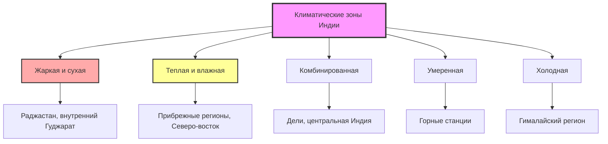

## Обзор

Индийские стандарты HVAC отражают разнообразие климатических зон страны, быструю урбанизацию и растущий акцент на энергоэффективность. Основной нормативно-правовой базис сочетает рейтинги звёзд Бюро энергоэффективности (BEE), требования Национального строительного кодекса (NBC) и Индийские стандарты (IS-коды), разработанные Бюро индийских стандартов. Эти стандарты учитывают тропические и субтропические климатические условия при внедрении современных принципов энергосбережения.

## Основной нормативно-правовой базис

### Бюро энергоэффективности (BEE)

BEE устанавливает стандарты энергоэффективности оборудования HVAC через обязательные программы рейтингования звёзд:

**Комнатные кондиционеры (RAC)**
- Рейтинг звёзд, основанный на индийском сезонном коэффициенте энергоэффективности (ISEER)
- Обязательная маркировка для установок мощностью охлаждения до 10,5 кВт
- Испытания согласно IS 1391 (часть 1 и часть 2)
- Минимальные требования ISEER обновляются раз в два года

**Чиллеры и центральное кондиционирование воздуха**
- Добровольная программа маркировки водяных и воздушных чиллеров
- Производительность измеряется при стандартных условиях номинальной нагрузки
- Интеграция с Кодексом энергосбережения зданий (ECBC)

### Национальный строительный кодекс (NBC) 2016

Часть 8 NBC (Системы зданий) устанавливает требования HVAC:

- Минимальные расходы наружного воздуха для различных типов помещений
- Процедуры расчёта нагрузки кондиционирования
- Требования к установке и безопасности оборудования
- Координация с электрическими и сантехническими системами

### Индийские стандарты (IS-коды)

Ключевые стандарты, регулирующие проектирование и установку HVAC:

| Стандарт | Название | Применение |
|----------|----------|-----------|
| IS 4444 (части 1-3) | Свод правил для центрального кондиционирования воздуха | Проектирование, оборудование, установка |
| IS 3315 | Вентиляция и кондиционирование в текстильной промышленности | Промышленное применение |
| IS 3231 | Свод правил для кондиционирования в медицинских учреждениях | Требования здравоохранения |
| IS 1391 | Комнатные кондиционеры | Испытания производительности |
| IS 13315 (части 1-2) | Унитарные кондиционеры | Испытания и рейтингование |

## Классификация климатических зон

Климатические зоны Индии согласно NBC и ECBC:

## Кодекс энергосбережения зданий (ECBC)

ECBC устанавливает минимальные стандарты энергоэффективности для коммерческих зданий с подключённой нагрузкой, превышающей 100 кВт, или договорной спросом выше 120 кВА.

### Требования к ограждающим конструкциям зданий

**Теплая и влажная зона (репрезентативна для прибрежных городов)**

Максимально допустимые коэффициенты теплопередачи U (Вт/м²·K):

| Конструкция | ECBC Standard | ECBC+ | SuperECBC |
|-----------|---------------|-------|-----------|
| Крыша | 0,409 | 0,261 | 0,200 |
| Стена | 0,450 | 0,400 | 0,350 |
| Остекление | 3,300 | 3,000 | 2,700 |
| Световой люк | 4,270 | 3,580 | 2,840 |

**Коэффициент солнечного теплового усиления (SHGC)**
- Максимум SHGC: 0,25 (ECBC Standard)
- Максимум SHGC: 0,23 (ECBC+)
- Значительное влияние на нагрузки охлаждения в тропическом климате

### Требования к системам HVAC

**Эффективность холодильного оборудования**

Воздушные чиллеры (полная нагрузка):

$$\text{COP}_{\text{min}} = \frac{Q_c}{W} \geq 2,65 \text{ (ECBC Standard)}$$

$$\text{COP}_{\text{min}} = \frac{Q_c}{W} \geq 2,85 \text{ (ECBC+)}$$

Водяные чиллеры демонстрируют превосходную эффективность в индийском климате:

$$\text{COP}_{\text{water-cooled}} = \frac{Q_c}{W} \geq 5,50 \text{ при номинальных условиях}$$

**Производительность при неполной нагрузке**

Интегрированное значение частичной нагрузки (IPLV) учитывает переменную работу нагрузки:

$$\text{IPLV} = 0,01A + 0,42B + 0,45C + 0,12D$$

Где:
- A = COP при 100% мощности
- B = COP при 75% мощности
- C = COP при 50% мощности
- D = COP при 25% мощности

### Требования по вентиляции

Минимальные расходы наружного воздуха согласно ECBC и NBC:

| Тип помещения | Наружный воздух (л/с·человек) | Обмены воздуха в час |
|------------|--------------------------|----------------------|
| Офисное помещение | 6,5 | - |
| Конференц-зал | 5,0 | - |
| Розница | 5,0 | - |
| Ресторан (обеденный зал) | 10,0 | - |
| Кухня | - | 15–30 |
| Туалет/ванная | - | 10 |

## Расчёт нагрузки охлаждения

Индийские стандарты ссылаются на методологию ASHRAE с поправками на местные условия.

### Проектные наружные условия

**Теплый и влажный климат (Мумбаи, Ченнаи, Калькутта)**
- Температура сухого термометра: 32–34°C (условие проектирования 1%)
- Температура влажного термометра: 27–29°C
- Относительная влажность: 70–80%

**Жаркий и сухой климат (Дели, Джайпур, Ахмедабад)**
- Температура сухого термометра: 40–46°C (условие проектирования 1%)
- Температура влажного термометра: 24–28°C
- Суточный диапазон температур: 12–15°C

### Солнечное теплонабор

Более высокая интенсивность солнечного излучения требует тщательного проектирования остекления:

$$q_{solar} = A \times SHGC \times SC \times SHGF$$

Где:
- A = площадь окна (м²)
- SHGC = коэффициент солнечного теплового усиления
- SC = коэффициент затеняющего устройства
- SHGF = фактор солнечного теплонабора для широты (Вт/м²)

Индийские широты (8°N до 35°N) подвергаются интенсивному солнечному излучению, особенно в жарко-сухих зонах, где пиковые значения превышают 900 Вт/м².

## Проектирование систем кондиционирования

### Критерии выбора системы

**Система переменного хладагента (VRF)**
- Набирает долю рынка в коммерческих применениях
- Высокая эффективность при неполной нагрузке
- Сниженные требования к воздуховодам
- Индивидуальное управление зонами

**Системы охлаждаемой воды**
- Стандарт для крупных коммерческих зданий
- Центральная насосная станция с обработчиками воздуха
- Лучшее управление влажностью в теплых-влажных климатах
- Интеграция с тепловым накопителем

### Управление влажностью

Критическое рассмотрение в теплых-влажных зонах:

$$SHR = \frac{q_s}{q_s + q_l}$$

Где:
- SHR = коэффициент явного охлаждения
- q_s = явная нагрузка охлаждения (кВт)
- q_l = скрытая нагрузка охлаждения (кВт)

Прибрежные регионы требуют значений SHR 0,65–0,75, требующих:
- Надлежащего размера змеевика для удаления влаги
- Подогрева при глубокой осушке
- Систем посвящённого наружного воздуха (DOAS) для вентиляционных нагрузок

## Индийский сезонный коэффициент энергоэффективности (ISEER)

BEE разработал ISEER для отражения фактических условий работы во всех климатических зонах Индии:

$$\text{ISEER} = \frac{\text{Общее годовое охлаждение (кВт·ч)}}{\text{Общее годовое энергопотребление (кВт·ч)}}$$

Расчёт основан на взвешенной операции при многих диапазонах температур:

| Температура наружного воздуха (°C) | Часы работы (%) | Нагрузка компрессора |
|-------------------------|---------------------|-----------------|
| 24 | 5 | 100% |
| 28 | 10 | 100% |
| 32 | 25 | 100% |
| 35 | 35 | 100% |
| 38 | 15 | 100% |
| 41 | 10 | 100% |

Рейтинги звёзд обновлены для требования минимальной производительности ISEER, согласованной с глобальными лучшими практиками.

## Регулирование хладагентов

Индия следует Монреальскому протоколу и Кигали-поправке:

**График поэтапного отказа**
- Замораживание потребления ХФУ: 2028
- Сокращение на 10%: 2029
- Сокращение на 85%: 2047

**Текущие тенденции**
- R-32 становится стандартом в комнатных кондиционерах
- R-410A преобладает в системах VRF
- Отказ от R-134a в чиллерах
- Растущий интерес к R-290 (пропан) для малых систем

## Стандарты установки и безопасности

### Электробезопасность

Согласно NBC часть 8 и IS 4444:
- Выделенные цепи для оборудования кондиционирования
- Надлежащее заземление и проводник заземления
- Защита от перегрузки и избыточного тока
- Координация с нормативами Центрального управления электроэнергии

### Конструктивные требования

Установки на крыше и сплит-системы должны учитывать:
- Вес оборудования и сейсмическую нагрузку
- Дренаж и гидроизоляцию
- Доступ для технического обслуживания
- Защиту от муссонной погоды

## Сравнение со стандартами ASHRAE

| Параметр | ASHRAE 90.1-2019 | ECBC 2017 | Взаимосвязь |
|-----------|------------------|-----------|-------------|
| COP чиллера (водяной) | 6,10 (Путь A) | 5,50 | ASHRAE более строг |
| Расход вентиляции (Офис) | 8,5 л/с·человек | 6,5 л/с·человек | ECBC ниже |
| U-коэффициент стены (Климат 1A) | 0,701 Вт/м²·K | 0,450 Вт/м²·K | ECBC более строг |
| SHGC окна | 0,25 | 0,25 | Эквивалентно |

Индийские стандарты всё более согласуются с международными лучшими практиками при одновременном учёте экономических и климатических реалий.

## Будущие направления развития

**Появляющиеся приоритеты**
- Интеграция возобновляемых источников энергии с системами HVAC
- Совместимость с интеллектуальной сетью и управление спросом
- Улучшенные стандарты качества внутреннего воздуха в постпандемический период
- Расширение ECBC на жилой сектор (Eco-Niwas Samhita)
- Усовершенствованные требования пусконаладки для крупных систем

Индийские стандарты HVAC продолжают развиваться, уравновешивая энергоэффективность, комфорт занятых и экономическое развитие в одном из самых быстрорастущих строительных рынков мира.
