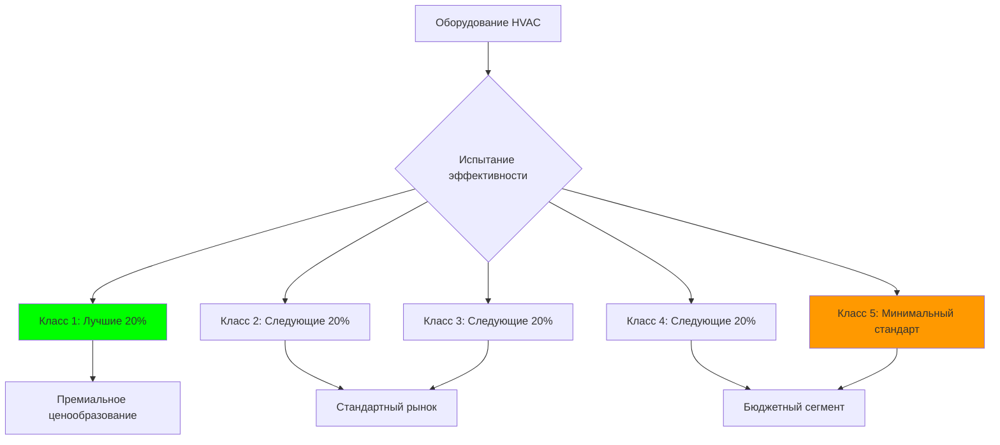
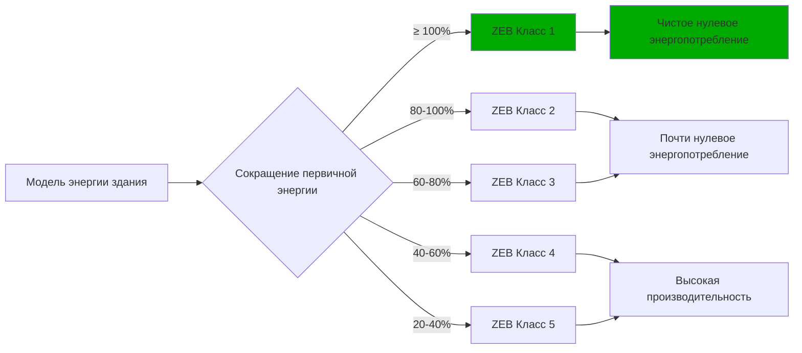

## Обзор рамок корейских стандартов HVAC

Нормативная система HVAC Южной Кореи объединяет строгие национальные стандарты (KS), обязательную маркировку энергоэффективности и агрессивные требования к энергетической эффективности зданий. Корейская ассоциация стандартов (KSA) разрабатывает технические стандарты, а Корейское энергетическое агентство (KEA) администрирует программы эффективности. Эта двойная система позиционирует Южную Корею как лидера в развертывании тепловых насосов, интеграции районного отопления и разработке зданий с нулевым энергопотреблением в регионе Азиатско-Тихоокеанского региона.

Стандарты отражают уникальную корейскую культуру отопления, сосредоточенную на ондоле (радиационном напольном отоплении), холодном зимнем климате, требующем надежной отопительной мощности, и обязательстве правительства снизить потребление энергии зданиями на 30% от уровня 2010 года к 2030 году.

## Корейские стандарты (KS) для оборудования HVAC

### KS B 6368: Кондиционеры воздуха и тепловые насосы

KS B 6368 устанавливает требования к производительности, процедуры испытаний и спецификации безопасности для оборудования кондиционирования воздуха и тепловых насосов. Стандарт определяет:

**Условия номинальной мощности** с использованием психрометрических испытательных камер:

| Режим работы | Условия в помещении | Наружные условия |
|----------------|------------------|-------------------|
| Охлаждение (номинальное) | 27°C ДБ / 19°C ВБ | 35°C ДБ / 24°C ВБ |
| Отопление (номинальное) | 20°C ДБ / 15°C ВБ | 7°C ДБ / 6°C ВБ |
| Отопление при низкой температуре | 20°C ДБ / 15°C ВБ | -15°C ДБ |
| Отопление при экстремально низкой температуре | 20°C ДБ / 15°C ВБ | -25°C ДБ |

Требования испытаний при низкой температуре -15°C и -25°C превышают спецификации AHRI 210/240, отражая корейские зимние условия, где наружная температура регулярно падает ниже -10°C в северных регионах. Оборудование, продаваемое в Корее, должно продемонстрировать отопительную мощность и эффективность при этих экстремальных условиях.

**Метрики производительности** включают:

- **COP охлаждения**: Рассчитывается как производительность охлаждения (Вт) / входная мощность (Вт) при номинальных условиях
- **COP отопления**: Рассчитывается как производительность отопления (Вт) / входная мощность (Вт) при номинальных условиях
- **Интегрированное значение при частичной нагрузке (IPLV)**: Взвешенная производительность при частичной нагрузке
- **Годовое энергопотребление**: На основе климатических данных Сеула

**Требования безопасности** касаются:

- Электробезопасности согласно KS C IEC 60335-2-40 для электродвигателей-компрессоров
- Ограничений заряда хладагента и обнаружения утечек для хладагентов A2L
- Сертификации сосудов под давлением для компонентов, превышающих 0,3 МПа
- Огнестойкости электрических компонентов и изоляционных материалов

### KS B 6879: Упакованные кондиционеры воздуха

KS B 6879 специально охватывает упакованные устройства, включая сплит-системы, мультисплит-системы и VRF системы. Ключевые положения включают:

**Минимальные требования к эффективности**, согласованные с пороговыми значениями класса этикеток энергоэффективности:

- Оборудование класса 1 должно достичь COP ≥ 4,1 (охлаждение) и COP ≥ 3,6 (отопление при 7°C)
- Оборудование с приводом инвертора должно достичь сезонных рейтингов эффективности на 25% выше, чем эквиваленты с фиксированной скоростью
- Мультисплит-системы должны соответствовать требованиям эффективности при всех условиях частичной нагрузки (25%, 50%, 75%, 100%)

**Спецификации хладагента**:

- Максимальный заряд хладагента на контур
- Требования обнаружения утечек для систем с зарядом более 1,5 кг
- Ограничения концентрации хладагента в занятых помещениях
- Требования по восстановлению и переработке в конце жизненного цикла

**Ограничения уровня шума**, измеренные на расстоянии 1 метра в полуанэхоических условиях:

| Производительность оборудования | Внутреннее устройство | Наружное устройство |
|-------------------|-------------|--------------|
| < 3,5 кВт | 45 дБ(A) | 55 дБ(A) |
| 3,5-7 кВт | 48 дБ(A) | 58 дБ(A) |
| 7-14 кВт | 52 дБ(A) | 62 дБ(A) |
| > 14 кВт | 55 дБ(A) | 65 дБ(A) |

## Система этикетов энергоэффективности

Корея управляет обязательной программой маркировки энергоэффективности, администрируемой Корейским энергетическим агентством. Все оборудование HVAC, продаваемое на внутреннем рынке, должно отображать этикетку эффективности, указывающую класс (1-5), годовое энергопотребление и предполагаемую стоимость эксплуатации.

### Пятиуровневая классификация эффективности

Система использует пятиуровневую структуру, где класс 1 представляет наивысшую эффективность:

Текущие пороги для комнатных кондиционеров (производительность охлаждения ≤ 3,5 кВт):

| Класс | COP охлаждения | COP отопления (7°C) | COP отопления (-15°C) |
|-------|-------------|-------------------|---------------------|
| 1 | ≥ 4,10 | ≥ 3,60 | ≥ 2,40 |
| 2 | ≥ 3,85 | ≥ 3,35 | ≥ 2,20 |
| 3 | ≥ 3,60 | ≥ 3,10 | ≥ 2,00 |
| 4 | ≥ 3,35 | ≥ 2,85 | ≥ 1,80 |
| 5 | ≥ 3,10 | ≥ 2,60 | ≥ 1,60 |

Требования COP отопления при -15°C отличают корейские стандарты от большинства международных рамок, которые обычно определяют производительность только при умеренных условиях (2-7°C). Это отражает критическую важность надежной отопительной мощности при низкой температуре.

### Метрики сезонной производительности

Оборудование с переменной скоростью использует метрики сезонной производительности, учитывающие работу при частичной нагрузке:

**Коэффициент сезонной производительности охлаждения (CSPF)**:

$$\text{CSPF} = \frac{\sum_{i=1}^{n} Q_{c,i} \cdot h_i}{\sum_{i=1}^{n} E_{c,i} \cdot h_i}$$

где:
- $Q_{c,i}$ = производительность охлаждения при условии bin $i$ (Вт)
- $E_{c,i}$ = входная мощность при условии bin $i$ (Вт)
- $h_i$ = часы при условии bin $i$ (часы/год)
- $n$ = количество температурных bins

**Коэффициент сезонной производительности отопления (HSPF)**:

$$\text{HSPF} = \frac{\sum_{i=1}^{n} Q_{h,i} \cdot h_i + Q_{def}}{\sum_{i=1}^{n} E_{h,i} \cdot h_i + E_{def} + E_{aux}}$$

где:
- $Q_{h,i}$ = производительность отопления при условии bin $i$ (Вт)
- $E_{h,i}$ = входная мощность при условии bin $i$ (Вт)
- $Q_{def}$ = потеря отопительной производительности во время оттаивания (Вт·ч)
- $E_{def}$ = энергия, потребляемая во время циклов оттаивания (Вт·ч)
- $E_{aux}$ = энергия вспомогательного отопления при температурах ниже мощности оборудования (Вт·ч)

Условия оттаивания и вспомогательного отопления становятся значительными в корейских климатических условиях, где работа при низкой температуре представляет значительное количество годовых часов.

## Интеграция ондола и радиационное отопление

Традиционное корейское отопление ондол — системы радиационного напольного отопления, нагреваемые водой или электрическим сопротивлением — влияет на проектирование систем HVAC и стандарты. Современные системы ондола интегрируются с тепловыми насосами и инфраструктурой районного отопления.

### Спецификации гидравлического ондола

KS B 6526 регулирует системы гидравлического радиационного напольного отопления:

**Требования к температуре подачи воды**:

- Максимальная температура подачи: 60°C для предотвращения перегрева поверхности пола
- Проектная температура подачи: 40-50°C для типичных жилых приложений
- Температура обратной линии: минимум 30°C для предотвращения конденсации в распределительных трубопроводах

**Ограничения тепловых потоков** в зависимости от напольного покрытия:

| Напольное покрытие | Максимальный тепловой поток | Температура поверхности |
|----------------|------------------|---------------------|
| Плитка/камень | 100 Вт/м² | 29°C |
| Инженерная древесина | 80 Вт/м² | 28°C |
| Винил/линолеум | 90 Вт/м² | 28°C |
| Ковер | 70 Вт/м² | 27°C |

**Расчет теплового сопротивления** для напольной конструкции ондола:

$$R_{total} = R_{finish} + R_{slab} + R_{tubing} + R_{insulation}$$

Минимальное значение R теплоизоляции ниже трубопровода ондола:

- Цокольный этаж: R = 2,1 м²·К/Вт
- Над неотапливаемым пространством: R = 2,6 м²·К/Вт
- Над отапливаемым пространством: R = 1,3 м²·К/Вт

### Интеграция тепловых насосов

Воздушные тепловые насосы, питающие системы ондола, сталкиваются с уникальными проблемами:

**Согласование производительности**: Тепловые насосы должны доставлять номинальную производительность при наружной температуре -15°C, когда пиковая нагрузка на отопление здания и типично деградирует производительность оборудования. Недостаточная мощность приводит к дополнительному электрическому нагреву сопротивления, что значительно увеличивает стоимость эксплуатации.

**Способность к поддержанию температуры подачи**: Стандартные воздушные тепловые насосы производят воду подачи 45°C при номинальных условиях. Низкие наружные температуры снижают достижимую температуру подачи до 35-40°C, требуя увеличения расхода или дополнительного отопления.

**Влияние цикла оттаивания**: Частые циклы оттаивания при низких температурах прерывают подачу тепла. Буферные емкости (200-500 л емкости) поддерживают работу системы во время периодов оттаивания.

**Деградация COP при низкой температуре**:

$$\text{COP}_{actual} = \text{COP}_{rated} \times \left(1 - 0,015 \times (T_{rated} - T_{outdoor})\right)$$

Для оборудования, номинированного при 7°C, работающего при -15°C:

$$\text{COP}_{-15°C} = 3,6 \times (1 - 0,015 \times 22) = 2,41$$

Это приближение показывает значительную деградацию производительности, обусловленную требованиями корейских стандартов испытаний при низкой температуре.

## Инфраструктура районного отопления

Южная Корея управляет обширными сетями районного отопления, обслуживающими примерно 58% жилых единиц в городских районах. Корейская корпорация районного отопления (KDHC) управляет региональными сетями, в то время как меньшие муниципальные системы обслуживают отдельные города.

### Технические характеристики

**Состав источников тепла**:

- Комбинированное производство электроэнергии и тепла (CHP): 65%
- Восстановление отходящего тепла от промышленных объектов: 20%
- Котлы на природном газе: 10%
- Возобновляемые источники (биомасса, геотермальная): 5%

**Параметры распределения**:

| Параметр | Подача | Обратная линия |
|-----------|--------|--------|
| Температура (зима) | 110-130°C | 60-70°C |
| Температура (летний ГВС) | 70-85°C | 50-60°C |
| Проектное давление | 10-16 бар | 3-5 бар |

**Блоки теплового интерфейса на уровне здания** снижают температуру сети до условий подачи ондола (40-50°C) с использованием пластинчатых теплообменников. Современные установки включают:

- Счетчики тепла, измеряющие потребление энергии для выставления счетов на основе использования
- Термостатические смесительные клапаны, предотвращающие перегрев пола
- Клапаны регулирования дифференциального давления для балансировки распределения
- Управление температурой подачи, компенсируемой по погоде

### Улучшения энергоэффективности

Инициативы по модернизации районного отопления сосредоточены на:

**Районное отопление четвертого поколения (4GDH)**, снижающее температуры подачи до 50-70°C:

- Позволяет интегрировать отходящее тепло из низкотемпературных источников
- Снижает потери при распределении с 10-15% до 5-8%
- Позволяет использовать пластиковые трубопроводы, заменяющие стальные, снижая стоимость установки
- Требует увеличенных теплообменников и поверхностей излучателей

**Тепловое аккумулирование**, позволяющее управление спросом на стороне потребления:

- Водяные емкости на уровне здания (10-30 м³) для аккумулирования теплоты в непиковые часы
- Материалы с фазовым переходом, обеспечивающие компактное тепловое накопление
- Централизованное хранилище на станциях районного отопления, перенося выработку во времени

## Сертификация зданий с нулевым энергопотреблением

Корея требует от всех новых государственных зданий, превышающих 1000 м², соответствия стандарту зданий с нулевым энергопотреблением (ZEB) с 2020 года, расширяясь на все новые здания, превышающие 500 м², к 2025 году. Сертификация использует пятиуровневую систему, основанную на сокращении первичной энергии по сравнению с базовыми значениями.

### Структура классов ZEB

**Методология расчета**:

$$\text{Сокращение первичной энергии} = \frac{E_{baseline} - (E_{consumption} - E_{renewable})}{E_{baseline}} \times 100\%$$

где:
- $E_{baseline}$ = первичная энергия базового здания согласно коду энергии здания
- $E_{consumption}$ = фактическое потребление первичной энергии зданием
- $E_{renewable}$ = выработка возобновляемой энергии (солнечные батареи, солнечные тепловые системы, геотермальная)

**Требования к системе HVAC** для сертификации ZEB:

- Тепловые насосы с сезонным COP ≥ 4,0 (охлаждение) и ≥ 3,5 (отопление)
- Вентиляция с рекуперацией тепла с эффективностью ≥ 75%
- Системы радиационного отопления/охлаждения с индивидуальным зональным управлением
- Системы автоматизации зданий, оптимизирующие работу оборудования
- Тепловое аккумулирование, снижающее пиковый спрос

### Развертывание технологии HVAC

Корейские проекты ZEB выделяют:

**Системы воздушных тепловых насосов**: Системы переменного расхода хладагента (VRF) или водяные тепловые насосы, питающие ондол и фанкойлы. Тепловые насосы для холодного климата, поддерживающие COP > 2,0 при наружной температуре -20°C.

**Системы тепловых насосов на основе грунта**: Замкнутые вертикальные скважины (глубина 100-200 м), обеспечивающие стабильный источник/приемник тепла. Температуры воды на входе 5-30°C позволяют достичь COP теплового насоса 4,5-5,5.

**Интеграция солнечной теплоты**: Вакуумные трубчатые коллекторы, предварительно нагревающие горячую воду для бытовых нужд и обеспечивающие низкотемпературное тепло тепловым насосам, улучшая общую эффективность системы на 15-25%.

## Общество инженеров кондиционирования воздуха и холодильной техники Кореи (SAREK)

SAREK разрабатывает рекомендации по проектированию, методологии расчета нагрузок и технические стандарты, дополняющие обязательные стандарты KS.

**Справочник по проектированию SAREK** предоставляет:

- Процедуры расчета нагрузок для корейских типов зданий и климатических зон
- Методологии определения размеров воздуховодов и трубопроводов
- Рекомендации по выбору оборудования
- Рекомендации по последовательностям управления
- Процедуры пуско-наладки

**Климатические зоны** для проектирования HVAC:

| Зона | Представительский город | Проектная зимняя температура | Проектная летняя температура | HDD (18°C) |
|------|--------------------|--------------------|-----------------------|------------|
| 1 (Северная) | Сеул | -15°C | 32°C ДБ / 25°C ВБ | 2700 |
| 2 (Центральная) | Дэджон | -12°C | 33°C ДБ / 26°C ВБ | 2400 |
| 3 (Южная) | Пусан | -8°C | 31°C ДБ / 26°C ВБ | 1800 |
| 4 (Чеджу) | Чеджу | -3°C | 30°C ДБ / 26°C ВБ | 1200 |

Значительное изменение градусо-дней отопления побуждает различные подходы к выбору оборудования и проектированию систем в разных регионах.

## Нормативы по хладагентам и будущие направления

Корея следует графику Монреальского протокола и поправки Кигали по отказу от хладагентов. Закон об управлении трансграничным перемещением опасных отходов регулирует управление хладагентом.

**Текущий ландшафт хладагентов**:

- R410A: Доминирующий хладагент в существующем оборудовании, отказ начинается в 2025 году
- R32: Предпочтительная замена для жилого и легкого коммерческого оборудования (GWP = 675)
- R454B: Развивается для коммерческого применения (GWP = 466)
- R290 (пропан): Используется в оборудовании небольшой мощности < 1 кВт (GWP = 3)

**Требования безопасности хладагента A2L** согласно KS C IEC 60335-2-40:

- Обнаружение утечки хладагента в занятых помещениях для систем > 1,5 кг заряда
- Механическая вентиляция, взаимосвязанная с обнаружением утечек
- Ограничения максимальной концентрации хладагента, предотвращающие воспламеняющиеся смеси
- Ограничения доступа к обслуживанию, требующие сертификации техников

**Требования по восстановлению**:

- Обязательное восстановление хладагента при утилизации оборудования
- Сертифицированное оборудование и техники для восстановления
- Целевые показатели скорости восстановления: 80% для обслуживаемого в полевых условиях оборудования
- Штрафы за выпуск хладагентов в атмосферу

## Характеристики рынка и тенденции технологий

### Рост рынка тепловых насосов

Рынок тепловых насосов Южной Кореи растет на 12-15% ежегодно, обусловленный:

- Ограничениями сетей районного отопления в пригородных районах
- Государственными субсидиями для высокоэффективных тепловых насосов, заменяющих отопление на ископаемом топливе
- Мандатами на нулевое энергопотребление зданий, требующими HVAC высокой производительности
- Потребительским предпочтением комбинированных возможностей охлаждения и отопления

**Государственные программы стимулирования**:

- Жилые субсидии на тепловые насосы: 30-50% стоимости оборудования и установки
- Гранты для коммерческих зданий на ретрофит тепловых насосов
- Ускоренная амортизация высокоэффективного оборудования
- Льготное финансирование для проектов ZEB

### Интеграция интеллектуального HVAC

Корейские производители HVAC интегрируют возможности автоматизации зданий и IoT:

- Дистанционное управление и мониторинг через приложения смартфонов
- Интеграция с платформами умного дома (Samsung SmartThings, LG ThinQ)
- Алгоритмы обучения на основе искусственного интеллекта, оптимизирующие комфорт и потребление энергии
- Участие в реагировании на спрос, снижая пиковую электрическую нагрузку
- Предсказательное техническое обслуживание с использованием данных работы оборудования

### Консолидация промышленности

Производство HVAC в Корее концентрируется среди крупных конгломератов:

- LG Electronics: Коммерческое и жилое кондиционирование воздуха, системы VRF, охладители
- Samsung Electronics: Жилые системы, DVM (Digital Variable Multi) VRF
- Carrier Korea: Лицензированное производство оборудования Carrier для внутреннего рынка
- Специализированные отечественные компании: Daeil Aqua, Kyungdong Navien, сосредоточенные на отопительном оборудовании

Эти производители конкурируют в рейтингах эффективности, при этом оборудование класса 1 представляет 45% продаж на жилом рынке, что значительно выше, чем на большинстве международных рынков, где премиальная эффективность занимает 15-25% доли.

## Заключение

Рамка стандартов HVAC Южной Кореи объединяет строгие технические требования, обязательную маркировку эффективности и агрессивные мандаты энергетической эффективности зданий. Стандарты KS обращаются к корейским климатическим условиям через требования производительности при низкой температуре, отражающие потребности в отоплении при холодной зиме. Система этикетов энергоэффективности побуждает трансформацию рынка в сторону оборудования высокой производительности. Интеграция ондола создает уникальные требования к проектированию для систем тепловых насосов. Сертификация зданий с нулевым энергопотреблением ускоряет развертывание тепловых насосов, вентиляции с рекуперацией тепла и интеграции возобновляемых источников энергии. Понимание корейских стандартов, динамики рынка и тенденций технологий предоставляет необходимый контекст для производителей, инженеров и политиков, занятых на азиатских рынках HVAC и глобальных инициативах эффективности.
