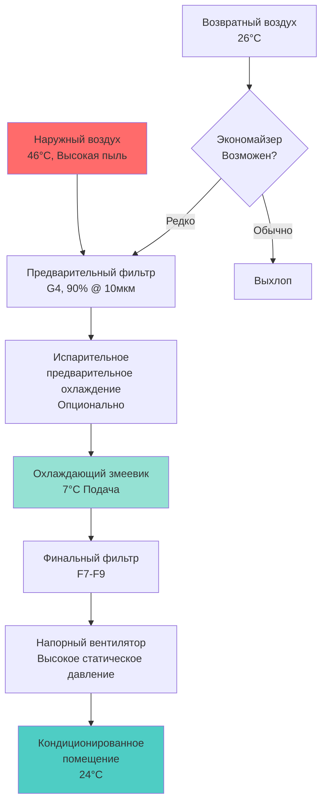
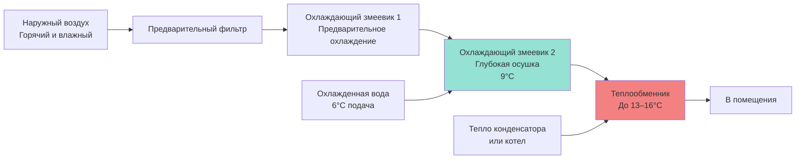

## Обзор проблем HVAC на Ближнем Востоке

Системы HVAC на Ближнем Востоке работают в условиях экстремальной тепловой нагрузки, которые определяют уникальные требования к проектированию. Наружные проектные температуры регулярно превышают 46°C при одновременной интенсивности солнечной радиации, достигающей 1000 Вт/м². Сочетание экстремальной явной теплоты, высокой концентрации пыли и прибрежной влажности создает инженерные проблемы, отличные от других регионов мира.

Региональные стандарты развивались, чтобы удовлетворить требования к производительности в пустынном климате, защите от песчаной инфильтрации и энергоэффективности в постоянно охлаждаемых приложениях.

## Критерии проектирования при экстремальной температуре

### Интенсивность охлаждающей нагрузки

Условия проектирования на Ближнем Востоке генерируют пиковые охлаждающие нагрузки, превышающие типичные параметры проектирования ASHRAE. Условие проектирования 0,4% в Дубае достигает 46°C по сухому термометру с 26°C по влажному термометру, тогда как Эр-Рияд испытывает 47°C по сухому термометру с более низкой влажностью.

Явная охлаждающая нагрузка доминирует из-за высоких температурных перепадов:

$$Q_s = \dot{m} \times c_p \times (T_{outdoor} - T_{indoor})$$

где:
- $Q_s$ = явная охлаждающая нагрузка (кДж/ч или кВт)
- $\dot{m}$ = массовый расход наружного воздуха (кг/с)
- $c_p$ = удельная теплоемкость воздуха (1,006 кДж/кг·K)
- $T_{outdoor}$ = проектная наружная температура
- $T_{indoor}$ = установка в помещении (обычно 24°C)

Для наружного условия 47°C с внутренней установкой 24°C, температурный перепад достигает 23°C, в сравнении с перепадами 8–11°C в умеренном климате.

### Снижение производительности оборудования

Высокие температуры окружающей среды снижают производительность и эффективность холодильного оборудования. Конденсаторы с воздушным охлаждением испытывают значительное снижение производительности при повышении температуры конденсации с окружающими условиями.

Деградация коэффициента производительности Карно следует:

$$\text{COP}_{degradation} = \frac{T_{evap}}{T_{cond} - T_{evap}}$$

где температуры абсолютные (Кельвин). По мере увеличения $T_{cond}$ с температурой окружающей среды, COP экспоненциально снижается.

Производители обычно рассчитывают оборудование при 35°C окружающей среды, требуя коэффициентов коррекции производительности 0,85–0,90 для работы при 46°C. Инженеры должны либо увеличивать размер оборудования, либо указывать единицы, спроектированные для работы при высокой температуре окружающей среды.

## Стратегии снижения песчаной пыли

### Требования к фильтрации

Концентрации атмосферной пыли в городских районах Ближнего Востока регулярно превышают 150 мкг/м³, при песчаных бурях достигая более 1000 мкг/м³. Эта нагрузка частицами требует надежных систем фильтрации, выходящих за рамки стандартной коммерческой практики.

| Ступень фильтра | Эффективность | Применение | Частота замены |
|---|---|---|---|
| Предварительный фильтр (G4) | 85–90% @ 10 мкм | Удаление грубой пыли | 1–2 месяца |
| Мешочный фильтр (F7) | 80–90% @ 1 мкм | Улавливание мелких частиц | 3–4 месяца |
| Финальный фильтр (F9) | 95% @ 1 мкм | Критические применения | 6–12 месяцев |

Многоступенчатая фильтрация защищает расположенные ниже по потоку змеевики и поддерживает качество воздуха в помещении. Предварительные фильтры продлевают срок службы расположенных ниже по потоку фильтров большей эффективности путем захвата грубых частиц.

### Защита змеевика

Змеевики теплообменника требуют защитных мер против накопления песка и эрозии. Практика проектирования включает:

- **Увеличенный шаг ребер**: 3–4 ребра на сантиметр (в сравнении с 5–6 на сантиметр в умеренных климатах) снижает восприимчивость к засорению
- **Покрытия змеевика**: Эпоксидные или полимерные покрытия защищают алюминиевые ребра от коррозии и облегчают очистку
- **Фильтрация перед источником**: Минимум MERV 11 защищает охлаждающие змеевики
- **Доступ для очистки**: Съемные панели и надлежащий зазор обеспечивают периодическое обслуживание

Падение давления через загрязненные змеевики увеличивается согласно:

$$\Delta P_{fouled} = \Delta P_{clean} \times \left(1 + k \times t\right)$$

где $k$ представляет коэффициент интенсивности загрязнения и $t$ — время эксплуатации с момента последней очистки.

## Региональные стандарты и коды

### Стандарты Саудовской Аравии

Саудовская Аравия разработала стандарты HVAC через Саудовскую организацию по стандартизации, метрологии и качеству (SASO), которые ссылаются на стандарты ASHRAE и ISO, но модифицируют их для местных условий.

**SASO 2663**: Энергетическая производительность кондиционеров воздуха устанавливает минимальные требования к эффективности:
- Сплит-системы ≤3,5 кВт: Минимум EER 11,5 (3,37 Вт/Вт)
- Блочные системы: Минимум EER 10,0 (2,93 Вт/Вт)

Эти требования превышают минимальные стандарты США для учета энергоемкости непрерывной работы охлаждения.

### Нормативные акты зеленого строительства ОАЭ

Нормативный документ 66 Муниципалитета Дубая устанавливает требования зеленого строительства, включая критерии производительности HVAC:

- **Системы охлажденной воды**: Минимальная системная эффективность 0,65 кВт/кВт охлаждения (COP 5,4)
- **Системы прямого расширения**: Сезонный коэффициент энергоэффективности (SEER) ≥14 для жилых приложений
- **Вентиляция**: Требуется управление вентиляцией по спросу на основе CO₂ для помещений >500 м²
- **Утилизация тепла**: Требуется утилизация энергии, когда наружный воздух превышает 30% подаваемого воздуха

## Преобладание систем охлажденной воды

Крупномасштабные разработки на Ближнем Востоке преимущественно используют районное охлаждение или охлаждающие системы на уровне здания, а не оборудование прямого расширения. Этот подход предоставляет несколько преимуществ для экстремальных климатов:

### Термодинамическая эффективность

Центральные холодильные установки достигают более высоких коэффициентов производительности через:

1. **Оборудование большой производительности**: Центробежные холодильники емкостью 500–2000 кВт охлаждения работают при пиках эффективности частичной нагрузки
2. **Охлаждение с водяным конденсатором**: Градирни обеспечивают более низкие температуры конденсации, чем системы с воздушным охлаждением, даже в жарком климате
3. **Тепловое аккумулирование**: Аккумулирование льда или охлажденной воды смещает электрическую нагрузку на внепиковые часы, когда температуры окружающей среды ниже

Преимущество холодильника с водяным охлаждением в климате Ближнего Востока вытекает из снижения температуры по влажному термометру. Даже когда сухой термометр достигает 46°C, температура по влажному термометру 26–28°C позволяет температуре подхода градирни 29–32°C, в сравнении с 46°C и выше для конденсаторов с воздушным охлаждением.

### Проектирование системы распределения

Распределение охлажденной воды требует тщательного проектирования для минимизации тепловых потерь и энергии насоса:

$$Q_{gain} = U \times A \times (T_{ambient} - T_{chw})$$

где:
- $U$ = общий коэффициент передачи тепла изолированной трубы (кВт/м²·K)
- $A$ = внешняя площадь поверхности трубы (м²)
- $T_{ambient}$ = температура окружающей среды в кабель-каналах или под землей
- $T_{chw}$ = температура охлажденной воды (обычно 6–7°C)

При температурах в неокондиционированных помещениях, достигающих 38–49°C, толщина изоляции 5–8 см является стандартной для трубопроводов охлажденной воды, в сравнении с 2,5–4 см в умеренных климатах.

## Проблемы управления влажностью

Прибрежные города Ближнего Востока (Дубай, Абу-Даби, Джидда) испытывают высокую влажность одновременно с экстремальной жарой, создавая скрытые охлаждающие нагрузки, которые вызывают проблемы с обычными системами.

Требование к удалению скрытого тепла следует:

$$Q_l = \dot{m} \times h_{fg} \times (W_{outdoor} - W_{indoor})$$

где:
- $Q_l$ = скрытая охлаждающая нагрузка
- $h_{fg}$ = скрытая теплота испарения (2454 кДж/кг)
- $W$ = коэффициент влажности (кг воды на кг сухого воздуха)

Для условий летнего Дубая (46°C DB, 26°C WB), коэффициент влажности достигает 0,0135 кг/кг. Поддержание условий в помещении 24°C и 50% RH (W = 0,0093 кг/кг) требует значительной осушки.

### Системы выделенного наружного воздуха

Конфигурации DOAS обеспечивают превосходное управление влажностью путем разделения обработки вентиляционного воздуха и кондиционирования помещения:

Глубокое охлаждение до 9–10°C эффективно конденсирует влагу, с последующим нагревом для предотвращения избыточного охлаждения. Энергетический штраф нагрева смещается точным управлением влажностью и снижением требований к общему расходу воздуха.

## Императивы энергоэффективности

Энергия охлаждения представляет 60–70% электрического потребления здания в климате Ближнего Востока. Улучшения эффективности напрямую влияют на эксплуатационные расходы и спрос на сеть.

### Приложения переменной скорости привода

Оборудование, управляемое VFD, обеспечивает значительную экономию энергии в системах, работающих при частичной нагрузке. Мощность вентилятора следует законам подобия:

$$P_2 = P_1 \times \left(\frac{N_2}{N_1}\right)^3$$

где $P$ — мощность и $N$ — частота вращения. Снижение скорости вентилятора до 80% от проектной снижает потребление мощности до 51% от работы на полной скорости.

VFD насоса охлажденной воды аналогично снижают энергию насоса при уменьшении нагрузки здания, хотя здания Ближнего Востока испытывают меньшее изменение нагрузки, чем конструкции в умеренном климате, из-за требований непрерывного охлаждения.

### Стандарты оборудования высокой эффективности

Практика спецификации подчеркивает оборудование премиум-класса эффективности:

| Тип оборудования | Стандартная эффективность | Высокая эффективность | Премиум-эффективность |
|---|---|---|---|
| Центробежный холодильник | 0,60 кВт/кВт охл. | 0,50 кВт/кВт охл. | 0,45 кВт/кВт охл. |
| Винтовой холодильник | 0,75 кВт/кВт охл. | 0,65 кВт/кВт охл. | 0,58 кВт/кВт охл. |
| Воздухоприемная установка | 0,8 Вт/CFM (1,36 Вт/(м³/ч)) | 0,6 Вт/CFM (1,02 Вт/(м³/ч)) | 0,4 Вт/CFM (0,68 Вт/(м³/ч)) |
| Градирня | 20 л/мин/кВт | 30 л/мин/кВт | 40 л/мин/кВт |

Дополнительная стоимость оборудования высокой эффективности обычно окупается в течение 2–4 лет при непрерывной работе и высоких затратах на электроэнергию в регионе.

## Интеграция конверта здания

Производительность системы HVAC критически зависит от теплового сопротивления конверта здания. Строительство на Ближнем Востоке все чаще применяет передовые стратегии конверта:

- **Наружная изоляция**: Сборки стен RSI 3,3–4,4 снижают передачу тепла проводимостью
- **Остекление высокого класса**: Покрытия Low-E с коэффициентами усиления солнечного тепла (SHGC) 0,25–0,35
- **Исключение тепловых мостов**: Непрерывная изоляция и изолированные конструктивные элементы
- **Системы воздушного барьера**: Непрерывные воздушные барьеры снижают инфильтрационные нагрузки

Связь между производительностью конверта и мощностью HVAC следует:

$$Q_{envelope} = U_{eff} \times A \times CLTD + (SHGC \times A_{glazing} \times SHGF)$$

где CLTD — температурная разность охлаждающей нагрузки и SHGF — коэффициент усиления солнечного тепла.

Улучшение U-значения стены с 0,85 до 0,57 кВт/м²·K снижает пиковую охлаждающую нагрузку примерно на 8–12% в климате Ближнего Востока, позволяя использовать более меньшие и эффективные системы HVAC.

## Стандарты Совета сотрудничества государств Персидского залива

Организация по стандартизации ССГ (GSO) разрабатывает единые стандарты в государствах-членах (Саудовская Аравия, ОАЭ, Кувейт, Катар, Бахрейн, Оман). Ключевые стандарты, связанные с HVAC, включают:

### GSO ISO 5151

Энергоэффективность и тестирование производительности кондиционеров воздуха и тепловых насосов. Этот стандарт устанавливает протоколы испытаний оборудования, продаваемого по всему региону ССГ, обеспечивая соответствие оценок производительности.

### Маркировка энергии GSO

Обязательные требования к маркировке энергии оборудования кондиционирования воздуха позволяют потребителям сравнивать рейтинги эффективности. Система маркировки использует звездные рейтинги (1–5 звезд) на основе значений EER или SEER, где 5 звезд представляют наивысшую эффективность.

## Система оценки устойчивости GSAS в Катаре

Глобальная система оценки устойчивости (GSAS), разработанная Организацией Персидского залива по исследованиям и развитию, обеспечивает критерии устойчивости, основанные на производительности для зданий в Катаре и других государствах Залива.

Требования, специфичные для HVAC в GSAS, включают:

- **Кредит энергоэффективности**: Баллы присуждаются за эффективность системы, превышающую базовый уровень на 10%, 20% или 30%
- **Влияние хладагента**: Выбор хладагента с низким потенциалом глобального потепления приносит баллы устойчивости
- **Эффективность вентиляции**: Мониторинг CO₂ и управление вентиляцией по спросу требуются для сертификации
- **Тепловой комфорт**: Соответствие критериям теплового комфорта ASHRAE Standard 55

## Кодекс энергосбережения Кувейта

Кодекс энергосбережения Кувейта предписывает специфические требования к производительности HVAC для новой конструкции:

- **Конверт здания**: Максимальная общая теплопередача (OTTV) 30 Вт/м²
- **Эффективность оборудования**: Сплит-кондиционеры должны достичь минимума EER 10,0
- **Управление**: Программируемые термостаты требуются для всех кондиционированных помещений
- **Изоляция**: Минимум RSI 2,3 для стен, RSI 3,3 для кровель в кондиционированных зданиях

## Соображения проектирования для экстремального климата

### Управление солнечной радиацией

Пиковая солнечная радиация в климате Ближнего Востока достигает 1000 Вт/м² на горизонтальных поверхностях и 800 Вт/м² на вертикальных фасадах восток/запад. Эта солнечная нагрузка значительно влияет на требования охлаждения.

Солнечное усиление тепла через остекление следует:

$$Q_{solar} = A_{glazing} \times SHGC \times SHGF \times CLF$$

где:
- $A_{glazing}$ = площадь окна (м²)
- $SHGC$ = коэффициент усиления солнечного тепла (0,25–0,85)
- $SHGF$ = коэффициент усиления солнечного тепла (Вт/м²)
- $CLF$ = коэффициент охлаждающей нагрузки (учитывает тепловую массу)

Остекление высокого класса с SHGC ≤0,30 снижает солнечное усиление на 60–70% в сравнении со стандартным прозрачным стеклом (SHGC ≈0,80).

### Охлаждение ночным излучением неба

Засушливые климаты Ближнего Востока с чистым ночным небом предоставляют возможности для радиационного охлаждения. Ночное небо действует как тепловой сток с эффективной температурой -4 до 16°C, позволяя отвод тепла через длинноволновое излучение.

Потенциал радиационного охлаждения следует закону Стефана–Больцмана:

$$Q_{rad} = \varepsilon \times \sigma \times A \times (T_{surface}^4 - T_{sky}^4)$$

где $\varepsilon$ — коэффициент излучения поверхности, $\sigma$ — постоянная Стефана–Больцмана (5,67×10⁻⁸ Вт/м²·K⁴), и температуры абсолютные.

Надлежащим образом спроектированные панели радиационного охлаждения могут отводить 40–60 Вт/м² во время чистых пустынных ночей, снижая механические охлаждающие нагрузки.

## Заключение

Инженерная практика HVAC на Ближнем Востоке отражает экстремальную тепловую среду региона и требования непрерывного охлаждения. Высокие температуры окружающей среды, песчаная инфильтрация и затраты на энергию определяют решения по проектированию в пользу систем охлажденной воды, надежной фильтрации и оборудования премиум-класса эффективности. Региональные стандарты все чаще предписывают уровни производительности, превышающие международные минимумы, признавая энергоемкость кондиционирования в пустынном климате. Успешное системное проектирование интегрирует основы термодинамики с климат-специфичными практическими соображениями для достижения надежной, эффективной работы в условиях сложной среды.
