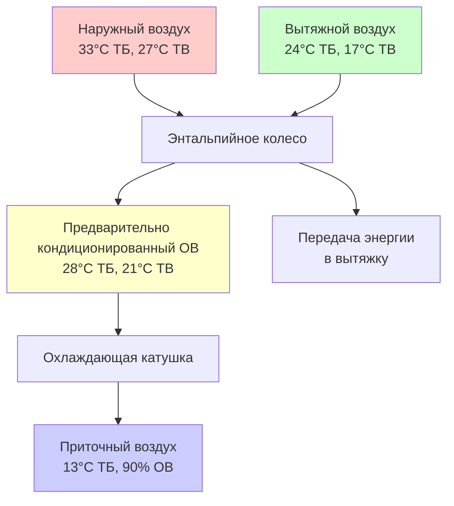

## Характеристики регионального климата и последствия для проектирования

Юго-Восточная Азия испытывает тропические климатические условия, которые коренным образом формируют приоритеты проектирования HVAC. Регион охватывает приблизительно от 10°N до 10°S широты, характеризуется высокой солнечной радиацией, постоянно повышенными температурами и значительными уровнями влажности в течение всего года. Эти условия создают нагрузки, ориентированные на охлаждение, при этом контроль влажности представляет основную техническую проблему.

Условия наружного проектирования в крупных городах Юго-Восточной Азии демонстрируют примечательную согласованность:

| Город | Проектная ТБ (°C) | Проектная ТВ (°C) | Проектная ОВ (%) | Годовые CDD (база 18°C) |
|------|-------------------|-------------------|------------------|--------------------------|
| Сингапур | 33,5 | 27,0 | 65-70 | 4 850 |
| Бангкок | 35,0 | 27,5 | 60-65 | 5 200 |
| Хошимин | 34,5 | 27,0 | 65-70 | 5 100 |
| Манила | 34,0 | 27,5 | 65-75 | 4 900 |
| Куала-Лумпур | 33,0 | 26,5 | 70-80 | 4 750 |
| Джакарта | 33,5 | 27,0 | 70-75 | 4 950 |

Минимальные колебания температуры между месяцами исключают сезонные колебания нагрузки, характерные для климата умеренных широт. Нагрузки на отопление практически отсутствуют, позволяя полностью сосредоточиться на оптимизации системы охлаждения и осушения.

## Психрометрические рассмотрения для тропического проектирования

Высокие температуры по влажному термометру принципиально ограничивают эффективность испарительного охлаждения и снижают эффективность цикла охлаждения. Взаимосвязь между температурой по влажному термометру и достижимой температурой конденсации напрямую влияет на перепад давления компрессора:

$$
\text{COP}_{\text{охлаждение}} = \frac{Q_{\text{испаритель}}}{W_{\text{компрессор}}} = \frac{h_1 - h_4}{h_2 - h_1}
$$

Где повышенные температуры конденсации (определяемые температурой по влажному термометру плюс подход плюс диапазон в водяных системах или сухим термометром плюс подход в воздушных системах) увеличивают разность энтальпии $(h_2 - h_1)$ по компрессору, снижая эффективность цикла.

### Доминирование скрытой нагрузки

Тропические условия генерируют более высокие соотношения скрытых к явным теплам, чем климат умеренных широт. Внутренние скрытые нагрузки от людей, в сочетании с инфильтрацией наружного воздуха при 70-80% относительной влажности, создают значительные требования к осушению.

Коэффициент явного тепла (SHR) для типичных коммерческих помещений Юго-Восточной Азии:

$$
\text{SHR} = \frac{Q_{\text{явное}}}{Q_{\text{явное}} + Q_{\text{скрытое}}} = 0,65 - 0,75
$$

Это контрастирует со значениями SHR для климата умеренных широт 0,80-0,90. Более низкие значения SHR требуют охлаждающих катушек с большей площадью поверхности и более низкими температурами входящего воздуха для достижения надлежащего удаления влаги, увеличивая требования к депрессии температуры приточного воздуха.

### Переохлаждение и стратегии перегрева

Стандартные системы прямого расширения, рассчитанные на явную нагрузку, часто обеспечивают недостаточное осушение, что приводит к уровням влажности в помещении, превышающим пороги комфорта (максимум 60% ОВ в соответствии со стандартом ASHRAE 55). Это требует:

- **Переохлаждение с перегревом**: Охлаждение воздуха до 10-12°C для конденсации влаги, затем перегрев до температуры приточного воздуха 13-15°C
- **Системы выделенного наружного воздуха (DOAS)**: Отдельная обработка воздуха вентиляции для удаления скрытой нагрузки перед смешиванием с рециркулируемым воздухом
- **Осушение десикантами**: Использование твердых или жидких десикантов для удаления влаги без переохлаждения

## Региональные стандарты и нормативная база

### Сингапур: Стандарты SS

Сингапур использует Сингапурские стандарты (SS), разработанные Советом по сингапурским стандартам в сотрудничестве с органом по строительству и конструкции (BCA).

**SS 553: Кодекс практики для кондиционирования воздуха и механической вентиляции в зданиях** устанавливает:

- Минимальные нормы вентиляции: 0,6 л/с·м² для офисов, 5 л/с·человека для переговорных комнат
- Условия наружного проектирования: 24-26°C, 55-65% ОВ для офисных помещений
- Требования энергоэффективности, связанные с пределами охлаждающей нагрузки GFA (Валовая площадь пола)
- Требования испытания герметичности воздуховодов: ≤10% при 250 Па для низконапорных систем

**SS 530** определяет требования эффективности холодильной машины, превышающие минимумы ASHRAE 90.1:

| Тип холодильной машины | Диапазон производительности | Минимальный COP (Полная нагрузка) |
|------------------------|-----------------------------|-----------------------------------|
| Водяная центробежная | >1 055 кВт | 6,2 |
| Воздушная винтовая | 264-528 кВт | 2,9 |
| Водяная винтовая | 264-528 кВт | 4,9 |

Схема сертификации Green Mark Сингапура предоставляет дополнительные стимулы для систем, превышающих минимальные пороги эффективности на 15-30%.

### Малайзия: Стандарты MS и требования UBBL

Малайзия применяет малайзийские стандарты (MS) наряду с требованиями Единого строительного регламента (UBBL).

**MS 1525: Кодекс практики по энергоэффективности и использованию возобновляемых источников энергии для нежилых зданий** устанавливает нормативную базу для производительности энергии. Ключевые положения:

- Пределы общего теплопередачи (OTTV) для строительных оболочек: ≤50 Вт/м² для большинства типов использования
- Минимальные уровни эффективности оборудования на основе типа здания и конфигурации системы
- Пределы плотности электроэнергии освещения, интегрированные с расчетами охлаждающей нагрузки
- Требования энергетического аудита для зданий >4 000 м² кондиционируемой площади

**MS 2680: Системы кондиционирования воздуха и механической вентиляции** касаются проектирования и установки:

- Диапазон температуры приточного воздуха: 13-16°C для верхнего распределения
- Требования смены воздуха: 6-8 ACH для офисов, 12-20 ACH для коммерческих кухонь
- Спецификации фильтра: минимум MERV 8 для наружного воздуха, MERV 11 для рециркуляции в чувствительных приложениях
- Требования виброизоляции на основе скорости оборудования и близости к занятым помещениям

### Таиланд: Министерские нормы и стандарты TISI

Нормативная среда Таиланда объединяет министерские нормы в соответствии с Законом об управлении зданиями с техническими характеристиками Таиландского института промышленных стандартов (TISI).

**Министерская норма по энергосбережению в зданиях** требует:

- Соответствие Строительному кодексу энергии (BEC) для зданий >2 000 м² или с производительностью охлаждения >300 кВт
- Ежегодный отчет о потреблении энергии для регулируемых зданий
- Энергетические аудиты каждые 5 лет для объектов, превышающих пороги потребления
- Требования ретроактивного соответствия при проведении крупных ремонтов

Целевые показатели энергоемкости в соответствии с нормами BEC:

| Тип здания | Максимальная энергоемкость (кВт·ч/м²·год) |
|------------|-------------------------------------------|
| Офисные здания | 200 |
| Отели | 300 |
| Торговые центры | 350 |
| Больницы | 400 |

### Индонезия: Основа стандартов SNI

Индонезия применяет индонезийские национальные стандарты (SNI), разработанные Агентством национальной стандартизации.

**SNI 03-6390: Энергосбережение в системах кондиционирования воздуха в зданиях** устанавливает требования к проектированию:

- Максимальная охлаждающая нагрузка: 180 Вт/м² для офисных зданий с соответствующими оболочками
- Эффективность холодильного завода: ≥0,65 кВт/кВт холода для систем >500 кВт холода производительности
- Требования переменного потока насоса для систем >150 кВт охлаждающей производительности
- Циклы экономайзера требуются где применимо (ограниченная применимость в тропических условиях)

## Выбор оборудования и оптимизация производительности

### Системы холодильных машин и рассмотрения воды конденсатора

Водяные холодильные машины доминируют в коммерческих приложениях благодаря значительным преимуществам эффективности над воздушным оборудованием в тропических условиях. Однако постоянно высокие температуры по влажному термометру ограничивают производительность охлаждающей башни.

Температуры подхода охлаждающей башни обычно варьируются от 3 до 5°C, создавая температуры воды конденсатора 30-32°C. Это повышает давление конденсации по сравнению с работой в климате умеренных широт:

$$
\text{Температура конденсации} = T_{\text{ТВ,наружная}} + \text{Подход} + \text{Диапазон}
$$

Для летних условий Бангкока (27,5°C ТВ), с подходом 3,5°C и диапазоном 5°C:

$$
T_{\text{конд}} = 27,5 + 3,5 + 5,0 = 36°C
$$

Центробежные холодильные машины сохраняют лучшую эффективность в этих условиях по сравнению с винтовыми или спиральными компрессорными типами. Компрессоры с магнитным подшипником дополнительно снижают паразитные потери, достигая полных COP значений 6,5-7,2 при тропических условиях номинала.

### Стратегии распределения воздуха

Высокие скрытые нагрузки требуют тщательного проектирования распределения воздуха для предотвращения проблем с комфортом:

**Распределение воздуха низкой температурой (LTAD)**: Приток воздуха при 7-10°C вместо обычного 13-15°C, снижая требования к потоку воздуха и размеры воздуховодов. Системы LTAD требуют внимания к выбору диффузоров, предотвращающих сквозняки и конденсацию на приточных регистрах.

**Системы выделенного наружного воздуха (DOAS)**: Отдельная обработка воздуха вентиляции от рециркулируемого воздуха. Поток наружного воздуха проходит глубокое охлаждение до 10-12°C для осушения, затем либо:
- Смягчается до нейтральной температуры (19-21°C) и подается отдельно
- Смешивается с рециркулируемым воздухом после независимого явного охлаждения
- Подается непосредственно при низкой температуре в помещения с высокими скрытыми нагрузками

### Рассмотрения выбора хладагента

Тропическая работа создает специфические для хладагента последствия производительности:

**R410A** испытывает более высокие температуры нагнетания под повышенным давлением конденсации, приближаясь к тепловым пределам компрессора (120-140°C) при экстремальных условиях. Это ограничивает производительность системы и надежность.

**R32** предлагает более низкий потенциал глобального потепления (675 против 2 088) и лучшие термодинамические свойства при высоких температурах конденсации, становясь все более предпочтительным, несмотря на классификацию воспламеняемости A2L, требующую пределы заряда и улучшенную вентиляцию.

**R134a** в центробежных холодильных машинах обеспечивает отличную производительность при высокой температуре с классификацией безопасности A1, сохраняя преимущества эффективности при температурах конденсации 38-42°C.

## Вентиляция и вызовы качества наружного воздуха

### Минимальные требования наружного воздуха

Нормы вентиляции стандарта ASHRAE 62.1 обычно превышают региональные стандарты, хотя Сингапур и Малайзия все чаще приводят в соответствие с международными требованиями:

- Офисные помещения: 2,5 л/с·человека (ASHRAE 62.1) против 5,0 л/с·человека (SS 553)
- Розничные помещения: 5 л/с·человека (ASHRAE 62.1) против 6 л/с·человека (MS 1525)
- Рестораны: 7,5 л/с·человека (ASHRAE 62.1) против 8 л/с·человека (региональная практика)

Более высокие местные стандарты отражают озабоченность по поводу высокой плотности занятости и сниженной естественной вентиляции в герметичных кондиционируемых зданиях.

### Ограничения рекуперации энергии

Вентиляторы рекуперации энергии (ERV) и вентиляторы рекуперации тепла (HRV) предоставляют ограниченную пользу в тропических климатах. Минимальная разница температур между вытяжным и наружным воздухом снижает эффективность передачи явного тепла:

$$
\varepsilon_{\text{явное}} = \frac{T_{\text{приток}} - T_{\text{наружный}}}{T_{\text{вытяжка}} - T_{\text{наружный}}}
$$

При наружном воздухе 33°C, вытяжке 25°C и явной эффективности 70%:

$$
T_{\text{приток}} = 33 - 0,70(33-25) = 27,4°C
$$

Это скромное предварительное охлаждение на 5,6°C обеспечивает ограниченную ценность. Энтальпийные колеса, передающие как явное, так и скрытое тепло, обеспечивают лучшую производительность, но требуют тщательного обслуживания для предотвращения передачи загрязнения и биологического роста на поверхностях десиканта.

## Стратегии энергоэффективности и интеграция в здание

### Требования к производительности оболочки

Тепловая производительность оболочки здания напрямую влияет на охлаждающую нагрузку. Региональные стандарты устанавливают максимальную теплопередачу через оболочку здания с использованием общей стоимости теплопередачи (OTTV) для стен и стоимости теплопередачи крыши (RTTV):

$$
\text{OTTV} = \alpha \times U_{\text{стена}} \times (1-WWR) \times TD_{\text{eq}} + (SC \times CF \times WWR \times SF) + U_{\text{окно}} \times WWR \times \Delta T
$$

Где:
- $\alpha$ = коэффициент солнечного поглощения (0,3-0,9 в зависимости от цвета стены)
- $U_{\text{стена}}$ = теплопередача стены (Вт/м²·К)
- WWR = коэффициент окна к стене
- $TD_{\text{eq}}$ = эквивалентная разность температур (10-15 К для тропических климатов)
- SC = коэффициент затемнения (0,2-0,9)
- CF = коэффициент солнечной коррекции
- SF = солнечный коэффициент (130-250 Вт/м² в зависимости от ориентации)
- $U_{\text{окно}}$ = теплопередача окна (Вт/м²·К)

Соответствие пределам OTTV 45-50 Вт/м² требует остекления с низкой степенью излучения, внешних устройств затемнения и изолированных стеновых узлов — меры, которые увеличивают первостоимость, но снижают пожизненные операционные расходы.

### Переменное давление насоса и системы вентилятора

Тропические здания с постоянной охлаждающей нагрузкой могут предположить, что системы с фиксированным потоком достаточны. Однако разнообразие зональной нагрузки и работа при частичной нагрузке все еще создают возможности для оптимизации переменного потока:

Соотношения мощности насоса:

$$
P_{\text{насос}} = \frac{\rho \times g \times Q \times H}{\eta_{\text{насос}}} \propto Q^3
$$

Системы переменного первичного потока (VPF) с насосами переменной скорости снижают потребление энергии на 30-50% по сравнению с конфигурациями постоянного первичного/переменного вторичного. Минимальные требования потока через испарители холодильной машины (обычно 30-40% расчетного потока) устанавливают нижние пределы модуляции.

### Потенциал тепловой аккумуляции энергии

Тарифы электроэнергии в зависимости от времени использования и сборы пикового спроса создают экономические стимулы для тепловой аккумуляции энергии (TES). Однако минимальное суточное колебание температуры снижает потенциал бесплатного охлаждения, доступный в климатах умеренных широт.

Конфигурации полного хранилища или частичного хранилища смещают работу холодильной машины на внепиковые периоды. Хранилище охлажденной воды при 4-6°C или хранилище льда при -1°C обеспечивает производительность в периоды пикового спроса. Экономическая жизнеспособность зависит от структуры тарифов коммунальных услуг и доступного пространства для резервуаров хранения.

## Характеристики регионального рынка и внедрение технологии

### Распределение рынка оборудования

Системы кондиционирования воздуха сплит-типа доминируют в жилых и небольших коммерческих приложениях во всей Юго-Восточной Азии, с проникновением на рынок более 80% в Сингапуре и 60-70% в других крупных городских центрах. Системы переменного хладагентного потока (VRF) все чаще захватывают среднекоммерческие проекты (500-3 000 м²) благодаря гибкости монтажа и воспринимаемым преимуществам эффективности.

Системы центрального завода остаются стандартом для крупных коммерческих, институциональных и гостиничных объектов, превышающих 5 000 м² кондиционируемой площади. Центробежные холодильные машины с водяным охлаждением составляют 75-85% крупных установок, с воздушным оборудованием ограничено приложениями, в которых наличие воды, сложность обработки или ограничения пространства исключают охлаждающие башни.

### Вызовы обслуживания и сервиса

Высокие влажностные среды ускоряют биологический рост на влажных поверхностях, требуя агрессивных протоколов обслуживания:

- **Очистка охлаждающей катушки**: Минимум ежемесячный осмотр и ежеквартальная очистка для предотвращения развития биопленки, снижающей теплопередачу
- **Обслуживание конденсатного дренажа**: Еженедельный полив для предотвращения закупоривания биологическим ростом
- **Замена фильтра**: Интервалы 30-45 дней для гофрированных фильтров в типичных офисных помещениях
- **Мониторинг утечки хладагента**: Более высокие давления при повышенных температурах конденсации нагружают соединения и уплотнения

Программы обработки воды для охлаждающих башен и конденсаторов требуют внимательного мониторинга проводимости, pH и концентрации биоцидов для обеспечения долговечности системы и эффективности теплопередачи.

## Заключение

Практика кондиционирования воздуха в Юго-Восточной Азии отражает уникальные вызовы тропической климатической работы. Охлаждение-ориентированные нагрузки с высокими соотношениями скрытого к явному теплу требуют конструкции систем, подчеркивающих возможность осушения над чистой способностью явного охлаждения. Региональные стандарты все чаще приводят в соответствие с международной лучшей практикой, одновременно решая местные климатические условия и конструктивные паттерны. Улучшения эффективности оборудования, надлежащее применение контроля влажности и оптимизация оболочки здания представляют основные пути к устойчивой работе системы охлаждения в этой постоянно теплой, влажной среде. Понимание физических принципов, управляющих тропической психрометрией и передачей тепла, позволяет инженерам проектировать системы, обеспечивающие комфорт и эффективность несмотря на сложные наружные условия в течение всего года.
