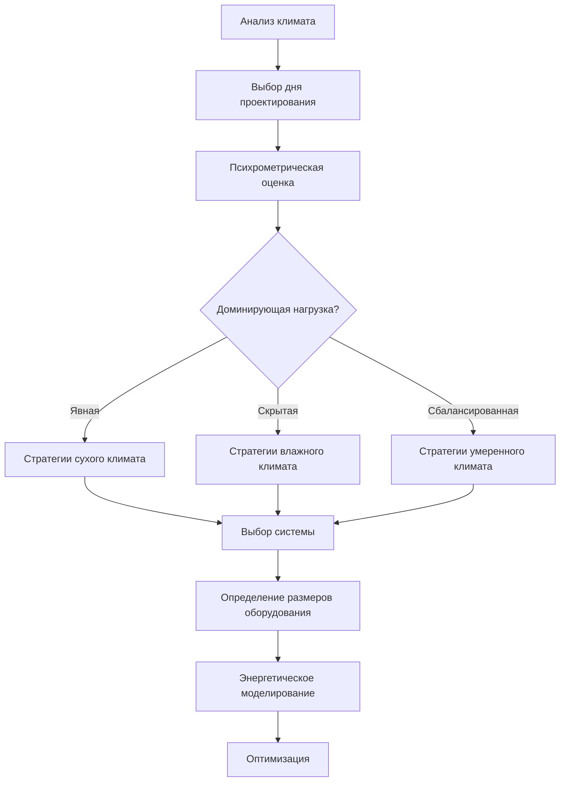

## Классификация климата и проектирование HVAC

Проектирование HVAC в зависимости от климата представляет собой применение принципов термодинамики и психрометрического анализа для соответствия требованиям комфорта и технологических процессов при значительно отличающихся условиях окружающей среды. Климатические зоны ASHRAE служат основой для выбора системы, определения размеров оборудования и стратегий оптимизации энергии во всем мире.

Фундаментальное соотношение между характеристиками климата и нагрузкой HVAC выражается через коэффициент явного тепла (SHR):

$$SHR = \frac{Q_s}{Q_s + Q_l}$$

где $Q_s$ представляет явную холодильную нагрузку (кВт), а $Q_l$ представляет скрытую холодильную нагрузку (кВт). Этот коэффициент варьируется кардинально в зависимости от климатической зоны, от SHR > 0,95 в пустынных климатах до SHR < 0,65 в тропических морских средах.

## Фреймворк климатических зон ASHRAE

Стандарт ASHRAE 169 определяет восемь тепловых климатических зон (1–8, от жарких к холодным) и три режима влажности (A: влажный, B: сухой, C: морской), создавая 26 отдельных климатических классификаций. Каждая зона представляет уникальные задачи проектирования:

| Климатическая зона | Представительные регионы | Основная задача проектирования | Типичная стратегия проектирования |
|--------------|-------------------------|--------------------------|------------------------|
| 1A | Майами, Сингапур | Высокая скрытая нагрузка, охлаждение в течение года | Системы уличного воздуха, осушение десиккантом |
| 2B | Феникс, Эр-Рияд | Экстремальная сухая жара, высокий солнечный прирост | Испарительное охлаждение, тепловая масса, ночная вентиляция |
| 3C | Сан-Франциско, Лиссабон | Мягкие температуры, морское влияние | Естественная вентиляция, смешанные системы |
| 5A | Чикаго, Стокгольм | Доминирующее отопление, контроль влажности | Рекупeрация тепла, переменный расход хладагента |
| 7 | Фэрбанкс, Якутск | Экстремальный холод, защита от замерзания | Рекуперация тепла, гликолевые системы, преддверия |
| 8 | Барроу, Лонгйёрбюен | Арктические условия, вечная мерзлота | Системы со связью с грунтом, рекуперация тепла отходов |

## Психрометрические аспекты проектирования

Проектирование в зависимости от климата начинается с психрометрического анализа условий наружного воздуха. Разность энтальпии между наружным и внутренним воздухом определяет полную нагрузку охлаждения или отопления от вентиляции:

$$Q_{vent} = \dot{m} \cdot (h_o - h_i) = 1.08 \cdot CFM \cdot \Delta h$$

где $\dot{m}$ — массовый расход (кг/с), $h_o$ и $h_i$ — энтальпии наружного и внутреннего воздуха (кДж/кг), и $\Delta h$ — разность энтальпии (Btu/lb для упрощенного уравнения).

## Выбор температуры и влажности проектирования

Справочник ASHRAE—Основы предоставляет условия проектирования при 0,4%, 1% и 2% годовой кумулятивной частоты возникновения. Выбор влияет на производительность оборудования:

**Условия проектирования охлаждения:**
- Проектирование 0,4%: Оборудование рассчитано на превышение в течение 35 часов/год (консервативно, более высокие начальные затраты)
- Проектирование 1%: Оборудование рассчитано на превышение в течение 88 часов/год (стандартная практика)
- Проектирование 2%: Оборудование рассчитано на превышение в течение 175 часов/год (экономичное, допускает краткие периоды неудовлетворенной нагрузки)

**Условия проектирования отопления:**
Большинство юрисдикций требуют условия зимнего проектирования 99% или 99,6% для обеспечения адекватной производительности при экстремальном холоде.

## Механизмы теплопередачи в зависимости от климата

Доминирующий режим теплопередачи варьируется в зависимости от климатической зоны, влияя на проектирование оболочки и стратегию системы:

### Жаркие засушливые климаты (2B, 3B)

Солнечная радиация доминирует в охлаждающих нагрузках. Температура солнечного воздуха учитывает комбинированные эффекты:

$$T_{sol-air} = T_o + \frac{\alpha \cdot I_t}{h_o} - \frac{\epsilon \cdot \Delta R}{h_o}$$

где $T_o$ — температура наружного воздуха (°C), $\alpha$ — поглощаемость солнца, $I_t$ — полная солнечная радиация (Вт/м²), $h_o$ — коэффициент теплопередачи на внешней поверхности (Вт/м²·K), $\epsilon$ — излучаемость, и $\Delta R$ — обмен тепловым излучением (Вт/м²).

Стратегии проектирования делают акцент на:
- Высокую тепловую массу для смещения пиковых нагрузок
- Отражающие поверхности (низкий $\alpha$, высокий $\epsilon$)
- Испарительное охлаждение где доступна вода
- Ночную вентиляцию для разрядки тепловой массы

### Жаркие влажные климаты (1A, 2A)

Скрытые нагрузки от влагопроникновения и вентиляционного воздуха доминируют. Требование по удалению влаги:

$$\dot{m}_w = \rho \cdot CFM \cdot (W_o - W_i) / 60$$

где $\rho$ — плотность воздуха (кг/м³), $W_o$ и $W_i$ — коэффициенты влажности наружного и внутреннего воздуха (кг влаги/кг сухого воздуха).

Стратегии проектирования включают:
- Системы уличного воздуха с независимым контролем скрытой нагрузки
- Осушение десиккантом для глубокого осушения (< 40% ОВ)
- Поддержание избыточного давления в здании для минимизации проникновения
- Рекуперация явного тепла вентиляторами рекуперации энергии

### Холодные климаты (6, 7, 8)

Потеря тепла оболочкой через кондукцию доминирует в нагрузках отопления:

$$Q_{loss} = U \cdot A \cdot (T_i - T_o)$$

где $U$ — общий коэффициент теплопередачи (Вт/м²·K), $A$ — площадь поверхности (м²), и $T_i - T_o$ — разность температур внутри и снаружи (K).

Стратегии проектирования делают акцент на:
- Высокопроизводительные оболочки (U < 0,15 Вт/м²·K)
- Рекуперация тепла при вентиляции (эффективность 75–90%)
- Преддверия и воздушные завесы для минимизации проникновения
- Защита от замерзания гидравлических систем

## Смешанные и адаптивные стратегии

Умеренные климаты (3A, 3C, 4A, 4B, 4C) получают преимущества от смешанных систем, которые переходят между естественной вентиляцией, механической вентиляцией и механическим охлаждением в зависимости от условий окружающей среды. Цикл экономайзера обеспечивает бесплатное охлаждение когда:

$$h_o < h_i \text{ (экономайзер по энтальпии)}$$

или

$$T_o < T_i - 2°C \text{ (температурный экономайзер)}$$

## Выбор системы в зависимости от климата

| Тип климата | Рекомендуемые системы | Особенности эффективности | Рассмотрения |
|--------------|---------------------|---------------------|----------------|
| Жаркий влажный | DOAS + лучистая, VRF с осушением | ERV, колеса десиккант | Проверка скрытой производительности |
| Жаркий сухой | Испарительное охлаждение, накопление тепла | Косвенное испарительное, ночная вентиляция | Доступность воды |
| Умеренный | VAV с экономайзером, тепловые насосы | Воздушный экономайзер, управление спросом | Сезонное переключение |
| Холодный | Гидравлическое отопление, DOAS с HRV | Рекуперация тепла > 80%, конденсационные котлы | Защита от замерзания |
| Экстремальный холод | Гликолевые системы, рекуперация тепла отходов | Циркуляционные петли, геотермальный источник | Аспекты вечной мерзлоты |

## Контроль влажности в зависимости от климата

Уравнение баланса влаги регулирует требования контроля влажности:

$$\dot{m}_{dehumidification} = \dot{m}_{generation} + \dot{m}_{ventilation} - \dot{m}_{infiltration}$$

Во влажных климатах производительность осушения должна превышать сумму внутреннего образования влаги и нагрузки влаги наружного воздуха. В холодных климатах увлажнение предотвращает чрезмерно сухие внутренние условия во время отопления.

## Оптимизация энергии в зависимости от климата

Оптимизация энергии в зависимости от климата сосредоточивает ресурсы на доминирующих нагрузках:

**Жаркие климаты:**
- Минимизировать поступление солнечного тепла (SHGC < 0,25)
- Оптимизировать распределение воздуха для минимизации перегрева
- Максимизировать часы работы экономайзера

**Холодные климаты:**
- Максимизировать изоляцию оболочки (R-10,6+ крыши в RSI)
- Эффективность рекуперации тепла > 80%
- Минимизировать вентиляцию при экстремальных условиях

**Умеренные климаты:**
- Естественная вентиляция в переходные сезоны
- Тепловая масса для смещения нагрузки
- Последовательности управления на основе спроса

## Требования нормативных документов и стандартов

Требования в зависимости от климата содержатся в:

- **ASHRAE 90.1 Energy Standard:** Требования оболочки в зависимости от климатической зоны, эффективность оборудования и мандаты экономайзера
- **International Energy Conservation Code (IECC):** Предписывающие требования в зависимости от климатической зоны
- **Местные дополнения:** Улучшенные требования в экстремальных климатах (California Title 24, Canadian National Energy Code)

Проектирование HVAC в зависимости от климата требует понимания взаимодействия между условиями окружающей среды, производительностью оболочки здания и возможностями системы для обеспечения комфорта и эффективности во всем спектре глобальных сред.
