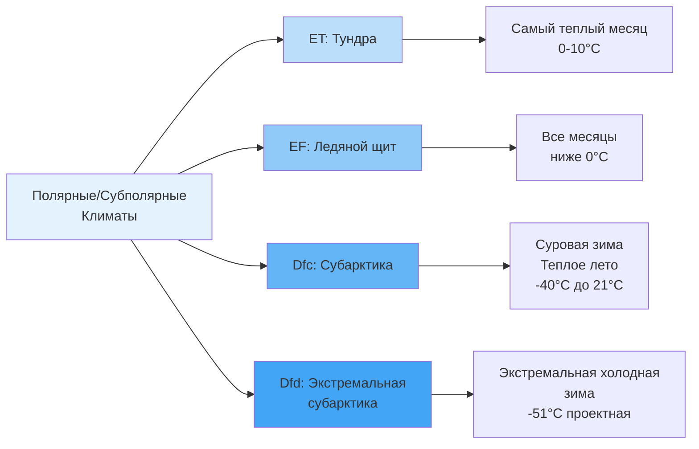

# Характеристики арктического и субарктического климата для HVAC

Арктический и субарктический климаты создают экстраординарные тепловые требования к системам HVAC благодаря устойчивому экстремальному холоду, массивным температурным дифференциалам, взаимодействию с вечной мерзлотой и атмосферным явлениям, которые кардинально изменяют механизмы теплопередачи. Понимание физики, управляющей этими условиями, необходимо для проектирования систем, которые поддерживают тепловой комфорт при управлении энергопотреблением и выживаемостью оборудования.

## Анализ температурного режима

Арктические и субарктические регионы характеризуются самыми экстремальными холодными условиями температуры для занятых сооружений, с продолжительными сезонами отопления и температурными экстремумами, которые бросают вызов пределам эксплуатации обычного оборудования HVAC.

### Распределение проектной температуры

Тепловая среда значительно варьируется в арктических и субарктических зонах:

| Классификация климата | Зима 99,6% проектная | Зима 99,0% проектная | Лето 0,4% проектная | Среднегодовая | Сезон отопления |
|----------------------|-------------------|-------------------|------------------|------------|----------------|
| Субарктика внутренняя | -43°C до -48°C | -40°C до -44°C | 21°C до 27°C | -7°C до -1°C | 9-10 месяцев |
| Арктика прибрежная | -37°C до -43°C | -34°C до -40°C | 10°C до 18°C | -12°C до -7°C | 10-11 месяцев |
| Арктика внутренняя | -46°C до -54°C | -43°C до -49°C | 18°C до 24°C | -15°C до -9°C | 11-12 месяцев |
| Высокая Арктика | -48°C до -57°C | -45°C до -54°C | 7°C до 16°C | -15°C до -12°C | Круглый год |

ASHRAE Handbook Fundamentals Chapter 14 предоставляет детальные климатические данные проектирования. Проектная температура 99,6% представляет условия, превышающие только 0,4% в год (35 часов), устанавливая базовый уровень для определения размера системы отопления.

### Накопление градусо-дней отопления

Градусо-дни отопления (HDD) количественно определяют годовые требования к энергии отопления, рассчитываемые как кумулятивная разница между базовой температурой (обычно 18°C) и средней дневной температурой:

$$
\text{HDD} = \sum_{i=1}^{365} \max(T_{base} - T_{mean,i}, 0)
$$

Значения HDD арктических и субарктических регионов кардинально превышают нагрузки умеренного климата:

**Распределение HDD по регионам:**
- Субарктика: 6670-8890 HDD (базовая 18°C)
- Арктика прибрежная: 8890-11110 HDD
- Арктика внутренняя: 11110-13900 HDD
- Высокая Арктика: 13900-16700 HDD

Для сравнения, Москва накапливает приблизительно 4500 HDD в год. Арктические сооружения испытывают тепловую нагрузку в 3-5 раз больше на градус теплопроводности оболочки.

## Термодинамические условия и теплопередача

Экстремальные температурные дифференциалы в арктическом климате создают скорости и механизмы теплопередачи, которые существенно отличаются от умеренных условий.

### Механика кондуктивных теплопотерь

Теплопроводность через оболочку здания следует закону Фурье, с арктическими условиями, усиливающими тепловой поток через массивные температурные градиенты:

$$
q = \frac{k \cdot A \cdot \Delta T}{L}
$$

Где:
- $q$ = скорость теплопередачи (Вт или кДж/ч)
- $k$ = тепловая проводимость (Вт/м·K или кДж/ч·м·K)
- $A$ = площадь поверхности (м²)
- $\Delta T$ = температурная разница (K или °C)
- $L$ = толщина материала (м)

**Пример: Теплопотери сборки стены**

Рассмотрим стену с изоляцией RSI 7,0 (U = 0,141 Вт/м²·K):
- Внутренняя температура: 21°C
- Внешняя температура: -46°C (арктическое условие проектирования)
- Температурный дифференциал: ΔT = 67 K
- Тепловой поток: $q'' = U \times \Delta T = 0,141 \times 67 = 9,45$ Вт/м²

Та же сборка стены в умеренном климате с ΔT = 39 K дает только 5,50 Вт/м², демонстрируя 71% увеличение теплопотерь на единицу площади в арктических условиях.

### Конвективная теплопередача при низких температурах

Коэффициенты естественной и принудительной конвекции варьируются в зависимости от температуры и атмосферной плотности. Коэффициент конвективной теплопередачи на поверхностях зданий:

$$
h = Nu \cdot \frac{k}{L}
$$

Где число Нуссельта (Nu) зависит от числа Грасгофа (Gr) и числа Прандтля (Pr) для естественной конвекции, или числа Рейнольдса (Re) и Pr для принудительной конвекции.

Плотность холодного воздуха значительно увеличивается:
- Плотность воздуха при 21°C: 1,2 кг/м³
- Плотность воздуха при -40°C: 1,44 кг/м³
- Увеличение плотности: 20%

Это изменение плотности влияет на конвективные схемы, движущие силы инфильтрации и производительность оборудования HVAC.

### Радиационная теплопередача

Долговолновой радиационный обмен между поверхностями зданий и небом становится значительным в арктических условиях, особенно во время ясных зимних ночей:

$$
q_{rad} = \epsilon \cdot \sigma \cdot A \cdot (T_{surface}^4 - T_{sky}^4)
$$

Где:
- $\epsilon$ = излучательность поверхности (0,9 для большинства строительных материалов)
- $\sigma$ = постоянная Стефана-Больцмана (5,67×10⁻⁸ Вт/м²·K⁴)
- $T$ = абсолютная температура (K)

При ясном арктическом небе эффективная температура неба может быть на 11-17°C ниже температуры окружающего воздуха, создавая дополнительные нагрузки радиационного охлаждения на крыши и открытые поверхности, которые должны быть учтены в расчетах теплопотерь.

## Атмосферные условия

Арктическая атмосферная физика создает уникальные вызовы для эксплуатации систем HVAC и давлении в зданиях.

### Плотность воздуха и инфильтрация

Разность давлений стекового эффекта увеличивается с температурной разницей и высотой здания:

$$
\Delta P = \frac{g \cdot h \cdot \Delta T \cdot (P_{out})}{T_{avg}}
$$

Где:
- $g$ = ускорение свободного падения (9,81 м/с²)
- $h$ = вертикальная высота (м)
- $\Delta T$ = разница внутренней и внешней температуры (K)
- $P_{out}$ = атмосферное давление на улице (Па)
- $T_{avg}$ = средняя абсолютная температура (K)

**Сравнение стекового эффекта:**

Для 3-этажного здания (высота 9 м):
- Умеренный климат (ΔT = 22 K): ΔP = 30 Па
- Арктический климат (ΔT = 67 K): ΔP = 90 Па

Утроенная разность давлений пропорционально увеличивает скорость инфильтрации для заданной герметичности оболочки, требуя критической необходимости в превосходном герметизации воздуха (целевой показатель: 0,6 ACH50 или ниже).

### Абсолютная влажность и транспорт влаги

Арктический воздух содержит минимум влаги из-за низкого давления насыщенного пара. Отношение Клаузиуса-Клапейрона управляет давлением насыщения:

$$
\frac{dP_{sat}}{dT} = \frac{L \cdot P_{sat}}{R \cdot T^2}
$$

Где $L$ = скрытая теплота испарения и $R$ = удельная газовая постоянная.

**Сравнение содержания влаги (при 100% ОВ):**

| Температура | Давление насыщения | Коэффициент влажности | Точка росы |
|------------|-------------------|----------------|-----------|
| 21°C | 2,50 кПа | 7,0 г/кг | 21°C |
| -18°C | 0,27 кПа | 0,76 г/кг | -18°C |
| -40°C | 0,03 кПа | 0,083 г/кг | -40°C |

Арктический наружный воздух содержит на 98,8% меньше влаги, чем насыщенный воздух при 21°C. Введение этого воздуха в отапливаемые помещения без увлажнения создает внутреннюю относительную влажность ниже 5%, вызывая повреждение материалов, статическое электричество и дискомфорт занимающихся.

### Ощущаемая температура и воздействие оборудования

Скорость ветра усиливает конвективные теплопотери от открытых поверхностей благодаря уменьшению толщины пограничного слоя. Эквивалент ощущаемой температуры влияет на производительность оборудования:

Скорость ветра увеличивает коэффициенты теплопередачи поверхности с типичных значений при отсутствии ветра 5,7-11,4 Вт/м²·K до 34-46 Вт/м²·K при скорости ветра 9 м/с, фактически удваивая теплопотери от наружного оборудования.

## Тепловые свойства вечной мерзлоты

Вечная мерзлота—грунт, остающийся ниже 0°C два последовательных года—покрывает 24% открытой земли в Северном полушарии и кардинально изменяет требования проектирования фундамента.

### Тепловая проводимость мёрзлого грунта

Тепловые свойства грунта резко изменяются при замерзании из-за фазового перехода вода-лед:

| Тип грунта | Тепловая проводимость (неморозная) | Тепловая проводимость (морозная) | Объемная теплоёмкость |
|-----------|-------------------------------|------------------------------|------------------------|
| Сухой песок | 0,85 Вт/м·K | 6,8 Вт/м·K | 1450 кДж/м³·K (мороз) |
| Насыщенный глинистый грунт | 3,4 Вт/м·K | 5,7 Вт/м·K | 2550 кДж/м³·K (мороз) |
| Торф/органика | 0,45 Вт/м·K | 3,4 Вт/м·K | 1820 кДж/м³·K (мороз) |
| Лед | — | 7,4 Вт/м·K | 1530 кДж/м³·K |

Мёрзлый грунт демонстрирует в 2-8 раз более высокую тепловую проводимость, чем немерзлый аналог, ускоряя теплопередачу из отапливаемых сооружений в вечную мерзлоту и увеличивая риск оттаивания.

### Динамика активного слоя

Активный слой—поверхностная зона, оттаивающая ежегодно—имеет толщину 0,3-0,9 м в арктических регионах. Теплота от зданий проникает этот слой, потенциально вызывая деградацию вечной мерзлоты:

$$
\text{Глубина проникновения} = \sqrt{\frac{\alpha \cdot t}{\pi}}
$$

Где:
- $\alpha$ = тепловая диффузивность (k/ρc)
- $t$ = период времени (обычно годовой цикл)

Здания должны предотвращать нисходящий тепловой поток, превышающий 3,2-9,5 Вт/м², чтобы избежать прогрессивного оттаивания вечной мерзлоты и осадки.

## Схемы солнечной радиации

Арктическая солнечная геометрия создает экстремальные сезонные колебания в доступной солнечной радиации и световых часах.

### Сезонные колебания инсоляции

```mermaid
graph TD
    A[Арктические схемы солнца] --> B[Зимний солнцестояние]
    A --> C[Летнее солнцестояние]
    B --> D[24-часовая тьма<br/>Высокая Арктика]
    B --> E[2-4 часа сумерек<br/>Полярный круг]
    B --> F[Нет прямого солнечного<br/>выигрыша<br/>Максимум нагрузки отопления]
    C --> G[24-часовой день<br/>Полночное солнце]
    C --> H[Высота солнца 30-47°<br/>Низкоугловая радиация]
    C --> I[Непрерывная нагрузка<br/>охлаждения<br/>Нет ночного восстановления]

    style B fill:#1a1a4d
    style C fill:#ffd700
    style F fill:#ff6b6b
    style I fill:#4ecdc4
```

Доступность солнечной радиации:
- **Зима (ноябрь-февраль):** 0-18 МДж/м²/день, в основном диффузная
- **Весна/Осень (март-апрель, сентябрь-октябрь):** 7-14 МДж/м²/день
- **Лето (май-август):** 18-25 МДж/м²/день, непрерывно, но низкого угла

Низкий угол возвышения солнца (максимум 47° на Полярном круге, 23,5° на Северном полюсе) снижает эффективность коэффициента солнечного выигрыша и бросает вызов ориентации фотоэлектрической системы.

## Метеорологические явления

Дополнительные атмосферные условия влияют на проектирование и эксплуатацию систем HVAC.

### Характеристики осадков

Годовой объем арктических осадков остается низким (100-300 мм эквивалента воды ежегодно), но возникает в виде снега с высокой потенциальной аккумуляцией:

- **Плотность снега:** 80-240 кг/м³ (свежий) до 240-480 кг/м³ (осевший)
- **Проектные нагрузки от снега на крыше:** 1,9-4,8 кПа
- **Коэффициенты сугроба:** 1,5-2,5× сбалансированная нагрузка снега
- **Обледенение:** Циклы замораживания-оттаивания создают ледяные плотины и формирование сосулек

Наружные воздухозаборы требуют защиты от инфильтрации снега и блокировки льда путем возвышенного позиционирования, козырьков и систем отопления.

### Атмосферное обледенение

Переохлажденные капельки воды замерзают при контакте с поверхностями ниже 0°C, накапливаясь на:
- Заполнении градирни и системах распределения
- Катушках конденсирующего блока и вентиляторах
- Воздухозаборных жалюзи и заслонках
- Выходных трубопроводах

Накопление льда снижает расход воздуха, блокирует дренаж, увеличивает механические нагрузки и может вызвать катастрофический отказ оборудования.

## Система классификации климата

Арктические и субарктические климаты соответствуют классификации климата Кёппена:

**Характеристики классификации:**

- **ET (Тундра):** Средняя температура самого теплого месяца 0-10°C, присутствует вечная мерзлота
- **EF (Ледяной щит):** Все месяцы ниже 0°C, постоянный снежно-ледяной покров
- **Dfc (Субарктика):** Суровые зимы (<-36°C), короткое прохладное лето, <4 месяцев >10°C
- **Dfd (Экстремальная субарктика):** Самые холодные обитаемые регионы, зимние средние ниже -36°C

## Последствия проектирования HVAC

Климатические характеристики определяют специальные требования к системам HVAC:

**Критические параметры проектирования:**

1. **Тепловое сопротивление оболочки:** RSI 10,5+ крыши, RSI 7,0+ стены, RSI 8,8+ полы
2. **Непрерывность воздушного барьера:** <0,6 ACH50 тест дверью разрежения
3. **Теплоrekuperation вентиляции:** 85-95% эффективность HRV/ERV требуется
4. **Емкость увлажнения:** 2,3-4,5 кг/ч на 283 м³/ч наружного воздуха
5. **Защита от замораживания:** Все трубопроводы, змеевики и управление конденсатом
6. **Возможность холодного запуска оборудования:** Эксплуатация до проектной температуры минус 5,6°C
7. **Резервное резервирование отопления:** 100% емкость резервирования для критических сооружений
8. **Защита вечной мерзлоты:** Системы удаления или вентиляции теплоты фундамента

**Величина тепловой нагрузки:**

Для 930 м² сооружения с умеренной оболочкой (U-стена = 0,80 Вт/м²·K):
- Теплопотери стены (372 м² при ΔT = 67 K): 35,2 кВт
- Теплопотери крыши (930 м² при ΔT = 67 K): 70,4 кВт
- Теплопотери пола (930 м² при ΔT = 28 K): 29,3 кВт
- Инфильтрация (0,1 ACH, 2260 м³): 42,2 кВт
- Вентиляция (237 м³/ч при 85% рекуперации): 28,5 кВт
- **Общая нагрузка отопления: 205,6 кВт** (22,1 Вт/м²)

Эквивалент умеренного климата будет приблизительно 87,9 кВт, демонстрируя 2,3× множитель нагрузки для арктических условий.

## Заключение

Характеристики арктического и субарктического климата представляют наиболее требовательную тепловую среду для проектирования системы HVAC. Устойчивый экстремальный холод создает температурные дифференциалы, превышающие 67 K, генерируя плотности теплового потока в 2-3 раза больше, чем умеренный климат. Низкое содержание влаги в атмосфере требует систем увлажнения, обрабатывающих дифференциалы давления насыщенного пара 2,47 кПа. Взаимодействие вечной мерзлоты требует осторожного управления температурой для предотвращения деградации фундамента. Давление стекового эффекта утраивается, требуя исключительной производительности воздушного барьера. Оборудование должно надежно работать при температурах, на 17-28°C ниже обычных пределов, при управлении обледенением, условиями холодного запуска и ускоренными циклами замораживания-оттаивания. Понимание этих фундаментальных климатических свойств—температурных экстремумов, термодинамических условий, изменений атмосферной плотности, теплового поведения вечной мерзлоты и схем солнца—обеспечивает основание для проектирования систем HVAC, которые поддерживают комфорт занимающихся и целостность зданий в полярных средах.
