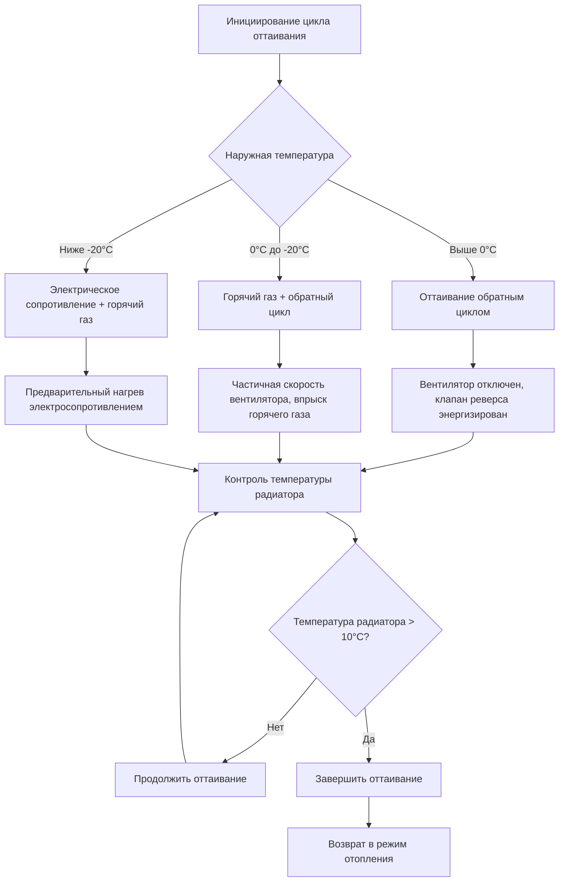

# Особенности выбора оборудования HVAC для арктического климата

Выбор оборудования для арктических и субарктических климатов требует специализированных компонентов, рассчитанных на непрерывную работу при наружных температурах от -40°C до -51°C. Стандартное оборудование HVAC отказывает в этих условиях из-за затвердевания смазочного материала, ограничений давления хладагента, хрупкости материалов и неадекватности систем оттаивания. Оборудование арктического класса включает улучшенные материалы, специализированные элементы управления и системы термального управления для обеспечения надежной работы в условиях экстремального холода.

## Технология низкотемпературных тепловых насосов

### Диапазоны рабочей температуры

Арктические тепловые насосы используют продвинутые контуры хладагента и технологии компрессоров для расширения рабочего диапазона за пределы стандартного оборудования.

| Тип теплового насоса | Минимальная рабочая температура | Производительность отопления при -10°C | COP при -10°C |
|---|---|---|---|
| Стандартный воздушный источник | −9°C до −8°C | 40-50% номинальная | 1,2-1,5 |
| Холодный климат | −10°C до −11°C | 55-65% номинальная | 1,6-2,0 |
| Усиленный холодный климат | −17°C до −18°C | 65-75% номинальная | 1,8-2,3 |
| Экстремально холодный климат | −27°C до −29°C | 70-80% номинальная | 2,0-2,5 |

Стандарт ASHRAE 116 определяет процедуры испытания производительности тепловых насосов при низких температурах, требуя измерения производительности и эффективности при наружных условиях 3°C, 8°C и 8°C.

### Технология паровпрыска

Улучшенные компрессоры с паровпрыском (EVI) впрыскивают пар хладагента при промежуточном давлении во время сжатия, увеличивая производительность отопления и эффективность при низких температурах окружающей среды.

Термодинамическая выгода проистекает из двухступенчатого процесса сжатия:

$$W_{comp} = \dot{m}_{1} \cdot (h_{2} - h_{1}) + (\dot{m}_{1} + \dot{m}_{inj}) \cdot (h_{3} - h_{2})$$

Где:
- $W_{comp}$ = Общая работа компрессора (кДж/ч)
- $\dot{m}_{1}$ = Основной массовый расход хладагента (кг/ч)
- $\dot{m}_{inj}$ = Массовый расход впрыскиваемого пара (кг/ч)
- $h_{1}, h_{2}, h_{3}$ = Энтальпия на всасывании, промежуточной и нагнетательной (кДж/кг)

Паровпрыск увеличивает производительность отопления на 15-30% при температурах ниже −18°C по сравнению с однступенчатым сжатием.

### Выбор хладагента для холодного климата

Арктические тепловые насосы требуют хладагентов с низкой критической температурой и адекватными степенями сжатия в экстремальных условиях:

| Хладагент | Давление испарения при −40°C | Критическая температура | Пригодность для арктики |
|---|---|---|---|
| R-410A | 207 кПа | 70°C | Хорошо до −9°C |
| R-32 | 290 кПа | 78°C | Хорошо до −13°C |
| R-454B | 241 кПа | 67°C | Хорошо до −9°C |
| R-744 (CO₂) | 1034 кПа | 31°C | Отлично до −40°C |

Трансритические системы R-744 (диоксид углерода) поддерживают положительное давление всасывания и адекватные степени сжатия при температурах, где обычные хладагенты приближаются к условиям вакуума.

## Конструкция компрессора для экстремального холода

### Требования холодного пуска

Эксплуатация компрессора при экстремальных температурах требует специализированных функций:

**Нагреватели картера:** Поддерживают температуру масла на 11-17°C выше температуры окружающей среды для обеспечения адекватной вязкости и предотвращения миграции хладагента в компрессор во время остановки.

Требуемая производительность нагревателя:

$$Q_{heater} = U \cdot A \cdot (T_{oil} - T_{ambient}) + \dot{m}_{mig} \cdot h_{fg}$$

Для типичного спирального компрессора при -40°C:
- Потери тепла на поверхности: 44-59 кДж/ч
- Тепло миграции: 15-29 кДж/ч
- Общая производительность нагревателя: 200-300 Вт

**Системы управления маслом:** Улучшенные маслоотделители (98-99% эффективность) и контуры возврата масла предотвращают скопление масла в наружных радиаторах при низкотемпературной эксплуатации.

**Защита двигателя компрессора:** Тепловая защита от перегрузки, откалиброванная для условий холодной окружающей среды, с датчиками температуры обмотки двигателя, предотвращающими сгорание при работе с высокой степенью сжатия.

### Преимущества спиральных компрессоров

Спиральные компрессоры доминируют в арктических приложениях благодаря:

1. **Меньше движущихся частей** - Снижение износа и потерь на трение
2. **Непрерывное сжатие** - Более плавная работа при высоких степенях сжатия
3. **Осевое соответствие** - Автоматическая регулировка в соответствии с различными нагрузками
4. **Управление маслом** - Превосходные характеристики возврата масла

Возможность степени сжатия при −40°C окружающей среды, +49°C конденсации:

$$PR = \frac{P_{discharge}}{P_{suction}} = \frac{3010 \text{ кПа}}{324 \text{ кПа}} = 9,3$$

Стандартные компрессоры ограничены степенями сжатия 5-7; арктические спиральные работают надежно при 8-11.

## Конфигурация наружного радиатора

### Характеристики накопления инея

Обледенение наружного радиатора следует отчетливым закономерностям в зависимости от условий окружающей среды:

| Наружная температура | Относительная влажность | Скорость обледенения | Частота оттаивания |
|---|---|---|---|
| +2°C | 70-80% | Сильная, мокрая | 45-60 мин |
| −8°C | 60-70% | Умеренная, кристаллическая | 60-90 мин |
| −18°C | 50-60% | Слабая, тонкая | 90-120 мин |
| −27°C | 40-50% | Минимальная | 180+ мин |

Ниже −9°C содержание влаги в атмосфере становится минимальным, снижая накопление инея, но увеличивая сложность цикла оттаивания из-за ледяного связывания.

### Скорость потока через радиатор

Арктические радиаторы работают при сниженных скоростях потока воздуха (1,0-1,5 м/с) по сравнению со стандартными конструкциями (2,0-2,5 м/с) для:

- Снижения перепада давления на стороне воздуха через обледеневший радиатор
- Увеличения площади поверхности радиатора и времени пребывания хладагента
- Улучшения теплопередачи при низких температурных напорах

**Теплопередача на стороне воздуха:**

$$Q = h_{air} \cdot A_{coil} \cdot (T_{air,in} - T_{surface})$$

При −40°C окружающей среды, 1,5 м/с скорости потока, расстояние между ребрами 5-6 мм (по сравнению с 2-2,5 мм в стандартных) оптимизирует толерантность к инею и теплопередачу.

## Продвинутые системы управления оттаиванием

### Стратегии инициирования оттаивания

Арктические тепловые насосы используют несколько методов инициирования оттаивания:

**Оттаивание по времени и температуре:** Инициирует на основе накопленного времени работы и температурного напора между жидкостной линией и наружным воздухом. Типовые установки при −20°C:
- Пороговое значение времени: 90 минут
- Температурный напор: <8°C

**Оттаивание по перепаду давления:** Отслеживает перепад давления через наружный радиатор через датчики давления хладагента. Накопление инея увеличивает перепад давления, инициируя оттаивание при превышении порога (обычно 138-207 кПа).

**Импедансное зондирование:** Измеряет электрический импеданс между ребрами радиатора. Образование льда изменяет импеданс, обеспечивая прямое измерение образования инея.

### Методология оттаивания

**Оттаивание с электрическим сопротивлением:** Ниже −13°C обратный цикл оттаивания становится неэффективным из-за недостаточного извлечения тепла из внутреннего воздуха. Дополнительное электрическое сопротивление (8,8-17,6 кВт) обеспечивает энергию оттаивания при поддержании комфорта в помещении.

Энергетический штраф за оттаивание:

$$E_{defrost} = \frac{Q_{defrost} \cdot t_{defrost} \cdot N_{cycles}}{COP_{heating}}$$

Для 10-минутных циклов оттаивания каждые 90 минут при −20°C:
- Энергия оттаивания: 4,4 МДж на цикл
- Частота: 16 циклов в день
- Ежедневный штраф оттаивания: 70 МДж (7% тепловой нагрузки)

## Выбор материалов для экстремального холода

### Пластичность металла и разрушение

Металлы демонстрируют пониженную пластичность и повышенную склонность к разрушению при криогенных температурах. Температура перехода от пластичного к хрупкому (DBTT) варьируется в зависимости от материала:

| Материал | DBTT | Пригодность для арктики |
|---|---|---|
| Углеродистая сталь (A36) | 0°C до −7°C | Низкая - хрупкая ниже −20°C |
| Нержавеющая сталь 304 | −73°C | Отличная |
| Алюминий 6061-T6 | −196°C | Отличная |
| Медь (тип L) | −196°C | Отличная |
| ПВХ Schedule 40 | +10°C | Неприемлема |
| CPVC | +5°C | Низкая |

Арктические установки требуют аустенитной нержавеющей стали, меди или алюминия для наружных трубопроводов и компонентов. Углеродистая сталь требует испытания на ударное воздействие в соответствии с ASME B31.3 при использовании ниже проектной металлической температуры.

### Материалы прокладок и уплотнений

Эластомерные уплотнения теряют эластичность при низких температурах, вызывая утечки:

**Приемлемые материалы:**
- Силиконовая резина: Эксплуатация до −62°C
- Фторсиликон: Эксплуатация до −51°C, улучшенная стойкость к топливу/маслу
- PTFE (Тефлон): Эксплуатация до −240°C, низкая остаточная деформация

**Неприемлемые материалы:**
- EPDM: Твердеет ниже −40°C
- Нитрил (Buna-N): Хрупкий ниже −22°C
- Стандартный неопрен: Ограничен −7°C

## Системы защиты от замерзания

### Требования к концентрации гликоля

Гидравлические системы требуют растворов пропиленгликоля с концентрацией, обеспечивающей защиту от замерзания с запасом 5°C ниже проектной температуры.

**Понижение точки замерзания:**

$$T_{freeze} = T_{water} - k \cdot \% glycol - c \cdot (\% glycol)^2$$

Для пропиленгликоля:
- $k = 0,445$
- $c = 0,0018$

| Проектная температура | Требуемый % гликоля | Точка замерзания | Запас безопасности |
|---|---|---|---|
| −7°C | 40% | −13°C | 6°C |
| −17°C | 48% | −24°C | 7°C |
| −27°C | 53% | −29°C | 2°C |
| −29°C | 57% | −34°C | 5°C |

**Штраф гликоля на теплопередачу:**

Снижение удельной теплоемкости:

$$c_{p,glycol} = c_{p,water} \cdot (1 - 0,0038 \cdot \% glycol)$$

При концентрации гликоля 50%:
- Удельная теплоемкость: 3,39 кДж/кг·°C (19% снижение по сравнению с водой)
- Плотность: 974 кг/м³ (2% снижение)
- Вязкость: 4,8 сСт (300% увеличение при 4°C)

Требуемое увеличение расхода:

$$GPM_{glycol} = GPM_{water} \cdot \frac{c_{p,water}}{c_{p,glycol}} = GPM_{water} \cdot 1,23$$

Мощность насоса увеличивается на 40-60% из-за комбинированного влияния увеличенного расхода и вязкости.

### Системы электрического обогрева трубопровода

Электрический обогрев трубопровода предотвращает замерзание в открытых трубопроводах, конденсатных линиях и системах отвода.

**Саморегулирующийся обогрев:** Полимерный сердечник увеличивает сопротивление при повышении температуры, автоматически ограничивая выход:
- Низкая температура (−40°C): 39-49 Вт/м
- Умеренная температура (0°C): 16-23 Вт/м
- Температура обслуживания (+10°C): 10-13 Вт/м

**Обогрев с постоянной мощностью:** Фиксированный выход, требующий управления термостатом:
- Стандартный выход: 16-26 Вт/м
- Высокий выход: 33-49 Вт/м
- Используется для быстрого нагрева или длинных контуров

**Проектирование контура обогрева:**

$$W_{total} = (W_{pipe} + W_{heat-loss}) \cdot L \cdot SF$$

Где:
- $W_{pipe}$ = Выход обогрева на метр трубопровода
- $W_{heat-loss}$ = Потеря тепла трубопровода на метр (из расчета изоляции)
- $L$ = Длина контура (метры)
- $SF$ = Коэффициент безопасности (1,1-1,3)

Максимальная длина контура ограничена падением напряжения:

$$L_{max} = \frac{\Delta V_{max} \cdot A_{conductor}}{I \cdot \rho \cdot 2}$$

Типичные пределы контура 120V: 45-75 метров в зависимости от мощности обогрева.

## Корпусы наружного оборудования

### Требования к защите от непогоды

Корпусы арктического оборудования защищают компоненты от экстремального холода, снегопада и ветра:

**Значения изоляции:**
- Изоляция стенок: R-57 до R-86 (RSI 10 до 15)
- Люки доступа: R-46 минимум (RSI 8)
- Смотровые окна: Двойное остекление, рамы с разрывом теплопроводности

**Системы отопления:**
- Электронагреватели, управляемые термостатом
- Установка: 4-5°C минимум
- Производительность: 163-327 Вт/м² площади пола корпуса

**Вентиляция:**
- Работает во время эксплуатации компрессора для отвода тепла
- Клапаны закрываются при остановке для удержания тепла
- Минимум 10 воздухообменов в час при эксплуатации

### Управление снегом и льдом

Возвышение оборудования и дренаж предотвращают накопление льда:

- Минимальный зазор над снежным покровом: 45-60 см
- Ориентация радиатора: Вертикальная предпочтительна для сброса льда
- Обогрев поддона: 130-195 Вт/м² для предотвращения ледяной блокировки
- Ветровые барьеры: Уменьшают проникновение снега и воздействие ветрового охлаждения

## Системы фундамента на вечной мерзлоте

### Технология термосифонов

Двухфазные термосифоны пассивно удаляют тепло из фундаментов зданий, поддерживая стабильность вечной мерзлоты.

**Принцип эксплуатации:**

Хладагент (CO₂, пропан или аммиак) испаряется в наземном зонде, поглощая тепло. Пар поднимается к радиатору, открытому холодному наружному воздуху, где конденсируется и отводит тепло. Жидкость возвращается в зонд под действием силы тяжести.

**Возможность удаления тепла:**

$$Q_{removal} = \dot{m} \cdot h_{fg} \cdot N_{cycles}$$

Для одного типичного термосифона диаметром 15 см:
- Удаление тепла: 147-440 кДж/ч (варьируется в зависимости от температурного напора)
- Эффективный радиус: 2,4-3,6 м
- Типовой шаг: 3,6-6 м в центре

**Особенности конструкции:**

Термосифоны работают только при температуре наружного воздуха ниже температуры грунта, обычно октябрь-апрель в арктических регионах. Летнее отключение позволяет некоторый прогрев грунта, требуя адекватной тепловой массы в слое вечной мерзлоты.

### Активные системы холодоснабжения

Критические сооружения используют механическое холодоснабжение с поддержанием вечной мерзлоты:

**Компоненты системы:**
- Охлаждающие спирали, встроенные в грунт (30-60 м на зону)
- Циркуляционные насосы гликоля (с резервированием)
- Конденсирующие блоки с воздушным охлаждением или сухие охладители
- Контроль температуры (несколько уровней глубины)

**Расчет производительности:**

$$Q_{cooling} = k \cdot A \cdot \frac{T_{building} - T_{permafrost}}{L}$$

Где:
- $k$ = Теплопроводность грунта (1,0-2,0 кДж/ч·м·°C мерзлого)
- $A$ = Площадь фундамента (м²)
- $T_{building}$ = Тепловой поток здания (обычно 2-4°C под изоляцией)
- $T_{permafrost}$ = Требуемая температура вечной мерзлоты (ниже −2°C)
- $L$ = Эффективная толщина изоляции (метры)

Потребление энергии для поддержания вечной мерзлоты варьируется от 6-26 кДж/ч на м² площади здания, представляя 5-15% общей тепловой нагрузки здания.

## Адаптация систем управления

### Технологии низкотемпературных датчиков

Стандартные температурные датчики могут неправильно функционировать в арктических условиях:

**Датчики термистора:**
- Диапазон: −40°C до +149°C
- Точность: ±0,1°C
- Время отклика: 3-10 секунд
- Арктический класс: Отличный

**RTD (датчик температуры сопротивления):**
- Диапазон: −240°C до +649°C
- Точность: ±0,06°C
- Дрейф: Минимальный со временем
- Стоимость: 3-5× термистор

**Термопара:**
- Диапазон: −201°C до +1260°C
- Точность: ±1°C
- Требует компенсации
- Стоимость: Минимальная

Арктические установки предпочитают датчики RTD или термистора в защитных термопроводах, с проводом датчика, рассчитанным на низкотемпературную эксплуатацию.

### Системы резервного питания от батарей

Непрерывность системы отопления во время отключения электроэнергии критична для арктических климатов, где замороженные трубопроводы развиваются в течение 4-8 часов потери отопления.

**Определение размера батареи:**

$$Ah_{required} = \frac{W_{load} \cdot t_{backup}}{V_{system} \cdot DOD \cdot \eta}$$

Для 24-часового резерва управления и циркуляционных насосов (500 Вт всего):
- Нагрузка: 500 Вт
- Время резерва: 24 часа
- Напряжение системы: 48V DC
- Глубина разряда: 50%
- Эффективность: 85%
- Требуемая емкость: 290 Ач

Литий-ионные батареи с встроенным обогревом поддерживают емкость при −40°C, в то время как емкость свинцово-кислотных падает на 50-70% при этих температурах.

## Стратегии резервирования оборудования

Арктические установки требуют резервных систем, предотвращающих потерю отопления:

### Параллельные системы отопления

**Конфигурация 1 - Двойные источники тепла:**
- Основной: Тепловой насос для холодного климата (70% нагрузки)
- Резерв: Масляная или пропановая печь (100% нагрузки)
- Переключение: Автоматическое на основе наружной температуры

**Конфигурация 2 - Несколько блоков:**
- Блоки: Два теплового насоса производительностью 60%
- Эксплуатация: Оба работают при экстремальном холоде
- Режим отказа: Единственный блок поддерживает 60% производительности

### Резервное электроснабжение

**Определение размера генератора:**

$$kW_{gen} = \frac{(W_{heating} + W_{circ} + W_{controls}) \cdot 1,25}{\eta_{gen} \cdot PF}$$

Для типичной жилой установки:
- Тепловая нагрузка: 40 кВт (136 500 кДж/ч)
- Циркуляция: 2 кВт
- Управление/освещение: 3 кВт
- Коэффициент безопасности: 1,25
- Эффективность генератора: 0,9
- Коэффициент мощности: 0,8
- Требуемая производительность: 78 кВт резерв

Автоматические переключатели передачи (ATS) обнаруживают потерю питания и запускают генераторы в течение 10-30 секунд, предотвращая отключение системы.

## Заключение

Выбор оборудования HVAC для арктики требует специализированных компонентов, разработанных для надежной эксплуатации при экстремальном холоде. Улучшенные тепловые насосы с паровпрыском расширяют производительность отопления до −29°C при поддержании значений COP 2,0-2,5, значительно превосходя эффективность электрического сопротивления. Системы компрессоров включают нагреватели картера, улучшенное управление маслом и хладагенты арктического класса, такие как R-744, обеспечивающие надежную эксплуатацию при температурах, где обычные хладагенты приближаются к условиям вакуума. Выбор материалов критичен, с аустенитной нержавеющей сталью, медью и алюминием, заменяющими углеродистую сталь и пластик, которые становятся хрупкими ниже −20°C. Концентрации гликоля 50-60% защищают гидравлические системы до −50°C, допуская штрафы на мощность насоса 20-40%. Продвинутые управления оттаиванием, использующие зондирование перепада давления и вспомогательное электрическое сопротивление, поддерживают эксплуатацию теплового насоса в периоды экстремального холода. Резервирование оборудования и системы резервного питания обеспечивают непрерывность отопления, критичную для арктических установок, где отказ системы создает жизненно опасные условия в течение часов.
