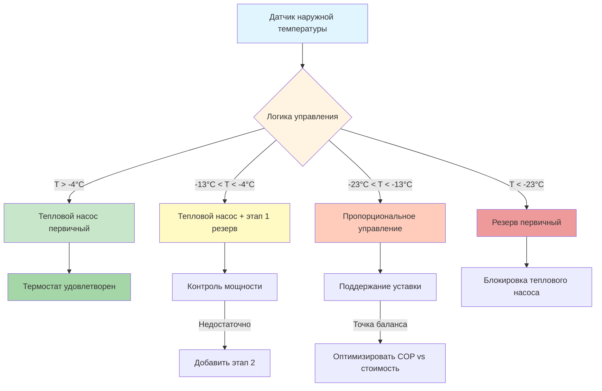
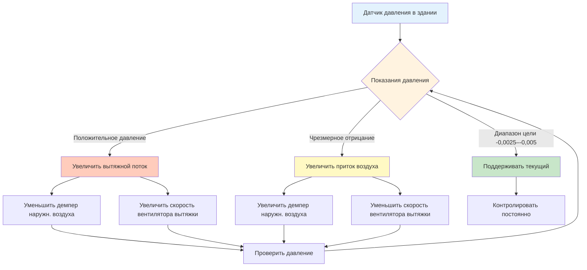
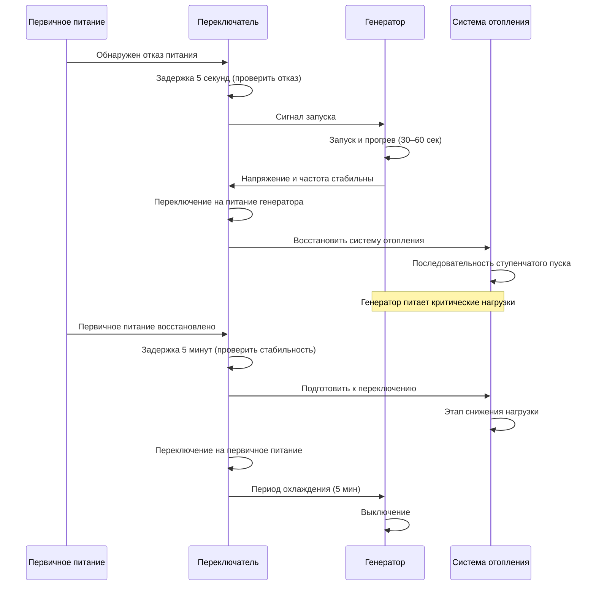

# Стратегии HVAC в арктических регионах и проектирование систем

Арктические и суарктические климаты требуют интегрированных стратегий HVAC, которые решают проблемы экстремальных температурных перепадов, превышающих 67°C, продолжительных сезонов отопления продолжительностью 9–11 месяцев и критических требований надежности. Эффективное проектирование систем сочетает несколько источников тепла, продвинутое восстановление энергии, строгий контроль влажности и полную защиту оборудования для обеспечения комфорта в помещениях и долговечности системы в самой экстремальной тепловой среде на планете.

## Стратегии гибридного отопления

Приложения в арктических регионах требуют нескольких источников тепла для балансирования энергоэффективности, надежности и операционной экономики при широко варьирующихся внешних условиях.

### Конфигурация двухтопливной системы

Двухтопливные системы объединяют электрические тепловые насосы с резервным топливным отоплением, оптимизируя энергозатраты при обеспечении отопительной мощности при всех температурах.

**Архитектура системы:**

**Определение температуры переключения:**

Экономически оптимальная температура переключения возникает, когда стоимость эксплуатации теплового насоса равна стоимости резервного топлива:

$$\text{COP}_{\text{HP}} \times \frac{C_{\text{электр}}}{C_{\text{топливо}}} \times \eta_{\text{топливо}} = 1$$

Где:
- COP_HP = коэффициент производительности теплового насоса при наружной температуре
- C_электр = стоимость электроэнергии ($/кВт⋅ч)
- C_топливо = стоимость топлива ($/Гкал или $/л)
- η_топливо = эффективность топливной системы отопления (0,80–0,95)

**Пример расчета:**

Дано:
- Электроэнергия: $0,15/кВт⋅ч
- Отопительное масло: $3,50/галлон (= 38,6 кВт⋅ч/л × 3,785 л = 161 кВт⋅ч/галлон; 146 кВт⋅ч/галлон более консервативно для расчета)
- КПД масляной печи: 85%
- COP теплового насоса при -9°C: 2,2

Стоимость электричества за кДж = $0,15/кВт⋅ч ÷ 3,6 кВт⋅ч/кДж = $0,0417/кДж

Стоимость масла за кДж = $3,50 ÷ (146 кВт⋅ч × 3,6 кДж/кВт⋅ч × 0,85) = $0,0323/кДж

Стоимость теплового насоса за кДж = $0,0417 ÷ 2,2 = $0,0190/кДж

При -9°C тепловой насос обеспечивает энергию с более низкой стоимостью. Переключение происходит, когда COP падает ниже 1,5 (примерно при -18°C для этого экономического сценария).

### Проектирование параллельной системы отопления

Параллельные системы одновременно используют несколько источников тепла, обеспечивая резервирование мощности и оптимизацию эффективности при различных нагрузках.

**Варианты конфигурации:**

| Тип системы | Первичный источник | Резервный источник | Логика переключения | Применение |
|-------------|-------------------|-------------------|---------------------|-----------|
| ТН + электро | Тепловой насос | Резистивные полоски | На основе мощности | Жилые, малые коммерческие |
| ТН + котел | Тепловой насос | Гидронный котел | На основе температуры | Большие жилые, учреждения |
| Котел + котел | Основной котел | Вторичный котел | Чередование свинца-отстающего | Критические объекты |
| Сеть + местная | Тепловая сеть | Местный резерв | Давление/температура подачи | Кампусы, удаленные объекты |

**Стратегия ступенчатого включения мощности:**

Для здания с расчетной нагрузкой отопления 146 кВт при -40°C:

1. **Тепловой насос (ТН):** 53 кВт при 8°C, 26 кВт при -11°C
2. **Этап 1 резерва:** 44 кВт (масляная печь)
3. **Этап 2 резерва:** 44 кВт (вторая печь или модульный котел)

**Последовательность включения этапов:**

- От 2°C до -9°C: Только ТН (90–120% мощность)
- От -9°C до -15°C: ТН + этап 1 (адекватная мощность)
- От -15°C до -32°C: ТН + этап 1 + этап 2 (расчетная мощность)
- Ниже -32°C: этап 1 + этап 2 только (блокировка ТН)

## Продвинутые стратегии рекуперирования тепла

Вентиляция с рекуперацией энергии достигает эффективности 75–95% в арктических климатах, восстанавливая 30–50% общей энергии отопления в хорошо спроектированных системах.

### Оптимизация производительности рекуператора тепла

Эффективность HRV варьируется в зависимости от баланса потока воздуха, температурного перепада и накопления льда. Максимальная производительность требует осторожной интеграции управления.

**Соотношение эффективности:**

$$\varepsilon = \frac{T_{\text{подачи}} - T_{\text{наружн}}}{T_{\text{вытяжки}} - T_{\text{наружн}}}$$

Для сбалансированного потока воздуха с эффективностью ядра 85%:
- Наружный воздух: -43°C
- Вытяжной воздух: 21°C
- Разница температур: 64°C
- Температура подаваемого воздуха: -43°C + (0,85 × 64°C) = 11,4°C

**Расчет восстановления энергии:**

Годовое восстановленное тепло:

$$Q_{\text{восстановл}} = 1,3 \times \text{CFM} \times \text{HDD} \times 24 \times \varepsilon$$

Для 200 CFM (339 м³/ч) непрерывной вентиляции с 10 000 градусо-сутками:

Q_восстановл = 1,3 × 339 × 10 000 × 24 × 0,85 = 93,2 ГДж/год

При стоимости $9/ГДж топлива: **Годовые сбережения = $839**

### Контроль образования льда в системах рекуперирования тепла

Эксплуатация HRV в арктике требует активного предотвращения образования льда, поскольку влага из вытяжного воздуха замерзает на холодных поверхностях ядра теплообменника.

**Физика накопления льда:**

Лед образуется, когда температура вытяжного воздуха падает ниже точки замерзания. Место образования льда:

$$x_{\text{лед}} = L \times \frac{T_{\text{вытяжка}} - 0°C}{T_{\text{вытяжка}} - T_{\text{наружн}}}$$

Где:
- L = глубина ядра теплообменника
- x_лед = расстояние от входа вытяжки до образования льда
- T_вытяжка = температура вытяжного воздуха (обычно 20–22°C)
- T_наружн = температура наружного воздуха

При -40°C наружной с 21°C вытяжкой и 30 см глубине ядра:

x_лед = 30 × (21 - 0) / (21 - (-40)) = 30 × 21 / 61 = 10,3 см

Лед накапливается во внешних 10 см ядра, в конечном итоге блокируя поток воздуха.

**Стратегии размораживания:**

| Метод | Работа | Энергетический штраф | Эффективность | Применение |
|--------|--------|----------------------|---------------|-----------|
| Рециркуляция | Вытяжной воздух обходит наружу | 8–12% | Хорошо | Стандартные HRV |
| Предварительный подогрев | Электрический элемент подогревает наружный воздух | 15–20% | Отлично | Экстремальный холод |
| Прерывистая работа | Цикл HRV выключается во время размораживания | 5–8% | Удовлетворительно | Мягкий суарктический |
| Только вытяжка | Демпер подачи закрывается, теплая вытяжка тает лед | 10–15% | Хорошо | Жилые |

**Управление циклом размораживания:**

Инициировать размораживание при:
1. Температура подаваемого воздуха падает ниже -2°C (индикатор накопления льда)
2. Дифференциальное давление на ядре превышает 1,5× нормального (закупорка)
3. Временной цикл: каждые 20–40 минут при наружной температуре ниже -29°C

### Применение колеса рекуперирования энергии

Колеса энтальпии передают как чувствительное, так и скрытое тепло, обеспечивая превосходную производительность в экстремальном холоде с активным вращением, предотвращающим накопление льда.

**Сравнение производительности:**

Для идентичного расхода воздуха и условий температуры:

| Тип рекуперирования | Эффективность чувствительного | Эффективность скрытого | Риск образования льда | Техническое обслуживание |
|-------------------|-------------------------------|----------------------|---------------------|----------------------|
| Пластинчатый HRV | 75–85% | 0% | Высокий | Низкое |
| Пластинчатый ERV | 70–80% | 50–65% | Средний | Низкое |
| Колесо энтальпии | 80–90% | 60–75% | Низкий | Среднее |
| Тепловая труба | 60–70% | 0% | Очень низкий | Очень низкое |

Колеса энтальпии превосходны в арктических приложениях благодаря непрерывному вращению, распределяющему лед равномерно и теплой вытяжке, постоянно тающей накопившийся лед.

## Контроль влажности и управление паром

Арктические конструкции испытывают экстремальные различия давления пара, которые направляют миграцию влаги от внутренней части к внешней, требуя строгой установки паробарьеров и контролируемой вентиляции.

### Анализ дифференциала давления пара

Движущей силой миграции влаги является разница давлений пара между внутренней и внешней средой.

**Расчет давления пара:**

Давление насыщенного пара (кПа):

$$p_{\text{нас}} = \exp\left(77,345 + 0,0057T - \frac{7235}{T}\right) / (T^{8,2})$$

Где T — абсолютная температура (К = °C + 273,15)

**Пример расчета:**

Внутренние условия: 21°C, 30% ОВ
- T = 294 K
- p_нас = 2,49 кПа
- p_пара = 2,49 × 0,30 = 0,747 кПа

Внешние условия: -40°C
- T = 233 K
- p_нас = 0,013 кПа (практически нулевое при этой температуре)

Дифференциал давления пара: 0,747 - 0,013 = 0,734 кПа

Это 57:1 соотношение давлений приводит к агрессивной миграции влаги, требуя паробарьеров с проницаемостью < 0,57 нг/(Па⋅с⋅м²).

### Стратегии предотвращения конденсации

**Критическая температура поверхности:**

Конденсация возникает, когда температура любой поверхности падает ниже точки росы прилегающего воздуха. Точка росы:

$$T_{\text{точка росы}} = \frac{243,04 \times \left(\ln\left(\frac{ОВ}{100}\right) + \frac{17,625 \times T}{243,04 + T}\right)}{17,625 - \left(\ln\left(\frac{ОВ}{100}\right) + \frac{17,625 \times T}{243,04 + T}\right)}$$

Для 21°C при 30% ОВ:
- T_точка росы = 3,8°C

Любая внутренняя поверхность ниже 3,8°C будет испытывать конденсацию. При -40°C наружной температуре внутренние температуры поверхности должны поддерживаться выше этого порога через адекватную теплоизоляцию.

**Расчет минимального значения R:**

Требуемая теплоизоляция для предотвращения конденсации:

$$R_{\text{мин}} = \frac{T_{\text{внутр}} - T_{\text{наружн}}}{T_{\text{внутр}} - T_{\text{точка росы}}} \times R_{\text{пленка внутри}}$$

Для примера условий:

R_мин = (21 - (-40)) / (21 - 3,8) × 0,12 = 61 / 17,2 × 0,12 = 0,43 м²⋅K/Вт

Однако это представляет абсолютный минимум. Практические приложения требуют R_5,3–R_10,6 м²⋅K/Вт (R_30–R_60) в ограждающей конструкции для обеспечения безопасного допуска и энергоэффективности.

### Управление созданием давления в здании

Поддержание слегка отрицательного давления (-0,0025–0,005 кПа) в арктических зданиях предотвращает выделение теплого влажного воздуха в полости стен, где он конденсировался бы и вызывал бы структурные повреждения.

**Стратегия управления давлением:**

Отрицательное давление предотвращает:
1. Выпуск через проникновения в ограждение
2. Накопление влаги в полостях стен
3. Образование льда на тепловых мостиках
4. Структурные повреждения от циклов замораживания-оттаивания

## Требования к защите оборудования в зимних условиях

Оборудование HVAC в арктике требует комплексной защиты от экстремального холода, включая выбор материалов, вспомогательное отопление и операционные защиты.

### Защита наружного блока обработки воздуха

**Проектирование предварительного подогрева:**

Катушки предварительного подогрева защищают нижний поток компонентов от замерзания. Требуемая мощность:

$$Q_{\text{предваритель}} = 1,3 \times \text{CFM} \times (T_{\text{цель}} - T_{\text{наружн}})$$

Для 2 360 м³/ч (8 500 CFM) наружного воздуха с -45°C расчетной температурой, нагрева до 2°C:

Q_предваритель = 1,3 × 8 500 × (2 - (-45)) = 519 кВт (= 445 МВт⋅ч)

**Последовательность управления катушкой предварительного подогрева:**

1. **Демпер воздухозаборника и обхода:** Модулируют для поддержания температуры выходящего воздуха
2. **Термостаты защиты от замерзания:** Тройная резервность при 2°C, 0°C и -2°C
3. **Отсечка нижнего предела:** Выключение вентилятора подачи и закрытие демпера наружн. воздуха, если выходящий воздух < -2°C
4. **Раствор гликоля:** 50% пропиленовый гликоль для защиты от замерзания при -45°C

### Процедуры холодного пуска

Оборудование, хранящееся в неотапливаемых помещениях или выключенное во время экстремального холода, требует ступенчатого прогрева для предотвращения механических повреждений.

**Последовательность пуска:**

| Шаг | Действие | Продолжительность | Порог температуры |
|-----|---------|-------------------|-------------------|
| 1 | Энергизировать нагреватели картера | 4–8 часов | Масло компрессора > 10°C |
| 2 | Запустить циркуляционные насосы (если применимо) | 1–2 часа | Движение жидкости установлено |
| 3 | Энергизировать предварительный подогрев | 30 минут | Наружный воздух > -7°C |
| 4 | Запустить вентилятор подачи на минимальной скорости | 15 минут | Поток воздуха проверен |
| 5 | Включить первичную последовательность отопления | Нормальная | Все защиты проверены |
| 6 | Увеличить до полной мощности | 30–60 минут | Постепенное увеличение нагрузки |

**Защита от холодного состояния:**

Миграция хладагента во время выключения создает риск гидравлического удара жидкости. Меры профилактики:

- Нагреватели картера: 50–150 Вт, поддерживающие температуру масла на 11–17°C выше окружающей
- Цикл откачки: Эвакуация испарителя перед выключением
- Задержка при перезапуске: Минимум 5 минут выключения в соответствии с ASHRAE Standard 15

### Управление конденсатом в экстремальном холоде

Весь конденсат должен управляться в отапливаемых помещениях или защищен от замерзания через активный тепловой след и теплоизоляцию.

**Размер теплового следа:**

Требуемая мощность теплового следа для предотвращения замерзания:

$$W = \frac{2 \times \pi \times k \times (T_{\text{поддерж}} - T_{\text{окружаю}})}{∆r}$$

Где:
- W = ватт теплового следа на метр
- k = теплопроводность теплоизоляции (Вт/(м⋅K))
- T_поддерж = минимальная температура жидкости (4°C)
- T_окружаю = минимальная температура окружающей среды (-50°C)
- ∆r = натуральный логарифм (r_наружная / r_внутренняя)

Для трубы из меди диаметром 2,5 см с теплоизоляцией 2,5 см (k = 0,04) при -50°C окружающей:

W ≈ 25–30 ватт на метр (используют 30 Вт саморегулирующегося теплового следа)

**Требования к установке:**

- Тепловой след установлен на нижней части горизонтальной трубы (предотвращает образование ледяной дамбы)
- Теплоизоляция над тепловым следом (никогда между следом и трубой)
- Управление термостатом: активировать ниже 4°C, деактивировать выше 10°C
- Мониторинг цепи: непрерывная проверка работы
- Резервное питание: критические дренажи требуют ИБП или резервное питание генератором

## Протоколы аварийного отопления

Арктические объекты требуют резервного отопления и протоколов экстренной помощи для поддержания безопасности жизни во время отказа оборудования или отключения электроэнергии.

### Требования к резервной мощности отопления

**Стратегия ступенчатого резервирования:**

| Тип объекта | Первичное тепло | Вторичное тепло | Аварийное тепло | Время удержания |
|-------------|-----------------|-----------------|----------------|-----------------|
| Жилое | Тепловой насос | Масло/пропановая печь | Электросопротивление | 24 часа |
| Коммерческое | Котельная | Кровельные установки | Портативные обогреватели | 12 часов |
| Критический объект | Двойные котлы | Резервный генератор + электро | Дизельные воздушные обогреватели | 72 часа |
| Удаленная станция | Тепловая сеть | Местный котел | Баллонный пропановый обогреватель | 7 дней |

**Падение температуры при отключении:**

Скорость распада температуры в здании без отопления:

$$\frac{dT}{dt} = -\frac{UA}{mc_p}(T_{\text{внутр}} - T_{\text{наружн}})$$

Где:
- U = общий коэффициент теплопередачи здания
- A = площадь ограждения здания
- m = тепловая масса здания
- c_p = удельная теплоемкость строительных материалов

Для типичной конструкции (UA = 5,9 кВт/K, масса = 227 000 кг):

Падение температуры = -(5,9 / (227 000 × 0,84)) × (21 - (-40)) = -1,2°C в час

Здание достигает температуры замерзания примерно за 18 часов без отопления при -40°C наружной температуре.

### Интеграция генератора для безопасности жизни

**Последовательность автоматического переключателя (ATS):**

**Приоритет отключения нагрузки:**

1. **Критические нагрузки (100% резерва):** система отопления, циркуляционные насосы, элементы управления, защита от замерзания
2. **Необходимые нагрузки (50% резерва):** частичное освещение, связь, минимальная вентиляция
3. **Некритические нагрузки (0% резерва):** кондиционирование воздуха, некритические розетки, наружное освещение

Размер генератора:

$$\text{кВ}_{\text{генератор}} = \frac{\sum \text{кВ}_{\text{критич}} + \sum \text{кВ}_{\text{необходимо}}}{0,80} \times 1,25$$

Коэффициент 0,80 учитывает коэффициент мощности; 1,25 обеспечивает безопасный допуск для пусковых токов двигателей.

## Комиссионирование систем для арктических условий

Комиссионирование в арктическом климате требует проверки всех систем защиты от холода и операционных последовательностей при расчетных условиях.

### Функциональное тестирование в холодную погоду

**Протокол тестирования:**

| Компонент системы | Условие теста | Критерии приемки | Метод |
|------------------|---------------|------------------|--------|
| Катушка предварительного подогрева | Наружный воздух при расчетной температуре | Выходящий воздух ≥ 2°C | Имитировать демпером |
| Термостаты замерзания | Ручная активация | Выключение вентилятора, закрытие демпера < 30 сек | Срабатывание каждого |
| Размораживание HRV | Наружный воздух < -29°C | Циклы размораживания поддерживают подачу > -2°C | Контроль во время холода |
| Цепи теплового следа | Поверхность трубы при окружающей | Тепловой след активируется, поддерживает > 4°C | ИК термография |
| Резервное отопление | Первичная система отключена | Резерв обеспечивает расчетную мощность | Проверка расчета нагрузки |
| Резервный генератор | Имитация отказа питания | Переключение < 60 сек, системы работают | Полный тест нагрузки |

### Проверка тепловизором

Инфракрасная термография выявляет тепловые мосты, дефекты теплоизоляции и утечки воздуха при максимальном температурном перепаде.

**Оптимальные условия тестирования:**

- Разница температуры внутри-снаружи: ≥ 22°C (больший перепад улучшает контрастность)
- Скорость ветра: < 7 м/с (предотвращает маскирование конвекции)
- Без осадков: влага мешает показаниям ИК
- Время: перед рассветом (исключает солнечное излучение)

**Критические области для проверки:**

1. Проникновения ограждения (трубы, воздуховоды, кабели)
2. Рамы окон и дверей
3. Переходы стена-крыша
4. Соединения фундамент-стена
5. Ограды оборудования и опоры

Разница температур на поверхности при R_7 стене с перепадом 56°C:

Внутренняя поверхность: 21°C - (56°C / 7) × 0,12 = 20,0°C
Тепловой мост (R_0,9): 21°C - (56°C / 0,9) × 0,12 = 13,5°C

Разница температур на поверхности 6,5°C четко выявляет дефекты теплоизоляции.

## Заключение

Стратегии HVAC в арктике требуют интегрированного проектирования, объединяющего гибридные источники тепла для надежности и эффективности, продвинутое рекуперирование тепла, восстанавливающее 75–95% энергии вентиляции, строгий контроль влажности, предотвращающий структурные повреждения, комплексную защиту оборудования, обеспечивающую эксплуатацию при -45°C и ниже, и надежные протоколы аварийного отопления, поддерживающие безопасность жизни при отказах системы. Успешные системы HVAC для арктики достигают температур подаваемого воздуха 10–13°C из наружного воздуха при -43°C через 85% эффективное рекуперирование тепла, сокращают годовую энергию отопления на 30–50% в сравнении с системами без рекуперации, предотвращают конденсацию через паробарьеры с проницаемостью ниже 0,57 нг/(Па⋅с⋅м²) и отрицательное создание давления в здании -0,0025 до -0,005 кПа, и поддерживают температуры в помещениях выше точки замерзания на 18–72 часа при отказах системы отопления в зависимости от тепловой массы и резервной мощности. Экстремальные температурные перепады, продолжительные сезоны отопления и критические требования надежности арктических климатов требуют тщательного внимания к термодинамическим принципам, защите оборудования и резервированию систем для обеспечения комфорта в помещениях и долговечности зданий в самой требовательной тепловой среде на Земле.
