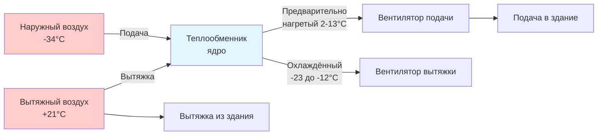

# Проектирование HVAC в холодном климате

Системы HVAC в холодном климате сталкиваются с уникальными вызовами, обусловленными экстремальными перепадами температур, продолжительными отопительными сезонами и физикой теплопередачи через тепловую оболочку зданий. Приоритеты проектирования смещаются от охлаждающих соображений к мощности отопления, защите от замораживания и управлению влажностью в условиях продолжительных субнулевых температур.

## Фундаментальные механизмы тепловых потерь

Тепловые потери в холодном климате происходят через три основных режима: теплопроводность через тепловую оболочку здания, конвекция через воздушную инфильтрацию и излучение на холодные поверхности. Общая отопительная нагрузка объединяет эти компоненты:

$$Q_{total} = Q_{conduction} + Q_{infiltration} + Q_{ventilation} + Q_{radiation}$$

Кондуктивные тепловые потери через узлы ограждающей конструкции следуют закону Фурье, где тепловой поток пропорционален градиенту температуры и обратно пропорционален тепловому сопротивлению:

$$Q_{cond} = \frac{A \cdot \Delta T}{R_{total}}$$

где:
- $A$ = площадь поверхности (м²)
- $\Delta T$ = разность температур внутри-снаружи (°C или K)
- $R_{total}$ = общее тепловое сопротивление (м²·K/W)

При расчётных условиях –34°C снаружи и +21°C внутри перепад температур 55 K вызывает значительные тепловые потери. Стена с теплоизоляцией R-5,3 (м²·K/W) испытывает тепловой поток:

$$q = \frac{\Delta T}{R} = \frac{55 \text{ K}}{5.3 \text{ м²·K/W}} = 10.4 \text{ W/м²}$$

## Контроль инфильтрации и утечки воздуха

Воздушная инфильтрация представляет критический механизм тепловых потерь в холодном климате, часто составляя 25-40% от общей отопительной нагрузки. Объёмный расход воздуха через проникновения в оболочке зависит от перепада давления и эффективной площади утечки:

$$Q_{inf} = \rho \cdot c_p \cdot \dot{V} \cdot \Delta T$$

где:
- $\rho$ = плотность воздуха (кг/м³)
- $c_p$ = удельная теплоёмкость воздуха (1.005 кДж/кг·K)
- $\dot{V}$ = объёмный расход воздуха (м³/ч)
- $\Delta T$ = разность температур

ASHRAE Standard 62.1 требует минимальные нормы вентиляции, но неконтролируемая инфильтрация тратит энергию. Герметичность тепловой оболочки, измеряемая как воздухообмены в час при 50 Па (ACH50), должна соответствовать целевым значениям:

| Тип здания | Целевое ACH50 | Применение |
|---------------|--------------|-------------|
| Пассивный дом | ≤0,6 | Сверхэффективное строительство |
| Высокая производительность | 1,0–1,5 | Продвинутое проектирование в холодном климате |
| Минимум кода | 3,0–5,0 | Стандартное строительство |
| Существующие здания | 5,0–15,0 | Кандидаты на модернизацию |

## Рекуперация энергии при вентиляции

Рекуператоры тепла (ERV) и теплообменники воздух-воздух (HRV) являются необходимыми в холодном климате для выполнения требований вентиляции при минимизации потерь на отопление при вентиляции. Эти устройства передают чувствительное тепло (и в ERV — скрытое тепло) между выходящим и подающим воздушными потоками.

Эффективность рекуперации тепла определяет температуру подаваемого воздуха, поступающего в здание:

$$\eta = \frac{T_{supply} - T_{outdoor}}{T_{exhaust} - T_{outdoor}}$$

Высокоэффективные HRV достигают 75-95% чувствительной эффективности, существенно снижая нагрузку отопления при вентиляции:

$$Q_{vent,recovered} = \dot{m} \cdot c_p \cdot (T_{exhaust} - T_{outdoor}) \cdot \eta$$

## Стратегии защиты от замораживания

Защита от замораживания имеет первостепенное значение при проектировании HVAC в холодном климате. Системы на водной основе подвергаются катастрофическому отказу, если температура труб падает ниже 0°C. Стратегии защиты включают:

### Проектирование системы отопления
- **Антифризные растворы**: Пропиленгликоль в концентрации 30-50% снижает точку замерзания до –29°C до –51°C
- **Кабельное отопление**: Кабели электрического сопротивления поддерживают минимальную температуру трубы
- **Теплоизоляция**: Минимизирует тепловые потери от распределительных труб
- **Термостаты с низким лимитом**: Отключают оборудование до наступления условий замерзания

### Обработка наружного воздуха
Заслонки наружного воздуха и теплообменники требуют защиты от замораживания через:

1. **Лицевые и байпасные заслонки**: Направляют наружный воздух вокруг теплообменников в холодных условиях
2. **Предварительно нагревающие теплообменники**: Электрические или паровые теплообменники повышают температуру воздуха перед основным теплообменником
3. **Гликолевые циркуляционные контуры**: Передают тепло от вытяжного воздуха к наружному
4. **Смесительные камеры**: Смешивают наружный и рециркуляционный воздух перед воздействием на теплообменник

Минимальная температура наружного воздуха для прямого воздействия на теплообменник без риска замерзания:

$$T_{OA,min} = T_{leaving} - \frac{Q_{coil}}{\dot{m} \cdot c_p}$$

## Рассмотрения тепловой оболочки здания

Тепловые мосты через конструктивные элементы создают локализованные тепловые потери и риск конденсации. Стальные стойки, бетонные плиты и оконные рамы эффективно проводят тепло, обходя слои теплоизоляции. Эффективное значение R стеновой панели учитывает тепловые мосты:

$$R_{eff} = \frac{1}{\frac{f_{frame}}{R_{frame}} + \frac{f_{cavity}}{R_{cavity}}}$$

где $f_{frame}$ и $f_{cavity}$ представляют доли площади стены, занятые каркасом и утеплённой полостью соответственно.

| Тип узла | Номинальное R-значение | Эффективное R-значение | Снижение |
|---------------|-----------------|-------------------|-----------|
| Деревянный каркас 2x6, R-3,7 | R-3,7 | R-2,8 | 24% |
| Стальной каркас, R-3,7 | R-3,7 | R-1,2 | 67% |
| ПСБ бетон, R-3,9 | R-3,9 | R-3,5 | 9% |
| SIPs, R-4,9 | R-4,9 | R-4,8 | 4% |

## Контроль конденсации и влажности

Холодные поверхности ниже температуры точки росы накапливают конденсацию, что приводит к росту плесени и повреждению конструкции. Температура точки росы, при которой конденсация образуется на поверхности:

$$T_{dp} = T - \frac{100 - RH}{5}$$

(Приблизительная формула для температур близких к +21°C)

Пароизоляция, расположенная на тёплой стороне теплоизоляции, предотвращает миграцию влаги на холодные поверхности. Скорость диффузии пара через материалы:

$$\dot{m}_v = \frac{A \cdot \delta \cdot \Delta p_v}{L}$$

где:
- $\delta$ = паропроницаемость
- $\Delta p_v$ = разница давления пара
- $L$ = толщина материала

## Выбор системы отопления

Системы отопления для холодного климата приоритизируют надёжность, мощность и эффективность в экстремальных условиях:

**Системы с принудительной циркуляцией воздуха**
- Преимущества: быстрое срабатывание, интеграция с вентиляцией, более низкая первоначальная стоимость
- Недостатки: потери тепла в воздуховодах, утечка воздуха, шум

**Гидравлические лучистые системы**
- Преимущества: высший комфорт, бесшумная работа, отсутствие циркуляции воздуха
- Недостатки: медленное срабатывание, более высокие затраты на установку, риск замерзания

**Технология тепловых насосов**
Тепловые насосы для холодного климата с впрыском пара поддерживают мощность до –9°C до –32°C наружной температуры. Коэффициент производительности (COP) снижается с увеличением разницы температур:

$$COP = \frac{Q_{delivered}}{W_{input}}$$

При –29°C продвинутые тепловые насосы для холодного климата достигают COP 1,8–2,2, по сравнению с 3,0–4,0 при +4°C.

## Выбор расчётной температуры

ASHRAE Handbook—Fundamentals предоставляет температуры отопления на основе 99,6% и 99% годовой совокупной частоты. Температура 99,6% (холоднее, чем 99,6% всех часов в году) обеспечивает адекватную мощность в экстремальных условиях.

| Местоположение | 99,6% DB | 99% DB | Выбор проектирования |
|----------|----------|---------|------------------|
| Фэйрбанкс, AK | –44°C | –42°C | Использовать 99,6% + коэффициент безопасности |
| Миннеаполис, MN | –27°C | –11°C | Использовать 99,6% |
| Анкоридж, AK | –11°C | –6°C | Использовать 99,6% |
| Калгари, AB | –33°C | –30°C | Использовать 99,6% + коэффициент безопасности |

Коэффициенты безопасности 5-15% дополнительной мощности компенсируют деградацию оборудования и экстремальные погодные события, выходящие за рамки расчётных условий.

## Тепловая масса и стратегии понижения температуры

Тепловая масса здания смягчает колебания температуры и позволяет ночное понижение без чрезмерных нагрузок утреннего восстановления. Постоянная времени для теплового отклика:

$$\tau = \frac{R \cdot C}{A}$$

где:
- $R$ = тепловое сопротивление
- $C$ = теплоёмкость (кДж/K)
- $A$ = площадь поверхности

Тяжёлые конструкции (бетон, кирпичная кладка) позволяют больший перепад без ущерба комфорту, в то время как лёгкие конструкции (деревянный каркас) требуют более консервативных стратегий.

Проектирование HVAC в холодном климате требует строгого внимания к тепловым потерям, контролю инфильтрации, защите от замораживания и управлению влажностью. Системы, спроектированные в соответствии с этими физическими принципами, обеспечивают надёжную производительность, комфорт жильцов и энергоэффективность в самых требовательных тепловых условиях.
