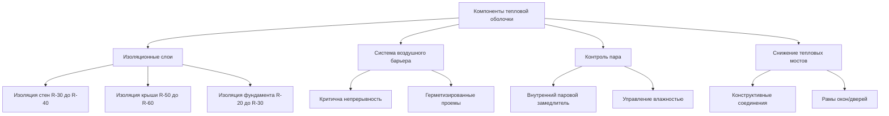
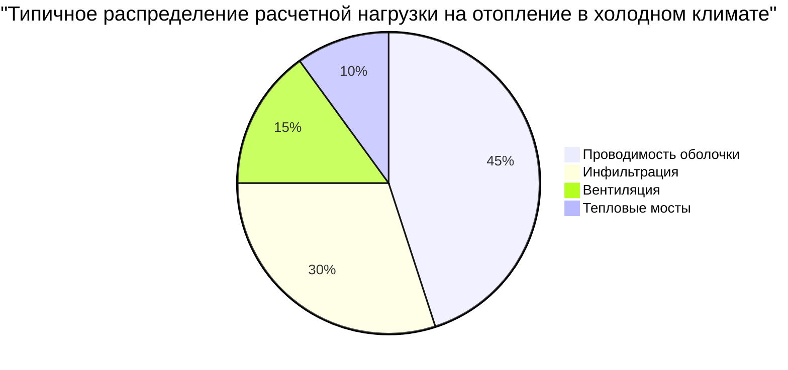

# Характеристики конструкции HVAC для холодного климата

Конструкция HVAC для холодного климата требует тщательного анализа механизмов теплопередачи, управления влажностью и производительности тепловой оболочки при экстремальных перепадах температур. Условия проектирования в холодных климатических зонах представляют уникальные вызовы, принципиально отличающиеся от подходов в умеренных или теплых климатических условиях.

## Критерии температур проектирования

Проектирование HVAC для холодного климата следует стандарту ASHRAE 90.1 и справочнику фундаментальных данных при установлении наружных условий проектирования. Температура сухого термометра для проектирования при 99,6% зимой представляет температуру, которая превышается в течение 99,6% часов типичных метеорологических лет.

Ключевые параметры проектирования включают:

- **Наружная температура проектирования**: от −30°C до −10°C в зависимости от местоположения
- **Внутренняя температура проектирования**: 20°C − 22°C для жилого, 21°C для коммерческого строительства
- **Дельта температур проектирования**: 40°C − 50°C (типично)
- **Средняя скорость ветра при совпадающих условиях**: критична для расчетов инфильтрации

## Механизмы потерь тепла

Потери тепла в холодных климатических условиях происходят через три основных механизма: проводимость через ограждающую конструкцию здания, инфильтрация холодного наружного воздуха и тепловые мосты на конструктивных элементах.

### Потери тепла через проводимость

Фундаментальное уравнение передачи тепла при установившейся проводимости:

$$Q_{cond} = U \cdot A \cdot \Delta T$$

Где:
- $Q_{cond}$ = потери тепла через проводимость (Вт)
- $U$ = коэффициент теплопередачи (Вт/м²·K)
- $A$ = площадь поверхности (м²)
- $\Delta T$ = разность температур между внутренней и наружной (K)

Конструкция для холодного климата требует значений U значительно ниже, чем для умеренных климатических условий. Конструкции стен обычно требуют U ≤ 0,28 Вт/м²·K, а крыши требуют U ≤ 0,18 Вт/м²·K.

### Потери тепла через инфильтрацию

Утечка воздуха составляет существенную часть общих потерь тепла, часто 25−40% в холодных климатических условиях. Уравнение потерь тепла через инфильтрацию:

$$Q_{inf} = \rho \cdot V \cdot c_p \cdot \Delta T$$

Где:
- $\rho$ = плотность воздуха (кг/м³)
- $V$ = объемный расход воздуха (м³/с)
- $c_p$ = удельная теплоемкость воздуха (1,006 кДж/кг·K)
- $\Delta T$ = разность температур (K)

Нормы утечки воздуха в холодных климатических условиях не должны превышать 1,5 ACH50 (воздухообмены в час при 50 Па) для жилого строительства, со стандартами пассивного дома требующими ≤0,6 ACH50.

## Производительность тепловой оболочки

### Требования к изоляции

Уровни изоляции для холодного климата превышают минимальные требования норм для достижения экономических и комфортных целей:

| Элемент здания | Климатическая зона 6 | Климатическая зона 7 | Климатическая зона 8 |
|-------------------|----------------------|----------------------|----------------------|
| Стены (R-значение) | R-20 − R-21 | R-21 − R-25 | R-25 − R-30 |
| Крыша/Потолок | R-49 − R-60 | R-49 − R-60 | R-60+ |
| Перекрытие над неотапливаемым помещением | R-30 | R-30 − R-38 | R-38 |
| Стены подвала | R-15 | R-15 − R-19 | R-19 |
| Край плиты | R-15, глубина 1,2 м | R-20, глубина 1,2 м | R-20, вся плита |
| U-коэффициент остекления | ≤0,32 | ≤0,29 | ≤0,26 |

## Контроль влажности и конденсации

Холодные климатические условия создают серьезные перепады давления пара, направляющие влагу из теплых внутренних помещений к холодным внешним поверхностям. Температура точки росы в конструкции стены должна оставаться выше температур поверхности для предотвращения внутриполостной конденсации.

Перепад давления пара:

$$\Delta P_v = P_{v,in} - P_{v,out}$$

При зимних условиях с внутренней температурой 21°C при 30% относительной влажности и наружной температурой −20°C, перепад давления пара достигает примерно 680 Па, направляя влагу наружу.

### Размещение парового замедлителя

Паровые замедлители должны быть размещены на теплой стороне изоляции в холодных климатических условиях. Соотношение наружного к внутреннему термическому сопротивлению определяет риск конденсации:

$$\frac{R_{exterior}}{R_{interior}} \leq 0,33$$

Этот критерий обеспечивает, что температура поверхности парового замедлителя остается выше температуры точки росы внутреннего воздуха.

## Тепловые мосты

Тепловые мосты создают локализованные пути потерь тепла и снижение температуры поверхности, создающие риск конденсации. Распространенные тепловые мосты включают:

- Стальное каркасное обрамление (снижает эффективное R-значение на 40−55%)
- Края железобетонных плит и балконы
- Рамы окон и дверей
- Соединения конструктивной стали

Линейный коэффициент теплопередачи (ψ-значение) количественно оценивает потери тепла через тепловой мост:

$$Q_{bridge} = \psi \cdot L \cdot \Delta T$$

Где:
- $\psi$ = линейный коэффициент теплопередачи (Вт/м·K)
- $L$ = длина теплового моста (м)

## Компоненты расчетной нагрузки на отопление

## Испытание утечки воздуха

Испытание с использованием дверцы вентилятора согласно ASTM E779 или ISO 9972 проверяет герметичность оболочки. Целевые показатели для холодного климата:

| Тип здания | Целевая утечка воздуха |
|------------|------------------------|
| Жилое − минимум по норме | ≤3,0 ACH50 |
| Жилое − высокоэффективное | ≤1,5 ACH50 |
| Пассивный дом | ≤0,6 ACH50 |
| Коммерческое | ≤1,9 л/(с·м²) при 75 Па |

## Потери тепла через фундамент

Теплопередача, связанная с землей, следует двумерным моделям передачи тепла. Упрощенный подход согласно справочнику ASHRAE:

$$Q_{ground} = U_{eff} \cdot A_{floor} \cdot (T_{in} - T_{ground})$$

Где $U_{eff}$ варьируется в зависимости от конфигурации изоляции, типа грунта и глубины грунтовых вод. Защищенные от промерзания мелкозаглубленные фундаменты (FPSF) снижают потери тепла путем размещения горизонтальной изоляции, простирающейся наружу от периметра фундамента.

## Производительность окон

Выбор окна критически влияет на производительность в холодном климате. Трёхслойные блоки со слоями низкой излучательности достигают U-значений 0,15−0,20 Вт/м²·K. Коэффициент солнечного коэффициента теплопередачи (SHGC) должен сбалансировать зимние солнечные поступления (SHGC 0,35−0,50) против рисков летнего перегрева.

## Последствия для системы

Характеристики холодного климата определяют требования к системе HVAC:

- Мощность отопления в 2−4 раза больше мощности охлаждения
- Воздуховоды и трубопроводы требуют защиты от замерзания
- Вентиляция с рекуперацией тепла существенна для энергоэффективности
- Гидравлические системы предпочтительны для равномерного распределения тепла
- Контроль влажности предотвращает конденсацию на холодных поверхностях

Эти характеристики тепловой оболочки создают основу для проектирования системы HVAC в холодном климате, непосредственно определяя расчетные нагрузки на отопление, размеры оборудования и энергетическую производительность.
