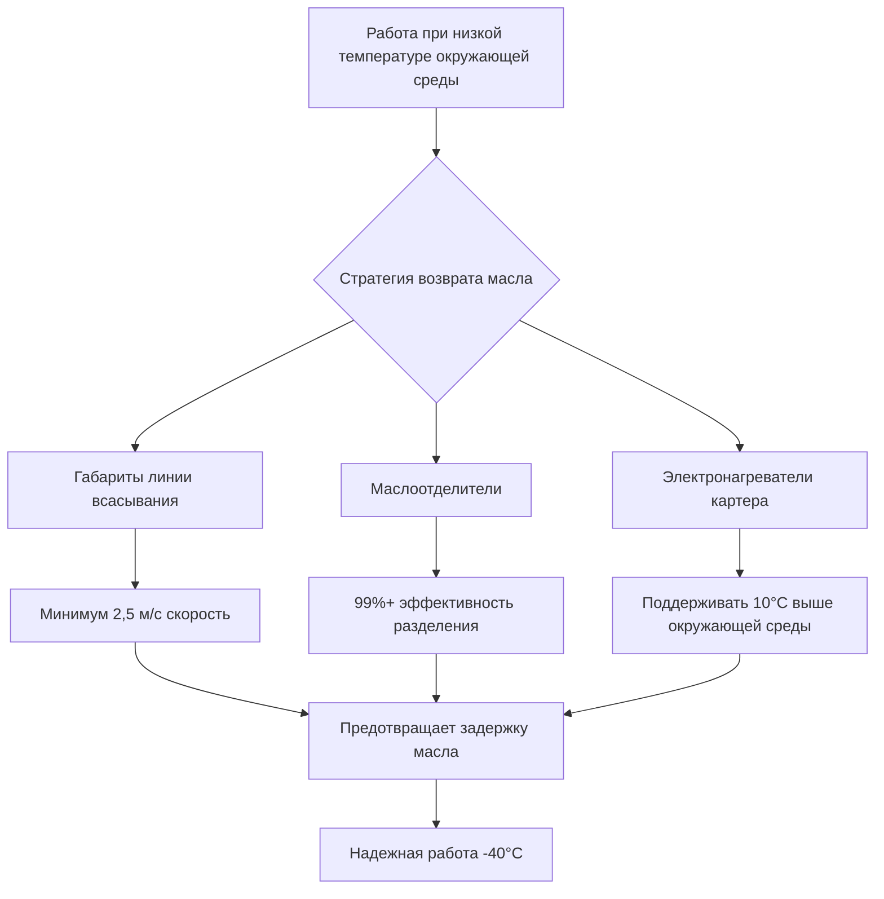

## Деградация производительности оборудования

Холодный климат налагает серьезные ограничения на работу оборудования HVAC за счет снижения эффективности теплопередачи, изменения поведения хладагента и деградации свойств материалов. Понимание этих физических ограничений определяет надлежащий выбор оборудования и конфигурацию системы.

### Потеря производительности теплового насоса

Производительность воздушного теплового насоса резко снижается при понижении наружной температуры в соответствии с термодинамикой цикла охлаждения:

$$
COP_{HP} = \frac{T_{конденсация}}{T_{конденсация} - T_{испарение}}
$$

Где температуры используют абсолютную шкалу (Кельвин). При наружной температуре -20°C температура испарителя может достичь -30°C, снижая теоретический COP с 4,0 при мягких условиях примерно до 2,0 при условиях проектирования. Реальное оборудование испытывает дополнительные потери из-за:

- Увеличенных потерь вязкого потока в расширительных устройствах
- Повышенного трения компрессора при холодных температурах масла
- Снижения эффективности теплообменника из-за накопления инея
- Потребностей вспомогательного нагрева для циклов оттаивания

Стандарт ASHRAE Standard 116 устанавливает испытания при 8,3°C и -8,3°C наружной температуры, однако проектирование для холодного климата требует расширенных данных рейтинга до -25°C и ниже.

## Выбор стратегии оттаивания

Накопление инея на наружных катушках блокирует поток воздуха и снижает теплопередачу, когда температура поверхности падает ниже 0°C и влажный воздух содержит влагу. Выбор цикла оттаивания влияет на эффективность системы и комфорт занятых.

### Сравнение методов оттаивания

| Метод | Энергетический штраф | Влияние на комфорт | Сложность управления | Применение |
|-------|----------------------|-------------------|----------------------|-----------|
| Обратный цикл | 15-25% во время оттаивания | Среднее (кратковременное охлаждение) | Среднее | Жилые, легко коммерческие |
| Обход горячего газа | 10-15% непрерывно | Минимальное | Низкое | Коммерческие приложения |
| Электрическое сопротивление | 30-40% во время оттаивания | Высокое (отключение) | Низкое | Компактное оборудование |
| Спрос на оттаивание | 5-10% снижение | Минимальное | Высокое | Продвинутые системы |

Спрос на оттаивание с использованием датчиков температуры и дифференциального давления снижает ненужные циклы оттаивания на 50% по сравнению с инициированием по времени, экономя примерно 10% сезонной энергии в холодном климате.

### Управление завершением оттаивания

Надлежащее завершение предотвращает чрезмерную продолжительность оттаивания при обеспечении полного удаления инея. Тепловой баланс во время оттаивания:

$$
Q_{оттаивание} = m_{лед} \cdot L_f + m_{катушка} \cdot c_p \cdot \Delta T + Q_{потери}
$$

Где:
- $m_{лед}$ = накопленная масса инея (кг)
- $L_f$ = скрытая теплота плавления (334 кДж/кг)
- $m_{катушка}$ = тепловая масса катушки (кг)
- $c_p$ = удельная теплота материала катушки (кДж/кг·К)
- $Q_{потери}$ = потери тепла в окружающую среду (кДж)

Стратегии завершения включают определение температуры катушки (обычно 21-27°C), временные ограничения (5-10 минут) или методы на основе давления, контролирующие условия насыщения хладагента.

## Управление хладагентом и маслом

Низкие температуры окружающей среды создают проблемы с миграцией хладагента и возвратом масла, влияющие на надежность и долговечность системы.

### Эффекты вязкости масла

Вязкость смазочного материала экспоненциально возрастает с понижением температуры в соответствии с уравнением Вальтера. Масла POE, используемые с хладагентами HFC, могут превышать 1000 сСт при -40°C, создавая:

- Неадекватную смазку компрессора при запуске
- Плохой возврат масла из наружной катушки при низких нагрузках
- Увеличенный перепад давления через линии всасывания
- Повреждение компрессора от обогащенного маслом хлопка

Решения по управлению маслом:

### Требования к обогреву картера

Миграция хладагента в холодные картеры во время циклов остановки разбавляет масло и вызывает вспенивание при запуске. Мощность электронагревателя картера следует эмпирическим соотношениям:

$$
W_{обогреватель} = k \cdot V_{картер} \cdot \Delta T_{проект}
$$

Типичные значения: k = 5-8 Вт/л·°C для поршневых компрессоров, 8-12 Вт/л·°C для спиральных компрессоров в экстремальном холодном климате.

## Выбор материалов и компонентов

Низкие температуры влияют на свойства материалов, требующие определенных критериев выбора.

### Спецификации компонентов

| Компонент | Стандартный материал | Требование для холодного климата | Причина |
|-----------|----------------------|-------------------------------------|---------|
| Прокладки/уплотнения | Нитриловая резина | EPDM, силикон | Сохраняет гибкость <-30°C |
| Электрический провод | Изоляция PVC | XLPE, Tefzel | Предотвращает растрескивание изоляции |
| Пластиковые корпуса | ABS | Поликарбонат, нейлон | Ударопрочность при низкой температуре |
| Управляющая проводка | Медь | Луженая медь | Предотвращает коррозию от льда/соли |
| Изоляция | Стекловолокно | Закрытоячеистая пена | Влагостойкость |
| Стоки конденсата | PVC Schedule 40 | С тепловой завесой/изолированные | Предотвращает замерзание блокировки |

### Переход хрупкости металла

Пластичность углеродистой стали резко снижается ниже -20°C, приближаясь к условиям хрупкого разрушения. Сталь ASTM A333 класс 6 сохраняет ударную вязкость до -46°C для критически важных наружных компонентов.

## Конфигурация наружного блока

Оборудование, спроектированное для холодного климата, включает специальные функции, решающие экологические проблемы.

### Требования к защите от ветра

Скорость ветра усиливает конвективные потери тепла от наружных блоков в соответствии с принципами вынужденной конвекции:

$$
h_{конв} = C \cdot Re^m \cdot Pr^n \cdot \frac{k}{L}
$$

Ветровые экраны, уменьшающие скорость на 50%, снижают потери тепла примерно на 30%, улучшая производительность на 8-12% при условиях -20°C. Стандарт ASHRAE Standard 37 предусматривает испытания в неподвижном воздухе, требуя коэффициентов коррекции для фактических условий установки.

### Поднятый монтаж

Установки на уровне земли в районах с интенсивным снежным покровом требуют:

- Минимум 450 мм зазора выше максимальной глубины снежного покрова
- Конструкционное основание для комбинированного оборудования и снежной нагрузки
- Доступность для технического обслуживания без удаления снега
- Маршрутизация дренажа, предотвращающая образование ледяных плотин

## Преимущества технологии переменной скорости

Компрессоры с инверторным приводом обеспечивают превосходную производительность в холодном климате благодаря:

1. **Расширенный диапазон работы**: Современные блоки работают до -30°C наружной температуры
2. **Способность мягкого запуска**: Снижает электрический спрос и механическое напряжение
3. **Непрерывная модуляция**: Минимизирует частоту оттаивания благодаря более низкой нагрузке на катушку
4. **Улучшенный возврат масла**: Более высокие коэффициенты сжатия улучшают скорость хладагента

Улучшение коэффициента производительности варьируется от 15-30% по сравнению с оборудованием с фиксированной скоростью в течение сезона отопления в климатических зонах 6-8.

## Заключение

Выбор оборудования для холодного климата требует комплексного анализа деградации термодинамической производительности, совместимости материалов и надежности эксплуатации при условиях проектирования. Надлежащая спецификация управления оттаиванием, систем управления маслом и материалов с холодным рейтингом обеспечивает надежное отопительное обслуживание на протяжении всех периодов зимней работы. Инженеры должны проверить, что данные производителя по производительности распространяются на температуры проектирования проекта, и учитывать потери производительности при расчетах нагрузки отопления согласно отношениям психрометрии справочника ASHRAE Handbook—Fundamentals.
