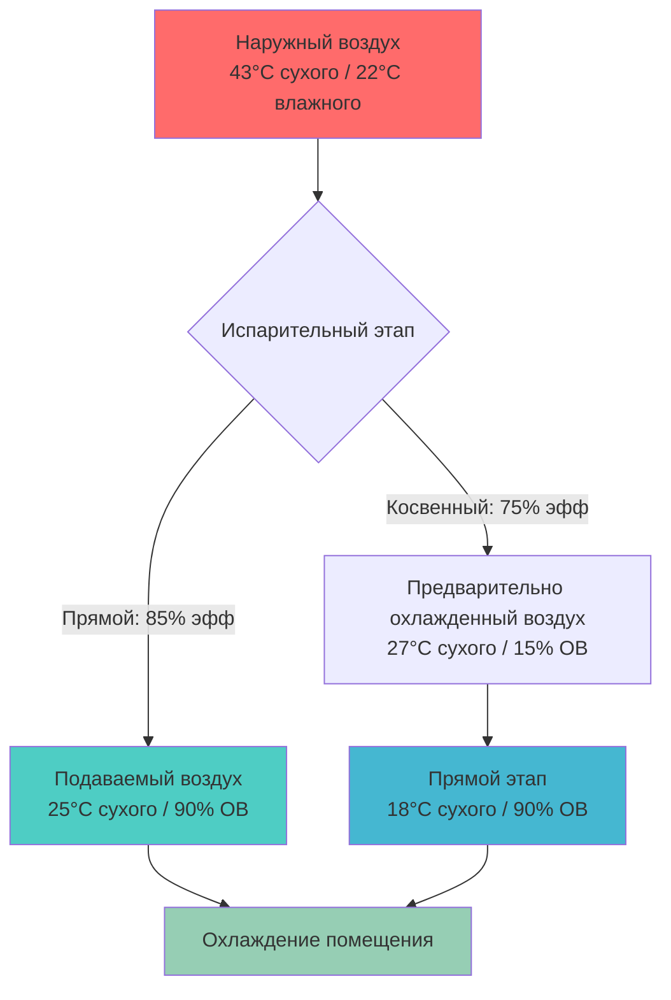

# Проектирование систем HVAC для пустынного и засушливого климата

Пустынные и засушливые климатические зоны представляют уникальные проблемы при проектировании HVAC, характеризующиеся экстремальными суточными колебаниями температуры, интенсивным солнечным излучением, минимальными осадками и загрязнением воздуха взвешенными частицами. Успешное проектирование системы требует использования преимущества низкой влажности при защите от температурных экстремумов и загрязняющих веществ окружающей среды.

## Характеристики климата и последствия для проектирования

**Ключевые проектные условия (климатическая зона ASHRAE 2B, 3B)**

| Параметр | Типичный диапазон | Влияние на проектирование |
|----------|-------------------|--------------------------|
| Летний сухой термометр | 40-49°C | Пиковая нагрузка охлаждения |
| Зимний сухой термометр | -4 до 4°C | Требования отопления |
| Относительная влажность | 5-25% | Потенциал испарительного охлаждения |
| Суточное колебание | 17-22°C | Преимущества тепловой массы |
| Солнечное излучение | 900-1100 Вт/м² | Доминирующий компонент нагрузки |
| Уровень взвешенных частиц | Повышенный PM10/PM2.5 | Требования фильтрации |

Характерной особенностью засушливого климата является сочетание высокой температуры сухого термометра с исключительно низкими отношениями влажности. Это создает значительную депрессию влажного термометра (разница между температурой сухого и влажного термометров), обычно 11-19°C при пиковых условиях, обеспечивающую весьма эффективное испарительное охлаждение.

## Психрометрический анализ условий пустыни

Пустынные климаты работают в нижней левой области психрометрической диаграммы, характеризующейся высокими коэффициентами чувствительного тепла (SHR > 0,95) и минимальной скрытой нагрузкой. Психрометрия проектных условий выявляет возможности стратегии охлаждения.

**Пример расчета: день проектирования Финикс, штат Аризона**
- Наружный воздух: 43°C сухого термометра / 22°C влажного термометра (15% ОВ)
- Целевой показатель в помещении: 24°C сухого термометра / 50% ОВ
- Депрессия влажного термометра: 21°C

Для прямого испарительного охлаждения с эффективностью 85%:
- Температура подаваемого воздуха = 43°C - (0,85 × 21°C) = 25°C
- Практически достижение температуры помещения без механического охлаждения

## Характеристики нагрузок охлаждения

Пустынные климаты характеризуются экстремальными солнечными нагрузками охлаждения с минимальным скрытым компонентом.

**Типичное распределение нагрузки:**
- Солнечный прирост тепла через ограждающую конструкцию: 40-50%
- Теплопередача через крышу/стены: 25-35%
- Внутренние источники тепла: 15-20%
- Чувствительность вентиляции: 8-12%
- Скрытая вентиляция: <2%

**Расчет прироста солнечного тепла**

Для западного остекления при проектных условиях:
- SHGC (коэффициент прироста солнечного тепла): 0,25 (стекло low-e)
- Прямое солнечное излучение: 789 Вт/м²
- Прирост тепла = A × SHGC × Солнечное излучение
- Для окна 9,3 м²: Q = 9,3 × 0,25 × 789 = 1834 Вт

Этот одиночный открытый участок может составлять 25-30% нагрузки охлаждения небольшого здания, подчеркивая критическую важность стратегий контроля солнечного излучения.

## Стратегии проектирования системы

```mermaid
flowchart LR
    A[Стратегия HVAC<br/>пустынный климат] --> B[Испарительное охлаждение]
    A --> C[Солнечная защита]
    A --> D[Система фильтрации]
    A --> E[Тепловое накопление]

    B --> B1[Прямое/косвенное<br/>испарительное]
    B --> B2[Двухэтапные системы]
    B --> B3[Гибридные с DX]

    C --> C1[Высокоэффективное<br/>остекление]
    C --> C2[Внешнее затенение]
    C --> C3[Холодная кровля<br/>SR > 0,65]

    D --> D1[MERV 13-16<br/>Предварительные фильтры]
    D --> D2[Герметичные воздухозаборники<br/>наружного воздуха]
    D --> D3[Стратегия<br/>избыточного давления]

    E --> E1[Ночное охлаждение<br/>Продувка]
    E --> E2[Интеграция<br/>тепловой массы]
    E --> E3[Холодное хранилище]

    style A fill:#f4a261
    style B fill:#2a9d8f
    style C fill:#e76f51
    style D fill:#264653
    style E fill:#e9c46a
```

### Применение испарительного охлаждения

**Прямое испарительное охлаждение (DEC)**
- Эффективность: 80-90% депрессии влажного термометра
- Энергопотребление: 10-25% от механического охлаждения
- Влажность подаваемого воздуха: 85-95% ОВ
- Наилучшее применение: промышленные, складские, частично кондиционируемые помещения

**Косвенное испарительное охлаждение (IEC)**
- Эффективность: 70-80% депрессии влажного термометра
- Без добавления влаги в подаваемый воздух
- Подходит для занятых помещений с требованиями комфорта
- Часто используется с прямым этапом для максимальной эффективности

**Двухэтапные (косвенно-прямые) системы**

Оптимальное решение для пустынного климата сочетает оба этапа:

1. **Косвенный этап**: предварительное охлаждение наружного воздуха чувствительно (без добавления влаги)
   - Теплообменник передает охлаждение в основной поток воздуха
   - Вторичный поток воздуха подвергается испарительному охлаждению
   - Достигает 70-75% депрессии влажного термометра

2. **Прямой этап**: дополнительное охлаждение предварительно охлажденного воздуха
   - Добавляет контролируемую влагу в окончательную подачу
   - Общая эффективность системы: 100-120% депрессии влажного термометра одного этапа
   - Может достичь температур подаваемого воздуха на 3-6°C ниже наружного влажного термометра

**Сравнение эффективности**

| Тип системы | Темп. подачи (43°C/22°C влажного) | Относительная энергия | Контроль влажности |
|-------------|----------------------------------|----------------------|-------------------|
| Только DX | 13°C | 1,00 (базовая) | Отличный |
| Прямое испар. | 25°C | 0,15 | Плохой (высокая ОВ) |
| Косвенное испар. | 27°C | 0,20 | Хороший |
| Двухэтапная | 18°C | 0,25 | Удовлетворительный |
| Гибридная IEC+DX | 13°C | 0,60 | Отличный |

### Смягчение прироста солнечного тепла

Солнечное излучение представляет доминирующий источник тепла в пустынных климатах, требующий агрессивных стратегий контроля.

**Контроль на уровне ограждающей конструкции:**
- SHGC ≤ 0,25 для всех ориентаций остекления
- Внешние затеняющие устройства (предотвращают попадание солнца до стекла)
- Покрытия холодной кровли: солнечная отражательная способность (SR) ≥ 0,65, тепловое излучение ≥ 0,85
- Изоляция кровли: RSI-5,3 минимум, RSI-8,6 предпочтительно
- Изоляция стен: RSI-2,3 непрерывной изоляции минимум

**Рассчитанное преимущество:**

Стандартная кровля (SR = 0,20) в сравнении с холодной кровлей (SR = 0,70):
- Снижение температуры поверхности кровли: 22-33°C
- Снижение теплового потока: q = U × ΔT
- Для кровли RSI-5,3 (U = 0,188): q = 0,188 × 28°C = 5,26 Вт/м²
- Сбережение кровли 186 м²: 977 Вт (0,28 кВт)

### Контроль загрязнения взвешенными частицами

Атмосферная пыль, песок и взвешенные частицы ускоряют деградацию оборудования и ухудшают качество воздуха в помещении.

**Стратегия фильтрации:**
- Предварительные фильтры: MERV 8-11 (удаление грубой пыли, частая замена)
- Финальные фильтры: MERV 13-16 (тонкие частицы, более длительный срок службы)
- Скорость фильтрации: ≤ 1,5 м/с (предотвращает повреждение среды и утечку)
- Мониторинг перепада давления: замена при 2-кратном начальном сопротивлении

**Защита оборудования:**
- Герметичные воздухозаборники наружного воздуха с защитой от погодных условий
- Покрытия змеевиков: фенольные или эпоксидные для коррозионной стойкости
- Защита от град для оборудования на крыше (рейтинг град ≥ 44 мм)
- Расстояние между ребрами конденсатора: ≥ 12 FPI для более легкой очистки
- Панели доступа, размеры которых позволяют регулярную промывку змеевика

**Избыточное давление в здании:**

Поддержание небольшого избыточного давления (5-12 Па) предотвращает инфильтрацию загрязненного пылью воздуха через щели в ограждающей конструкции здания. Рассчитайте требование наружного воздуха:

OA_м³/ч = Вентиляция_на_человека + Компенсация_давления

Компенсация давления = (Площадь_утечки_здания × Давление^0,65) / 2,5

## Методология расчета нагрузки

Расчеты нагрузки для пустынного климата должны учитывать экстремальный солнечный компонент и преимущества суточного колебания температуры.

**Расчет нагрузки ASHRAE Fundamentals:**

Общая нагрузка охлаждения = Кровля + Стены + Окна + Внутренние + Вентиляция

**Нагрузка кровли с отставанием тепловой массы:**
- Метод CLTD (разность температур охлаждающей нагрузки)
- Учитывает температуру солнечного воздуха и тепловое отставание
- Темп. солнечного воздуха: T_sa = T_наружный + (α × I / h_o) - (ε × ΔR / h_o)
  - α = солнечная поглощательная способность (0,90 для темной кровли, 0,30 для холодной кровли)
  - I = интенсивность солнечного излучения (Вт/м²)
  - h_o = коэффициент внешней пленки (10,65 Вт/м²·°C)
  - ε × ΔR = коррекция долговолнового излучения (~3,9°C ночью)

**Преимущество ночного охлаждения:**

Суточное колебание пустыни позволяет существенное охлаждение за счет тепловой массы:
- Ночная температура наружного воздуха: 21-24°C
- Охлаждение строительной массы: ΔT = 11-17°C
- Емкость накопленного охлаждения: Q = m × c × ΔT
- Для 45 400 кг бетона: Q = 45 400 × 920 × 14 = 582 МДж

Это накопленное охлаждение снижает пиковую дневную нагрузку на 10-25% при сочетании со стратегиями ночной вентиляционной продувки.

## Рассмотрения при определении размеров системы

**Мощность системы охлаждения:**
- Базовый расчет нагрузки на проектные условия 1% (ASHRAE Fundamentals)
- Коэффициент безопасности: 10-15% (ниже, чем во влажных климатах, из-за предсказуемых нагрузок)
- Испарительные системы: размер для 100-110% расчетной нагрузки
- Гибридные системы: DX рассчитан на 60-70% пиковой, испарительная покрывает колебания

**Мощность системы отопления:**
- Проектная температура 99% (обычно 25-35°F = -4 до 2°C)
- Теплопотери ограждающей конструкции доминируют (минимальная инфильтрация в герметичной конструкции)
- Переразмеров не рекомендуется: короткий сезон отопления, неэффективность циклирования
- Точка баланса теплового насоса: часто экономична из-за мягкой зимы

**Выбор оборудования:**
- Высокоэффективные конденсаторные установки: EER ≥ 12,0, SEER ≥ 16
- Агрегаты, рассчитанные на пустыню: улучшенные покрытия змеевика, большая поверхность змеевика
- Компрессоры с переменной скоростью: эффективность при частичной нагрузке
- Испарительная среда: жесткий CELdek® или аналог, глубина 30 см для двухэтапной

## Оперативные стратегии

**Операция экономайзера:**
- Экономайзер по сухому термометру: 500-1000+ часов в год
- Уставка: 18-21°C наружного воздуха
- Управление заслонкой: модулирующее для точного смешивания
- Минимальное положение: требуемый кодексом расход вентиляции

**Ночная продувка охлаждением:**
- Активизируйте, когда наружный < 21°C и внутренний > 24°C
- 100% наружный воздух, максимальная скорость вентилятора подачи
- Продолжительность: 2-4 часа до начала работы
- Предварительно охлаждает тепловую массу, снижает утреннюю нагрузку

**Контроль влажности:**
- Засушливые климаты редко требуют осушения
- Испарительные системы могут требовать ограничения влажности в период муссонов
- Контролируйте ОВ помещения, заблокируйте стадию прямого испарения, если ОВ > 65%

---

**Ссылки:**
- ASHRAE Standard 90.1: Energy Standard for Buildings Except Low-Rise Residential Buildings
- ASHRAE Handbook: Fundamentals, Chapter 18: Nonresidential Cooling and Heating Load Calculations
- ASHRAE Climatic Design Conditions: Climate Zone 2B, 3B
- ASHRAE Standard 62.1: Ventilation for Acceptable Indoor Air Quality
