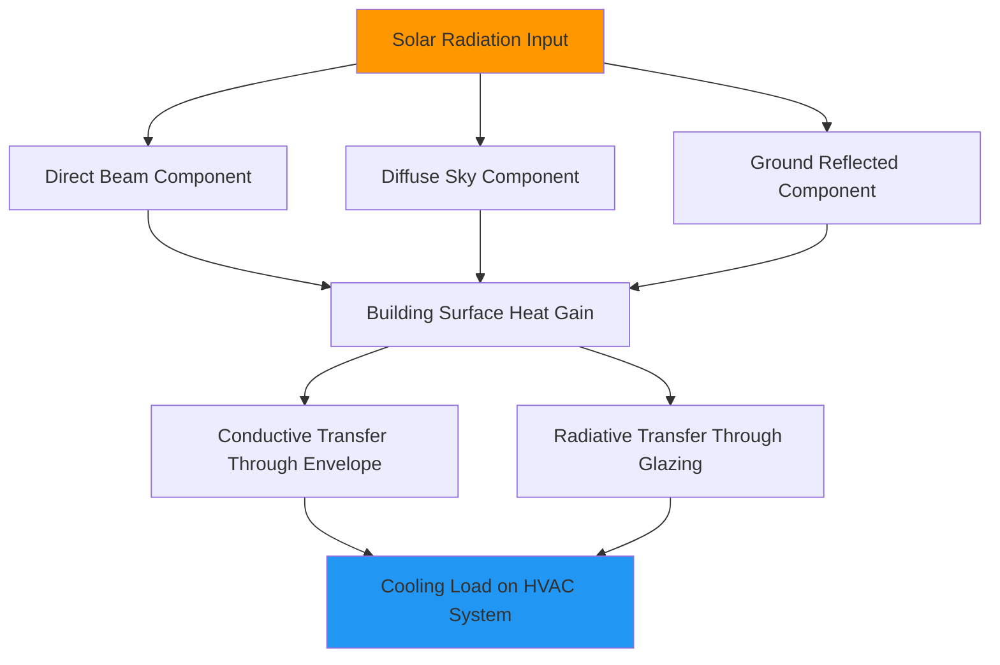

## Параметры климата

Пустынные и засушливые климаты создают уникальные термодинамические проблемы для систем HVAC, характеризуясь экстремальными суточными колебаниями температуры, минимальной атмосферной влажностью и интенсивным солнечным излучением. Эти условия принципиально изменяют расчеты нагрузок, выбор оборудования и параметры производительности системы.

### Характеристики температуры

Пустынные регионы характеризуются суточным диапазоном температур, превышающим 22°C, с летними проектными температурами сухого термометра, достигающими 46-52°C в соответствии с ASHRAE Handbook Fundamentals. Этот экстремальный перепад создает значительные охлаждающие нагрузки в часы пикового потребления, одновременно обеспечивая эффективные стратегии ночной вентиляции.

Скорость изменения температуры следует выражению:

$$\frac{dT}{dt} = \frac{q_{net}}{mc_p}$$

где $q_{net}$ представляет чистый теплопередачу, $m$ — тепловую массу, и $c_p$ — удельную теплоемкость. Пустынные конструкции требуют стратегического расположения тепловой массы для демпфирования этих быстрых колебаний.

| Параметр климата | Типичный диапазон | Влияние на проектирование |
|------------------|------------------|------------------------|
| Летняя температура сухого термометра | 43-52°C | Пиковая охлаждающая нагрузка |
| Суточный диапазон | 19-28°C | Возможность термического аккумулирования |
| Зимняя температура сухого термометра | -4 до 7°C | Определение размера оборудования отопления |
| Средняя совпадающая температура влажного термометра | 18-22°C | Потенциал испарительного охлаждения |

### Психрометрические свойства

Низкая абсолютная влажность определяет психрометрию пустыни с типичными температурами точки росы между -7 и 4°C в летние месяцы. Это создает большие значения психрометрического различия, обеспечивая высокоэффективное испарительное охлаждение.

Психрометрическое различие рассчитывается как:

$$\Delta T_{wb} = T_{db} - T_{wb}$$

Значения 22-28°C являются типичными, позволяя прямым испарительным охладителям снижать температуру приточного воздуха на 14-19°C при проектных условиях.

Нагрузка по удалению влаги остается минимальной, с коэффициентом чувствительности тепла (SHR), обычно превышающим 0,95:

$$SHR = \frac{Q_s}{Q_s + Q_l}$$

где $Q_s$ — чувствительное охлаждение и $Q_l$ — скрытое охлаждение. Этот высокий SHR позволяет уменьшить размер оборудования по скрытой емкости, сосредоточив проектирование на удалении чувствительного тепла.

### Эффекты солнечного излучения

Пустынные регионы получают одни из самых высоких значений солнечной облученности в мире, с облученностью горизонтальной поверхности при ясном небе, достигающей 1000-1100 Вт/м² в полдень по солнечному времени. Расчеты по модели ясного неба ASHRAE дают:

$$E_b = E_0 \cdot e^{-B/\sin(\beta)}$$

где $E_b$ — прямая нормальная облученность, $E_0$ — внеатмосферная облученность, $B$ — коэффициент атмосферного ослабления, и $\beta$ — угол высоты солнца.

Годовая горизонтальная облученность 2200-2500 кВт·ч/м²/год превышает значения в умеренных зонах на 40-60%, создавая значительные кондуктивные и радиационные тепловые прибыли через ограждающие конструкции здания.

### Динамика теплопередачи

Коэффициенты конвективной теплопередачи на внешних поверхностях увеличиваются с скоростью ветра в соответствии с выражением:

$$h_c = a + b \cdot V$$

где типичные коэффициенты дают $h_c$ = 15-25 Вт/м²·К для условий пустынного ветра. В сочетании с радиационным обменом с ясным ночным небом (эффективная температура неба на 17-28°C ниже окружающей температуры), ночное отведение тепла становится высокоэффективным.

Потенциал охлаждения за счет радиации неба следует соотношениям Стефана-Больцмана:

$$q_{rad} = \epsilon \cdot \sigma \cdot A \cdot (T_{surface}^4 - T_{sky}^4)$$

Это позволяет применять пассивные стратегии охлаждения и улучшает отведение тепла конденсатором при ночной работе.

### Ветер и пыль

Пустынные ветры переносят значительное количество твердых частиц, требуя улучшенной фильтрации и защиты оборудования. Господствующие ветровые режимы создают перепады давления на ограждающих конструкциях здания:

$$\Delta P_{wind} = \frac{1}{2} \cdot C_p \cdot \rho \cdot V^2$$

где $C_p$ — коэффициент давления (0,4-0,8 для наветренных поверхностей), $\rho$ — плотность воздуха, и $V$ — скорость ветра. Эти перепады давления влияют на коэффициент инфильтрации и требования к герметичности здания.

| Фактор окружающей среды | Рассмотрение при проектировании |
|----------------------|-------------------------------|
| Запыленность | Улучшенная фильтрация (минимум MERV 11-13) |
| Поступление песка | Защищенные места забора, более грубые предфильтры |
| Воздействие ультрафиолета | Деградация материалов, требуются защитные покрытия |
| Низкое количество осадков | Минимальная коррозия, продленный срок службы оборудования |

### Эффекты высоты над уровнем моря

Многие пустынные регионы находятся на высоте 610-2130 м над уровнем моря, что снижает плотность воздуха в соответствии с выражением:

$$\rho = \rho_0 \cdot e^{-\frac{g \cdot h}{R \cdot T}}$$

Это исправление на высоту влияет на требуемую мощность вентилятора, номинальную мощность оборудования и характеристики оборудования для сжигания топлива. На высоте 1500 м плотность воздуха уменьшается примерно на 17%, требуя пропорционального увеличения объемного расхода воздуха для поддержания массового расхода.

## Характеристики профиля нагрузки

Нагрузки пустынного климата концентрируются главным образом в чувствительном охлаждении, с пиковыми нагрузками, происходящими в полдень, когда солнечное излучение и окружающая температура сочетаются. Асимметричный профиль нагрузки позволяет применять стратегии аккумулирования тепловой энергии, перенося охлаждение на ночные часы, когда оборудование работает с более высокой эффективностью и более низкими затратами на электроэнергию.

Температуры наружных поверхностей на темных крышах могут превышать 82°C при летних проектных условиях, создавая серьезные кондуктивные тепловые прибыли. Требуемое тепловое сопротивление для ограничения теплового потока следует выражению:

$$R_{required} = \frac{T_{surface} - T_{indoor}}{q_{max}}$$

Типичное пустынное строительство требует R-значений крыши в диапазоне RSI 5,3-8,6 для контроля кондуктивных прибылей, вызванных солнцем.

## Рассмотрения производительности оборудования

Сочетание высоких температур окружающей среды и низкой влажности создает оптимальные условия для технологий испарительного охлаждения, одновременно создавая проблемы для производительности систем парокомпрессионного цикла. Конденсаторы с воздушным охлаждением испытывают деградацию емкости и потери эффективности при экстремальных наружных температурах, часто требуя увеличения размеров или дополнительного испарительного предохлаждения.

Системы десикантного осушения воздуха работают неэффективно в уже сухих климатах, что делает их непригодными для применения в пустынях. И наоборот, косвенно-прямые ступени испарительного охлаждения могут достичь коэффициента производительности (COP) свыше 15 при надлежащем проектировании для психрометрических условий пустыни.
