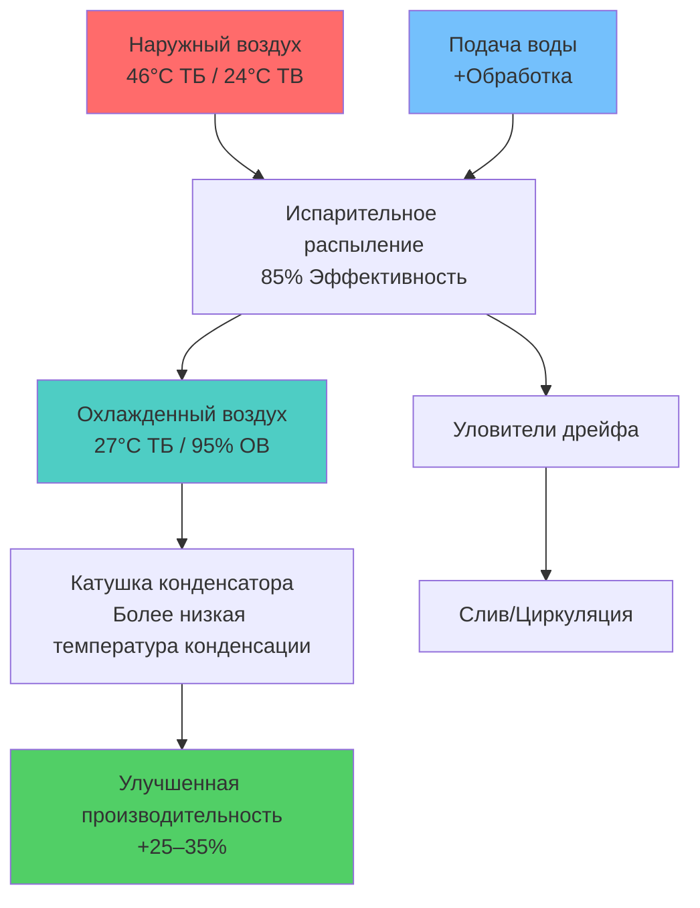
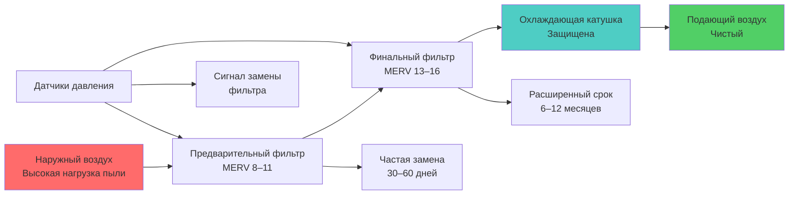

# Рассмотрение оборудования HVAC для пустынного климата

Выбор оборудования для пустынных и засушливых климатов требует специализированных конструктивных особенностей для обеспечения устойчивости к экстремальному тепловому циклированию, интенсивному солнечному излучению, загрязнению взвешенными частицами в воздухе и коррозионной пыли. Стандартные спецификации оборудования неадекватны при этих условиях, что требует применения улучшенных материалов, защитных покрытий и модифицированных геометрий.

## Воздействие факторов окружающей среды и влияние на оборудование

Оборудование в пустыне подвергается одновременному воздействию нескольких механизмов деградации.

**Основные экологические проблемы:**

| Фактор | Величина | Влияние на оборудование | Стратегия смягчения |
|--------|----------|------------------------|-------------------|
| Пиковая температура | 46–52°C окружающего воздуха | Перегрузка компрессора, давление хладагента | Компоненты, рассчитанные на высокие температуры |
| Суточное циклирование | 17–28°C суточный размах | Усталость материалов, отказ уплотнений | Гибкие соединения, компенсационные швы |
| Солнечное излучение | 900–1100 Вт/м² | Деградация корпуса, отказ управления | Отражающие покрытия, изолированные корпусы |
| Взвешенные частицы в воздухе | PM10: 50–200 мкг/м³ | Обрастание катушек, износ подшипников | Улучшенная фильтрация, геометрия катушек |
| Щелочная пыль | pH 8–10 | Коррозия алюминия | Защитные покрытия, замена материалов |
| Воздействие града | Диаметр 2,5–6,4 см | Повреждение катушек, вмятины на корпусе | Защитные экраны, устойчивые к ударам |

## Выбор холодильного оборудования

### Конденсирующие блоки — специализированные для пустыни

Стандартные конденсирующие блоки испытывают значительное снижение производительности и преждевременный отказ в условиях пустыни. Специализированные спецификации для пустыни решают эти проблемы.

**Улучшенные конструктивные особенности:**

**Геометрия катушки:**
- Расстояние между ребрами: 12–14 шт. на дюйм (в сравнении со стандартными 16–20 шт. на дюйм)
- Увеличенное расстояние снижает скорость накопления пыли
- Облегчает очистку без повреждения ребер
- Поддерживает воздухопровод при загрязненных условиях

**Защита поверхности катушки:**
- Фенольно-эпоксидное покрытие (минимальная толщина 1,5 мил)
- Э-покрытие обеспечивает превосходную коррозионную стойкость в сравнении с окислением алюминия
- Гидрофобная поверхность снижает прилипание пыли
- Продление срока службы: 200–300% в среде щелочной пыли

**Тепловая защита компрессора:**
- Номинальная температура окружающей среды: минимум 52°C (предпочтительно 60°C)
- Внутренний тепловой перегрузочный релей с ручным сбросом
- Обогреватель картера для запуска в холодное утро зимой
- Отсечка по высокому давлению: 3275–3450 кПа для систем R-410A

**Конструкция корпуса:**
- Оцинкованная сталь минимум 0,91 мм (в сравнении со стандартными 0,71 мм)
- Порошковое покрытие с УФ-стабилизаторами
- Отражающий экстерьер: солнечное отражение ≥ 0,60
- Жалюзийные панели для отражения солнечного излучения

### Снижение производительности

Производительность оборудования снижается с повышением температуры конденсации при увеличении окружающих условий. Связь следует термодинамическим принципам цикла охлаждения.

**Коэффициент коррекции производительности:**

Для воздушных конденсаторов производительность варьируется приблизительно:

$$
Q_{фактическая} = Q_{номинальная} \times \left(1 - 0,02 \times (T_{окр} - T_{номинальная})\right)
$$

Где:
- $Q_{фактическая}$ = Фактическая производительность охлаждения (кДж/ч)
- $Q_{номинальная}$ = Номинальная производительность ARI при 35°C окружающего воздуха (кДж/ч)
- $T_{окр}$ = Фактическая температура окружающего воздуха (°C)
- $T_{номинальная}$ = Температура номинального условия (35°C)
- 0,02 = Типичный коэффициент снижения (2% на °C)

**Пример расчета:**

Блок мощностью 35 кВ (при 35°C окружающего воздуха эквивалентно 420 кДж/ч на кВ), работающий при 46°C:

$$
Q_{фактическая} = 35 \times \left(1 - 0,02 \times (46 - 35)\right) = 35 \times 0,78 = 27,3 \text{ кВ}
$$

Снижение производительности: 22% при экстремальных условиях проектирования.

**Последствия для проектирования размера:**
- Выбирайте оборудование на основе ожидаемой температуры окружающего воздуха, а не стандартного номинала 35°C
- Применяйте коэффициент снижения производительности при расчетах нагрузки
- Рассмотрите несколько меньших устройств в сравнении с одним большим устройством
- Проверьте пределы работы компрессора при высокой температуре

### Испарительное конденсирование

Предварительное охлаждение входящего воздуха конденсатора путем испарительного распыления снижает температуру конденсации и восстанавливает производительность в пиковых условиях.

**Конфигурация системы:**

**Выгода производительности:**

Температура входящего воздуха после испарительного предварительного охлаждения:

$$
T_{вход} = T_{тб} - \eta \times (T_{тб} - T_{тв})
$$

Где:
- $\eta$ = Испарительная эффективность (0,80–0,90)
- $T_{тб}$ = Температура по сухому термометру (°C)
- $T_{тв}$ = Температура по влажному термометру (°C)

Для условий 46°C / 24°C ТВ с эффективностью 85%:

$$
T_{вход} = 46 - 0,85 \times (46 - 24) = 46 - 18,7 = 27,3°C
$$

Снижение температуры конденсации: 11–14°C
Улучшение производительности: 25–35%
Улучшение энергоэффективности (EER): 15–25%

**Проектные соображения:**
- Качество воды: ОВ (общее растворённых веществ) < 500 мг/л предпочтительно, требуется обработка при ОВ > 1000 мг/л
- Скорость слива: 3–5% для контроля концентрации минералов
- Уловители дрейфа: максимум 0,001% уноса
- Защита от мороза: система осушки на зиму

## Оборудование испарительного охлаждения

Прямые и непрямые испарительные охладители обеспечивают наиболее энергоэффективное решение охлаждения для пустынных климатов, но требуют надлежащего выбора среды и обработки воды.

### Выбор испарительной среды

**Жесткая среда (CELdek®, Glasdek®):**
- Конструкция: целлюлозный или стеклопластиковый субстрат с полимерным покрытием
- Толщина: 15–30 см (30 см для двухступенчатых систем)
- Угол желобка: 15/45° или 30/60° перекрестно-гофрированный
- Эффективность: 85–92% при номинальной скорости
- Диапазон скорости: 1 м/с–2 м/с (1,27 м/с оптимально)
- Срок службы: 5–10 лет при надлежащем техническом обслуживании

**Взаимосвязь производительности:**

Испарительная эффективность следует логарифметической зависимости от глубины среды:

$$
\eta = 1 - e^{-K \times L / V}
$$

Где:
- $\eta$ = Эффективность насыщения
- $K$ = Коэффициент массопередачи (зависит от геометрии среды)
- $L$ = Глубина среды (см)
- $V$ = Скорость воздуха (м/с)

**Сравнение сред:**

| Тип среды | Глубина | Скорость | Эффективность | Перепад давления | Соотношение стоимости |
|-----------|---------|----------|---------------|-----------------|----------------------|
| Асповое волокно | 10 см | 1,27 м/с | 75–80% | 25 Па | 1,0 |
| CELdek 15 см | 15 см | 1,27 м/с | 85–88% | 37 Па | 2,5 |
| CELdek 30 см | 30 см | 1,27 м/с | 90–92% | 62 Па | 4,0 |
| Glasdek 20 см | 20 см | 1,52 м/с | 88–90% | 44 Па | 3,5 |

### Системы водораспределения

Равномерное распределение воды по поверхности среды обеспечивает согласованную производительность и предотвращает сухие участки, которые снижают эффективность.

**Методы распределения:**

**Гравитационная система заливки:**
- Напорная труба с калибровочными отверстиями
- Расход: 1,9–3,8 л/мин на погонный метр среды
- Циркуляционный насос: 0,37–0,75 кВт на 473 м³/ч
- Емкость резервуара: 2–3 минуты удержания при скорости циркуляции

**Система распылительных форсунок:**
- Форсунки с давлением распыления 100–200 кПа
- Перекрытие паттерна: 100% покрытие
- Расход: 3–6 л/мин на погонный метр
- Повышенная равномерность, повышенная мощность насоса

**Требования качества воды:**

| Параметр | Максимальное значение | Влияние при превышении |
|----------|----------------------|----------------------|
| Общее растворённые вещества | 1000 мг/л | Образование накипи, снижение смачивания |
| Жесткость кальция | 200 мг/л как CaCO₃ | Белые отложения накипи |
| pH | 6,5–8,5 | Деградация среды, коррозия |
| Хлориды | 200 мг/л | Коррозия металлических компонентов |
| Кремний | 50 мг/л | Твёрдая накипь, сложное удаление |

**Расчет скорости слива:**

Для поддержания ОВ на приемлемом уровне часть циркулирующей воды должна быть удалена.

$$
\text{Скорость слива (л/мин)} = \frac{\text{Скорость испарения}}{\text{Количество циклов концентрации} - 1}
$$

Скорость испарения приблизительно равна:

$$
\text{Испарение (л/мин)} = \frac{\text{м³/ч} \times \Delta h}{501,6}
$$

Где:
- $\Delta h$ = Изменение энтальпии через среду (кДж/кг)
- 501,6 = Коэффициент преобразования для л/мин

**Пример:**

Блок мощностью 4720 м³/ч, снижение температуры на 11°C (≈ 8,3 кДж/кг изменение энтальпии), 3 цикла концентрации:

$$
\text{Испарение} = \frac{4720 \times 8,3}{501,6} \approx 0,078 \text{ л/мин}
$$

$$
\text{Слив} = \frac{0,078}{3 - 1} = 0,039 \text{ л/мин}
$$

Общее поступление свежей воды: 0,078 + 0,039 = 0,117 л/мин (7 л/ч)

## Оборудование обработки воздуха

### Системы фильтрации

Уровни загрязнения взвешенными частицами в пустыне превышают предположения проектирования стандартных фильтров в 5–10 раз, что требует специализированных стратегий фильтрации.

**Двухступенчатый подход к фильтрации:**

**Ступень предварительного фильтра:**
- Номинал MERV 8–11 (45–65% эффективность пыльцы ASHRAE)
- Улавливает крупные частицы: диаметр 3–10 мкм
- Предотвращает перегрузку финального фильтра
- Скорость: 1,5–2 м/с
- Интервал замены: 30–90 дней в зависимости от частоты пыльных бурь

**Финальная ступень фильтра:**
- Номинал MERV 13–16 (85–95% эффективность пыльцы ASHRAE)
- Улавливает мелкие частицы: диаметр 0,3–3 мкм
- Защищает охлаждающие катушки от обрастания
- Скорость: 1,27–1,78 м/с (более низкая скорость продлевает срок службы)
- Интервал замены: 6–12 месяцев при надлежащем предварительном фильтре

**Мониторинг перепада давления:**

Загрузка фильтра создает экспоненциальное увеличение перепада давления. Замените при достижении перепада давления в 2× от начального сопротивления чистого фильтра.

$$
\Delta P_{фильтр} = \Delta P_{чистый} \times \left(1 + k \times m_{пыль}\right)
$$

Где:
- $\Delta P_{фильтр}$ = Текущий перепад давления (Па)
- $\Delta P_{чистый}$ = Начальный перепад чистого фильтра (Па)
- $k$ = Коэффициент загрузки (зависит от среды)
- $m_{пыль}$ = Накопленная масса пыли (г/м²)

**Типичные пороги замены:**

| Тип фильтра | Начальный ΔP | Замена при ΔP | Типичное обслуживание (пустыня) |
|-------------|------------|---------------|--------------------------------|
| MERV 8 | 37 Па | 98 Па | 1–2 месяца |
| MERV 11 | 62 Па | 148 Па | 2–3 месяца |
| MERV 13 | 86 Па | 197 Па | 6–9 месяцев |
| MERV 16 | 123 Па | 295 Па | 8–12 месяцев |

### Защита охлаждающей катушки

Обрастание катушек снижает теплопередачу и увеличивает перепад давления на стороне воздуха, ухудшая производительность системы.

**Спецификация катушки для условий пустыни:**

**Расстояние между ребрами:** 8–10 шт. на дюйм (в сравнении с 12–14 шт. на дюйм стандарт)
- Снижает накопление пыли между ребрами
- Облегчает доступ для очистки
- Поддерживает воздухопровод при частичном обрастании

**Скорость лицевой части:** максимум 2 м/с
- Более низкая скорость снижает столкновение пыли
- Снижает штраф перепада давления от обрастания
- Стандартное проектирование часто указывает 2,5–2,8 м/с

**Глубина катушки:** 4–6 рядов типично
- Неглубокие катушки легче очищать
- Несколько малых катушек предпочтительнее одной глубокой катушки
- Требования доступа: зазор 1,1 м для очистки

**Защитные покрытия:**
- Фенольно-эпоксидное: стандартная защита, толщина 1,5 мил
- Покрытие Heresite: премиальная защита для агрессивных сред
- Золотое ребро покрытие: улучшенная коррозионная стойкость для алюминиевых ребер

**Доступ для очистки:**
- Съемные панели доступа: минимум 0,6 м × 0,6 м с обеих сторон
- Чистое пространство: минимум 1,1 м для работы мойки высокого давления
- Дренажные отверстия: соединение дренажа 4–5 см, с водяной ловушкой

### Системы вентиляторов

Пустынная жара влияет на производительность двигателей и смазку подшипников, требуя тепловой защиты и улучшенного охлаждения.

**Выбор электродвигателя:**
- Коэффициент обслуживания: минимум 1,15 (предпочтительно 1,25 для наружных устройств)
- Класс изоляции: F минимум (155°C), предпочтителен H (180°C)
- Корпус: TEFC (полностью закрытый вентилируемый вентилятором) для пыльных сред
- Номинал окружающей среды: 50°C (122°F) непрерывная работа

**Защита подшипников:**
- Уплотненные подшипники: предотвращение попадания пыли
- Высокотемпературная смазка: NLGI Grade 2, температура каплепадения 177°C
- Предусмотрения переосмазки: масленки доступны без разборки

**Преобразователи частоты (VFD):**
- Номинал окружающей среды: минимум 50°C (122°F)
- Номинал IP: минимум IP54 для наружных установок
- Конформное покрытие: защита печатной платы от пыли
- Вентиляция: фильтрованный впуск, герметичный корпус
- Реактор/фильтр: минимизируют ток подшипника двигателя от гармоник PWM

## Защита наружного оборудования

### Защита от солнечного излучения

Прямое солнечное воздействие повышает температуру корпуса на 11–22°C выше окружающей, влияя на органы управления и снижая срок службы компонентов.

**Стратегии затенения:**

**Специализированные навесы:**
- Высота: 30–45 см над оборудованием
- Свес: 30–60 см за границу оборудования
- Материал: отражающий металл (оцинкованная сталь, алюминий)
- Вентиляция: открытые стороны для потока воздуха
- Снижение температуры: 8–14°C внутри корпуса

**Встроенные солнечные экраны:**
- Установленные на заводе отражающие панели
- Воздушный зазор: 5–10 см над корпусом крыши
- Солнечное отражение: ≥ 0,70
- Тепловое излучение: ≥ 0,85

**Применение прохладной крыши:**
- Эластомерное покрытие на корпусе оборудования
- Солнечное отражение: 0,60–0,80
- Применение: распыление или нанесение валиком
- Переприменение: 5–7 лет

### Защита от града

Пустынные регионы испытывают суровые конвективные штормы с крупным градом. Защита оборудования предотвращает катастрофический ущерб.

**Спецификации защиты от града:**

**Защита катушек:**
- Материал: расширенный металл, толщина 0,89 мм алюминий
- Сетка: отверстия 1,9 см × 0,6 см (защита от града 4,4 см)
- Отступ: 2,5–5 см от поверхности катушки
- Влияние на воздухопровод: < 5% при надлежащем проектировании

**Защита корпуса:**
- Материал: перфорированный металл 18-го калибра
- Перфорация: 50–60% открытая площадь
- Покрытие: верх и подветренные стороны
- Ударная стойкость: град 5 см на скорости падения (40+ м/с)

**Защита вентилятора:**
- Диаметр провода: минимум 4,9 мм (5-й калибр)
- Расстояние: 1,3–1,9 см для защиты лопасти
- Ударная стойкость: сертифицировано по AMCA 99

### Защита от песчаных бурь

Летающий песок, абразирующий катушки и загрязняющий компоненты во время песчаных бурь, требует как пассивной, так и активной защиты.

**Пассивная защита:**
- Впускные жалюзи: направлены вниз, минимум 45°
- Конструкция лабиринта: несколько изменений направления захватывают тяжелые частицы
- Дренаж: отверстия для удаления скопления песка

**Активная защита:**
- Автоматические клапаны: закрывают впуск наружного воздуха при экстремальных событиях
- Датчики давления: обнаруживают условия песчаной бури
- Режим рециркуляции: поддерживают работу при 100% воздухе из помещения

**Техническое обслуживание после бури:**
- Протокол проверки: визуальная проверка в течение 24 часов
- Очистка катушек: мягкое ополаскивание водой (избегать высокого давления на пыльные катушки)
- Замена фильтра: часто требуется после крупных пыльных событий

## Защита системы управления

Электронные органы управления выходят из строя преждевременно в условиях пустыни без защиты окружающей среды.

**Спецификации окружающей среды панели управления:**

| Параметр | Стандарт | Усиленный для пустыни |
|----------|----------|----------------------|
| Рабочая температура | 0–40°C | −10–60°C |
| Номинал NEMA | NEMA 1 | NEMA 3R минимум, NEMA 4 предпочтительно |
| Конформное покрытие | Опционально | Требуется (акриловое или уретановое) |
| Защита от пыли | Не указано | IP5X минимум |
| Управление тепловым режимом | Пассивное | Активное охлаждение (тепловая труба, элемент Пельтье) |

**Стратегии управления тепловым режимом:**

**Охлаждение с помощью тепловой трубы:**
- Передает тепло из корпуса управления во внешний радиатор
- Нет движущихся частей, высокая надежность
- Производительность: 37–147 Вт
- Снижение температуры: 8–17°C

**Термоэлектрические охладители (элемент Пельтье):**
- Активное охлаждение корпуса управления
- Производительность: 74–294 Вт
- Снижение температуры: 17–28°C
- Потребление энергии: 110–220 Вт
- Лучше всего для критических органов управления в экстремальных условиях

**Вентиляционные вентиляторы:**
- Фильтрованный впуск, вытяжной вентилятор
- Фильтр: MERV 8 минимум, заменяемый
- Воздухопровод: 24–47 м³/ч типично
- Снижение температуры: 5–11°C

## Ввод в эксплуатацию и проверка производительности

Оборудование для пустыни требует проверки при фактических условиях эксплуатации, а не при стандартных условиях номинала.

**Критические тесты производительности:**

**Тест производительности при высокой температуре:**
- Проводите при фактическом пиковом условии проектирования (46°C и выше)
- Проверьте производительность соответствует расчету нагрузки
- Проверьте амперность компрессора, пределы давления на головке
- Документируйте фактическую производительность в сравнении с прогнозируемой

**Проверка воздухопровода катушки:**
- Измерьте перепад давления через катушки
- Сравните с данными чистой катушки производителя
- Установите базовую линию для будущего мониторинга обрастания
- Цель: < 37 Па на ряд для чистой катушки

**Проверка эффективности испарительной системы:**
- Измерьте сухой-влажный термометр впуска и выхода
- Рассчитайте фактическую эффективность в сравнении со спецификацией проектирования
- Проверьте равномерность распределения воды
- Проверьте операцию слива и уровни ОВ

**Проверка системы фильтрации:**
- Установите манометры Мажелика через каждую ступень фильтра
- Документируйте перепад давления чистого фильтра
- Проверьте настройки выключателя сигнализации давления
- Проверьте функциональность сигнализации

---

**Ссылки:**
- ASHRAE Handbook: HVAC Systems and Equipment, Chapter 52: Evaporative Cooling
- ASHRAE Standard 143: Design and Maintenance of Evaporative Cooling Equipment
- AHRI Standard 340/360: Performance Rating of Commercial and Industrial Unitary Air-Conditioning and Heat Pump Equipment
- ASHRAE Standard 62.1: Ventilation for Acceptable Indoor Air Quality (Filtration Requirements)
