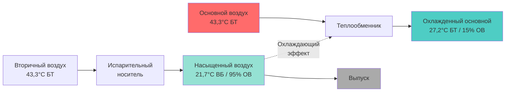
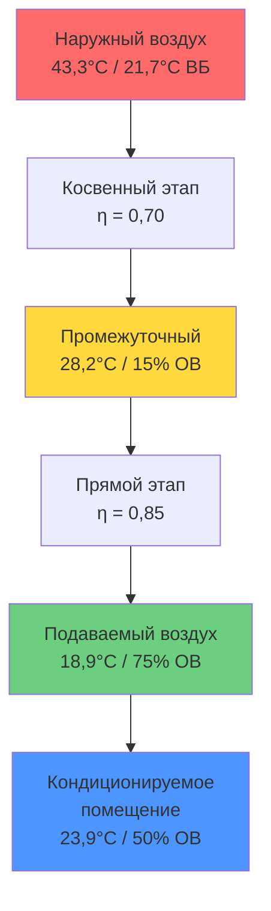
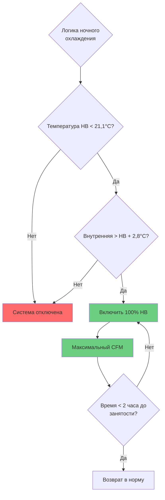

# Стратегии HVAC для пустынного климата

Пустынные и засушливые климатические зоны требуют специализированных подходов HVAC, которые используют присущее низкую влажность при одновременном снижении экстремальных тепловых нагрузок и суточных колебаний температуры. Фундаментальная стратегия сосредоточена на минимизации механического охлаждения путем использования пассивных и низкоэнергетических активных методов охлаждения.

## Основы испарительного охлаждения

Испарительное охлаждение представляет основную возможность в пустынных климатах, используя психрометрическое расстояние между температурой сухого булькова и температурой влажного булькова для достижения существенного чувственного охлаждения с минимальным энергетическим входом.

### Физика прямого испарительного охлаждения

Прямое испарительное охлаждение (ПИО) работает по принципу адиабатического насыщения, при котором испарение воды извлекает скрытую теплоту из потока воздуха, снижая температуру сухого булькова при увеличении коэффициента влажности.

**Энергетический баланс:**

$$Q_{испар} = \dot{m}_{воздух} \times (h_{вход} - h_{выход})$$

Где энтальпия остается постоянной в идеальном адиабатическом процессе, но температура сухого булькова снижается согласно:

$$T_{выход} = T_{вход} - \eta_{испар} \times (T_{сб} - T_{вб})$$

**Ключевые параметры:**
- $\eta_{испар}$ = эффективность испарения (0,80-0,90 для жестких носителей)
- $(T_{сб} - T_{вб})$ = депрессия влажного булькова
- $T_{вб}$ = термодинамическая температура влажного булькова

**Таблица анализа производительности:**

| Условие проектирования | Наружный воздух | Депрессия ВБ | Подача при эфф. 85% | Соотношение энергии к DX |
|------------------|-------------|---------------|------------------|-------------------|
| Пик Феникса | 43,3°C / 21,7°C ВБ | 21,7°C | 25°C | 0,15 |
| Пик Лас-Вегаса | 42,2°C / 20°C ВБ | 22,2°C | 23,3°C | 0,14 |
| Пик Эр-Рияда | 46,1°C / 23,9°C ВБ | 22,2°C | 27,2°C | 0,16 |
| Пик Алис-Спрингс | 40°C / 18,9°C ВБ | 21,1°C | 22,2°C | 0,13 |

Прямое испарительное охлаждение потребляет примерно на 85-90% меньше энергии, чем парокомпрессионное холодоснабжение, при этом требования к мощности ограничиваются энергией вентилятора и насосами циркуляции воды.

**Ограничения:**
- Относительная влажность подаваемого воздуха: 85-95%
- Ограниченная способность кондиционирования комфорта
- Непригодна для приложений, чувствительных к влажности
- Требует непрерывного водоснабжения и обработки

### Косвенное испарительное охлаждение

Косвенное испарительное охлаждение (КИО) разделяет процесс испарения от основного потока воздуха с использованием теплообменника, обеспечивая чувственное охлаждение без добавления влажности.

**Принцип работы:**

**Расчет передачи тепла:**

Эффективность косвенного этапа определяется как:

$$\eta_{КИО} = \frac{T_{основной,вход} - T_{основной,выход}}{T_{основной,вход} - T_{вб,вторичный}}$$

Типичные значения находятся в диапазоне 0,55-0,75 в зависимости от конфигурации теплообменника и скоростей воздуха.

**Передача энергии:**

$$Q_{КИО} = \dot{m}_{основной} \times c_p \times (T_{вход} - T_{выход})$$

Для системы объемом 10000 CFM (16990 м³/ч) при условиях проектирования Феникса:
- Массовый расход воздуха: $\dot{m} = 10000 \times 1,699 \times 1,2 = 20388$ кг/ч
- Снижение температуры: $\Delta T = 43,3 - 27,2 = 16,1°C$
- Охлаждающая мощность: $Q = 20388 \times 1,005 \times 16,1 = 331,1$ кДж (92 кВт охл.)
- Потребление мощности: ~15 кВт (вентилятор + насосы) = 0,16 кВт/кВт охл.

Сравнительно с холодоснабжением DX при 0,32 кВт/кВт входа КИО достигает сопоставимого охлаждения при 50% большей эффективности.

### Двухступенчатые испарительные системы

Двухступенчатое (косвенно-прямое) испарительное охлаждение объединяет обе технологии в серии для максимизации охлаждающего потенциала при управлении добавлением влажности.

**Конфигурация системы:**

**Расчет производительности:**

Этап 1 (Косвенный):
$$T_1 = T_{НВ} - \eta_{КИО} \times (T_{НВ} - T_{вб,НВ})$$
$$T_1 = 43,3 - 0,70 \times (43,3 - 21,7) = 28,2°C$$

Промежуточное условие имеет сниженный сухой булькова, но неизменный коэффициент влажности, создавая новую температуру влажного булькова приблизительно 20°C.

Этап 2 (Прямой):
$$T_2 = T_1 - \eta_{ПИО} \times (T_1 - T_{вб,1})$$
$$T_2 = 28,2 - 0,85 \times (28,2 - 20) = 21,3°C$$

**Сравнительная производительность:**

| Тип системы | Температура подачи | ОВ подачи | Охлаждающая мощность | Входная мощность | КОП |
|-------------|-------------|-----------|--------------|-------------|-----|
| Только DX | 12,8°C | 50% | 105,2 кВ охл. | 30,0 кВт | 12,0 |
| Только КИО | 27,8°C | 15% | 70,1 кВ охл. | 12,0 кВт | 20,0 |
| Только ПИО | 25°C | 90% | 84,1 кВ охл. | 4,5 кВт | 64,0 |
| Двухступенчатая | 21,1°C | 75% | 100,1 кВ охл. | 16,5 кВт | 20,7 |
| Гибридная КИО+DX | 12,8°C | 50% | 105,2 кВ охл. | 18,0 кВт | 20,0 |

Двухступенчатая конфигурация обеспечивает 95% механической охлаждающей мощности при 55% энергетического входа, представляя оптимальный баланс для приложений критического комфорта.

## Использование тепловой массы

Пустынные климаты демонстрируют экстремальные суточные колебания температуры (16,7-22,2°C), позволяющие тепловой массе хранить ночное охлаждение для снижения дневной нагрузки.

**Емкость теплового хранилища:**

$$Q_{сохран} = m \times c_p \times \Delta T$$

Для бетонной тепловой массы:
- $c_p = 0,92$ кДж/кг·°C
- Типичная масса здания: 240-725 кг/м² площади пола
- Колебание температуры: 8,3-13,9°C во время цикла заряда/разряда

**Пример расчета:**

Здание площадью 465 м² с полом из бетона толщиной 200 мм (480 кг/м²):
- Общая масса: $m = 465 \times 480 = 223200$ кг
- Ночное охлаждение: $\Delta T = 11,1°C$ (от 32,2°C до 21,1°C)
- Сохраненное охлаждение: $Q = 223200 \times 0,92 \times 11,1 = 2279$ МДж

Это тепловое хранилище обеспечивает:
- Среднее охлаждение за 10-часовой день: 228 кВ охл. (64,8 кВт)
- Способность пикового сглаживания: 25-35% расчетной нагрузки
- Снижение размера механической системы: сокращение мощности на 15-20%

**Тепловая диффузивность и глубина проникновения:**

Эффективная глубина участия тепловой массы зависит от тепловой диффузивности:

$$\alpha = \frac{k}{\rho \times c_p}$$

Для бетона: $\alpha = 0,0026$ м²/ч

Глубина проникновения для 24-часового цикла:

$$d = \sqrt{\frac{2\alpha \times t}{\pi}} = \sqrt{\frac{2 \times 0,0026 \times 24}{\pi}} = 0,226 \text{ м (226 мм)}$$

Это подтверждает, что стандартные плиты толщиной 150-200 мм полностью участвуют в суточных циклах теплового хранилища.

## Охлаждение ночной вентиляции

Ночная вентиляционная продувка использует прохладный ночной наружный воздух для предварительного охлаждения тепловой массы и снижения охлаждающей нагрузки следующего дня.

**Стратегия управления:**

**Коэффициент подачи охлаждения:**

$$Q_{ночь} = \dot{V} \times \rho \times c_p \times (T_{внутр} - T_{наружн})$$

Для вентиляции 10000 CFM (16990 м³/ч) при наружной температуре 18,3°C и внутренней 29,4°C:
$$Q = 16990 \times 1,2 \times 1005 \times (29,4-18,3) = 224,8 \text{ кВ охл.}$$

За 4-часовой цикл ночной продувки:
- Общее подаваемое охлаждение: 3098 МДж
- Эквивалентное охлаждение тепловой массы: 179000 кг бетона на 5,6°C
- Снижение пиковой нагрузки следующего дня: 25,2 кВ охл. в среднем (7,2 кВт)

**Оптимальные операционные параметры:**

| Параметр | Рекомендуемое значение | Ссылка ASHRAE |
|-----------|-------------------|------------------|
| Температура активации | 21,1°C наружного | ASHRAE 90.1 |
| Минимальный температурный дифференциал | 2,8°C | Оптимизация поля |
| Скорость воздухообмена | 4-8 воздухообмена/ч | Экспозиция тепловой массы |
| Продолжительность | 2-6 часов | Емкость тепловой массы |
| Последнее время завершения | 2 часа до занятости | Восстановление комфорта |

## Затенение и защита от солнца

Солнечная радиация составляет 40-50% охлаждающей нагрузки в пустынных климатах, делая защиту от солнца наивысшим приоритетом пассивной стратегии.

**Физика солнечного прироста тепла:**

Общий прирост солнечного тепла через остекление:

$$Q_{солнечн} = A \times ПГЛС \times I_т \times КЗ$$

Где:
- $A$ = площадь остекления (м²)
- $ПГЛС$ = Коэффициент прироста солнечного тепла (безразмерный)
- $I_т$ = общее падающее солнечное излучение (кВт/м²)
- $КЗ$ = коэффициент затенения для внешних устройств

**Пример - Сравнение западного фасада:**

| Тип остекления | ПГЛС | Коэффициент U | КПВ | Прирост тепла при 789 Вт/м² |
|--------------|------|----------|-----|---------------------------|
| Четкое одиночное | 0,82 | 6,24 Вт/м²·К | 0,90 | 646 Вт/м² |
| Четкое двойное | 0,70 | 2,84 Вт/м²·К | 0,78 | 552 Вт/м² |
| Низкоэмиссионное двойное | 0,40 | 1,65 Вт/м²·К | 0,70 | 316 Вт/м² |
| Тройное низкоэмиссионное | 0,25 | 1,02 Вт/м²·К | 0,60 | 198 Вт/м² |
| Низкоэмиссионное + Внешн. затенение | 0,08 | 1,65 Вт/м²·К | 0,21 | 63 Вт/м² |

Для 46,5 м² остекления, ориентированного на запад, модернизация с четкого двойного на низкоэмиссионное с внешним затенением:
- Снижение прироста тепла: $(552-63) \times 46,5 = 22,7$ кВ охл.
- Экономия охлаждающей нагрузки: 25-30% от типичного здания
- Снижение пикового спроса: 6,5 кВт при 0,32 кВт/кВ охл.

**Эффективность внешнего затенения:**

Внешнее затенение препятствует достижению солнечной радиацией остекления, исключая тепло до передачи через стекло.

$$КЗ_{внешн} = \frac{Q_{затенено}}{Q_{незатенено}} = 0,10 - 0,20$$

Размер горизонтального козырька для южного фасада:

$$\text{Проекция козырька} = \frac{\text{Высота окна}}{\tan(\text{Солнечная высота при проектировании})}$$

Для Феникса при летнем солнцестоянии (солнечная высота 82°):
$$P = \frac{1,83 \text{ м}}{\tan(82°)} = 0,26 \text{ м}$$

Однако это обеспечивает минимальную защиту запада/востока, требуя вертикальных ребер или управляемых внешних жалюзи.

## Теплообмен воздух-к-воздуху

Теплообмен воздух-к-воздуху расширяет работу экономайзера и снижает вентиляционные нагрузки во время пиковых условий.

**Эффективность колеса теплообмена:**

Эффективность чувственной теплоты:

$$\eta_ч = \frac{T_{подача,выходящая} - T_{наружн}}{T_{выпуск} - T_{наружн}}$$

Для применений в пустыне целевая чувственная эффективность 0,70-0,80.

**Производительность при условиях проектирования:**

Наружный: 43,3°C, Выпуск: 23,9°C, Эффективность: 0,75

$$T_{подача} = 43,3 - 0,75 \times (43,3-23,9) = 28,1°C$$

Для 5000 CFM (8495 м³/ч) вентиляционного воздуха:
- Снижение температуры: 15,2°C
- Снижение охлаждающей нагрузки: $Q = 8495 \times 1,2 \times 1005 \times 15,2 = 155,4$ кВ охл.
- Экономия мощности: 33,2 кВт механического охлаждения
- Годовая экономия энергии: 122,9-174,6 МВт·ч

**Таблица сравнения:**

| Тип теплообмена | Эффективность чувствования | Латентная передача | Перепад давления | Пригодность для пустыни |
|--------------------|--------------|-----------------|---------------|--------------------|
| Пластинчатый стационарный | 0,60-0,75 | Нет | 1,0-2,0 кПа | Отличная |
| Энергетическое колесо | 0,70-0,85 | Да (нежелательно) | 0,8-1,5 кПа | Хорошая |
| Тепловая труба | 0,45-0,65 | Нет | 0,5-1,3 кПа | Хорошая |
| Циркуляционный контур | 0,55-0,65 | Нет | 1,3-2,5 кПа | Удовлетворительная |

Пластинчатые теплообменники обеспечивают оптимальную производительность для пустынных климатов, предлагая высокую чувственную эффективность без латентной передачи (что добавило бы нежелательную влажность).

## Расширенная работа экономайзера

Пустынные климаты позволяют работу экономайзера на 800-1200+ часов в год благодаря значительным суточным колебаниям температуры и расширенным переходным сезонам.

**Стратегии управления экономайзером:**

**Управление сухим булькова:**
$$\text{Если } T_{НВ} < T_{экономайз,задание} \text{ то включить 100% НВ}$$

Типичное задание: 18,3-21,1°C для охлаждающихся зданий

**Управление дифференциальной энтальпией:**

Сравнивать энтальпию наружного против возвратного воздуха:

$$h = c_p \times T + W \times h_{испар}$$

Где:
- $W$ = коэффициент влажности (кг_воды/кг сухого воздуха)
- $h_{испар}$ = скрытая теплота испарения (2454 кДж/кг при 23,9°C)

Для пустынных климатов управление энтальпией обеспечивает минимальную выгоду над сухим булькова благодаря стабильно низким коэффициентам влажности наружного воздуха.

**Годовые операционные часы:**

| Климатическая зона | Часы экономайзера | Экономия энергии | Период окупаемости |
|--|------------------|----------------|----------------|
| Феникс, АЗ | 1100 ч/год | 157,5 МВт·ч/год | 2,5 года |
| Лас-Вегас, НВ | 1250 ч/год | 181,6 МВт·ч/год | 2,2 года |
| Альбукерке, НМ | 1400 ч/год | 202,4 МВт·ч/год | 2,0 года |
| Палм-Спрингс, КА | 900 ч/год | 132,6 МВт·ч/год | 2,8 года |

**Требования ASHRAE 90.1:**

ASHRAE 90.1-2019 требует экономайзеры для:
- Климатические зоны 2B через 8 (включает все пустынные регионы)
- Охлаждающая мощность ≥ 15,9 кВ (маленькие упакованные установки исключены)
- Должны включать управление дифференциальной энтальпией или сухим булькова

## Интегрированная реализация стратегии

Оптимальное проектирование HVAC для пустынного климата объединяет множество стратегий в скоординированном системном подходе.

**Матрица приоритета стратегии:**

```mermaid
graph TB
    A[Иерархия стратегии<br/>HVAC пустыни] --> B[1. Защита от солнца<br/>Снижение нагрузки 40-50%]
    A --> C[2. Испарительное охлаждение<br/>Снижение энергии 60-85%]
    A --> D[3. Тепловая масса<br/>Сглаживание пика 20-30%]
    A --> E[4. Ночная вентиляция<br/>Снижение нагрузки 15-25%]
    A --> F[5. Теплообмен<br/>Снижение вент. нагрузки 25-35%]
    A --> G[6. Экономайзер<br/>1000+ часов бесплатного охлажд.]

    B --> H{Тип здания}
    C --> H
    D --> H
    E --> H
    F --> H
    G --> H

    H -->|Офис| I[Гибридная КИО + DX<br/>Ночная продувка<br/>Энергетическое колесо]
    H -->|Склад| J[Двухступенчатое испаренное<br/>Высокий объем<br/>Минимальный корпус]
    H -->|Жилое| K[КИО или мини-сплит<br/>Тепловая масса<br/>Вентилятор для всего дома]
    H -->|Критическое<br/>учреждение| L[Первичная DX<br/>Предварительное охлажд. КИО<br/>Резервные системы]

    style B fill:#e76f51
    style C fill:#2a9d8f
    style D fill:#e9c46a
    style E fill:#264653
    style F fill:#a8dadc
    style G fill:#457b9d
```

**Последовательность реализации:**

1. **Оптимизация корпуса** - Установить минимальные тепловые нагрузки путем защиты от солнца, изоляции и герметизации воздуха
2. **Пассивные системы** - Включить тепловую массу и естественную вентиляцию где возможно
3. **Низкоэнергетическая активная** - Рассчитать испарительное охлаждение для максимального практического охвата
4. **Теплообмен** - Интегрировать теплообменники воздух-к-воздуху для снижения вентиляционной нагрузки
5. **Механический резерв** - Обеспечить мощность DX для пиковых условий и латентного управления

Этот интегрированный подход достигает 50-70% снижения энергии по сравнению с обычными системами только DX при сохранении комфорта и надежности.

---

**Ссылки:**
- ASHRAE Handbook: HVAC Systems and Equipment, Chapter 41: Evaporative Cooling
- ASHRAE Standard 90.1-2019: Energy Standard for Buildings
- ASHRAE Handbook: Fundamentals, Chapter 18: Thermal Properties of Building Materials
- ASHRAE Standard 62.1-2019: Ventilation for Acceptable Indoor Air Quality
- ASHRAE Climatic Design Conditions: Climate Zones 2B, 3B, 4B
