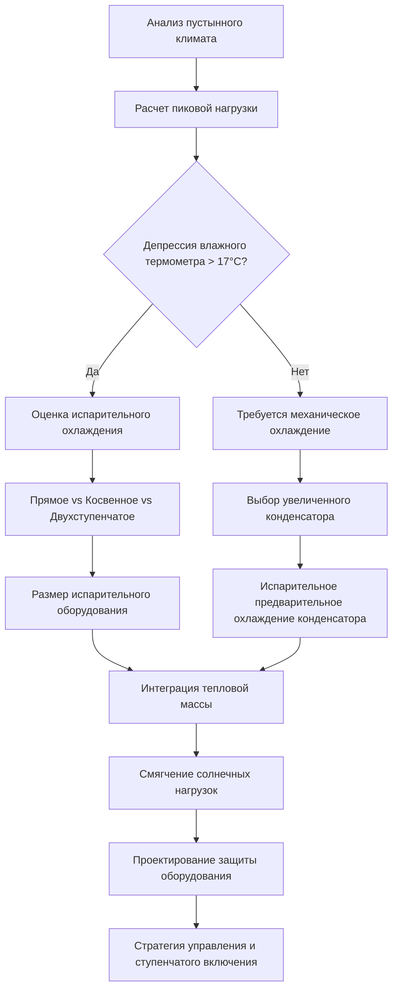

## Характеристики пустынного климата

Жаркие, засушливые пустынные климаты представляют экстремальные термические вызовы, характеризующиеся высокими температурами окружающей среды, превышающими 49°C, интенсивным солнечным излучением, приближающимся к 1050 Вт/м², экстремальными суточными колебаниями температуры в 22–28°C и исключительно низкой относительной влажностью ниже 20%. Эти условия требуют специализированных инженерных подходов HVAC, принципиально отличающихся от проектирования в климате с высокой влажностью.

Ключевое термическое преимущество пустынных климатов — низкое содержание влаги, обеспечивающее высокоэффективное испарительное охлаждение. Сухой воздух позволяет получить большую теплоощущаемую охлаждающую мощность при минимальной скрытой нагрузке, принципиально смещая приоритеты выбора системы.

## Психрометрические основы

Проектирование HVAC в пустынном климате использует большую депрессию по влажному термометру — разницу между температурами сухого и влажного термометров. При условиях проектирования 46°C сухого термометра и 20% относительной влажности, температура влажного термометра приближается к 25°C, создавая депрессию по влажному термометру в 21°C.

Теоретический потенциал испарительного охлаждения описывается формулой:

$$
Q_{evap} = \dot{m}_a \cdot (h_1 - h_2) = \dot{m}_a \cdot c_p \cdot (T_{db1} - T_{db2})
$$

Где эффективность насыщения при прямом испарительном охлаждении достигает 80–95%, обеспечивая температуру подачи воздуха на 2–4°C выше температуры влажного термометра без механического охлаждения.

## Основные стратегии охлаждения

### Прямое испарительное охлаждение

Системы прямого испарительного охлаждения (ПИО) распыляют воду непосредственно в воздушный поток, достигая адиабатического насыщения. Эффективность охлаждения составляет:

$$
\eta_{DEC} = \frac{T_{db,in} - T_{db,out}}{T_{db,in} - T_{wb,in}}
$$

Для системы с 85% эффективностью при 46°C сухого термометра / 25°C влажного термометра:

$$
T_{db,out} = 46°C - 0,85 \times (46°C - 25°C) = 28,1°C
$$

Это обеспечивает значительное охлаждение при расходе воды 11–19 л/час на кВт охлаждения, значительно меньше, чем энергетическая стоимость механического охлаждения.

### Косвенное испарительное охлаждение

Косвенное испарительное охлаждение (КИО) охлаждает подаваемый воздух без добавления влаги, пропуская его через теплообменник, где вторичный воздушный поток подвергается испарительному охлаждению. Это сохраняет меньшую влажность подаваемого воздуха при захвате 50–75% депрессии по влажному термометру.

Двухступенчатые системы, объединяющие КИО, за которым следует ПИО, достигают температур подачи на 1–2°C выше влажного термометра с общей эффективностью:

$$
\eta_{total} = \eta_{IEC} + \eta_{DEC}(1 - \eta_{IEC})
$$

При ηIEC = 0,65 и ηDEC = 0,85:

$$
\eta_{total} = 0,65 + 0,85(1 - 0,65) = 0,948
$$

### Оптимизация механического охлаждения

Когда требуется механическое охлаждение, работа конденсатора сталкивается с серьезными вызовами. Холодопроизводительность холодильной установки снижается в соответствии с:

$$
\dot{Q}_{evap} = \dot{m}_r \cdot (h_1 - h_4) \cdot \eta_{vol}
$$

При 49°C окружающей среды, температуры приближения конденсатора увеличиваются на 8–14°C выше проектного, снижая мощность на 15–25% и увеличивая потребление энергии на 20–30%.

## Сравнение типов систем

| Тип системы | Эффективность | Потребление энергии | Расход воды | Применение |
|-------------|---------------|-------------------|------------|-----------|
| Прямое испарительное | 80–95% депр. | 0,3–0,6 кВ/кВт | 11–19 л/ч на кВт | Промышленность, склады |
| Косвенное испарительное | 50–75% депр. | 0,6–1,1 кВ/кВт | 8–15 л/ч на кВт | Коммерческие помещения |
| Двухступенчатое испарительное | 90–100% депр. | 0,9–1,5 кВ/кВт | 15–23 л/ч на кВт | Прецизионные приложения |
| DX механическое | 100% мощность | 3,0–4,4 кВ/кВт | Минимум | ЦОД, больницы |
| Охлажденная вода | 100% мощность | 1,8–2,6 кВ/кВт | Градирня | Крупные коммерческие системы |

## Тепловая масса и пассивные стратегии

Пустынные климаты обеспечивают исключительное использование тепловой массы. Массивная конструкция с высокой термической диффузивностью задерживает пиковые охлаждающие нагрузки на 6–10 часов. Тепловая постоянная времени:

$$
\tau = \frac{\rho \cdot c \cdot L^2}{\alpha}
$$

Для бетона толщиной 30 см (ρ = 2242 кг/м³, c = 963 Дж/кг·°C, α = 0,013 м²/ч):

$$
\tau = \frac{2242 \times 963 \times 0,3^2}{0,013} = 14 688 \text{ часов}
$$

Эта массивная тепловая инерция сглаживает колебания внутренней температуры и позволяет радиационному охлаждению к ночному небу, где поверхности могут отводить 158–222 Вт/м² к чистому ночному небу при падении температур окружающей среды до 18–24°C.

## Управление солнечными нагрузками

Солнечный прирост тепла доминирует в охлаждающих нагрузках в пустынных климатах. Горизонтальные поверхности получают пиковое облучение 1011–1105 Вт/м², в то время как западные вертикальные поверхности испытывают 569–695 Вт/м² во время дневных часов.

Солнечный прирост тепла через остекление:

$$
q_{solar} = A \cdot SHGC \cdot I_t \cdot CLF
$$

Эффективные стратегии включают:
- Высокопроизводительное остекление с SHGC < 0,25
- Наружные затеняющие устройства, блокирующие прямое солнечное излучение
- Кровельные поверхности светлого цвета с коэффициентом солнечного отражения > 0,70
- Радиационные барьеры в чердачных пространствах, снижающие радиационный теплопередачу на 90–95%

## Требования по защите оборудования

Пустынные условия ускоряют деградацию оборудования через проникновение песка, воздействие УФ-излучения и термические циклы. Критические меры защиты:

**Фильтрация воздуха**: Фильтры MERV 8–11 с предфильтрами захватывают частицы песка размером 3–10 микрон. Перепад давления фильтра увеличивается на 50–100% быстрее, чем в климатах с влажностью, требуя частой замены.

**Защита конденсатора**: Испарительное предварительное охлаждение воздуха конденсатора снижает входящую температуру на 8–14°C, улучшая мощность и эффективность. Защитные покрытия на ребрах катушки предотвращают коррозию от накопления пыли.

**Термическое расширение**: Суточные колебания температуры в 22–28°C создают значительное термическое расширение. Трубопровод требует петель расширения или гибких соединителей каждые 24–30 м:

$$
\Delta L = L \cdot \alpha \cdot \Delta T
$$

Для 30-метрового медного трубопровода (α = 1,76 × 10⁻⁵ м/м·°C) с колебанием 28°C:

$$
\Delta L = 30 \times 1,76 \times 10^{-5} \times 28 = 0,015 \text{ м} = 15 \text{ мм}
$$

## Процесс проектирования

## Управление и операционные стратегии

Системы HVAC в пустынном климате получают преимущества от адаптивных стратегий управления, реагирующих на суточные температурные паттерны. Оптимальные подходы включают:

**Предварительное охлаждение**: Работа в ранние утренние часы (4–8 часов утра) при температуре окружающей среды 18–27°C сохраняет охлаждение в строительной массе. Охлаждающая мощность в этот период:

$$
q_{storage} = m \cdot c_p \cdot \Delta T = \rho \cdot V \cdot c_p \cdot (T_{initial} - T_{final})
$$

**Работа экономайзера**: Пустынные климаты позволяют работу экономайзера 60–75% годовых часов, когда энтальпия наружного воздуха падает ниже энтальпии возвратного воздуха в соответствии с требованиями ASHRAE 90.1.

**Последовательность ступенчатого включения**: Многоступенчатые системы переходят от испарительного к механическому охлаждению по мере увеличения нагрузок, минимизируя энергопотребление при соблюдении требований комфорта.

## Рассмотрение водных ресурсов

Дефицит воды в пустынных регионах требует тщательной оценки расхода воды при испарительном охлаждении в сравнении с энергопотреблением механического охлаждения. Анализ компромисса:

**Расход воды при испарительном охлаждении**: 11–19 л/ч на кВт охлаждения
**Энергия механического охлаждения**: 3,0–4,4 кВ/кВт, требующая 1,9–3,0 л/кВт·ч на типовых электростанциях

Чистое потребление воды при механическом охлаждении, включая производство электроэнергии, часто превышает прямое расходование при испарительном охлаждении, хотя региональная инфраструктура определяет оптимальный подход.

## Стандарты проектирования ASHRAE

ASHRAE Standard 90.1 предписывает требования к проектированию в пустынном климате, включая:
- Требования предписывающего метода для климатической зоны 2B (жарко-сухо)
- Минимальные стандарты эффективности оборудования в условиях высокой окружающей температуры
- Требования к экономайзеру для охлаждающих систем > 19,1 ГДж/ч
- Ограничения SHGC остекления 0,25 для вертикального остекления

Справочник ASHRAE—Приложения HVAC, глава 51 предоставляет комплексное руководство по приложениям испарительного охлаждения и ожидаемым характеристикам производительности во всех пустынных климатических зонах.

## Заключение

Проектирование HVAC для пустынного климата достигает оптимальной производительности через стратегическое применение принципов испарительного охлаждения, использование тепловой массы, агрессивное управление солнечными нагрузками и надежную защиту оборудования. Экстремальные сухие условия обеспечивают подходы к охлаждению, невозможные в климатах с высокой влажностью, с потреблением энергии на 70–90% ниже, чем при механическом охлаждении при надлежащем применении. Успех требует тщательного психрометрического анализа, осторожного выбора системы, соответствующей характеристикам нагрузки, и комплексной защиты от деградации, вызванной окружающей средой.
