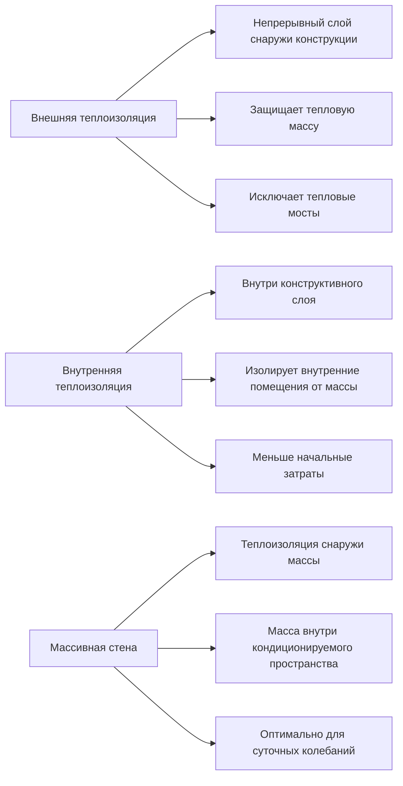

Проектирование ограждающей конструкции здания для жаркого, сухого экстремального пустынного климата требует комплексного понимания механизмов передачи тепла, управления солнечной радиацией и принципов теплового накопления. Правильно спроектированные ограждающие конструкции могут снизить холодильные нагрузки на 40-60% по сравнению с традиционным строительством в этих сложных условиях.

## Характеристики климата и последствия для ограждающей конструкции

Экстремальные пустынные климатические условия (климатическая зона ASHRAE 2B и части 3B) характеризуются высокими суточными колебаниями температуры (11-17 °C), интенсивной солнечной радиацией (до 1105 кДж/ч·м²), низкой влажностью (10-30% ОВ) и минимальной облачностью. Эти условия создают уникальные требования к проектированию ограждающей конструкции:

- **Высокий дневной теплопритток** от солнечной радиации и повышенных температур наружного воздуха (38-49 °C)
- **Потенциал ночного отвода тепла** в более прохладные периоды (16-27 °C)
- **Минимальные потребности в управлении влажностью** из-за низкой абсолютной влажности
- **Продлённые периоды охлаждения**, требующие круглогодичного снижения теплопритока

## Применение тепловой массы

Тепловая масса использует суточное колебание температуры для сдвига по времени и снижения пиковых холодильных нагрузок. Эффективность зависит от теплоёмкости, температуропроводности и площади поверхности.

Глубина теплопроникновения определяет оптимальную толщину стены:

$$
\delta = \sqrt{\frac{\alpha \cdot t}{\pi}}
$$

где δ — глубина теплопроникновения (м), α — температуропроводность (м²/ч), t — период (24 часа для суточных циклов).

Для бетона с α = 0,00233 м²/ч:

$$
\delta = \sqrt{\frac{0,00233 \times 24}{\pi}} = 0,134 \text{ м} \approx 13,4 \text{ см}
$$

### Конфигурация тепловой массы

| Материал | Плотность (кг/м³) | Удельная теплоёмкость (кДж/кг·°C) | Объёмная теплоёмкость (кДж/м³·°C) | Оптимальная толщина |
|----------|-------------------|------------------------------------|------------------------------------|---------------------|
| Бетон | 2400 | 0,84 | 2010 | 10-15 см |
| Саман | 1920 | 1,01 | 1940 | 20-30 см |
| Кирпич | 2080 | 0,80 | 1660 | 10-20 см |
| Утрамбованный грунт | 2000 | 0,92 | 1840 | 25-40 см |

Тепловая масса работает оптимально при:
- Расположении внутри теплоизоляции (конфигурация массивной стены)
- Контакте с кондиционируемым пространством для поглощения/отдачи тепла
- Сочетании с ночной вентиляцией
- Защите от прямого солнечного теплопритока внешним затенением или высокоотражающими поверхностями

## Солнечная отражающая способность и излучательность

Солнечная отражающая способность (SR) и термическая излучательность (ε) определяют температуру поверхности кровли и стен. Индекс солнечного отражения (SRI) сочетает оба свойства:

$$
\text{SRI} = 123,97 - 141,35 \times \text{TS} + 9,655 \times \text{TS}^2
$$

где TS — повышение установившейся температуры относительно окружающей среды, рассчитанное на основе SR и ε.

### Производительность холодных поверхностей

| Тип поверхности | Солнечная отражающая способность | Термическая излучательность | SRI | Повышение температуры поверхности (°C) |
|-----------------|----------------------------------|------------------------------|-----|----------------------------------------|
| Белое эластомерное покрытие | 0,85 | 0,90 | 110 | 3-4 |
| Холодное серое покрытие | 0,60 | 0,85 | 75 | 8-11 |
| Стандартный асфальт | 0,05 | 0,90 | 0 | 36-42 |
| Открытый бетон | 0,35 | 0,90 | 35 | 19-22 |
| Алюминиевое покрытие | 0,70 | 0,25 | 50 | 14-17 |

Стандарт ASHRAE 90.1 требует минимальных значений SRI 82 (маловысокие кровли) и 39 (крутые кровли) для климатических зон 1-3.

Снижение теплового потока через высокоотражающие поверхности:

$$
q = \frac{\alpha_s \cdot I \cdot A}{R_{total}}
$$

где α_s — солнечная поглощательность (1 - SR), I — падающая солнечная радиация (кДж/ч·м²), A — площадь поверхности (м²), R_total — полное тепловое сопротивление (м²·°C/Вт).

## Расположение и конфигурация теплоизоляции

Расположение теплоизоляции существенно влияет на производительность ограждающей конструкции в пустынном климате. Существует три основных конфигурации:

### Производительность конфигурации теплоизоляции

| Конфигурация | Влияние на холодильную нагрузку | Контроль тепловых мостов | Использование тепловой массы | Применение |
|--------------|--------------------------------|--------------------------|------------------------------|------------|
| Массивная стена | -25% до -35% | Отличный | Максимальное | Климат с высокими суточными колебаниями |
| Внешняя непрерывная | -20% до -30% | Отличный | Умеренное | Все пустынные применения |
| Полость + внешняя | -15% до -25% | Хороший | Ограниченное | Применения при реконструкции |
| Только полость | Базовое | Плохой | Минимальное | Не рекомендуется |

Требование теплового сопротивления для стен в климатической зоне 2B согласно ASHRAE 90.1 составляет 2,29 м²·°C/Вт (металлический каркас) или 2,29 + 1,32 м²·°C/Вт ci (массивные стены).

## Стратегии окон и остекления

Окна представляют основной путь теплопритока в пустынном климате. Полный солнечный теплопритток через остекление:

$$
q_{solar} = A \times \text{SHGC} \times I_{incident}
$$

где A — площадь остекления (м²), SHGC — коэффициент солнечного теплопритока, I_incident — падающая солнечная радиация (кДж/ч·м²).

### Варианты высокопроизводительного остекления

| Тип остекления | U-коэффициент (кДж/ч·м²·°C) | SHGC | Видимое пропускание | Соотношение ЛСП |
|---|---|---|---|---|
| Одинарное чистое | 5,91 | 0,76 | 0,81 | 1,07 |
| Двойное чистое | 2,73 | 0,62 | 0,70 | 1,13 |
| Двойное Low-E (низкое солнечное) | 1,65 | 0,23 | 0,41 | 1,78 |
| Тройное Low-E (низкое солнечное) | 1,14 | 0,19 | 0,37 | 1,95 |
| Спектрально селективное | 1,82 | 0,27 | 0,60 | 2,22 |

Соотношение светопропускания к солнечному теплопритоку (ЛСП) указывает на эффективность дневного света. Спектрально селективное остекление обеспечивает оптимальную производительность для пустынного климата, пропуская видимый свет и отражая ближнюю инфракрасную радиацию.

ASHRAE 90.1 требует максимального SHGC 0,25 и U-коэффициента 2,84 кДж/ч·м²·°C для жилых применений в климатической зоне 2B.

## Снижение тепловых мостов

Тепловые мосты создают локализованные пути теплопритока через ограждающую конструкцию. Эффективное R-значение с учётом тепловых мостов:

$$
R_{effective} = \frac{1}{\frac{FF}{R_{framing}} + \frac{(1-FF)}{R_{cavity}}}
$$

где FF — доля каркаса (обычно 0,15-0,25 для стоек/балок).

Для стены с полостью R-3,35 м²·°C/Вт и каркасом R-0,88 м²·°C/Вт при доле каркаса 20%:

$$
R_{effective} = \frac{1}{\frac{0,20}{0,88} + \frac{0,80}{3,35}} = \frac{1}{0,227 + 0,239} = 2,15 \text{ м}^2·°\text{C/Вт}
$$

Это представляет снижение на 36% от номинального значения R-3,35 полости.

Слои непрерывной теплоизоляции исключают тепловые мосты и обеспечивают:
- Однородное тепловое сопротивление по ограждающей конструкции
- Снижение риска конденсации на конструктивных элементах
- Более низкие U-коэффициенты по сравнению с теплоизоляцией только в полости
- Улучшенную герметичность воздуха в местах проникновения

## Системы воздушных барьеров

Инфильтрация воздуха в пустынном климате в основном вызывает явный теплопритток и проникновение взвешенных частиц (пыль). Явный теплопритток от инфильтрации:

$$
q_{infiltration} = 1,08 \times Q \times \Delta T \times 1,055
$$

где Q — скорость потока воздуха (CFM/м³/ч), ΔT — разность температур внутри-снаружи (°C).

Стандарт ASHRAE 90.1 требует, чтобы утечка воздуха ограждающей конструкции здания не превышала 2,27 CFM/м² (м³/ч·м²) при 75 Па для климатических зон 1-3.

Стратегии воздушного барьера для пустынного климата:
- **Самоклеящиеся мембраны** на внешней обшивке (лучше для сопротивления ветро-дождевым воздействиям)
- **Жидкоприменяемые барьеры** для сложной геометрии и проникновений
- **Герметизированный гипсокартон внутри** для маловлажных условий
- **Герметизированная бетонная кладка** с шпатлёвкой или покрытием

Воздушный барьер должен образовывать непрерывную плоскость с герметизированными переходами в основание, кровлю, окна и проникновения.

## Интеграция производительности ограждающей конструкции

Оптимальное проектирование ограждающей конструкции интегрирует множество стратегий для минимизации холодильных нагрузок при поддержании комфорта занятых лиц. Комбинированный эффект улучшений ограждающей конструкции:

$$
q_{total} = q_{conduction} + q_{solar} + q_{infiltration} + q_{thermal\_bridge}
$$

Каждый компонент требует специфической стратегии снижения:
- **Кондукция**: Адекватные уровни теплоизоляции и правильное расположение
- **Солнечный теплопритток**: Высокоотражающие поверхности и низкий SHGC остекления
- **Инфильтрация**: Непрерывный воздушный барьер с герметизированными проникновениями
- **Тепловые мосты**: Непрерывная теплоизоляция и передовые методы конструирования каркаса

При надлежащем проектировании ограждающие конструкции в экстремальном пустынном климате могут снизить годовое потребление энергии на охлаждение на 50-65% по сравнению с минимальным соответствию коду, одновременно позволяя устанавливать более компактное и эффективное оборудование HVAC с меньшими первоначальными и операционными затратами.
