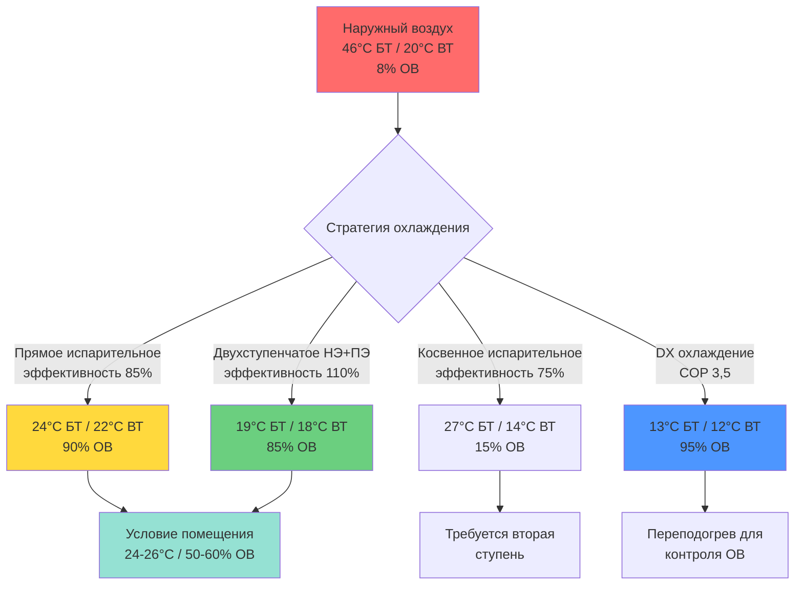
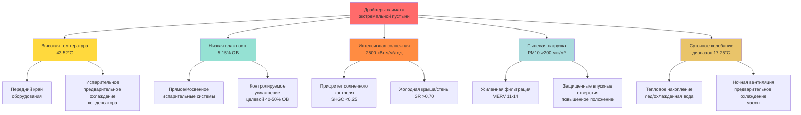

# Характеристики HVAC в экстремальном климате пустыни

Жаркие-сухие экстремальные пустынные климаты представляют верхнюю границу наземных тепловых условий для занятых конструкций, создавая исключительные требования к системам HVAC через устойчивые высокие температуры, экстремальную солнечную радиацию, массивные суточные колебания температуры и минимальную влажность атмосферы. Эти условия создают уникальные возможности для энергоэффективного охлаждения при одновременном вызове надежности оборудования и производительности обычных систем охлаждения.

## Тепловой режим и термодинамика крайних условий

Экстремальные пустынные регионы испытывают наиболее тяжелые условия высокой температуры в мире, с температурой окружающей среды, регулярно превышающей пределы работы оборудования и приближающейся к пороговым значениям физиологической толерантности человека.

### Распределение температур проектирования

Жаркие-сухие экстремальные пустыни охватывают наиболее термически требовательные теплые климатические условия:

| Параметр климата | Значения экстремальной пустыни | Климатическая зона ASHRAE | Влияние проектирования |
|------------------|---------------------|-------------------|--------------|
| Лето 0,4% БТ | 46-52°C | 1B, 2B | Пиковая мощность охлаждения |
| Лето 1,0% БТ | 44-49°C | 1B, 2B | Расширенный расчет продолжительности |
| Среднее суточное изменение | 17-25°C | Все | Возможность теплового накопления |
| Зима 99,6% БТ | -4 до 2°C | Большинство | Минимальная тепловая нагрузка |
| Среднегодовое БТ | 24-29°C | Переменная | Часы работы оборудования |

Справочник ASHRAE Fundamentals глава 14 определяет места включая Death Valley, CA (рекорд 56,7°C), Phoenix, AZ (проектирование 50°C) и регионы Саудовской Аравии, Ирана и Австралии как экстремальные жаркие-сухие климаты. Условие проектирования 0,4% представляет температуры, превышаемые только 35 часов в год, устанавливая основу для мощности охлаждающей системы.

### Физика суточного колебания температуры

Экстремальные пустынные суточные диапазоны превосходят любой другой обитаемый тип климата, обусловленные низким содержанием влаги в атмосфере и минимальным облачным покровом. Скорость изменения температуры следует простой тепловой балансировке первого порядка:

$$
\frac{dT}{dt} = \frac{1}{mc_p}\left(Q_{solar} - Q_{radiation} - Q_{convection}\right)
$$

Где:
- $m$ = тепловая масса здания (кг)
- $c_p$ = теплоемкость (Дж/кг·K)
- $Q_{solar}$ = поглощенная солнечная радиация (кВт)
- $Q_{radiation}$ = потери длинноволновой радиации в небо (кВт)
- $Q_{convection}$ = конвективная теплопередача (кВт)

**Пример: Типичный суточный цикл пустыни**

Phoenix, AZ летний день проектирования:
- 4:00 минимум: 26°C
- 14:00 максимум: 46°C
- Суточный диапазон: 20°C
- Время пик-пик: 10 часов
- Скорость охлаждения: 2,5°C/час (вечер)
- Скорость нагрева: 1,9°C/час (утро)

Это быстрое колебание температуры позволяет применять стратегии накопления тепловой энергии, смещая охлаждающую нагрузку с пиковых послеполуденных часов на эффективную ночную работу.

### Анализ продолжительности тепловой нагрузки

В отличие от влажных климатов, где пиковые условия сохраняются в течение длительных периодов, пики экстремальной пустыни происходят в течение сосредоточенных послеполуденных часов (1:00-5:00 PM), с существенным снижением нагрузки в вечерние и ночные периоды.

**Распределение часов охлаждающих градусов (база 24°C):**
- Всего в пиковый день: 390-500 часов охлаждающих градусов
- Пиковые часы (14:00-16:00): 22-28 часов охлаждающих градусов/час
- Вечерние часы (18:00-22:00): 5-14 часов охлаждающих градусов/час
- Ночные часы (22:00-6:00): 0-5 часов охлаждающих градусов/час

Этот профиль нагрузки позволяет применять механическое охлаждение неполного размера, дополненное тепловым накоплением или ночным предварительным охлаждением, сокращая установленную мощность оборудования на 30-40%.

## Психрометрические свойства и транспорт влаги

Психрометрия экстремальной пустыни определяет нижнюю границу содержания влаги в атмосфере для обитаемых регионов, создавая исключительную депрессию влажного термометра и практически нулевые потребности в испарительном охлаждении.

### Абсолютная влажность и точка росы

Содержание влаги в атмосфере в экстремальных пустынях остается на глобальных минимумах, с температурой точки росы постоянно на 28-44°C ниже значений сухого термометра:

| Условие на открытом воздухе | Сухой термометр | Влажный термометр | Точка росы | ОВ | Отношение влажности |
|------------------|----------|----------|----------|-----|----------------|
| Пик проектирования | 46°C | 20°C | 3°C | 8% | 0,0054 кг/кг |
| Типичное лето | 42°C | 21°C | 6°C | 12% | 0,0064 кг/кг |
| Период муссона | 38°C | 24°C | 13°C | 25% | 0,0098 кг/кг |
| Проектирование зимы | 20°C | 9°C | -2°C | 22% | 0,0038 кг/кг |

Для сравнения, условия проектирования Miami (35°C БТ / 26°C ВТ) содержат отношение влажности 0,0162 кг/кг—в 2,5 раза больше содержания влаги, чем воздух экстремальной пустыни.

### Механика депрессии влажного термометра

Разница между температурой сухого и влажного термометров представляет теоретический предел для эффективности испарительного охлаждения:

$$
\Delta T_{wb} = T_{db} - T_{wb} = \frac{\omega_{sat}(T_{wb}) - \omega}{\omega_{sat}(T_{wb}) - \omega_{sat}(T_{db})} \times (T_{db} - T_{sat})
$$

Условия экстремальной пустыни производят депрессии влажного термометра 22-28°C, позволяя прямым испарительным охладителям достичь температуры воздуха на выходе приблизительно равной или ниже температуры помещения без механического охлаждения.

**Расчет потенциала испарительного охлаждения:**

Для прямого испарительного охладителя при эффективности 85%:
- На открытом воздухе: 46°C БТ / 20°C ВТ
- Депрессия влажного термометра: 26°C
- Достижимое охлаждение: 0,85 × 26°C = 22°C
- Температура воздуха на выходе: 46°C - 22°C = 24°C
- Достигнутая температура помещения без компрессора

Это представляет теоретический коэффициент производительности (COP) 15-20 по сравнению с COP 3-4 для систем парокомпрессионного цикла.

### Коэффициент чувствительного тепла

Доля общей охлаждающей нагрузки, представленная чувствительным (температурным) в сравнении с скрытым (влажностным) компонентами, достигает максимальных значений в экстремальных пустынях:

$$
\text{SHR} = \frac{Q_{sensible}}{Q_{sensible} + Q_{latent}}
$$

**Типичное распределение нагрузки:**
- Чувствительная охлаждающая нагрузка: 96-98% от общего количества
- Скрытая охлаждающая нагрузка: 2-4% от общего количества
- SHR: 0,96-0,98

Этот высокий SHR исключает необходимость в оборудовании осушения и позволяет испарительным системам управлять влажностью помещения посредством контролируемого добавления влаги, целевая относительная влажность 40-50%.

## Интенсивность солнечной радиации и теплопоступления

Экстремальные пустынные места получают одни из самых высоких солнечных облученностей на планете, с минимальной атмосферной аттенюацией и близким к непрерывному ясному небу в течение сезона охлаждения.

### Величина солнечной облученности

Пиковая солнечная радиация достигает теоретических максимальных значений для заданной широты:

**Солнечная радиация дня проектирования (июль):**
- Глобальная горизонтальная облученность: 900-1100 Вт/м² 
- Прямая нормальная облученность: 950-1050 Вт/м² 
- Частота ясного неба: 85-95% часов дневного света
- Годовой горизонтальный итог: 2400-2700 кВт·ч/м²/год

ASHRAE модель ясного неба рассчитывает облученность прямого луча:

$$
E_b = A \cdot e^{-B/\sin(\beta)}
$$

Где:
- $A$ = видимая внеземная облученность при воздушной массе = 0
- $B$ = коэффициент атмосферного затухания (0,15-0,20 для ясной пустыни)
- $\beta$ = угол солнечной высоты

Для летнего солнцестояния экстремальной пустыни на широте 35°N в солнечный полдень:
- Солнечная высота: β = 78,5°
- Прямой луч: $E_b = 1050 \times e^{-0,17/\sin(78,5°)} = 910$ Вт/м²

### Солнечное теплопоступление через оболочку здания

Солнечная радиация доминирует в охлаждающей нагрузке в экстремальных пустынных конструкциях, представляя 45-60% от общего теплопоступления:

**Теплопоступление непрозрачной поверхности:**

Температура sol-air учитывает совместное солнечное поглощение и радиационный обмен:

$$
T_{sol-air} = T_{outdoor} + \frac{\alpha \cdot I_{total}}{h_o} - \frac{\epsilon \cdot \Delta R}{h_o}
$$

Где:
- $\alpha$ = солнечная поглощаемость (0,05-0,95 в зависимости от цвета поверхности)
- $I_{total}$ = общее падающее солнечное излучение (Вт/м²)
- $h_o$ = наружный комбинированный коэффициент пленки (14 Вт/м²·К)
- $\epsilon$ = длинноволновая излучательность (0,85-0,95 для большинства поверхностей)
- $\Delta R$ = разница между длинноволновой радиацией и температурой воздуха (обычно 4°C ночью, 0°C в полдень)

**Пример: темная кровельная поверхность**
- Температура окружающей среды: 46°C
- Горизонтальная солнечная радиация: 950 Вт/м²
- Поглощаемость поверхности: 0,90 (темная мембрана)
- Температура sol-air: $T_{sa} = 46 + \frac{0,90 \times 950}{14} = 107°C$
- Температура поверхности: 93-107°C измеренная

**Производительность холодной крыши:**
- Температура окружающей среды: 46°C
- Горизонтальная солнечная радиация: 950 Вт/м²
- Поглощаемость поверхности: 0,25 (холодное покрытие, SR = 0,75)
- Температура sol-air: $T_{sa} = 46 + \frac{0,25 \times 950}{14} = 63°C$
- Снижение температуры: 44°C
- Снижение теплового потока (R-5,3 крыша): $\Delta q = \frac{44}{5,3} = 8,3$ Вт/м²

Для 465 м² крыши: экономия = 3,86 кВт (постоянно)

### Теплопоступления через остекление

Теплопоступление через окно представляет одиночный самый крупный компонент нагрузки в экстремальных пустынных зданиях:

$$
Q_{window} = A \times \text{SHGC} \times \text{SHGF}
$$

Где:
- $A$ = площадь окна (м²)
- SHGC = коэффициент солнечного теплопоступления (безразмерный, 0,20-0,85)
- SHGF = коэффициент солнечного теплопоступления из таблиц ASHRAE (Вт/м²)

**Остекление, обращенное на запад, в 15:00 (наихудший случай):**
- Прямая солнечная радиация: 760 Вт/м²
- Рассеянная солнечная радиация: 110 Вт/м²
- Общий SHGF: 870 Вт/м²

**Производительность по типам остекления:**

| Система остекления | SHGC | Теплопоступление (9,3 м²) | Годовое охлаждение (кВт·ч) |
|----------------|------|---------------------|---------------------|
| Одинарное чистое | 0,86 | 7,7 кВт | 4,600 |
| Двойное чистое | 0,70 | 6,3 кВт | 3,770 |
| Двойное low-e | 0,40 | 3,6 кВт | 2,150 |
| Тройное low-e + тонировка | 0,23 | 2,1 кВт | 1,230 |
| Внешняя защита + low-e | 0,12 | 1,1 кВт | 640 |

Оптимальное остекление экстремальной пустыни: SHGC ≤ 0,25, коэффициент теплопередачи ≤ 1,7, видимая светопередача ≥ 0,40

## Загрузка атмосферного твердого вещества

Атмосфера экстремальной пустыни содержит повышенные концентрации минеральной пыли, песка и мелкодисперсного твердого вещества, ускоряя деградацию оборудования и требуя усиленных стратегий фильтрации.

### Характеристики твердого вещества

Состав пустынной пыли и распределение по размерам частиц влияют на проектирование системы HVAC:

**Типичное распределение пустынного твердого вещества:**
- PM10 (частицы ≤10 мкм): 100-400 мкг/м³ (умеренно) до >800 мкг/м³ (пыльные события)
- PM2,5 (частицы ≤2,5 мкм): 40-150 мкг/м³ (умеренно) до >350 мкг/м³ (пыльные события)
- Состав: кварц (30-50%), глинистые минералы (20-30%), карбонаты (10-20%), соли (5-10%)
- Твердость: 6-7 по шкале Мооса (кварц), сильно абразивный

Для сравнения, стандарты качества воздуха EPA целевой PM2,5 < 35 мкг/м³ (среднее за 24 часа). Базовое условие пустыни превышает это в 2-4 раза, с пыльными событиями достигая превышения в 10-15 раз.

### Требования фильтрации и перепад давления

Усиленная фильтрация защищает качество воздуха в помещении и долговечность оборудования, но увеличивает энергию вентилятора:

**Характеристики производительности фильтра:**

| Рейтинг фильтра | Эффективность (0,3-1,0 мкм) | Начальный перепад (2,5 м/с) | Перепад загруженности | Удержание пыли | Интервал замены |
|--------------|------------------------|---------------------|----------|--------------|---------------------|
| MERV 8 | 20-40% | 62 Па | 125 Па | 280 г | 1-2 месяца |
| MERV 11 | 65-80% | 100 Па | 200 Па | 380 г | 2-3 месяца |
| MERV 13 | 85-95% | 137 Па | 275 Па | 450 г | 3-4 месяца |
| MERV 16 | >95% | 200 Па | 400 Па | 500 г | 4-6 месяцев |

Рекомендуемая стратегия: предварительный фильтр MERV 8-11 (частая замена) + финальный фильтр MERV 13-14 (продленный срок службы).

Штраф энергии вентилятора для усиленной фильтрации:

$$
P_{fan} = \frac{Q \times \Delta P}{6356 \times \eta_{fan}}
$$

Где $Q$ = воздушный поток (м³/ч), $\Delta P$ = перепад давления (Па), $\eta_{fan}$ = эффективность вентилятора (0,55-0,75).

Для системы 4,719 м³/ч:
- MERV 8: P = 0,61 кВт
- MERV 13: P = 1,34 кВт
- Дополнительная энергия: 0,73 кВт × 5000 ч/год = 3,650 кВт·ч/год

### Влияние загрязнения оборудования

Накопление твердых частиц на поверхностях теплопередачи деградирует производительность:

**Загрязнение конденсаторной катушки:**
- Чистая теплопередача катушки: U = 142 Вт/м²·К
- Пыльная катушка (0,5 мм слой): U = 102-125 Вт/м²·К
- Деградация производительности: потеря мощности 20-30%, потеря эффективности 15-25%
- Частота чистки: ежемесячно в сезон пыли

**Загрязнение испарительного носителя:**
- Перепад давления чистого носителя: 60-100 Па
- Перепад давления загрязненного минералами носителя: 160-320 Па
- Потеря эффективности: 10-20% после 2-3 сезонов
- Обработка воды критична: TDS < 500 ppm, циклы продувки 3-5

## Конвективная и радиационная теплопередача

Условия экстремальной пустыни усиливают оба механизма конвективной и радиационной теплопередачи через большие температурные дифференциалы и атмосферную прозрачность.

### Коэффициенты наружной конвекции

Комбинированная конвективная и радиационная теплопередача на наружных поверхностях:

$$
h_{combined} = h_{convection} + h_{radiation}
$$

**Конвективный компонент:**

$$
h_c = a + b \cdot V_{wind}
$$

Типичные коэффициенты для наружных поверхностей:
- Низкий ветер (<2,2 м/с): $h_c$ = 17-28 Вт/м²·К
- Умеренный ветер (2,2-6,7 м/с): $h_c$ = 28-45 Вт/м²·К
- Высокий ветер (>6,7 м/с): $h_c$ = 45-68 Вт/м²·К

**Радиационный компонент:**

Длинноволновое излучение в небо и окружающие области:

$$
h_r = \epsilon \cdot \sigma \cdot (T_{surface}^2 + T_{sky}^2)(T_{surface} + T_{sky})
$$

Для типичной поверхности при 66°C, излучающей в эффективную температуру неба 21°C:
- $h_r$ ≈ 8,5 Вт/м²·К (дневное время)
- $h_r$ ≈ 11,4 Вт/м²·К (ночное время, ясное небо)

### Ночное радиационное охлаждение

Ясное пустынное небо позволяет эффективное радиационное охлаждение в открытый космос:

**Эффективная температура неба:**

$$
T_{sky} = T_{air} \times \epsilon_{sky}^{0.25}
$$

Где излучательность неба для ясных сухих условий: $\epsilon_{sky}$ = 0,7-0,8

Пример расчета:
- Температура воздуха: 24°C (297 К)
- Излучательность неба: 0,75
- Эффективная температура неба: $297 \times 0,75^{0,25} = 267$ К = -6°C

Потенциал радиационного охлаждения из горизонтальной поверхности:

$$
q_{rad} = \epsilon_{surface} \cdot \sigma \cdot A \cdot (T_{surface}^4 - T_{sky}^4)
$$

Для крыши при 29°C (302 К) и неба при -6°C (267 К):
- $q_{rad} = 0,90 \times 5,67 \times (3,02^4 - 2,67^4) = 206$ Вт/м²

Это позволяет применять стратегии пассивного охлаждения и улучшает производительность воздушных конденсаторов при ночной работе.

## Эффекты высоты и атмосферного давления

Многие экстремальные пустынные регионы существуют на умеренных возвышениях (300-1500 м), снижая плотность атмосферы и влияя на производительность оборудования.

### Коррекция плотности воздуха

Барометрическое давление уменьшается с высотой согласно:

$$
P = P_0 \cdot e^{-\frac{g \cdot h}{R \cdot T}}
$$

**Влияние высоты на свойства воздуха:**

| Высота | Давление | Плотность | Коэффициент коррекции | Множитель мощности |
|----------|---------|---------|------------------|-------------------|
| Уровень моря | 101,3 кПа | 1,225 кг/м³ | 1,00 | 1,00 |
| 760 м | 93,1 кПа | 1,127 кг/м³ | 0,92 | 0,95 |
| 1520 м | 84,0 кПа | 1,007 кг/м³ | 0,83 | 0,90 |
| 2130 м | 77,8 кПа | 0,945 кг/м³ | 0,77 | 0,87 |

**Корректировка производительности оборудования:**
- Мощность испарительного охладителя: снизить 2-3% на каждые 300 м высоты
- Нагрузка двигателя вентилятора: увеличить 8-10% на каждые 300 м для постоянного объемного потока
- Мощность воздушного конденсатора: снизить 4-5% на каждые 300 м высоты
- Оборудование сгорания: снизить на 4% на каждые 300 м, требуется корректировка избытка воздуха

## Последствия для проектирования системы HVAC

Уникальная комбинация экстремальной температуры, низкой влажности, интенсивной солнечной радиации и пылевой нагрузки создает специфические приоритеты проектирования:

**Критические параметры проектирования:**

1. **Расчет мощности охлаждения:** условия проектирования 1,0% (менее экстремальные, чем 0,4%, чтобы избежать передачи), максимум 10-15% коэффициент безопасности

2. **Смягчение солнечного теплопоступления:** управление солнечным излучением оболочки представляет наивысший ROI
   - SHGC окна ≤ 0,25 все ориентации
   - SR холодной крыши ≥ 0,70, термическая излучательность ≥ 0,85
   - Устройства внешней защиты (горизонтальная проекция ≥ 0,5 × высота окна)

3. **Интеграция испарительного охлаждения:** двухступенчатые системы достигают экономии 60-80% энергии по сравнению с DX-только
   - Косвенная ступень: эффективность влажного термометра 70-80%
   - Прямая ступень: эффективность влажного термометра 85-95%
   - Комбинированная система COP: 12-18 при условиях проектирования

4. **Защита оборудования:** компоненты, рассчитанные на пустыню, продлевают срок службы на 40-60%
   - Покрытия катушек: фенолические, e-coat или heresite
   - Расстояние между ребрами конденсаторной катушки: ≥10 FPI для удобства чистки
   - Герметичные корпусы: NEMA 3R минимум для наружного оборудования

5. **Экономика теплового накопления:** взимание платежей за максимум требует хранилища в большинстве утилит экстремальной пустыни
   - Хранилище льда: 0,264 т·ч охлаждения/л при 90% эффективности заряда
   - Охлажденная вода: скорость разрядки 0,6-0,8°C/час типично
   - Окупаемость: 3-7 лет в зависимости от структуры тарифов коммунального предприятия

**Типичная величина нагрузки (930 м² офисное здание):**
- Солнечная крыша + кондукция: 43,8 кВт (45%)
- Стена солнечная + кондукция: 24,9 кВт (25%)
- Окно солнечное + кондукция: 19,9 кВт (20%)
- Внутренние теплопоступления: 6,6 кВт (7%)
- Вентиляция чувствительная: 2,5 кВт (2,5%)
- Вентиляция скрытая: 0,4 кВт (0,5%)
- **Общая охлаждающая нагрузка: 98,1 кВт** = 106 Вт/м²

С гибридной системой двухступенчатого испарительного + DX:
- Испарительное обрабатывает 60-70% нагрузки (58,9 кВт)
- DX обрабатывает оставшиеся 30-40% (39,2 кВт)
- Установленная мощность DX сокращена на 60% по сравнению с DX-только системой

## Заключение

Жаркие-сухие экстремальные пустынные климаты определяют верхнюю тепловую границу для работы обычной системы HVAC, характеризующейся устойчивыми температурами окружающей среды 46-52°C, интенсивной солнечной радиацией в общей сумме 2400-2700 кВт·ч/м²/год, депрессиями влажного термометра 22-28°C и суточными колебаниями температуры 17-25°C. Эти условия создают охлаждающие нагрузки, доминируемые солнечным теплопоступлением (65-75% от общего) с минимальным скрытым компонентом (SHR > 0,96), позволяя высокоэффективные системы испарительного охлаждения, достигающие значений COP 12-18. Загрузка атмосферного твердого вещества 100-400 мкг/м³ PM10 требует усиленной фильтрации (MERV 11-14) и ежемесячной чистки конденсаторной катушки. Массивное суточное колебание температуры позволяет применять стратегии теплового накопления и ночного предварительного охлаждения, сокращая установленную механическую мощность охлаждения на 30-40%. Оборудование должно надежно работать при окружающей среде 46°C и выше, при управлении ускоренной тепловой деградацией, УФ экспозицией и накоплением пыли. Понимание этих фундаментальных характеристик—экстремальная величина и длительность температуры, психрометрические свойства, позволяющие испарительные технологии, доминирование солнечной радиации, закономерности загрязнения твердым веществом и суточные возможности—обеспечивает инженерную основу для проектирования систем HVAC, которые эффективно поддерживают комфорт жильцов при достижении экономии энергии 40-70% по сравнению с обычными системами парокомпрессионного цикла в самых термически требовательных обитаемых окружающих средах мира.
