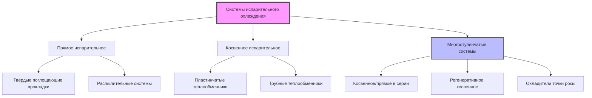
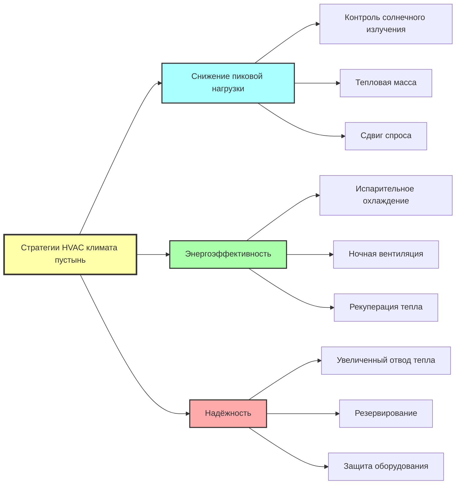

## Характеристики климата

Жаркий сухой климат экстремальных пустынь создаёт уникальные задачи проектирования HVAC-систем, характеризуемые высокими дневными температурами, низкой влажностью, интенсивным солнечным излучением и значительными суточными колебаниями температуры. Эти регионы, классифицируемые как BWh (жаркая пустыня) в системе Köppen-Geiger, включают такие местоположения, как Финикс (Аризона), Дубай (ОАЭ) и Эр-Рияд (Саудовская Аравия).

### Ключевые психрометрические параметры

Типичные условия проектирования летом для климата экстремальных пустынь:

| Параметр | Диапазон | Влияние на проектирование HVAC |
|-----------|----------|-------------------------------|
| Температура по сухому термометру | 40–50°C | Экстремальные нагрузки охлаждения |
| Температура по влажному термометру | 18–24°C | Высокий потенциал испарительного охлаждения |
| Относительная влажность | 5–20% | Минимальная скрытая нагрузка |
| Суточное колебание температуры | 15–25°C | Возможности ночного охлаждения |
| Солнечное излучение | 800–1000 Вт/м² | Доминирующая составляющая нагрузки |

Большая депрессия влажного термометра (разница между сухим и влажным термометрами) создаёт исключительные условия для применения технологий испарительного охлаждения.

## Стратегии снижения солнечных нагрузок

Солнечное излучение доминирует в нагрузке охлаждения в климате пустынь, часто составляя 40–60% от общего теплоприхода. Эффективный контроль солнечного излучения снижает как пиковый спрос, так и энергопотребление.

### Прирост солнечного тепла через ограждающие конструкции

Прирост тепла через остекление рассчитывается по формуле:

$$Q_{solar} = A \times SHGC \times I_{solar} \times CLF$$

Где:
- $Q_{solar}$ = прирост солнечного тепла (Вт)
- $A$ = площадь окна (м²)
- $SHGC$ = коэффициент пропускания солнечного тепла (безразмерный)
- $I_{solar}$ = падающее солнечное излучение (Вт/м²)
- $CLF$ = коэффициент нагрузки охлаждения, учитывающий тепловую массу

### Рекомендуемые меры по контролю солнечного излучения

**Спецификации остекления для климата пустынь:**

- Максимальное значение SHGC: 0,25 для восточной/западной ориентаций, 0,30 для северной/южной
- Минимальная видимая светопропускаемость: 0,40 для сохранения дневного света
- Низкоэмиссионные покрытия с излучательной способностью < 0,10 на поверхности #3
- Внешние устройства затенения с коэффициентом выступа > 0,6 для западных фасадов

**Стратегии для крыши и стен:**

- Светоотражающие покрытия крыш с коэффициентом солнечного отражения > 0,70 и тепловой излучательной способностью > 0,85
- Светлые наружные отделки (альбедо > 0,60)
- Вентилируемые полости крыш для отвода тепла до теплопроводности
- Минимальная изоляция: RSI-5,3 для крыш, RSI-3,3 для стен согласно ASHRAE 90.1 Climate Zone 1

## Применение испарительного охлаждения

Термодинамическое преимущество испарительного охлаждения в климате пустынь вытекает из психрометрического соотношения между обменом явного и скрытого тепла.

### Процесс прямого испарительного охлаждения

Адиабатический процесс насыщения следует линии влажного термометра на психрометрической диаграмме:

$$T_{out} = T_{in} - \eta_{EC} \times (T_{db} - T_{wb})$$

Где:
- $T_{out}$ = температура приточного воздуха (°C)
- $T_{in}$ = температура входящего воздуха по сухому термометру (°C)
- $\eta_{EC}$ = эффективность испарительного охладителя (0,70–0,90)
- $T_{db}$ = температура по сухому термометру (°C)
- $T_{wb}$ = температура по влажному термометру (°C)

**Пример расчёта:**
Для внешних условий 45°C БТ / 20°C ВТ с эффективностью 85%:

$$T_{out} = 45 - 0,85 \times (45 - 20) = 23,75°C$$

Это демонстрирует возможность достижения комфортных температур приточного воздуха исключительно за счёт испарительного охлаждения.

### Типы систем испарительного охлаждения

**Сравнение производительности:**

| Тип системы | Диапазон эффективности | Добавление влажности | Коэффициент капитальных затрат |
|-------------|----------------------|-------------------|------------------------------|
| Прямое испарительное | 70–90% | Высокое | 1,0x |
| Косвенное испарительное | 50–75% | Минимальное в помещение | 1,8–2,5x |
| Косвенное/прямое в две ступени | 100–120% | Среднее | 2,2–3,0x |
| Охладители точки росы | 100–130% | Низкое | 2,5–3,5x |

Многоступенчатые системы могут достичь температур приточного воздуха ниже температуры входящего влажного термометра через несколько стадий теплообмена.

## Использование тепловой массы

Большое суточное колебание температуры в климате пустынь позволяет использовать стратегии с тепловой массой для сдвига и снижения пиковых нагрузок охлаждения.

### Тепловое хранение в строительной массе

Теплоёмкость строительной массы:

$$Q_{stored} = m \times c_p \times \Delta T = \rho \times V \times c_p \times \Delta T$$

Где:
- $Q_{stored}$ = накопленная тепловая энергия (Дж)
- $m$ = масса материала (кг)
- $c_p$ = удельная теплоёмкость (Дж/кг·К)
- $\Delta T$ = колебание температуры (К)
- $\rho$ = плотность (кг/м³)
- $V$ = объём (м³)

**Эффективные материалы с тепловой массой:**

- Бетон: $\rho$ = 2400 кг/м³, $c_p$ = 880 Дж/кг·К
- Глинобитный кирпич/утрамбованная земля: $\rho$ = 1800 кг/м³, $c_p$ = 840 Дж/кг·К
- Кирпичная кладка: $\rho$ = 1920 кг/м³, $c_p$ = 920 Дж/кг·К

### Ночное вентиляционное охлаждение

Излучение на ночное небо и конвективное охлаждение могут отвести тепловую энергию, накопленную в массе в течение дня. Потенциал охлаждения выражается как:

$$Q_{night} = \dot{m}_{air} \times c_{p,air} \times (T_{indoor} - T_{outdoor}) \times t$$

Эффективное ночное охлаждение требует:
- Минимальный расход воздуха: 10–15 воздухообменов в час
- Наружная температура ниже 25°C
- Продолжительность: минимум 6–8 часов
- Площадь поверхности с открытой тепловой массой > 2× площадь пола

## Соображения при выборе оборудования

Условия работы в пустынях значительно влияют на производительность и долговечность оборудования HVAC.

### Влияние температуры конденсации

Воздухоохлаждаемое холодильное оборудование работает при повышенных температурах конденсации, когда окружающая среда превышает условия проектирования. Соотношение COP Карно:

$$COP_{Carnot} = \frac{T_{evap}}{T_{cond} - T_{evap}}$$

Увеличение температуры конденсации на 10°C обычно снижает действительный COP системы на 15–20% и производительность на 8–12%.

**Спецификация оборудования для работы в пустынях:**

| Компонент | Стандартный номинал | Требование номинала для пустынь |
|-----------|-------------------|-------------------------------|
| Воздухоохлаждаемые конденсаторы | 35°C (95°F) | 46–52°C (115–125°F) |
| Испарительные конденсаторы | 35°C ВТ | Минимум 27°C ВТ |
| Градирни | 27°C ВТ | 24°C ВТ или ниже |
| Двигатели вентиляторов подачи | 40°C окружающей среды | 50–55°C окружающей среды |

### Требования к фильтрации

Проникновение пустынной пыли требует усиленной фильтрации:

- Предварительные фильтры: минимум MERV 8 для защиты катушек
- Финальные фильтры: MERV 13–14 для занятых помещений
- Частота замены фильтра: в 2–4 раза чаще, чем в умеренном климате
- Расположение воздухозаборника: минимум 3 м над уровнем земли, вдали от источников пыли

## Рекомендации по архитектуре системы

**Оптимальные типы систем по размеру здания:**

**Малые здания (<2 000 м²):**
- Прямое/косвенное испарительное охлаждение с минимальным механическим резервом
- Рулонные крышные блоки с испарительным предохлаждением
- Оборудование, рассчитанное на работу в пустынях

**Средние здания (2 000–10 000 м²):**
- Системы охлаждённой воды с испарительно-охлаждаемыми холодильными агрегатами
- Выделенные системы наружного воздуха с косвенным испарительным охлаждением
- Накопление тепловой энергии для срезания пиковых нагрузок

**Крупные здания (>10 000 м²):**
- Центральные установки охлаждённой воды с гибридными градирнями
- Системы с переменным расходом хладагента для периметровых зон
- Районное охлаждение, где доступно

## Баланс водосбережения

Несмотря на исключительную эффективность испарительного охлаждения в климате пустынь, потребление воды требует тщательного анализа. Потребление воды на единицу охлаждения (тонна-час):

- Прямое испарительное охлаждение: 15–25 л/т·ч
- Испарительные конденсаторы: 8–12 л/т·ч
- Градирни: 10–18 л/т·ч
- Воздухоохлаждаемое оборудование: 0 л/т·ч

Выбор между испарительным и воздухоохлаждаемым оборудованием должен учитывать экономию электроэнергии в сравнении с наличием и стоимостью воды. Во многих пустынных регионах экономия электроэнергии оправдывает потребление воды, особенно если очищенные сточные воды или солоноватая вода могут питать системы охлаждения.

## Ссылки

ASHRAE Handbook—Fundamentals, Chapter 14: Climatic Design Information
ASHRAE Standard 90.1: Energy Standard for Buildings Except Low-Rise Residential Buildings
ASHRAE Standard 169: Climatic Data for Building Design Standards
