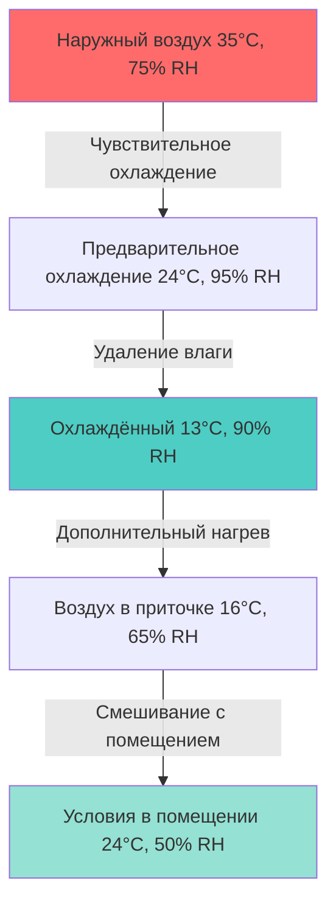
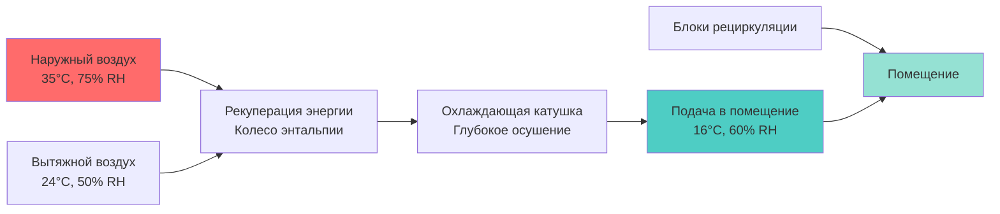

## Характеристики климата и последствия для проектирования

Влажные субтропические климаты (классификация Köppen Cfa/Cwa, климатические зоны ASHRAE 2A и 3A) представляют уникальные проблемы для HVAC, характеризующиеся высокой температурой окружающего воздуха в сочетании с повышенным уровнем влажности. Эти регионы испытывают условия летнего проектирования, как правило, в диапазоне 32–38°C сухого термометра с совпадающими температурами по влажному термометру 24–28°C, что приводит к относительной влажности, часто превышающей 70%.

Фундаментальная проблема вытекает из преобладания скрытых охлаждающих нагрузок над чувствительными нагрузками. Коэффициент чувствительной теплоты (SHR) в этих климатах часто падает ниже 0,70, что требует систем HVAC, специально предназначенных для удаления влаги, а не только для снижения температуры.

$$\text{SHR} = \frac{Q_s}{Q_s + Q_l} = \frac{\text{Sensible Load}}{\text{Total Load}}$$

Где:
- $Q_s$ = чувствительная охлаждающая нагрузка (кВт)
- $Q_l$ = скрытая охлаждающая нагрузка (кВт)

## Психрометрический анализ

Понимание психрометрических соотношений в условиях влажного субтропического климата имеет решающее значение для надлежащего проектирования системы. Разница в энтальпии между внешними условиями и желаемыми внутренними условиями определяет общее требование к охлаждению:

$$\Delta h = c_p \Delta T + h_{fg} \Delta W$$

Где:
- $c_p$ = удельная теплоёмкость воздуха (1,006 кДж/кг·К)
- $\Delta T$ = разница температур (К)
- $h_{fg}$ = скрытая теплота парообразования (2501 кДж/кг при 0°C)
- $\Delta W$ = разница коэффициента влажности (кг влаги/кг сухого воздуха)

## Стратегии осушения

### Системы прямого расширения

Обычные DX-системы в условиях влажного субтропического климата требуют тщательного проектирования контура хладагента для достижения достаточного осушения. Точка росы устройства (ADP) должна быть ниже требуемой точки росы помещения, чтобы обеспечить надлежащее удаление влаги.

| Конфигурация системы | Диапазон ADP (°C) | Типичный SHR | Применение |
|---------------------|-------------------|--------------|-----------|
| Стандартный DX катушка | 10–13 | 0,70–0,75 | Лёгкое коммерческое |
| Усиленное осушение | 7–10 | 0,60–0,70 | Высокие скрытые нагрузки |
| Специализированное осушение | 4–7 | 0,40–0,60 | Критичный контроль влажности |
| Осушающее средство-вспомогательное | Переменный | 0,30–0,50 | Музеи, архивы |

### Переохлаждение и повторный нагрев

Когда коэффициент чувствительной теплоты падает ниже возможностей оборудования, становится необходимо переохлаждение с последующим повторным нагревом. Температура подаваемого воздуха от охлаждающей катушки должна быть достаточно низкой для удаления влаги, а затем повторно нагрета, чтобы избежать переохлаждения помещения:

$$Q_{reheat} = \dot{m} \cdot c_p \cdot (T_{supply} - T_{coil})$$

Этот подход, хотя и эффективен для контроля влажности, вводит энергетический штраф, который можно минимизировать посредством:
- Рекуперации теплоты от конденсатора
- Расположения серийных катушек
- Систем переменного хладагента
- Перепускной клапан горячего газа (с учётом эффективности)

## Управление нагрузкой вентиляции

Требования к вентиляции согласно стандарту ASHRAE 62.1 накладывают значительные нагрузки в условиях влажного субтропического климата. Энтальпия наружного воздуха существенно превышает внутренние условия, что делает системы выделенного наружного воздуха (DOAS) особенно выгодными.

### Преимущества конфигурации DOAS

Системы DOAS отделяют вентиляцию от кондиционирования помещения, позволяя каждой системе работать в оптимальных условиях. Поток наружного воздуха получает глубокое осушение, в то время как устройства рециркуляции справляются только с чувствительными нагрузками.

## Профилактика конденсации

Температуры поверхности ниже точки росы внутреннего воздуха вызывают конденсацию, приводящую к развитию плесени, деградации материалов и проблемам с качеством воздуха в помещении. Критические поверхности, требующие тепловой анализа, включают:

**Минимальные значения изоляции R (зона ASHRAE 2A/3A):**

| Компонент | R-значение (м²·К/Вт) | Назначение |
|-----------|----------------------|-----------|
| Трубопроводы охлаждённой воды | 0,53–0,70 | Профилактика конденсации |
| Линии всасывания хладагента | 0,35–0,53 | Энергосбережение + конденсация |
| Воздуховоды (приточный воздух) | 0,70–1,06 | Конденсация + тепловая эффективность |
| Холодные поверхности в помещении | 0,18–0,35 | Контроль поверхностной влаги |

Расчёт критической температуры поверхности выполняется следующим образом:

$$T_{surface,min} = T_{dewpoint,indoor} + \Delta T_{safety}$$

Где $\Delta T_{safety}$ обычно составляет 2–3°C для учёта тепловых мостиков и несовершенства установки.

## Критерии выбора оборудования

### Производительность охлаждающего оборудования

Оборудование должно поддерживать эффективность во всём диапазоне эксплуатации, характерном для условий влажного субтропического климата. Интегральный коэффициент энергоэффективности (IEER) обеспечивает лучшее указание производительности, чем номинальный EER:

$$\text{IEER} = 0.02A + 0.617B + 0.238C + 0.125D$$

Где A, B, C, D представляют эффективность при 100%, 75%, 50% и 25% мощности соответственно.

**Рекомендуемые минимальные значения эффективности (ASHRAE 90.1):**

| Тип оборудования | Диапазон мощности | Минимальный IEER/IPLV |
|------------------|-------------------|----------------------|
| Воздухоохлаждаемые чиллеры | <528 кВт | 12,20 |
| Воздухоохлаждаемые чиллеры | ≥528 кВт | 13,00 |
| Водоохлаждаемые чиллеры | Все мощности | 16,00–18,00 |
| Кровельные блочные устройства | <19 кВт | 12,00 IEER |
| Кровельные блочные устройства | 19–40 кВт | 11,60 IEER |

### Стратегии управления

Контроль влажности требует независимого управления от температуры. Контроллеры с двойным уставом поддерживают оба параметра в приемлемых диапазонах:

1. **Контроль точки росы** — наиболее точен для критичных приложений
2. **Контроль относительной влажности** — распространён для комфортного кондиционирования
3. **Контроль энтальпии** — энергоэффективное управление экономайзером

## Тепловая масса и ограждающие конструкции здания

Тепловая масса здания взаимодействует по-другому в условиях влажного субтропического климата по сравнению с засушливыми регионами. Постоянные уровни влажности снижают эффективность ночной вентиляции и повышают важность непрерывного осушения.

Расположение паронепроницаемого слоя следует принципу "тёплой стороны" — расположено на внешней стороне в климатах с преобладающим охлаждением, чтобы предотвратить миграцию внутренней влаги в полости здания, где она может конденсироваться на более холодных поверхностях.

Требования к паропроницаемости узла стены:
- Внутренняя отделка: >10 перм (паропроницаемая)
- Наружный паронепроницаемый слой: 0,1–1,0 перм (полупроницаемый)
- Дренажный слой и вентиляционные зазоры: необходимы для выхода влаги

## Системы рекуперации энергии

Вентиляторы рекуперации энергии (ERV) обеспечивают существенные преимущества путём передачи как чувствительной, так и скрытой энергии между потоками вытяжного и наружного воздуха. Эффективность во влажных условиях:

$$\epsilon_{latent} = \frac{W_{outdoor} - W_{supply}}{W_{outdoor} - W_{exhaust}}$$

Высокопроизводительные колёса энтальпии достигают 70–85% скрытой эффективности, восстанавливая значительную охлаждающую энергию, которая иначе была бы потеряна. В условиях влажного субтропического климата годовое энергосбережение от систем ERV обычно составляет 30–45% от охлаждающих нагрузок вентиляции.

## Заключение

Проектирование HVAC для влажного субтропического климата требует приоритизации управления скрытой нагрузкой посредством надлежащих стратегий осушения, профилактики конденсации и рекуперации энергии. Выбор системы должен учитывать преобладающее требование к удалению влаги, а не просто контроль температуры, с тщательным вниманием к производительности при частичной нагрузке, где системы работают наиболее часто.
