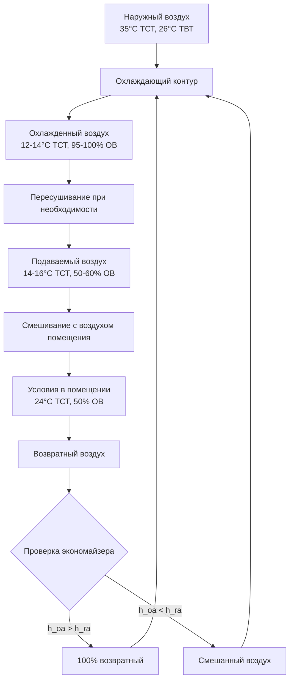

## Определение климата и географическое распределение

Климат влажных субтропиков (классификация Кеппена Cfa/Cwa) характеризует регионы между примерно 25° и 40° широты на восточной стороне континентов. Эти зоны включают юго-восточную часть США, южный Китай, южную Японию, северную Аргентину, прибрежную Австралию и части южной Европы. Климат характеризуется жарким, влажным летом со значительными осадками и мягкой или прохладной зимой.

Классификация зон климата ASHRAE обозначает эти регионы в основном как зона 2A (жаркая-влажная) и части зоны 3A (теплая-влажная), определяемые градусо-днями охлаждения, превышающими градусо-дни отопления, и специфическими критериями влажности.

## Термодинамические свойства

### Характеристики температуры

Регионы с влажным субтропическим климатом демонстрируют значительные сезонные колебания температуры с летними проектными температурами по сухому термометру, обычно находящимися в диапазоне 32–38°C и зимними проектными температурами от –5 до 5°C в зависимости от широты и близости к материку.

Средняя сопутствующая температура по влажному термометру в периоды пикового охлаждения находится в диапазоне 24–27°C, создавая значительные проблемы для механических систем охлаждения. Это небольшое различие по влажному термометру (температура по сухому термометру минус температура по влажному термометру) 5–8°C указывает на ограниченный потенциал испарительного охлаждения.

### Психрометрический анализ

Фундаментальное соотношение, управляющее взаимодействиями воздуха и влаги, следует:

$$h = c_p T + W(h_{fg} + c_{pw}T)$$

Где:
- h = энтальпия влажного воздуха (кДж/кг)
- c_p = удельная теплоемкость сухого воздуха (1,006 кДж/кг·K)
- T = температура по сухому термометру (°C)
- W = коэффициент влажности (кг воды/кг сухого воздуха)
- h_fg = скрытая теплота парообразования при 0°C (2501 кДж/кг)
- c_pw = удельная теплоемкость водяного пара (1,86 кДж/кг·K)

При летних пиковых условиях наружный воздух обычно имеет коэффициент влажности между 0,018 и 0,024 кг/кг, что соответствует значениям относительной влажности 55–75% при 35°C. Это высокое абсолютное содержание влаги обусловливает значительные скрытые охлаждающие нагрузки.

## Характеристики влажностной нагрузки

### Распределение скрытой и явной нагрузки

Климат влажных субтропиков предъявляет исключительные требования к скрытому охлаждению. Коэффициент явного тепла (SHR) при летних проектных условиях обычно находится в диапазоне 0,65–0,75, значительно ниже, чем в засушливых климатах, где SHR превышает 0,90.

$$SHR = \frac{Q_{sensible}}{Q_{sensible} + Q_{latent}}$$

Скрытая охлаждающая нагрузка происходит как от вентиляционного воздуха, так и от инфильтрации:

$$Q_{latent} = \dot{m}_{air} \times h_{fg} \times (W_{outside} - W_{inside})$$

Для скорости вентиляции 1000 CFM (0,472 м³/с) с наружными условиями 35°C, 70% ОВ (W = 0,0246 кг/кг) и внутренней уставкой 24°C, 50% ОВ (W = 0,0093 кг/кг):

$$Q_{latent} = 0,567 \text{ кг/с} \times 2501 \text{ кДж/кг} \times (0,0246 - 0,0093) = 21,7 \text{ кВт}$$

Это представляет примерно 35–40% от общей охлаждающей нагрузки для типичных коммерческих зданий.

## Сезонные колебания

| Сезон | Проектная ТСТ (°C) | Проектная ТВТ (°C) | Коэффициент влажности (кг/кг) | Основной вызов HVAC |
|--------|----------------|----------------|------------------------|------------------------|
| Лето | 33–36 | 24–27 | 0,020–0,024 | Скрытая нагрузка, осушение |
| Зима | –2 до 8 | –3 до 5 | 0,002–0,005 | Увлажнение, отопление |
| Весна | 20–28 | 15–21 | 0,010–0,016 | Переменные нагрузки, управление |
| Осень | 18–26 | 13–19 | 0,008–0,014 | Оптимизация экономайзера |

## Осадки и атмосферная влажность

Годовое количество осадков в зонах влажных субтропиков составляет от 900 до 2000 мм, распределяясь относительно равномерно в течение года с небольшими летними пиками. Это постоянное наличие влаги поддерживает повышенные уровни абсолютной влажности в течение всего года.

Температура точки росы, рассчитанная из:

$$T_{dp} = T - \frac{(100 - RH)}{5}$$ (приближение для типичных диапазонов)

Более точно через соотношения давления пара:

$$e_s(T_{dp}) = RH \times e_s(T_{db})/100$$

Летние точки росы часто превышают 21°C, приближаясь к условиям комфорта в помещении или превышая их. Это явление исключает потенциал явного охлаждения от наружного воздуха и требует непрерывного осушения.

## Требования к психрометрическим процессам

## Взаимодействия с ограждающей конструкцией здания

Разница давления пара между наружными и внутренними условиями летом создает внутреннюю диффузию влаги через ограждающие конструкции здания. Поток влаги следует:

$$g = M \times \Delta p_{vapor}$$

Где M представляет проницаемость сборки ограждающей конструкции (нг/Па·с·м²). Правильное размещение паробарьера с внешней стороны (низкая проницаемость обшивки) предотвращает конденсацию в полостях стен во время кондиционирования.

## Сравнение проектных решений

| Параметр климата | Влажные субтропики | Жарко-сухой (сравнение) | Коэффициент влияния |
|-------------------|-------------------|----------------------|---------------|
| Пиковая скрытая нагрузка | 8–12 Вт/м² | 2–4 Вт/м² | 3–4× выше |
| Подход охлаждающего контура | Глубокий (до 12°C) | Умеренный (до 16°C) | Требуется более низкий SHR |
| Часы осушения | 2500–3500 ч/год | 500–1000 ч/год | Непрерывная работа |
| Эффективность экономайзера | Ограниченная (энтальпия) | Отличная (сухой термометр) | Снижено свободное охлаждение |
| Контроль пара в ограждении | Критичен (наружу летом) | Минимальное значение | Противоположно холодным климатам |

## Размеры систем кондиционирования воздуха

Стандарт ASHRAE 90.1 требует, чтобы системы удовлетворяли как явную, так и скрытую нагрузки независимо. Общая охлаждающая способность определяется из:

$$Q_{total} = Q_{sensible} + Q_{latent} = 1,08 \times CFM \times \Delta T + 0,68 \times CFM \times \Delta W$$

Где CFM представляет объемную скорость потока в стандартных условиях.

Для приложений с влажным субтропическим климатом оборудование должно обеспечивать достаточное удаление влаги при частичной нагрузке. Системы с одной ступенью, включающиеся/выключающиеся циклически, демонстрируют плохой контроль влажности, так как поверхность контура высыхает между циклами. Системы с переменной мощностью или оборудование с выделенным осушением поддерживают более низкие коэффициенты влажности в помещении при сниженных явных нагрузках.

## Рассмотрение теплового комфорта

Модель прогнозируемого среднего голоса (PMV) показывает повышенную чувствительность к влажности при повышенных температурах. Поддержание 50% относительной влажности при 24°C обеспечивает комфорт, эквивалентный 40% при 22°C, позволяя немного повысить температуру с улучшенным осушением для снижения энергопотребления.

Связь между операционной температурой и допустимой влажностью для теплового комфорта следует зонам комфорта стандарта ASHRAE 55, которые ограничивают верхний предел влажности до 0,012 кг/кг (примерно 65% ОВ при 24°C) для предотвращения роста плесени и конденсации на поверхности.

## Критерии выбора системы

Характеристики климата диктуют специфические атрибуты системы:

1. **Проектирование охлаждающего контура**: минимум 8–10 рядов, низкая скорость на входе (200–250 CFM (м³/ч)) для повышенного удаления влаги
2. **Температура подаваемого воздуха**: 12–14°C для достижения адекватного осушения
3. **Возможность пересушивания**: требуется для контроля влажности при частичной нагрузке
4. **Управление экономайзером**: на основе энтальпии, а не сухого термометра для предотвращения увеличения скрытых нагрузок
5. **Обработка наружного воздуха**: выделенные системы наружного воздуха (DOAS) с отдельной обработкой скрытого/явного тепла

Понимание этих фундаментальных характеристик климата позволяет правильный выбор системы, определение размеров и разработку стратегии управления для приложений с влажным субтропическим климатом.
