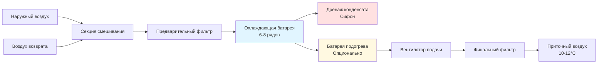
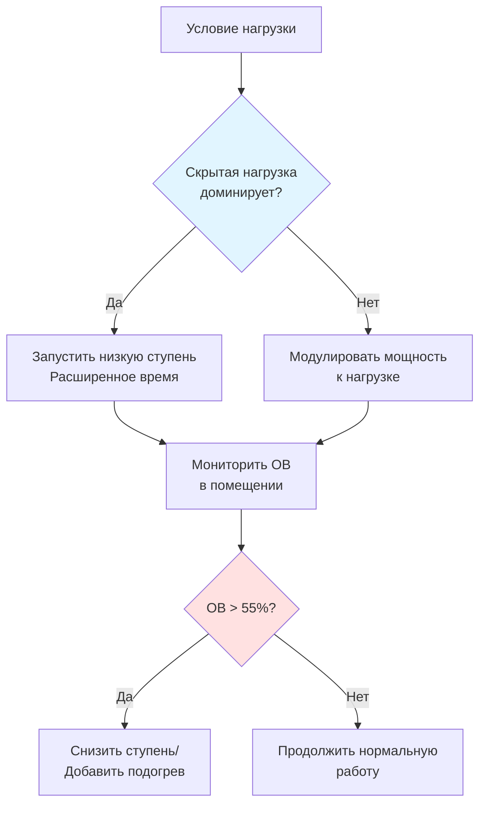

## Обзор

Влажные субтропические климаты (зоны климата ASHRAE 2A и 3A) представляют уникальные проблемы при выборе оборудования из-за устойчиво высокого уровня влажности, повышенных температур наружного воздуха (условия проектирования 24-32°C) и скрытых нагрузок охлаждения, которые часто превышают 30% от общей мощности охлаждения. Выбор оборудования должен приоритизировать способность к удалению влаги при поддержании приемлемого уровня влажности в помещении ниже 60% ОВ.

## Требования осушения

### Анализ коэффициента чувствительного тепла

Коэффициент чувствительного тепла (SHR) определяет долю мощности охлаждения, направленную на снижение температуры в сравнении с удалением влаги:

$$SHR = \frac{Q_{sensible}}{Q_{sensible} + Q_{latent}}$$

Приложения во влажном субтропическом климате обычно требуют значений SHR в диапазоне 0,65-0,75, значительно ниже, чем диапазон 0,80-0,85, распространенный в сухих климатах. Оборудование должно быть выбрано или модифицировано для эффективной работы при этих пониженных коэффициентах.

### Мощность скрытого охлаждения

Расчет скрытой нагрузки охлаждения учитывает удаление влаги:

$$Q_{latent} = \dot{m} \times h_{fg} \times (W_{outdoor} - W_{indoor})$$

Где:
- $\dot{m}$ = массовый расход воздуха (кг/с)
- $h_{fg}$ = скрытая теплота парообразования (2501 кДж/кг при 0°C)
- $W$ = коэффициент влажности (кг влаги/кг сухого воздуха)

Для типичных условий (32°C, 70% ОВ наружу на 24°C, 50% ОВ внутри), изменение коэффициента влажности составляет примерно 0,012 кг/кг, требуя существенной мощности осушения.

## Критерии выбора оборудования

### Конструкция охлаждающего батарейного блока

| Параметр | Стандартный климат | Влажный субтропический | Влияние |
|-----------|-----------------|-------------------|---------|
| Ряды батареи | 3-4 | 6-8 | Улучшенное удаление влаги |
| Шаг оребрения | 10-12 ШОР | 8-10 ШОР | Снижение перекрытия конденсата |
| Скорость воздуха на выходе | 500-550 м/мин | 400-450 м/мин | Нижний уровень уноса, лучше осушение |
| Температура выхода воздуха | 12-14°C | 10-12°C | Глубокое осушение |
| Точка росы аппарата | 10-12°C | 8-10°C | Максимальное извлечение влаги |

Более глубокие батареи с увеличенной площадью поверхности обеспечивают продленное время контакта между воздухом и холодными поверхностями, максимизируя конденсацию. Более низкие скорости выхода предотвращают повторное вовлечение влаги в воздушный поток.

### Конфигурации приточно-вытяжных установок

Критические особенности для приложений во влажном субтропическом климате:

1. **Глубокие сифонные дренажи** - Минимум 150 мм водяного столба для предотвращения инфильтрации воздуха
2. **Дренажные поддоны с уклоном** - Минимум 2% уклон для предотвращения застоя воды
3. **Антимикробные покрытия** - Снижение биологического роста на влажных поверхностях
4. **Двойная теплоизоляция стенок** - Предотвращение конденсации снаружи холодных поверхностей
5. **Люки доступа** - Облегчение регулярной чистки батареи в условиях высокой влажности

## Стратегии осушения

### Подход переохлаждения и доогрева

Этот метод переохлаждает воздух ниже желаемой температуры для достижения глубокого осушения, затем повторно нагревает для поддержания комфорта:

$$Q_{reheat} = \dot{m}_{air} \times c_p \times (T_{supply} - T_{coil\\_leaving})$$

Энергетический штраф: обычно 10-15% от общей энергии охлаждения, но необходим для контроля влажности, когда наружная точка росы превышает 20°C.

### Системы выделенного наружного воздуха (DOAS)

Установки DOAS отделяют обработку вентиляционного воздуха от кондиционирования помещения, позволяя оптимизировать выбор оборудования:

| Компонент | Конфигурация | Преимущество |
|-----------|--------------|---------|
| Блок наружного воздуха | Глубокая охлаждающая батарея (8-10 рядов) | Обрабатывает высокую скрытую нагрузку вентиляции |
| Блок помещения | Стандартная батарея (4-6 рядов) | Эффективно управляет чувствительной нагрузкой |
| Рекуперация энергии | Энтальпийное колесо (эффективность 70-80%) | Снижает нагрузку кондиционирования наружного воздуха |
| Температура подачи | Точка росы 10-13°C | Нейтральное или легкое осушение |

Рекуперация энергии критична во влажном субтропическом климате, где кондиционирование наружного воздуха представляет 40-50% от общей нагрузки охлаждения по сравнению с 25-30% в умеренных климатах.

### Адсорбционное осушение

Для приложений, требующих влажности в помещении ниже 45% ОВ (музеи, фармацевтика), твердые или жидкие адсорбционные системы обеспечивают дополнительное удаление влаги:

$$\eta_{desiccant} = \frac{W_{in} - W_{out}}{W_{in} - W_{saturation}}$$

Эффективность адсорбента обычно варьируется от 60-75% в зависимости от доступности энергии регенерации. Интеграция с источниками отходящего тепла (конденсационные котлы, солнечные тепловые системы) улучшает экономику эксплуатации.

## Соображения по расчету оборудования

### Производительность при частичной нагрузке

Оборудование работает при частичной нагрузке 95% от годового времени работы во влажном субтропическом климате. Деградация производительности происходит потому, что:

1. **Сокращенное время работы** - Меньше удаления влаги за цикл
2. **Повышенная частота циклирования** - Батарея никогда не достигает стационарного влажного состояния
3. **Повышенный SHR** - Система удаляет меньше влаги при пониженной мощности

### Оборудование с несколькими ступенями или переменной скоростью

Компрессоры с переменной скоростью, работающие на 40-60% мощности, обеспечивают превосходное осушение по сравнению с одноступенчатыми блоками с циклированием включения/выключения. Продленное время контакта батареи при пониженном расходе воздуха максимизирует удаление влаги.

## Управление конденсатом

### Конструкция системы дренажа

Производство конденсата во влажном субтропическом климате достигает 4-6 литров в час на киловатт мощности охлаждения. Правильный дренаж предотвращает:

- Микробный рост в застойной воде
- Переполнение дренажного поддона и повреждение водой
- Инфильтрацию воздуха через неадекватные сифоны
- Деградацию производительности системы

Расчет глубины сифона:

$$H_{trap} = \frac{P_{fan}}{ρ \times g} + Safety\\_Factor$$

Где статическое давление ($P_{fan}$) в системах отрицательного давления требует глубины сифона, превышающей максимальное статическое давление вентилятора на 50% коэффициента безопасности.

### Доступ для обслуживания

Высокое производство конденсата ускоряет биологическое загрязнение. Конструкция должна включать:

- Съемные секции батареи для механической чистки
- Промывные или заменяемые дренажные поддоны (нержавеющая сталь предпочтительна)
- Порты УФ-C для бактерицидной обработки
- Инспекционные порты в местах расположения дренажных сифонов

## Выбор материалов

| Компонент | Стандартный материал | Альтернатива для влажного субтропического климата | Причина |
|-----------|------------------|-------------------------------|---------|
| Дренажные поддоны | Оцинкованная сталь | Нержавеющая сталь 304 | Устойчивость к коррозии |
| Оребрение батареи | Алюминий | Покрытый алюминий или медь | Продленный срок службы |
| Теплоизоляция воздуховодов | Стекловолокно | Закрытопористый пенопласт | Предотвращение поглощения влаги |
| Крепежные элементы | Углеродистая сталь | Нержавеющая сталь | Предотвращение ржавчины и пятен |
| Шкаф | Окрашенная сталь | Порошковое покрытие или нержавеющая сталь | Устойчивость к влажности |

Гальваническая коррозия ускоряется в условиях высокой влажности. Контакт разнородных металлов должен включать диэлектрическую изоляцию.

## Стратегии управления

Эффективный контроль влажности во влажном субтропическом климате требует:

1. **Контроль точки росы** - Уставка точки росы приточного воздуха (обычно 10-12°C) вместо температуры сухого термометра
2. **Вентиляция по требованию** - Датчики CO₂ сокращают наружный воздух при низкой загруженности
3. **Оптимизация подогрева** - Минимизация энергетического штрафа через рекуперацию тепла или использование тепла конденсатора
4. **Блокировочные элементы управления** - Предотвращение одновременного отопления и охлаждения в периметральных зонах

Управление точкой росы приточного воздуха поддерживает согласованное осушение независимо от колебаний чувствительной нагрузки помещения, критично для стабильного уровня влажности в помещении.

## Заключение

Выбор оборудования для влажного субтропического климата требует принципиальных отклонений от стандартной практики. Глубокие охлаждающие батареи, пониженные скорости выхода, улучшенное управление конденсатом и продвинутые стратегии управления решают преобладающие скрытые нагрузки охлаждения. Правильная спецификация оборудования снижает уровень влажности в помещении, улучшает комфорт занимающихся, предотвращает повреждение зданий, связанные с влажностью, и поддерживает приемлемое качество воздуха в помещении в сложных условиях окружающей среды.
