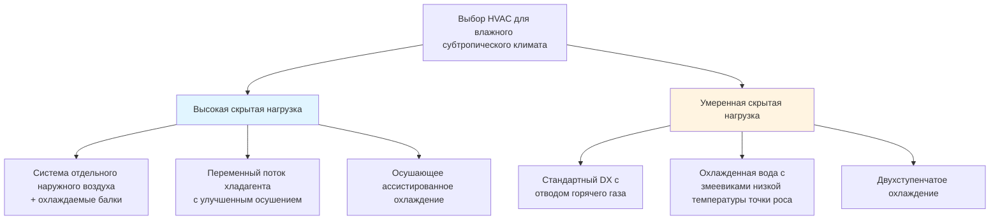
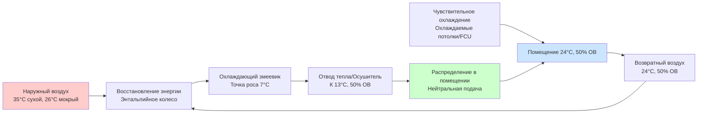

## Характеристики климата

Влажные субтропические климаты (Köppen Cfa/Cwa) представляют уникальные задачи HVAC, характеризующиеся:

- **Высокие нагрузки охлаждения**: 1389–2500 градусо-суток охлаждения (база 18°C)
- **Постоянная влажность**: 60–80% относительная влажность круглый год
- **Скрытые доминирующие нагрузки**: Коэффициенты скрытого тепла 0,30–0,45
- **Мягкие зимы**: 278–1111 градусо-суток отопления (база 18°C)
- **Продленные сезоны охлаждения**: 6–9 месяцев ежегодно

Психрометрическая задача сосредоточена на одновременном контроле температуры и влажности, где удаление влаги часто определяет выбор оборудования в большей степени, чем чувствительная охлаждающая мощность.

## Требования к осушению

### Анализ скрытой охлаждающей нагрузки

Общая охлаждающая нагрузка разделяется на чувствительную и скрытую составляющие:

$$Q_{total} = Q_{sensible} + Q_{latent}$$

где скрытая нагрузка от инфильтрации влаги и внутренних источников составляет:

$$Q_{latent} = \dot{m}_{air} \times h_{fg} \times (W_{outdoor} - W_{indoor})$$

**Переменные:**
- $\dot{m}_{air}$ = массовый расход наружного воздуха (кг/ч)
- $h_{fg}$ = скрытая теплота испарения (≈2450 кДж/кг при стандартных условиях)
- $W$ = коэффициент влажности (кг воды/кг сухого воздуха)

Коэффициент чувствительного тепла (SHR) количественно определяет отношение:

$$SHR = \frac{Q_{sensible}}{Q_{total}}$$

Приложения в влажных субтропических климатах типично требуют SHR 0,55–0,70, в сравнении с 0,75–0,85 в засушливых климатах.

### Выбор температуры точки роса аппарата

Эффективное осушение требует охлаждающих температур змеевика ниже желаемой точки роса помещения:

| Условие в помещении | Требуемая температура точки роса | Скорость на входе в змеевик |
|-----------------|--------------|-------------------|
| 24°C, 50% ОВ | 9–11°C | 1,5–2,0 м/с |
| 24°C, 45% ОВ | 7–9°C | 1,3–1,8 м/с |
| 22°C, 50% ОВ | 7–9°C | 1,5–2,0 м/с |

Более низкие скорости на входе улучшают удаление влаги путем увеличения времени контакта со змеевиком и приближения к условиям точки роса.

## Стратегии выбора системы

### Сравнение охлаждающего оборудования

### Характеристики производительности оборудования

| Тип системы | Скрытая мощность | Энергоэффективность | Контроль влажности | Капитальные затраты |
|-------------|----------------|-------------------|------------------|--------------|
| Стандартный DX | Умеренная | EER 11–13 | Удовлетворительный | Низкие |
| Улучшенный DX + отвод тепла | Высокая | EER 9–11 | Отличный | Средние |
| Охлажденная вода (6°C) | Умеренная | 0,6–0,8 кВт/кВт охл. | Хороший | Средние |
| DOAS + излучающая | Очень высокая | Комбинированная 0,5–0,7 кВт/кВт охл. | Отличный | Высокие |
| Гибридный осушитель | Очень высокая | COP 3–5 | Отличный | Высокие |

## Проектирование психрометрического процесса

### Процесс охлаждения и осушения

Процесс кондиционирования воздуха следует психрометрическому пути от наружных условий к условиям подачи:

$$\dot{Q}_{coil} = \dot{m}_{air} \times (h_{entering} - h_{leaving})$$

Для эффективного удаления влаги выходящее воздушное состояние должно попадать на кривую насыщения при температуре точки роса аппарата, затем смешиваться с воздухом байпаса:

$$h_{supply} = BF \times h_{entering} + (1-BF) \times h_{ADP}$$

где коэффициент байпаса (BF) типично варьируется 0,05–0,20 для приложений осушения.

### Отвод тепла для контроля влажности

Достижение низкой влажности без переохлаждения требует чувствительного добавления тепла:

$$\dot{Q}_{reheat} = \dot{m}_{air} \times c_p \times (T_{supply} - T_{coil,leaving})$$

**Сравнение методов отвода тепла:**

| Метод | Источник энергии | Эффективность | Точность управления | Применение |
|--------|--------------|-----------|-------------------|-------------|
| Электрическое сопротивление | Электроэнергия | 100% преобразования | Отличная | Небольшие зоны |
| Отвод горячего газа | Отходящее тепло компрессора | "Бесплатное" восстановление | Хорошая | DX системы |
| Восстановление тепла | Тепло конденсатора | COP 3–6 | Хорошая | Большие системы |
| Тепловой насос отвода | Цикл охлаждения | COP 2–4 | Отличная | Круглогодичная |

## Вентиляция и управление наружным воздухом

### Соответствие ASHRAE 62.1 во влажных климатах

Наружный воздух вносит значительную скрытую нагрузку:

$$\dot{Q}_{latent,OA} = 0,0208 \times \text{CFM} \times (W_{outdoor} - W_{indoor})$$

При проектных условиях (35°C сухой термометр, 26°C мокрый термометр), наружный воздух при 9,4 л/с на одного человека вносит примерно:
- **Чувствительная нагрузка**: 67 Вт на человека
- **Скрытая нагрузка**: 53 Вт на человека
- **Общая нагрузка**: 120 Вт на человека

### Системы отдельного наружного воздуха

DOAS отделяет вентиляцию от кондиционирования помещения:

Эффективность восстановления энергии во влажных климатах:

$$\epsilon_{latent} = \frac{W_{outdoor} - W_{supply,ERV}}{W_{outdoor} - W_{return}}$$

Целевая скрытая эффективность: 60–75% для энтальпийных колес, снижение нагрузки влаги наружного воздуха на 40–60%.

## Стратегии контроля влажности

### Рассмотрения оболочки здания

Перепад давления пара управляет миграцией влаги:

$$\Delta p_v = p_{v,outdoor} - p_{v,indoor}$$

При летних проектных условиях (наружный 35°C/75% ОВ, внутренний 24°C/50% ОВ):
- Давление пара наружного воздуха: 5,1 кПа
- Давление пара внутреннего воздуха: 2,96 кПа
- Движущая сила: 2,14 кПа (внутримигрирующая)

**Требования к оболочке:**
- Непрерывная воздушная преграда: <1,3 м³/(ч·м²) при 75 Па
- Паровой барьер: II или III класс на внешней стороне (теплая сторона)
- Дренажная плоскость: Минимум 10 мм полости за облицовкой
- Влагозащита фундамента: Полиэтилен толщиной минимум 150 мкм

### Удаление конденсата

Осушение производит значительный конденсат:

$$\dot{m}_{condensate} = \dot{m}_{air} \times (W_{entering} - W_{leaving})$$

**Требования проектирования:**
- Глубина сифона: Минимум 2× отрицательное давление на поддоне слива (см водяного столба)
- Уклон: Минимум 1,3 см на 30 см на горизонтальных участках
- Мощность: Размер для пиковой скорости удаления скрытой нагрузки
- Обработка: Биоцидные таблетки или УФ-обработка для стоячей воды

## Стратегии управления влажностью

### Управление с двойной уставкой

Независимый контроль температуры и влажности требует:

1. **Контур управления температурой**: Модулирует охлаждающую мощность через скорость компрессора или положение клапана
2. **Контур управления влажностью**: Активирует дополнительное осушение или отвод тепла
3. **Логика приоритета**: Осушение переопределяет уставку температуры на 1–1,5°C при необходимости

### Управление по точке роса в сравнении с управлением по относительной влажности

Управление на основе точки роса обеспечивает превосходное управление влажностью:

$$T_{dewpoint} = T_{drybulb} - \frac{100-RH}{5}$$ (приближение для диапазона 16–27°C)

**Сравнение управления:**

| Параметр | Управление по ОВ | Управление по точке роса |
|-----------|-----------|------------------|
| Точность | ±5% ОВ | ±1°C точка роса |
| Дрейф температуры | Значительный | Минимальный |
| Чувствительность расположения датчика | Высокая | Умеренная |
| Предотвращение плесени | Хорошее | Отличное |
| Энергоэффективность | Умеренная | Лучше |

Поддерживайте точку роса ниже 13°C для предотвращения роста плесени и поверхностной конденсации на тепловых мостиках.

## Меры энергоэффективности

### Работа с переменной мощностью

Производительность осушения при частичной нагрузке улучшается с:

$$COP_{part-load} = COP_{rated} \times (0.85 + 0.15 \times PLR)$$

где PLR = коэффициент частичной нагрузки (0,3–1,0)

**Стратегии оборудования:**
- Компрессоры с переменной скоростью: Поддерживают температуры змеевика при условиях низкой нагрузки
- Ступенчатое охлаждение: Последовательная работа компрессора расширяет время работы
- Блокировка экономайзера: Предотвращает введение влажного наружного воздуха при энтальпии превышающей возвратный воздух

### Циклы переохлаждения-отвода тепла

Улучшенное осушение с восстановлением отходящего тепла:

1. Переохладите воздух до 7–9°C точки роса (глубокое осушение)
2. Восстановите тепло конденсатора для отвода к температуре подачи
3. Достигните 40–45% ОВ при минимальном энергетическом штрафе

Улучшение COP: 15–25% в сравнении с электрическим отводом при обеспечении превосходного контроля влажности.

## Ссылки

- ASHRAE Standard 62.1: Вентиляция для приемлемого качества внутреннего воздуха
- ASHRAE Standard 55: Тепловые условия окружающей среды для комфорта человека
- ASHRAE Handbook—Fundamentals, Chapter 1: Психрометрия
- ASHRAE Handbook—HVAC Applications, Chapter 28: Контроль влажности
- ASHRAE Design Guide: Системы отдельного наружного воздуха
