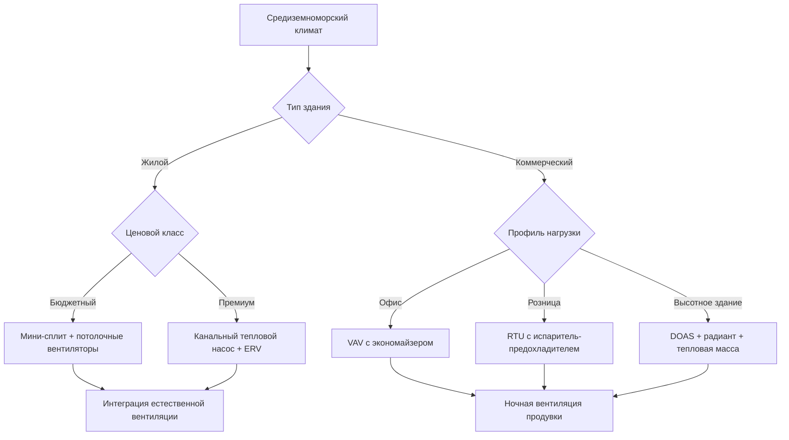

# Проектирование HVAC для средиземноморского климата

Средиземноморские климаты (классификация Köppen Csa/Csb) предоставляют уникальные возможности для энергоэффективного проектирования HVAC благодаря их характерным жарким сухим летам и мягким влажным зимам. Благоприятные суточные колебания температур и продолжительные переходные сезоны позволяют применять гибридные стратегии систем, которые минимизируют механическое охлаждение и нагрев, одновременно максимизируя естественную вентиляцию и пассивное кондиционирование.

## Характеристики климата и проектные последствия

**Профиль температур:**
- Летний сухой термометр: 29-38°C
- Зимний сухой термометр: 7-16°C
- Суточное колебание: 14-19°C типичное
- Градусодни отопления (база 18°C): 830-1385 в год
- Градусодни охлаждения (база 18°C): 445-835 в год

**Условия влажности:**
- Летняя относительная влажность: 20-40% типичное
- Зимняя относительная влажность: 50-70% типичное
- Депрессия мокрого термометра: 11-17°C летом

Существенное различие между сухим и мокрым термометром в сезон охлаждения обеспечивает исключительные условия для испарительного охлаждения и работы экономайзера. Мягкие зимние температуры минимизируют требования к отоплению, часто снижая нагрузки отопления до 20-30% от сопоставимых смешанно-влажных климатов.

## Сезонный анализ нагрузок

### Летние нагрузки охлаждения

Нагрузки охлаждения доминируют в проектировании HVAC для средиземноморского климата, обычно представляя 70-80% годового потребления энергии. Пиковые нагрузки возникают в послеобеденные часы, когда солнечное излучение и температура наружного воздуха совпадают.

| Компонент нагрузки | Процент от пика | Стратегия проектирования |
|-------------------|-----------------|------------------------|
| Солнечное поступление (окна) | 30-40% | Остекление Low-E, наружное затенение |
| Солнечное поступление (оболочка) | 15-25% | Высокая тепловая масса, светлые крыши |
| Вентиляция | 20-30% | Циклы экономайзера, ночная вентиляция |
| Внутренние источники | 15-25% | Светодиодное освещение, эффективное оборудование |
| Инфильтрация | 5-10% | Системы воздушного барьера, тамбуры |

**Соображения при расчете нагрузки охлаждения:**

Коэффициент явного тепла (SHR) обычно находится в диапазоне 0,85-0,95 в средиземноморских климатах из-за низкого абсолютного содержания влаги. Этот высокий SHR требует тщательного выбора оборудования, чтобы избежать избыточного охлаждения и проблем с контролем влажности.

Расчет проектной емкости охлаждения:
```
Q_total = Q_sensible + Q_latent
Q_sensible = m × cp × ΔT + UA × ΔT + Q_solar + Q_internal
Q_latent = m × h_fg × Δω (типично 5-15% от общего значения)
```

Где латентный компонент остается минимальным, позволяя использовать уменьшенную емкость осушения по сравнению с влажными климатами.

### Зимние нагрузки отопления

Нагрузки отопления остаются скромными, с условиями проектирования обычно в диапазоне 2-7°C для наружного сухого термометра. Внутренние источники от присутствия людей, освещения и оборудования часто удовлетворяют дневные требования отопления в коммерческих зданиях.

**Характеристики нагрузки отопления:**
- Потери передачей: 60-70% от общей нагрузки отопления
- Инфильтрация/вентиляция: 20-30% от общей нагрузки отопления
- Пиковые нагрузки прогрева по утрам превышают стационарные на 40-60%
- Восстановление ночного снижения температуры требует обычно 2-4 часа

Оборудование отопления обычно рассчитывается на 97-161 кДж/ч на м² для жилых помещений и 65-107 кДж/ч на м² для коммерческих зданий с умеренными внутренними источниками.

### Возможности переходных сезонов

Продолжительные весенние и осенние периоды (март-май, сентябрь-ноябрь в Северном полушарии) предоставляют 4-6 месяцев в год, когда наружные условия поддерживают естественную вентиляцию и работу экономайзера без механического кондиционирования.

**Анализ часов свободного охлаждения:**

Средиземноморские климаты обычно обеспечивают 3000-4500 часов в год, когда температура наружного воздуха находится в диапазоне экономайзера (13-21°C), что представляет 35-50% занятых часов. Этот обширный потенциал свободного охлаждения оправдывает инвестиции в высокачественные системы экономайзера и инфраструктуру естественной вентиляции.

## Рамки выбора системы

### Матрица решений



### Гибридные стратегии систем

Оптимальный подход сочетает механические системы с пассивными стратегиями:

**1. Системы с доминирующим экономайзером**
- Воздушный экономайзер с интегрированным управлением
- Стратегия управления по сухому термометру (депрессия мокрого термометра не требуется)
- Минимальная способность 100% наружного воздуха во время переходных сезонов
- Вентиляторы переменной скорости подачи для работы при низкой нагрузке
- Рекуперация энергии отключается во время работы экономайзера

**2. Интеграция испарительного предохлаждения**
- Непрямое испарительное охлаждение снижает температуру подаваемого воздуха на 5,6-11°C
- Прямые испарительные ступени для помещений, допускающих добавление влаги
- Двухступенчатые системы достигают эффективности 75-90% к мокрому термометру
- Потребление воды: 7,6-15,1 л на 3,517 кВт охлаждения в час

**3. Использование тепловой массы**
- Обнаженная бетонная плита обеспечивает 631-1262 кДж/м² накопленной тепловой энергии
- Ночная вентиляция продувки (наружный воздух < 21°C) перезаряжает массу
- Интеграция радиантного охлаждения поддерживает среднюю радиантную температуру 20-22°C
- Снижает пиковые нагрузки охлаждения на 25-35% по сравнению с легкой конструкцией

## Рассмотрения при определении размеров оборудования

Средиземноморские климаты требуют асимметричных подходов к определению размеров, которые признают охлаждающие нагрузки при избежании завышенного оборудования отопления.

**Определение размеров оборудования охлаждения:**
- Расчеты Manual J/S с использованием условий 1% (не 0,4%)
- Учет отставания тепловой массы в профилях нагрузки
- Размер по явной емкости при проектируемом SHR, не по полной емкости
- Оборудование переменной емкости предотвращает короткие циклы во время переходных сезонов

**Определение размеров оборудования отопления:**
- Использование условий 99% для отопления
- Точка баланса теплового насоса обычно 2-7°C
- Резервное электрическое сопротивление: 50-70% проектной нагрузки достаточно
- Рассмотреть работу исключительно теплового насоса для прибрежных зон

**Рекомендуемые соотношения емкостей:**

| Тип системы | Охлаждение (кДж/ч/м²) | Отопление (кДж/ч/м²) | Соотношение отопления к охлаждению |
|-------------|-------------------|--------------------|----------------------------------|
| Жилой | 61-85 | 68-102 | 0,9-1,2 |
| Офис | 85-119 | 51-85 | 0,5-0,8 |
| Розница | 102-153 | 68-102 | 0,6-0,8 |
| Высотное жилое | 68-102 | 51-85 | 0,7-1,0 |

## Стратегии управления для средиземноморских климатов

**Последовательность интегрированного управления:**

1. **Температура наружного воздуха < 13°C:** Режим отопления с минимальной вентиляцией
2. **13-18°C:** Работа экономайзера 100%, механическое охлаждение отключено
3. **18-24°C:** Модуляция экономайзера, механическое охлаждение по мере необходимости
4. **24-29°C:** Интегрированный экономайзер + механическое охлаждение
5. **> 29°C:** Минимальный наружный воздух, полное механическое охлаждение, рассмотреть испарительное вспомогательное охлаждение

**Протокол ночной вентиляции:**
- Инициировать, когда температура наружного воздуха < температура в помещении - 2,8°C
- Целевые 8-12 воздушных обменов в час для зарядки тепловой массы
- Работать до тех пор, пока температура в помещении не достигнет 20-21°C или за 2 часа до начала занятости
- Требует моторизированных заслонок, рассмотрения безопасности и фильтрации

## Эталоны энергопроизводительности

Хорошо спроектированные системы HVAC в средиземноморских климатах достигают:

- **Жилой:** 43-86 МДж/м²/год общая энергия HVAC
- **Офис:** 65-129 МДж/м²/год общая энергия HVAC
- **Доля энергии HVAC:** 25-35% от общей энергии здания (в сравнении с 40-50% в экстремальных климатах)
- **Снижение пикового спроса:** 8,6-12,9 W/м² благодаря пассивным стратегиям

Эти уровни производительности требуют интегрированного проектирования с учетом оболочки здания, ориентации, остекления, тепловой массы, инфраструктуры естественной вентиляции и оптимизации механической системы.

## Резюме рекомендаций по проектированию

**Приоритетные стратегии:**
1. Максимизировать часы работы экономайзера за счет щедрой емкости наружного воздуха и оптимизированного управления
2. Интегрировать обнажение тепловой массы с циклами ночной продувки вентиляции
3. Правильно рассчитать размер оборудования охлаждения для условий высокого коэффициента явного тепла
4. Развертывать испарительное охлаждение там, где доступность воды и допуск влажности в помещении позволяют
5. Минимизировать емкость оборудования отопления до фактических требований, избегая завышения размеров
6. Указать оборудование переменной емкости для поддержания эффективности в широком диапазоне нагрузок
7. Проектировать для естественной перекрестной вентиляции во время переходных сезонов (4-6 месяцев в год)

Средиземноморские климаты вознаграждают сложные гибридные подходы, которые признают заложенные преимущества климата. Системы, которые жестко применяют шаблоны климатов с отоплением или охлаждением, теряют 30-50% потенциальной экономии энергии, доступной благодаря климатически ориентированному проектированию.
