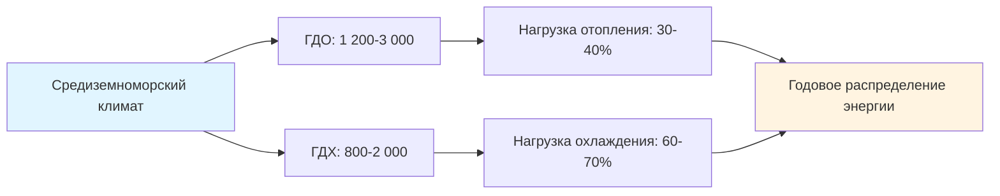
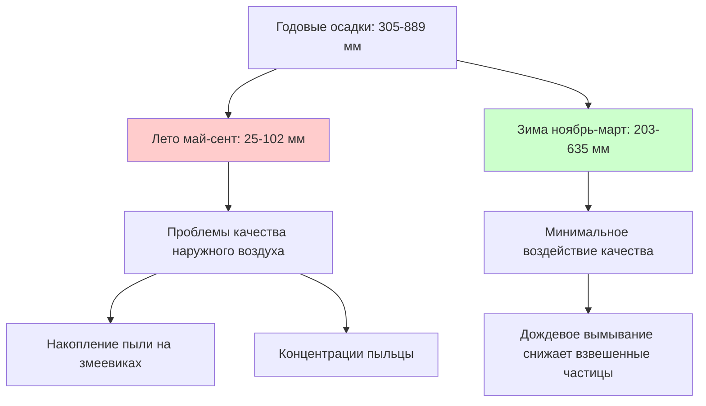

# Характеристики средиземноморского климата для проектирования HVAC

Средиземноморские климаты (классификация Кёппена Csa и Csb) демонстрируют отчётливые сезонные закономерности, характеризующиеся жарким, сухим летом и мягкой влажной зимой. Эти климатические зоны находятся вдоль западных побережий континентов между 30° и 45° широты, включая прибрежную Калифорнию, центральное Чили, бассейн Средиземного моря, юго-западную Австралию и Западный мыс Южной Африки. Уникальные тепловые и психрометрические свойства этого климата позволяют применять стратегии HVAC, которые существенно отличаются от подходов, ориентированных на отопление или охлаждение.

## Классификация климата и географическое распределение

**Критерии классификации климата Кёппена:**

- **Csa (Жаркое средиземноморское):** Средняя температура самого тёплого месяца ≥ 22°C, осадков в самый сухой летний месяц < 30 мм
- **Csb (Тёплое средиземноморское):** Менее 4 месяцев со средней температурой ≥ 22°C, осадков в самый сухой летний месяц < 30 мм
- Сухой летний сезон: < 40% годовых осадков выпадает май-сентябрь (Северное полушарие)
- Концентрация зимних осадков: > 60% годовых осадков выпадает ноябрь-март

**Представительские города проектирования HVAC:**

| Место | Классификация | Летний ПТ (1%) | Зимний ПТ (99%) | Годовые осадки |
|----------|---------------|----------------|-----------------|---------------------|
| Лос-Анджелес, Калифорния | Csb | 29°C | 7°C | 381 мм |
| Сан-Франциско, Калифорния | Csb | 27°C | 6°C | 584 мм |
| Сакраменто, Калифорния | Csa | 37°C | 3°C | 457 мм |
| Перт, Австралия | Csa | 36°C | 8°C | 813 мм |
| Рим, Италия | Csa | 34°C | 3°C | 838 мм |
| Афины, Греция | Csa | 35°C | 5°C | 406 мм |

## Характеристики температуры

### Профили сезонных температур

Средиземноморские климаты демонстрируют асимметричное распределение сезонных температур с преобладающими годовыми требованиями охлаждения, но значительной потребностью в отоплении в зимние утренние часы.

**Параметры летней температуры (июнь-сентябрь, Северное полушарие):**

- Проектная температура по сухому термометру (1% превышение): 29-38°C
- Средняя суточная максимальная температура: 27-33°C
- Средняя суточная минимальная температура: 16-21°C
- Суточный перепад температур: 11-17°C типично
- Момент пиковой температуры: 14:00-16:00 солнечного времени
- Градусодни охлаждения (база 18°C): 800-2 000 в год

**Параметры зимней температуры (декабрь-февраль, Северное полушарие):**

- Проектная температура по сухому термометру (99% превышение): 2-9°C
- Средняя суточная максимальная температура: 13-18°C
- Средняя суточная минимальная температура: 6-11°C
- Суточный перепад температур: 7-10°C типично
- Момент минимальной температуры: 06:00-07:00 солнечного времени
- Градусодни отопления (база 18°C): 1 200-3 000 в год

### Суточный перепад температур

Суточный перепад температур представляет один из наиболее значимых параметров проектирования для систем HVAC средиземноморского климата. Это колебание температуры между суточным максимумом и минимумом позволяет применять стратегии тепловой аккумуляции и ночного вентиляционного охлаждения.

**Анализ суточного перепада температур:**

Суточный перепад температур следует синусоидальному паттерну, приблизительно описываемому:

$$T(t) = T_{mean} + \frac{\Delta T_{diurnal}}{2} \sin\left(\frac{2\pi(t - t_{min})}{24}\right)$$

Где:
- $T(t)$ = температура наружного воздуха в момент времени $t$ (°C)
- $T_{mean}$ = средняя суточная температура (°C)
- $\Delta T_{diurnal}$ = суточный перепад температур (°C)
- $t_{min}$ = момент минимальной температуры, типично 06:00-07:00 (часы)

**Сезонные закономерности суточного перепада:**

| Сезон | Средний перепад | Диапазон | Значение для HVAC |
|--------|------------|-------|-----------------|
| Лето | 9°C | 7-11°C | Ночная вентиляция весьма эффективна |
| Зима | 4°C | 3-6°C | Восстановление утреннего отопления продлено |
| Весна/Осень | 7°C | 6-9°C | Окна бесплатного охлаждения расширены |

Значительный летний суточный перепад позволяет тепловой аккумуляции поглощать дневные тепловые притоки и отклонять накопленную энергию в более прохладные ночные часы. Циклы ночного вентиляционного продува, работающие когда температура наружного воздуха падает ниже 21°C, могут снизить пиковые нагрузки охлаждения на 25-35% в конструкциях с большой тепловой массой.

### Анализ градусодней

Расчёты градусодней количественно определяют требования энергии на отопление и охлаждение. Средиземноморские климаты демонстрируют сбалансированное, но асимметричное распределение градусодней.

**Расчёт градусодней:**

Градусодни отопления (ГДО):

$$HDD = \sum_{i=1}^{365} \max(0, T_{base} - T_{mean,i})$$

Градусодни охлаждения (ГДХ):

$$CDD = \sum_{i=1}^{365} \max(0, T_{mean,i} - T_{base})$$

Где $T_{base} = 18°C$ для жилых приложений.

**Представительские значения градусодней:**

**Сравнение с другими климатами:**

| Тип климата | ГДО (база 18°C) | ГДХ (база 18°C) | Соотношение ГДО:ГДХ |
|--------------|----------------|----------------|---------------|
| Средиземноморский (Csa) | 1 500-2 500 | 1 200-2 000 | 1,0-1,5 |
| Жаркий влажный субтропический | 1 500-2 500 | 2 500-4 000 | 0,5-0,8 |
| Жаркий сухой пустынный | 1 000-2 000 | 3 000-5 000 | 0,3-0,5 |
| Холодный континентальный | 5 000-8 000 | 500-1 200 | 5,0-10,0 |
| Морской западный берег | 3 500-5 500 | 100-400 | 12,0-30,0 |

## Психрометрические характеристики

### Влажность и содержание влаги

Средиземноморские климаты демонстрируют ярко выраженные сезонные колебания влажности, переходя от очень сухих летних условий к умеренным уровням зимней влажности.

**Летние психрометрические условия:**

- Относительная влажность (午後): 15-35%
- Относительная влажность (утро): 40-60%
- Температура точки росы: 10-16°C
- Влагосодержание: 0,005-0,008 кг воды/кг сухого воздуха
- Температура по мокрому термометру: 17-22°C
- Депрессия по мокрому термометру: 10-17°C

**Зимние психрометрические условия:**

- Относительная влажность (午後): 50-70%
- Относительная влажность (утро): 70-90%
- Температура точки росы: 3-10°C
- Влагосодержание: 0,004-0,007 кг воды/кг сухого воздуха
- Температура по мокрому термометру: 6-13°C
- Депрессия по мокрому термометру: 3-7°C

### Депрессия по мокрому термометру и потенциал испарительного охлаждения

Депрессия по мокрому термометру—разница между температурами по сухому и мокрому термометрам—определяет теоретический предел для эффективности испарительного охлаждения.

**Мощность испарительного охлаждения:**

Максимальное чувствительное охлаждение, достижимое через прямое испарительное охлаждение:

$$Q_{evap} = \dot{m}_{air} \cdot c_{p,air} \cdot \eta_{evap} \cdot (T_{db} - T_{wb})$$

Где:
- $Q_{evap}$ = мощность испарительного охлаждения (кДж/ч)
- $\dot{m}_{air}$ = массовый расход воздуха (кг/ч)
- $c_{p,air}$ = удельная теплоёмкость воздуха = 1,006 кДж/кг·K
- $\eta_{evap}$ = эффективность испарителя (0,70-0,85 для прямого, 0,55-0,75 для косвенного)
- $T_{db}$ = температура по сухому термометру (°C)
- $T_{wb}$ = температура по мокрому термометру (°C)

**Практическая эффективность испарительного охлаждения:**

Для типичного летнего условия проектирования 35°C по сухому и 18°C по мокрому (17°C депрессия):

| Тип системы | Эффективность | Снижение температуры | Температура на выходе |
|-------------|--------------|----------------------|------------------|
| Прямое испарительное | 80% | 13°C | 22°C |
| Косвенное испарительное | 65% | 11°C | 24°C |
| Двухступенчатое косвенно-прямое | 110%* | 18°C | 17°C |

*Эффективность > 100% для двухступенчатых систем при использовании определения подхода по мокрому термометру

### Коэффициент чувствительного тепла

Коэффициент чувствительного тепла (КЧТ) количественно определяет долю общей нагрузки охлаждения, приписываемой чувствительной (температурной) в сравнении с латентной (влажностью) компонентам:

$$SHR = \frac{Q_{sensible}}{Q_{sensible} + Q_{latent}} = \frac{Q_{sensible}}{Q_{total}}$$

**Значения КЧТ средиземноморского климата:**

- Летнее проектное КЧТ: 0,85-0,95
- Зимнее отопление (только чувствительное): 1,00
- Переходные сезоны: 0,90-0,98

Условия высокого КЧТ требуют выбора оборудования, приоритизирующего мощность чувствительного охлаждения. Стандартное оборудование прямого расширения (DX), выбранное по полной мощности, будет переохлаждать помещения до достижения адекватного удаления чувствительного тепла, приводя к холодным, влажным условиям и работе с малыми циклами.

**Производительность осушения оборудования:**

Влагосодержание воздуха на выходе из охлаждающего змеевика:

$$\omega_{leaving} = \omega_{entering} - \frac{Q_{latent}}{\dot{m}_{air} \cdot h_{fg}}$$

Где:
- $\omega$ = влагосодержание (кг воды/кг сухого воздуха)
- $h_{fg}$ = латентная теплота парообразования ≈ 2 500 кДж/кг при типичных условиях

В средиземноморских климатах с низкими латентными нагрузками охлаждающие змеевики редко достигают низких температур на выходе (6-9°C), необходимых для эффективного осушения, что делает специализированные системы осушения ненужными для большинства приложений.

## Закономерности солнечного излучения

### Интенсивность и продолжительность солнечного излучения

Средиземноморские климаты получают высокие уровни солнечного излучения в летние месяцы с ясным небом в 70-90% дневных часов.

**Проектные значения солнечного излучения:**

| Параметр | Лето | Зима | Годовое среднее |
|-----------|--------|--------|----------------|
| Пиковое солнечное облучение | 980-1040 Вт/м² | 690-820 Вт/м² | 850-920 Вт/м² |
| Суточный итог горизонтальный | 6,9-8,2 кВт·ч/м²·день | 2,5-3,8 кВт·ч/м²·день | 4,7-6,0 кВт·ч/м²·день |
| Часы ясного неба | 10-14 ч/день | 6-9 ч/день | 8-11 ч/день |
| Облачность | 10-20% | 35-50% | 25-35% |

**Солнечный теплогрейн через остекление:**

Коэффициент солнечного теплогрейна (КСТГ) определяет долю падающего солнечного излучения, пропускаемую остеклением:

$$Q_{solar,glazing} = A_{glazing} \cdot KSTG \cdot I_{solar} \cdot KNZ$$

Где:
- $Q_{solar,glazing}$ = солнечный теплогрейн через остекление (кДж/ч)
- $A_{glazing}$ = площадь остекления (м²)
- $KSTG$ = коэффициент солнечного теплогрейна (безразмерный, 0-1)
- $I_{solar}$ = падающее солнечное излучение (Вт/м²)
- $KNZ$ = коэффициент нагрузки охлаждения, учитывающий тепловую лаг массы (0,6-1,0)

**Оптимальные стратегии остекления для средиземноморских климатов:**

| Ориентация | КСТГ летний | КСТГ зимний | Стратегия затенения |
|-------------|------------|------------|------------------|
| Юг | 0,25-0,35 | Максимизировать солнечный прирост | Горизонтальные козырьки |
| Восток/Запад | 0,20-0,30 | 0,30-0,40 | Вертикальные плавники + козырьки |
| Север | 0,35-0,50 | 0,40-0,60 | Минимальное затенение требуется |

### Следствия сезонного пути солнца

Траектория солнца существенно варьируется между летом и зимой в средиземноморских широтах (30-45°), создавая возможности для пассивного солнечного отопления зимой при одновременном обеспечении эффективного затенения летом.

**Расчёт угла высоты солнца:**

$$\sin(\alpha) = \sin(\phi) \sin(\delta) + \cos(\phi) \cos(\delta) \cos(h)$$

Где:
- $\alpha$ = угол высоты солнца над горизонтом
- $\phi$ = широта
- $\delta$ = угол солнечного склонения (+23,45° летнее солнцестояние, -23,45° зимнее солнцестояние)
- $h$ = часовой угол (15° на час от солнечного полудня)

**Пиковый угол высоты солнца в солнечный полдень:**

| Широта | Летнее солнцестояние | Зимнее солнцестояние | Разница |
|----------|----------------|-----------------|------------|
| 32°N (Сан-Диего) | 81° | 35° | 46° |
| 38°N (Сан-Франциско) | 75° | 29° | 46° |
| 40°N (Северная Италия) | 73° | 27° | 46° |
| 34°S (Аделаида) | 79° | 33° | 46° |

Последовательная разница в 46° между летним и зимним углом солнца позволяет фиксированным горизонтальным козырькам блокировать высокое летнее солнце одновременно с допуском низкого зимнего солнца для пассивного отопления.

## Осадки и качество наружного воздуха

### Сезонные закономерности осадков

Средиземноморские климаты концентрируют 60-80% годовых осадков в мягкие зимние месяцы (ноябрь-март на Северном полушарии), создавая отчётливые сухие и влажные сезоны.

**Распределение месячных осадков (Северное полушарие):**

**Следствия для HVAC закономерностей осадков:**

- **Сухие летние месяцы:** Повышенное содержание взвешенных в воздухе частиц требует усиленной фильтрации (MERV 11-13 минимум)
- **Зимние события с дождём:** Забор наружного воздуха требует надлежащего дренажа и защиты от погоды
- **Весенняя пыльца:** Пиковые концентрации пыльцы март-май требуют повышенной эффективности фильтрации
- **Накопление пыли:** Продолжительные сухие периоды вызывают загрязнение наружных змеевиков, снижая коэффициент теплопередачи на 15-30%

### Рассмотрения качества наружного воздуха

Средиземноморские регионы испытывают проблемы качества воздуха, специфичные для сухих летних условий и географии этого климата.

**Обычные проблемы качества воздуха:**

| Загрязнитель | Летняя концентрация | Зимняя концентрация | Источник |
|-----------|---------------------|---------------------|---------|
| PM2.5 | 15-35 мкг/м³ | 8-20 мкг/м³ | Лесные пожары, пыль, выбросы транспорта |
| PM10 | 25-60 мкг/м³ | 15-35 мкг/м³ | Пыль, строительство, пыль дорог |
| Озон (O₃) | 60-90 ппб | 30-50 ппб | Образование фотохимического смога |
| VOC | Умеренно-Высокое | Низкое-Умеренное | Выбросы растительности, городские источники |

**Требования фильтрации по приложениям:**

- **Жилое:** MERV 11-13 для здоровья жильцов и защиты оборудования
- **Коммерческое здание:** MERV 13-14 для стандартов качества наружного воздуха (ASHRAE 62.1)
- **Здравоохранение:** MERV 14-16 с усиленной обработкой наружного воздуха
- **Критичные приложения:** HEPA фильтрация (99,97% @ 0,3 мкм) для лабораторных и чистых помещений

## Ветровые закономерности и потенциал естественной вентиляции

### Характеристики преобладающих ветров

Средиземноморские климаты обычно испытывают последовательный послеполуденный морской бриз в прибрежных местах и суточные ветры в горных долинах во внутренних регионах.

**Прибрежные ветровые закономерности:**

- **Летний день:** Морской бриз 3,5-8 м/с с океана/моря, начало 10:00-12:00
- **Летняя ночь:** Сухопутный бриз 1,8-4,5 м/с к океану/морю, начало 20:00-22:00
- **Зима:** Более переменчивые, вызванные штормом ветры 5-11 м/с с событиями осадков

**Ветровые закономерности внутренних/долинных районов:**

- **День:** Ветры по долине/вверх по склону 2,7-6,7 м/с
- **Ночь:** Ветры вниз по долине/вниз по склону 1,8-5,4 м/с
- **Сезонное колебание:** Летние закономерности более последовательны, чем зимние

### Эффективность естественной вентиляции

Предсказуемые ветровые закономерности и благоприятные колебания температур позволяют применять стратегии естественной вентиляции 4-6 месяцев в год в течение переходных сезонов.

**Расход вентиляции через отверстия:**

Расход вентиляции, вызванной ветром:

$$Q_{wind} = C_d \cdot A \cdot V_{wind}$$

Где:
- $Q_{wind}$ = расход вентиляции (м³/ч)
- $C_d$ = коэффициент расхода (0,6-0,7 для острокромочных отверстий)
- $A$ = эффективная площадь отверстия (м²)
- $V_{wind}$ = скорость ветра (м/ч)

Расход вентиляции за счёт тягового эффекта:

$$Q_{stack} = C_d \cdot A \cdot \sqrt{2 \cdot g \cdot H \cdot \frac{(T_{indoor} - T_{outdoor})}{T_{indoor}}}$$

Где:
- $g$ = ускорение свободного падения = 9,81 м/с²
- $H$ = вертикальное расстояние между впуском и выпуском (м)
- $T$ = абсолютная температура (K)

**Часы потенциала естественной вентиляции:**

| Сезон | Часы/месяц | Выполненные условия | Стратегия |
|--------|-------------|----------------|----------|
| Летний день | 0-50 ч | Редко—темпер. наружного воздуха слишком высокая | Требуется механическое охлаждение |
| Летняя ночь | 180-220 ч | Частые—наружное < 21°C | Ночной вентиляционный продув |
| Весна/Осень | 400-550 ч | Обширные—наружное 15-24°C | Перекрёстная вентиляция в рабочие часы |
| Зима | 100-200 ч | Умеренные—при отсутствии требуемого отопления | Работа экономайзера |

## Сводка условий проектирования

**Условия проектирования ASHRAE для представительских городов:**

| Город | Широта/Долгота | Летний ПТ (1%) | Летний МТ (1%) | Зимний ПТ (99%) | ДТСВ* | ДТМХ** |
|------|----------|----------------|----------------|-----------------|-------|--------|
| Лос-Анджелес, Калифорния | 34°N/118°W | 29°C | 19°C | 7°C | 22°C | 24°C |
| Сакраменто, Калифорния | 39°N/121°W | 37°C | 20°C | 3°C | 21°C | 28°C |
| Афины, Греция | 38°N/24°E | 35°C | 21°C | 5°C | 22°C | 26°C |
| Перт, Австралия | 32°S/116°E | 36°C | 19°C | 8°C | 21°C | 27°C |

*ДТСВ = Дневная температура совпадающего влажного (при летнем ПТ проектирования)
**ДТМХ = Дневная температура совпадающего максимума (при зимнем ПТ проектирования)

**Влияние параметров климата на проектирование HVAC:**

Характеристики средиземноморского климата создают специфичные приоритеты проектирования:

1. **Большой суточный перепад температур** → Стратегии тепловой аккумуляции и ночная вентиляция
2. **Большая депрессия по мокрому термометру** → Жизнеспособность испарительного охлаждения
3. **Сбалансированные градусодни** → Избегать переоборудования отопительного оборудования
4. **Расширенные переходные сезоны** → Работа экономайзера 3 500-4 500 часов в год
5. **Низкая летняя влажность** → Выбор оборудования с высоким коэффициентом чувствительного тепла
6. **Сезонные осадки** → Усиленная фильтрация в сухие месяцы
7. **Предсказуемые ветровые закономерности** → Интеграция естественной вентиляции
8. **Высокое солнечное излучение** → Оптимизация остекления и наружное затенение критичны

Эти характеристики климата позволяют средиземноморским регионам достигать среди самых низких энергопотребления HVAC на единицу площади из всех климатических зон, когда системы надлежащим образом спроектированы для использования преимуществ присущего климата, а не применения универсальных шаблонов оборудования.
