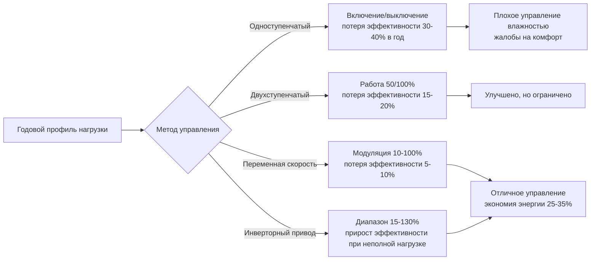

# Выбор оборудования HVAC для средиземноморского климата

Выбор оборудования для средиземноморского климата требует оптимизации для доминирующего охлаждения, высоких коэффициентов явного тепла, длительных периодов экономайзеров и минимальных нагрузок на отопление. Благоприятные характеристики климата — значительные суточные колебания температуры, низкая влажность и мягкие зимы — позволяют использовать конфигурации оборудования, принципиально отличающиеся от тех, которые подходят для климатов с экстремальным отоплением или охлаждением.

## Критерии выбора оборудования охлаждения

### Соответствие коэффициента явного тепла

Средиземноморские климаты обычно демонстрируют коэффициенты явного тепла (SHR) 0,85–0,95 в условиях пиковой охлаждения. Стандартное оборудование с рейтингом SHR 0,70–0,75 будет чрезмерно охлаждать помещения перед достижением адекватной осушки, что приведет к проблемам комфорта и неэффективности циклирования.

**Мощность явного охлаждения при рабочих условиях:**

$$Q_{sensible} = \dot{m} \times c_p \times (T_{entering} - T_{leaving})$$

$$\text{SHR} = \frac{Q_{sensible}}{Q_{total}} = \frac{Q_{sensible}}{Q_{sensible} + Q_{latent}}$$

Для приложений средиземноморского типа выберите оборудование, соответствующее этим критериям:

| Тип оборудования | Минимум SHR | Условия входящего воздуха | Диапазон применения |
|----------------|-------------|------------------------|-------------------|
| Катушки DX | 0,85 | 26,7°C БТ / 15,6°C ВТ | Общего назначения |
| Катушки охлажденной воды | 0,90 | 26,7°C БТ / 14,4°C ВТ | Низкие скрытые нагрузки |
| Испарительно-вспомогательные | 0,95 | 35°C БТ / 18,3°C ВТ | Пиковый период сухого лета |
| Лучистое охлаждение | 1,00 | Температура поверхности > точка росы | Только явное тепло |

**Методология выбора катушки:**

1. Рассчитайте явную нагрузку проектирования независимо от скрытой нагрузки
2. Определите требуемую точку росы аппарата (ADP) из психрометрического анализа
3. Выберите катушку с достаточным количеством рядов и шагом оребрения для достижения целевого SHR
4. Проверьте коэффициент обхода: $BF = e^{-NTU}$, где NTU увеличивается с глубиной катушки

Типичные приложения средиземноморского типа требуют катушек с 4–6 рядами и 10–12 ребер на дюйм в сравнении с 6–8 рядами и 14–16 ребер на дюйм в влажных климатах.

### Технологии переменной мощности

Широкий диапазон эксплуатации в средиземноморском климате — от минимальных нагрузок в переходные сезоны к пиковым летним условиям — требует оборудования, способного к эффективной работе при неполной нагрузке.

**Сравнение модуляции мощности:**



**Метрики эффективности при неполной нагрузке:**

$$\text{IEER} = 0.020A + 0.617B + 0.238C + 0.125D$$

Где:
- A = COP при 100% нагрузке (условия проектирования)
- B = COP при 75% нагрузке
- C = COP при 50% нагрузке
- D = COP при 25% нагрузке

Средиземноморские климаты работают в основном в диапазоне 25–75% нагрузки в течение 60–70% часов охлаждения. Выбор оборудования должен отдавать приоритет IEER перед EER для точной оценки эффективности.

## Конфигурации тепловых насосов

### Размеры реверсивного теплового насоса

Средиземноморские климаты представляют идеальное применение для воздушных тепловых насосов из-за мягких нагрузок на отопление и умеренных зимних температур. Соотношение мощности отопления к охлаждению обычно находится в диапазоне 0,5:1 к 1,2:1, в зависимости от типа здания.

**Анализ точки баланса теплового насоса:**

$$T_{balance} = T_{indoor} - \frac{Q_{internal} + Q_{solar}}{\text{UA}_{building}}$$

Для приложений средиземноморского типа точки баланса обычно находятся между 1,7–10°C, хорошо выше минимальной температуры эксплуатации компрессора (обычно -9,4°C для современных тепловых насосов).

**Мощность отопления при рабочей температуре:**

$$Q_{heating}(T_{outdoor}) = Q_{rated} \times \left[1 - k(T_{rated} - T_{outdoor})\right]$$

Где $k$ = коэффициент деградации мощности (обычно 0,027–0,045 на °C для воздушных блоков).

**Рекомендуемые спецификации теплового насоса:**

| Климатическая зона | Прибрежная | Внутренняя долина | Предгорья |
|--------------|---------|---------------|----------|
| Расчетная температура отопления | 4,4–7,2°C | 1,7–4,4°C | -0,6–1,7°C |
| Минимум HSPF | 9,0 | 9,5 | 10,0 |
| Минимум SEER | 16 | 18 | 18 |
| Мощность отопления при -8,3°C | 60% номинальной | 70% номинальной | 80% номинальной |
| Размер резервного отопления | 40% расчетной нагрузки | 50% расчетной нагрузки | 60% расчетной нагрузки |

### Системы переменного потока хладагента

Системы VRF превосходно работают в приложениях средиземноморского типа благодаря одновременной возможности отопления/охлаждения, высокой эффективности при неполной нагрузке и гибкости зонирования. Внутренние зоны часто требуют охлаждения круглый год, в то время как периметральные зоны переходят сезонно.

**Распределение мощности VRF:**

$$Q_{system} = \sum_{i=1}^{n} Q_i \times CF_i$$

Где $CF_i$ = коэффициент совпадения для зоны $i$ (обычно 0,7–0,9 для приложений средиземноморского типа).

**Преимущества VRF для средиземноморского климата:**

- **Режим восстановления тепла:** передача тепла из охлаждаемых зон в отопляемые зоны, снижая общий энергетический ввод на 20–35%
- **Управление отдельными зонами:** приспосабливается к различным профилям нагрузок от различий солнечной ориентации
- **Расширенный диапазон неполной нагрузки:** модуляция 10–130% поддерживает эффективность во время суточных колебаний
- **Минимальные воздуховоды:** снижает проникновения оболочки и тепловые потери
- **Встроенный экономайзер:** заводская координация предварительной кондиционирования наружного воздуха

**Методология размеров:**

1. Рассчитайте пиковую блочную нагрузку (не сумму пиков зон)
2. Примените коэффициент разнообразия: 0,70–0,85 для коммерческих, 0,60–0,75 для жилых
3. Выберите наружный блок с мощностью при 35°C расчетной температуре
4. Проверьте мощность отопления при 1,7–4,4°C расчетной температуре
5. Убедитесь, что общая подключенная мощность внутреннего блока = 100–130% наружного блока

## Оборудование и средства управления экономайзером

### Проектирование воздушного экономайзера

Средиземноморские климаты предоставляют 3000–4500 годовых часов, подходящих для эксплуатации экономайзера — что представляет наибольшую окупаемость инвестиций для этой технологии.

**Требования к мощности экономайзера:**

$$\dot{V}_{OA,max} = \frac{Q_{cooling,sensible}}{\rho \times c_p \times (T_{indoor} - T_{outdoor,min})}$$

Для приложений средиземноморского типа заслонки экономайзера и вентиляторы должны вмещать 100% наружного воздуха при расчетном объеме подачи воздуха, а не минимальную скорость воздухообмена, требуемую кодексом.

**Компоненты экономайзера:**

| Компонент | Спецификация | Требование для средиземноморского климата |
|-----------|--------------|---------------------------|
| Заслонка наружного воздуха | Противоположные лопасти, низкая утечка | Класс 1A утечка (<0,05 м³/(ч·м²)) |
| Разрывная заслонка | Гравитационная или управляемая | Размер для 100% OA + 10% |
| Привод заслонки | Модулирующий, возвратная пружина | Максимум 90 секунд на ход |
| Вентилятор подачи | Привод переменной скорости | Диапазон скорости 30–100% |
| Датчик наружного воздуха | Точность ±0,56°C | Экранированный щиток, обращенный на север |
| Датчик смешанного воздуха | Точность ±0,56°C | Ниже по потоку от точки смешивания |

**Последовательность управления для сухого экономайзера по сухому термометру:**

1. **$T_{OA} < 13°C$:** экономайзер отключен, минимум OA для вентиляции
2. **$13°C \leq T_{OA} < 18,3°C$:** 100% OA, механическое охлаждение заблокировано
3. **$18,3°C \leq T_{OA} < 23,9°C$:** модуляция заслонки OA для поддержания температуры подачи, механическое охлаждение срабатывает по мере необходимости
4. **$T_{OA} \geq 23,9°C$:** возврат к минимуму OA, полное механическое охлаждение

Управление на основе энтальпии в сухое средиземноморское лето не требуется. Управление по сухому термометру захватывает все доступные часы бесплатного охлаждения без дополнительной сложности.

### Системы испарительного охлаждения

Значительная депрессия мокрого термометра, характерная для средиземноморского лета (18–28°C типично), обеспечивает высокоэффективное испарительное охлаждение.

**Эффективность прямого испарительного охлаждения:**

$$\epsilon_{direct} = \frac{T_{db,in} - T_{db,out}}{T_{db,in} - T_{wb,in}}$$

Типичная эффективность: 70–85% для жесткого носителя, 85–90% для высокоэффективных конструкций.

**Непрямое испарительное охлаждение:**

$$T_{supply} = T_{db,in} - \epsilon_{indirect}(T_{db,in} - T_{wb,in})$$

Системы непрямого типа достигают эффективности 55–75% при одновременном избежании добавления влажности к подаваемому воздуху.

**Двухступенчатое испарительное охлаждение:**

```mermaid
graph TD
    A[Наружный воздух<br/>35°C БТ / 18,3°C ВТ] --> B[Непрямая ступень<br/>ε = 0,65]
    B --> C[24,8°C БТ / 17,2°C ВТ<br/>снижение 10°C]
    C --> D[Прямая ступень<br/>ε = 0,80]
    D --> E[18,9°C БТ / 17,8°C ВТ<br/>подаваемый воздух]

    F[Потребление воды] --> G[Непрямое: 0,23 л/кВт-ч]
    F --> H[Прямое: 0,30 л/кВт-ч]
    F --> I[Итого: 0,53 л/кВт-ч]

    J[Эквивалент охлаждения DX] --> K[7 кВт на 1000 CFM (1700 м³/ч)]
    J --> L[COP эквивалент: 15–25]
```

**Рекомендации по применению:**

- **100% испарительное:** подходит, если подаваемый воздух 18–21°C соответствует нагрузке (склады, мастерские)
- **Испарительное предварительное охлаждение + DX:** снижает нагрузку DX на 30–50%, поддерживает точное управление
- **Только непрямое:** приложения, требующие управления влажностью (музеи, архивы)
- **Требования к качеству воды:** TDS < 500 ppm, непрерывный продув 10–15% циркуляционного расхода

## Оборудование для распределения воздуха

### Выбор вентилятора для переменной работы

Средиземноморские климаты требуют системы вентиляции, оптимизированные для широких колебаний объема воздуха, от минимальной вентиляции в периоды неиспользования до 100% работы экономайзера.

**Мощность вентилятора при неполной нагрузке:**

$$P_{fan} = P_{design} \times \left(\frac{CFM_{actual}}{CFM_{design}}\right)^3 \times \frac{1}{\eta_{motor} \times \eta_{drive}}$$

Приводы переменной скорости снижают потребление энергии вентилятором на 50–70% во время эксплуатации экономайзера и неполной нагрузки в сравнении с системами постоянного объема с входными лопатками или дроссельными заслонками.

**Требования к эффективности вентилятора (согласно ASHRAE 90.1):**

| Тип вентилятора | Минимум FEI | Целевой показатель средиземноморского климата |
|-------------|-------------|---------------------|
| Вентиляторы камеры | 0,96 | 1,00 |
| Центробежный в корпусе | 1,00 | 1,10 |
| Встроенный центробежный | 0,96 | 1,05 |
| Осевой в корпусе | 0,92 | 0,98 |

**Распределение перепада давления:**

- Фильтры: 10–20 Па (MERV 13–14)
- Охлаждающая катушка: 7–15 Па
- Отопительная катушка: 5–7 Па
- Заслонки экономайзера: 4–6 Па
- Воздуховоды: 0,02 Па на метр
- Диффузоры/решетки: 1–2 Па
- **Общее внешнее статическое давление:** 4–6 Па типично

### Размер воздуховодов для эксплуатации экономайзера

Стандартные методологии размера воздуховодов, основанные на скоростях 3,5–4,5 м/с, оказываются неадекватными для систем, рассчитанных на 100% эксплуатацию экономайзера наружного воздуха.

**Рекомендуемые скорости для систем экономайзера средиземноморского типа:**

- **Основной воздуховод подачи:** 6–7,6 м/с (против стандарта 4,5–6 м/с)
- **Ветвевые воздуховоды:** 4–5 м/с (против стандарта 3–4 м/с)
- **Воздуховод возврата:** 5–6 м/с (против стандарта 3,5–4,5 м/с)
- **Воздуховод наружного воздуха:** 4,5–5,5 м/с (размер для 100% расхода системы)

Более высокие скорости предотвращают чрезмерные размеры воздуховодов при вмещении полного расхода экономайзера при поддержании приемлемого перепада давления и уровня шума.

## Оборудование фильтрации

### Стратегия фильтрации для сухих климатов

Средиземноморские климаты представляют повышенные нагрузки твердых частиц в течение сухих летних месяцев, требуя надежной фильтрации без чрезмерного перепада давления, который наказывает работу экономайзера.

**Критерии выбора фильтра:**

| Тип фильтра | Рейтинг MERV | Начальный Δp | Финальный Δp | Триггер замены | Пригодность для средиземноморского климата |
|-------------|-------------|-----------|----------|---------------------|--------------------------|
| Складчатый носитель | 8 | 6,2 Па | 18,6 Па | 16 Па | Достаточно для жилых |
| Синтетический носитель | 11–13 | 8,6 Па | 24,6 Па | 21 Па | Коммерческий стандарт |
| Мини-плиссе | 14–15 | 12,3 Па | 34,5 Па | 29,6 Па | Высокопроизводительные здания |
| HEPA | 17–20 | 24,6 Па | 61,5 Па | 49,2 Па | Только критические среды |

**Рекомендации по расширенной эксплуатации экономайзера:**

Во время 3000+ годовых часов экономайзера, агрегаты обработки воздуха обрабатывают 5–10× нормальный объем наружного воздуха. Загрязнение фильтра пылью пропорционально увеличивается, требуя:

- **Увеличенная глубина фильтра:** минимум 10 см (против 5 см стандарта)
- **Более низкая скорость набегания:** 1,5–2 м/с (против 2,5 м/с стандарта)
- **Мониторинг перепада давления:** замена фильтров при 80% номинального финального перепада давления
- **Сезонный график замены:** предлето (май) и послелето (октябрь) минимум

## Интеграция оборудования и вспомогательные устройства

### Системы восстановления энергии

Вентиляторы восстановления энергии (ERV) и вентиляторы восстановления тепла (HRV) требуют тщательной оценки в средиземноморском климате из-за длительных периодов экономайзера, когда восстановление тепла становится контрпродуктивным.

**Эффективность в отопительный сезон:**

$$\epsilon_{sensible} = \frac{T_{supply} - T_{outdoor}}{T_{exhaust} - T_{outdoor}}$$

$$\epsilon_{total} = \frac{h_{supply} - h_{outdoor}}{h_{exhaust} - h_{outdoor}}$$

**Рекомендации по системе восстановления средиземноморского климата:**

- **HRV предпочтительнее ERV:** низкая влажность снижает ценность восстановления скрытого тепла
- **Байпас-заслонки обязательны:** включить полный байпас при работе экономайзера (50–60% часов работы)
- **Эффективность явного тепла:** целевой показатель 70–80% (более высокая эффективность увеличивает стоимость без пропорциональной экономии)
- **Ограничение перепада давления:** максимум 1,2 Па во избежание наказания работы экономайзера
- **Пороговое применение:** здания, требующие > 1700 CFM (2885 м³/ч) непрерывной вентиляции

**Расчет годового восстановления энергии:**

$$E_{recovered} = \dot{V} \times \rho \times c_p \times (T_{indoor} - T_{outdoor}) \times \epsilon \times \tau_{operating}$$

Где $\tau_{operating}$ учитывает часы байпаса экономайзера (обычно 40–50% от общего количества часов в средиземноморском климате).

### Аккумулирование тепловой энергии

Суточные колебания температуры в средиземноморском климате и тарифы с использованием времени создают благоприятную экономику для аккумулирования тепловой энергии (TES).

**Емкость ледяного хранилища:**

$$Q_{storage} = m_{water} \times [c_p \Delta T + h_{fusion}] = m_{water} \times [4,19 \times 10 + 334] = 376 \text{ кДж/кг}$$

**Емкость хранилища охлажденной воды:**

$$Q_{storage} = m_{water} \times c_p \times \Delta T = m_{water} \times 4,19 \times (12–6) = 25,14 \text{ кДж/кг}$$

Ледяное хранилище обеспечивает плотность энергии в 12,8 раз выше, чем хранилище охлажденной воды, обеспечивая компактные установки в приложениях с ограниченным пространством.

**Приложения TES средиземноморского типа:**

- **Полное хранилище:** смещение всего охлаждения дневного времени на зарядку вне пиковых часов (обычно: 22:00–6:00)
- **Частичное хранилище:** снижение пикового спроса на 40–60%, чиллер + хранилище соответствуют пиковой нагрузке
- **Выравнивание нагрузки:** постоянная работа чиллера, хранилище буферизирует колебания нагрузки

**Экономический порог:** сборы за спрос в зависимости от времени использования > 90 руб./кВт-месяц обычно обоснованы инвестициями TES в средиземноморском климате, где охлаждающие нагрузки преобладают.

## Проверка производительности оборудования

### Требования к полевому тестированию

Оборудование, установленное в средиземноморском климате, требует проверки производительности при фактических условиях эксплуатации, в частности функциональности экономайзера и эффективности при неполной нагрузке.

**Процедуры тестирования введения в эксплуатацию:**

1. **Функциональный тест экономайзера:**
   - Проверьте достижимость 100% наружного воздуха при расчетном объеме подачи воздуха
   - Подтвердите последовательность заслонок при установке управления (13°C, 18,3°C, 23,9°C)
   - Измерьте температуру смешанного воздуха при различных положениях заслонок
   - Проверьте блокировку механического охлаждения во время режима полного экономайзера

2. **Проверка охлаждающей мощности:**
   - Измерьте объем воздуха: $\dot{V} = $ скорость × площадь (траверс Пито)
   - Запишите входящие/выходящие условия: сухой термометр, влажный термометр, давление
   - Рассчитайте мощность: $Q = 1,2 \times \dot{V} \times \Delta h$ (кВт)
   - Сравните с номинальной мощностью при рабочих условиях (в пределах ±10%)

3. **Производительность при неполной нагрузке:**
   - Тестируйте при 100%, 75%, 50%, 25% мощности, если переменная скорость
   - Запишите энергетический ввод в каждой точке нагрузки
   - Рассчитайте COP: $\text{COP} = \frac{Q_{cooling}}{P_{input} \times 3,6}$
   - Проверьте расчет IEER из измеренных данных

Оборудование средиземноморского климата должно продемонстрировать полную номинальную производительность в течение краткого периода летнего пика, при этом поддерживая высокую эффективность при расширенной эксплуатации в переходные сезоны.
