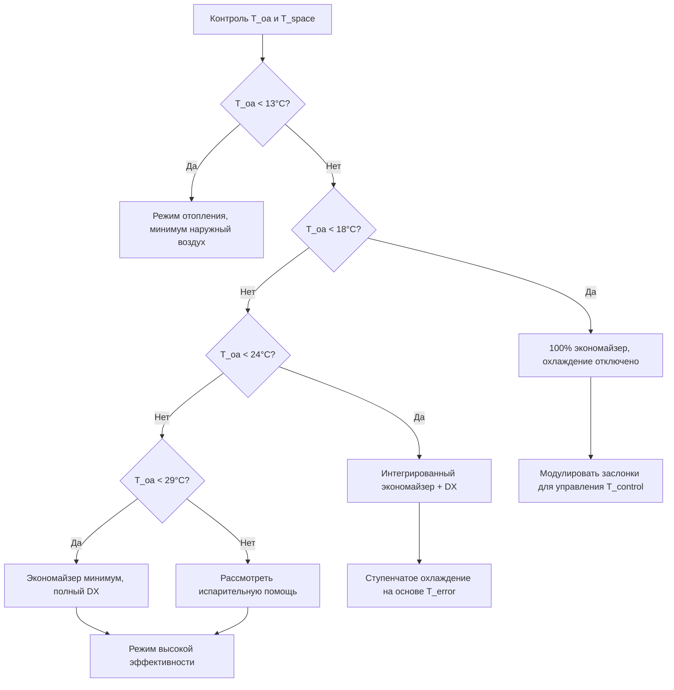
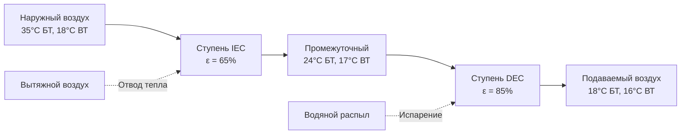
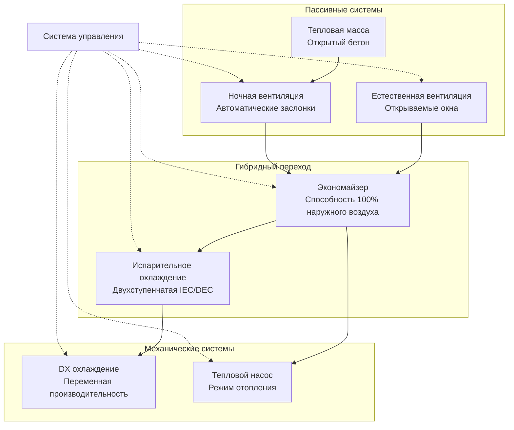

# Стратегии HVAC в средиземноморском климате

Средиземноморские климаты (Köppen Csa/Csb) предоставляют исключительные возможности для энергоэффективного проектирования HVAC благодаря гибридным стратегиям, которые используют характерные суточные перепады температур 14–19 °C, продолжительные переходные сезоны и низкую влажность. Следующие стратегии используют фундаментальные принципы теплопередачи для минимизации механического кондиционирования при сохранении комфорта пользователей.

## Проектирование системы с преобладанием экономайзера

Значительный потенциал бесплатного охлаждения в средиземноморском климате — обычно 3000–4500 часов в год — оправдывает использование систем экономайзера в качестве первичной стратегии HVAC, а не дополнительной функции.

### Основы воздушного экономайзера

Операция экономайзера заменяет воздух из возвратного воздухопровода наружным воздухом, когда наружные условия снижают потребность в охлаждении. Сравнение энтальпии определяет активацию экономайзера:

$$
h_{oa} < h_{ra} - \Delta h_{threshold}
$$

Где:
- $h_{oa}$ = энтальпия наружного воздуха (кДж/кг)
- $h_{ra}$ = энтальпия воздуха из возвратного воздухопровода (кДж/кг)
- $\Delta h_{threshold}$ = дифференциал управления (обычно 5–7 кДж/кг)

Для средиземноморского климата с сухим летом упрощенное управление по температуре сухого термометра доказывает свою надежность в сравнении с управлением по энтальпии:

$$
T_{oa} < T_{setpoint} - \Delta T_{differential}
$$

Типовое значение уставки управления: 18–21 °C с дифференциалом 2–3 °C.

### Требования к размерам экономайзера

Стандартные системы экономайзера обеспечивают производительность 15–25% наружного воздуха. Приложения в средиземноморском климате требуют полной способности 100% наружного воздуха для максимального количества часов бесплатного охлаждения.

**Расчетные скорости воздухообмена:**

| Тип здания | Минимум наружный воздух (CFM (м³/ч) на человека) | Производительность экономайзера (об/ч) | Коэффициент размера нагнетателя |
|---------------|------------------------|---------------------------|--------------------------|
| Офис | 15–20 (7.6–10.2 м³/ч) | 4–6 | 1.25–1.35 |
| Розница | 10–15 (5.1–7.6 м³/ч) | 3–5 | 1.20–1.30 |
| Ресторан | 20–30 (10.2–15.2 м³/ч) | 6–8 | 1.30–1.40 |
| Школьный класс | 15–20 (7.6–10.2 м³/ч) | 5–7 | 1.25–1.35 |

Повышенная производительность наружного воздуха требует пропорционального увеличения мощности нагнетателя. Преобразователи частоты (VFD) компенсируют затраты на энергию во время работы с минимальным наружным воздухом.

### Оптимизация последовательности управления

**Преимущества интегрированного управления:**
- Исключает механическое охлаждение во время 35–50% занятости
- Снижает пиковый спрос на 2.7–4.0 Вт/м²
- Увеличивает срок служения компрессора благодаря сокращению времени работы
- Поддерживает требования к качеству вентиляционного воздуха

## Интеграция испарительного охлаждения

Условия низкой влажности (20–40% ОВ) во время сезона охлаждения создают идеальные условия для испарительного охлаждения. Значительная депрессия по влажному термометру (11–17 °C) обеспечивает значительное чувствительное охлаждение за счет испарения воды.

### Физика испарительного охлаждения

Прямое испарительное охлаждение следует психрометрическому процессу вдоль линий постоянной влажной температуры. Эффективность охлаждения количественно определяет производительность:

$$
\varepsilon_{evap} = \frac{T_{db,in} - T_{db,out}}{T_{db,in} - T_{wb,in}}
$$

Где:
- $\varepsilon_{evap}$ = эффективность испарительного охлаждения (0.70–0.95 типично)
- $T_{db,in}$ = входящая температура сухого термометра (°C)
- $T_{db,out}$ = выходящая температура сухого термометра (°C)
- $T_{wb,in}$ = входящая влажная температура (°C)

**Пример расчета:**

Для летних условий средиземноморского климата:
- Наружный воздух: 35 °C БТ, 18 °C ВТ
- Эффективность испарителя прямого охлаждения: 85%

$$
T_{db,out} = T_{db,in} - \varepsilon_{evap}(T_{db,in} - T_{wb,in})
$$

$$
T_{db,out} = 35°C - 0.85(35°C - 18°C) = 20.5°C
$$

Это снижение температуры на 14.5 °C достигается без энергии компрессора, потребляя только мощность вентилятора и насоса (0.3–0.6 кВ на кВт охлаждения).

### Косвенное испарительное охлаждение

Косвенное испарительное охлаждение (IEC) обеспечивает чувствительное охлаждение без добавления влажности в подаваемый воздух. Поверхности теплообменника разделяют влажный и сухой воздушные потоки.

**Производительность IEC:**

| Параметр | Типовой диапазон | Расчетное значение |
|-----------|---------------|--------------|
| Эффективность | 55–75% | 65% |
| Подход по влажному термометру | 4–8 °C | 6 °C |
| Перепад давления | 10–20 Па | 15 Па |
| Потребление воды | 1–2 л/кВт·ч | 1.5 л/кВт·ч |
| Мощность вентилятора | 0.15–0.25 кВ/кВт | 0.20 кВ/кВт |

Холодопроизводительность систем IEC:

$$
Q_{IEC} = \dot{m}_{air} \cdot c_p \cdot \varepsilon_{IEC} \cdot (T_{db} - T_{wb})
$$

### Двухступенчатые испарительные системы

Двухступенчатые системы объединяют косвенное испарительное охлаждение, за которым следует прямое испарительное охлаждение, достигая температур подхода по влажному термометру 1–3 °C.

**Производительность двухступенчатой системы:**
- Температура подаваемого воздуха: 17–20 °C достижимо от 35 °C наружного воздуха
- Общая эффективность: 87–93% от депрессии по влажному термометру
- Потребление энергии: 0.15–0.30 кВ/кВт охлаждения (в сравнении с 1.0–1.2 кВ/кВт для DX охлаждения)
- Потребление воды: 2–3 л/кВт·ч

## Использование тепловой массы

Тепловая масса смягчает колебания внутренней температуры благодаря накоплению тепла в пиковые периоды и выпуску тепла в прохладные периоды. Суточный перепад температур в средиземноморском климате (14–19 °C) создает идеальные условия для стратегий использования тепловой массы.

### Емкость теплосохранения

Емкость теплосохранения строительной массы:

$$
Q_{stored} = m \cdot c_p \cdot \Delta T = \rho \cdot V \cdot c_p \cdot \Delta T
$$

Где:
- $m$ = масса (кг)
- $c_p$ = удельная теплоемкость (кДж/кг·°C)
- $\Delta T$ = перепад температур (°C)
- $\rho$ = плотность (кг/м³)
- $V$ = объем (м³)

**Свойства материалов для тепловой массы:**

| Материал | Плотность (кг/м³) | Удельная теплоемкость (кДж/кг·°C) | Объемная тепловая емкость (кДж/м³·°C) |
|----------|------------------|---------------------------|---------------------------------------|
| Бетон | 2320 | 0.92 | 2134 |
| Кирпичная кладка | 1920 | 1.00 | 1920 |
| Камень | 2640 | 0.88 | 2323 |
| Гипсокартон | 800 | 1.09 | 872 |
| Дерево | 560 | 1.38 | 773 |

**Расчет эффективной тепловой массы:**

Для здания площадью 186 м² с открытой бетонной плитой толщиной 15 см:

$$
V = 186 \text{ м}^2 \times 0.15 \text{ м} = 27.9 \text{ м}^3
$$

$$
Q_{stored} = 27.9 \text{ м}^3 \times 2134 \frac{\text{кДж}}{\text{м}^3 \cdot °C} \times 5.6°C = 333,000 \text{ кДж}
$$

Эта емкость теплосохранения эквивалентна 29.4 кВт·ч охлаждения, обеспечивая значительное снижение пиковой нагрузки.

### Рекомендации по проектированию тепловой массы

**Максимизация эффективности за счет:**
- Открытия бетонных плит и кирпичных стен в занятые помещения
- Поддержания температуры поверхности в диапазоне 20–24 °C во время занятости
- Связи тепловой массы с ночной вентиляцией для ежедневной зарядки
- Позиционирования тепловой массы для перехвата солнечного излучения через окна
- Обеспечения площади поверхности массы, превышающей 1.5× площадь пола для оптимального контакта

**Метрики производительности:**
- Снижение пиковой нагрузки охлаждения: 25–35% в сравнении с легкой конструкцией
- Снижение перепада температур: 3–4 °C в занятых помещениях
- Потенциал снижения размера оборудования HVAC: 15–25%
- Снижение годовой энергии охлаждения: 20–30%

## Охлаждение ночной вентиляцией

Ночная вентиляция удаляет теплый дневной воздух и заряжает тепловую массу прохладным наружным воздухом во время неоккупированных часов. Физика включает конвективную теплопередачу от поверхностей массы к вентиляционному воздуху.

### Основы теплопередачи

Скорость конвективной теплопередачи от тепловой массы к вентиляционному воздуху:

$$
Q_{conv} = h_c \cdot A_s \cdot (T_s - T_a)
$$

Где:
- $h_c$ = коэффициент конвективной теплопередачи (Вт/м²·°C)
- $A_s$ = площадь поверхности тепловой массы (м²)
- $T_s$ = температура поверхности (°C)
- $T_a$ = температура воздуха (°C)

Для вынужденной конвекции во время ночной вентиляции коэффициент конвекции:

$$
h_c = 5.62 \cdot V_{air}^{0.8}
$$

Где $V_{air}$ = скорость воздуха на поверхности (м/с), обычно 0.25–0.75 м/с для 8–12 об/ч.

### Стратегия управления ночной вентиляцией

**Критерии активации:**
1. Температура наружного воздуха < температура внутри помещения - 3 °C
2. Температура наружного воздуха > 10 °C (предотвращение переохлаждения)
3. Временной период: обычно 22:00 – 6:00
4. Требуется интеграция с системой безопасности

**Скорости вентиляции:**
- Минимум эффективный: 6 об/ч
- Оптимальный диапазон: 8–12 об/ч
- Здания с большой тепловой массой: 12–15 об/ч

**Целевые температуры выпуска:**

$$
T_{discharge} = T_{space,initial} - \frac{Q_{removed}}{\dot{m}_{air} \cdot c_p}
$$

Целевая температура в помещении перед занятостью: 20–21 °C

### Количественная оценка влияния на энергию

Эффективность ночной вентиляции зависит от температуры наружного воздуха и скорости вентиляции. Для средиземноморского климата с типовыми летними ночными температурами 15–21 °C:

**Ежедневно вытесняемая энергия охлаждения:**

$$
Q_{daily} = \dot{V} \cdot \rho \cdot c_p \cdot (T_{space} - T_{oa}) \cdot t_{operating}
$$

Для 9,438 CFM (16,000 м³/ч) работающих 8 часов ночью:

$$
Q_{daily} = 16,000 \frac{\text{м}^3}{\text{ч}} \times 1.2 \frac{\text{кг}}{\text{м}^3} \times 1.01 \frac{\text{кДж}}{\text{кг} \cdot °C} \times 6.7°C \times 8 \text{ ч}
$$

$$
Q_{daily} = 12,430 \text{ кДж} = 3.45 \text{ кВт·ч}
$$

**Потребление энергии вентилятором:**

Работа 16,000 м³/ч при статическом давлении 37 Па с КПД вентилятора 60%:

$$
P_{fan} = \frac{V \cdot \Delta P}{\eta_{fan}} = \frac{16,000 \text{ м}^3\text{/ч} \times 37 \text{ Па}}{3,600 \times 0.60} = 0.274 \text{ кВ}
$$

Соотношение энергии: 3.45 кВт·ч охлаждения / (0.274 кВ × 8 ч) = 1.58 кВт·ч на кВ·ч

Это представляет исключительную эффективность в сравнении с механическим охлаждением при 0.8–1.2 кВт·ч на кВ·ч.

## Архитектура гибридной системы

Оптимальная для средиземноморского климата HVAC объединяет механические системы с пассивными стратегиями в скоординированных последовательностях управления.

### Интеграция компонентов системы

### Сезонные режимы работы

**Летняя эксплуатация (июнь–сентябрь):**
1. Ночная вентиляция: 22:00 – 6:00, когда $T_{oa}$ < 21 °C
2. Утренний экономайзер: 6:00 – 10:00, когда $T_{oa}$ < 24 °C
3. Испарительная помощь: 10:00 – 16:00, когда $T_{oa}$ < 35 °C
4. Механическое охлаждение: Пиковые часы, когда $T_{oa}$ > 35 °C или испарения недостаточно
5. Вечерний экономайзер: 18:00 – 22:00, когда $T_{oa}$ < 27 °C

**Переходные сезоны (март–май, октябрь–ноябрь):**
1. Естественная вентиляция: Все часы, когда 18 °C < $T_{oa}$ < 24 °C
2. 100% экономайзер: Когда требуется охлаждение и $T_{oa}$ < 21 °C
3. Минимальная механическая работа: Только при исключительных условиях

**Зимняя эксплуатация (декабрь–февраль):**
1. Тепловой насос отопления: Когда $T_{oa}$ < 18 °C
2. Минимальная вентиляция: 7.5–10.2 м³/ч на человека
3. Рекуперация тепла: Интеграция ERV при непрерывной вентиляции

### Эталоны производительности

Хорошо выполненные гибридные стратегии в средиземноморском климате достигают:

**Целевые показатели энергоэффективности:**
- Жилая: 3–6 кВт·ч/м²/год энергии HVAC
- Малый офис: 5–9 кВт·ч/м²/год энергии HVAC
- Розница: 8–14 кВт·ч/м²/год энергии HVAC

**Доля механического охлаждения:**
- Часы механического охлаждения: 800–1200 часов в год
- Часы экономайзера/бесплатного охлаждения: 3000–4500 часов в год
- Энергия механического охлаждения: 40–55% от общей энергии HVAC
- Вклад бесплатного охлаждения: 45–60% от требуемого охлаждения

## Контрольный список реализации проекта

**Системы экономайзера:**
- Размер нагнетателей для подачи 100% наружного воздуха при расчетном расходе
- Задайте модулирующие заслонки с конструкцией низкой утечки
- Установите датчики температуры сухого термометра в репрезентативных местах
- Программируйте интегрированные последовательности управления экономайзер-DX
- Проверьте работу заслонок и калибровку датчиков при пусконаладке

**Испарительное охлаждение:**
- Оцените двухступенчатые системы для снижения пиковой нагрузки
- Размер систем водоочистки для локального качества воды
- Обеспечьте отдельные электрические цепи для компонентов испарительного охлаждения
- Установите отделители брызг для прямых испарительных ступеней
- Отслеживайте потребление воды и регулируйте скорости продувки сезонно

**Тепловая масса:**
- Откройте минимум 1.5× площадь пола поверхностей тепловой массы
- Задайте светлые или отражающие покрытия для солнечного контроля
- Интегрируйте лучистое отопление/охлаждение для улучшенной связи массы
- Избегайте ковровых покрытий или подвесных потолков над тепловой массой
- Смоделируйте влияние тепловой массы с использованием почасового энергетического моделирования

**Ночная вентиляция:**
- Установите моторизованные заслонки с пружинным возвратом отказоустойчивого типа
- Интегрируйте системы безопасности с управлением вентиляцией
- Обеспечьте фильтрацию входящего воздуха (MERV 8 минимум)
- Осуществляйте пусконаладку последовательностей ночной вентиляции с переопределением занятости
- Отслеживайте температуры в помещениях для проверки целевых температур выпуска

Средиземноморский климат вознаграждает комплексную интеграцию пассивных и активных стратегий HVAC. Системы, разработанные с ориентацией на эксплуатацию экономайзера, испарительное охлаждение, использование тепловой массы и ночную вентиляцию, снижают энергию механического охлаждения на 50–70% в сравнении с обычными полностью механическими подходами при сохранении превосходных условий комфорта.
