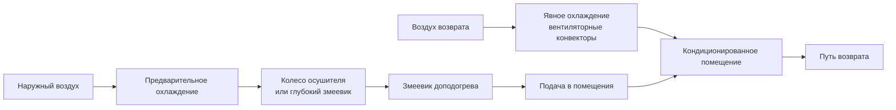

## Обзор

Проектирование систем HVAC для тропического климата решает фундаментальную задачу управления высокими явной и скрытой нагрузками, вызванными повышенными температурами окружающего воздуха (обычно 25-35°C) в сочетании с относительной влажностью 70-90%. Термодинамические требования существенно отличаются от приложений в умеренном климате, требуя специального выбора оборудования, повышенной емкости осушения и стратегий контроля влажности для поддержания приемлемых внутренних условий.

Основная инженерная проблема вытекает из высокого содержания влаги в наружном воздухе, требующего значительного энергетического вклада для конденсации и удаления. Стандартное охлаждающее оборудование, рассчитанное только на явные нагрузки, оказывается неадекватным, что приводит к повышенной влажности в помещении, развитию микроорганизмов и дискомфорту обитателей.

## Психрометрические характеристики

### Условия проектирования наружного воздуха

Тропические климаты демонстрируют отличительные психрометрические свойства, которые определяют проектирование системы:

| Параметр | Типичный диапазон | Влияние на проектирование |
|-----------|-------------------|---------------------------|
| Температура сухого термометра | 28-34°C | Умеренная явная охлаждающая нагрузка |
| Температура смачиваемого термометра | 24-28°C | Высокий индикатор скрытой нагрузки |
| Относительная влажность | 70-90% | Требование жесткого осушения |
| Температура точки росы | 22-26°C | Устанавливает минимально достижимую влажность |
| Абсолютная влажность | 16-22 г/кг | Высокий спрос на удаление влаги |

Падение температуры смачиваемого термометра (разница между сухим и смачиваемым термометром) обычно составляет 4-8°C, что значительно ниже, чем в умеренных климатах (8-15°C), ограничивая эффективность испарительного охлаждения.

### Доминирование скрытой нагрузки

Скрытая охлаждающая нагрузка в тропических приложениях часто равна или превышает явную нагрузку. Общая охлаждающая нагрузка составляет:

$$Q_{total} = Q_{sensible} + Q_{latent}$$

где:

$$Q_{latent} = \dot{m}_{air} \times h_{fg} \times \Delta W$$

- $\dot{m}_{air}$ = массовый расход воздуха (кг/с)
- $h_{fg}$ = скрытая теплота испарения (2450 кДж/кг при 20°C)
- $\Delta W$ = изменение влагосодержания (кг воды/кг сухого воздуха)

Коэффициент явного тепла (SHR) обычно составляет 0,50-0,65 в тропических климатах по сравнению с 0,75-0,85 в умеренных зонах:

$$SHR = \frac{Q_{sensible}}{Q_{total}}$$

## Стратегии осушения

### Проектирование охлаждающего змеевика с повышенной производительностью

Стандартные змеевики прямого расширения (DX) должны быть модифицированы для достижения адекватного удаления влаги:

**Снижение скорости на лице змеевика**: Ограничение скорости на лице до 1,5-2,0 м/с (в сравнении со стандартными 2,5-3,0 м/с) увеличивает время контакта между воздухом и холодной поверхностью, повышая конденсацию. Это снижает емкость змеевика на единицу площади, но значительно улучшает производительность осушения.

**Более низкая температура испарения**: Работа при температуре испарения хладагента 4-6°C (в сравнении со стандартными 7-10°C) увеличивает температурный перепад между поверхностью змеевика и точкой росы, обеспечивая более высокие скорости конденсации. Скорость удаления влаги следует соотношению:

$$\dot{m}_{condensate} = \dot{m}_{air} \times (W_{in} - W_{out})$$

где $W$ представляет влагосодержание при условиях на входе и выходе змеевика.

**Конфигурации с глубокими змеевиками**: Змеевики с 6-8 рядами обеспечивают расширенный контакт поверхности в сравнении со стандартными конструкциями с 3-4 рядами, увеличивая скрытую емкость на 30-50%.

### Системы подачи свежего воздуха (DOAS)

Конфигурации DOAS разделяют обработку вентиляционного воздуха от кондиционирования помещения, оптимизируя каждую функцию независимо:

Установка DOAS обрабатывает 100% наружного воздуха через оборудование с повышенным осушением, подавая воздух при 12-15°C и 40-50% ОВ. Параллельные приборы явного охлаждения (охлаждаемые балки, вентиляторные конвекторы) обрабатывают нагрузки помещения без введения дополнительной влаги.

Этот подход снижает общее энергопотребление системы на 20-35% по сравнению с обычными системами смешанного воздуха путем исключения штрафа на энергию от избыточного охлаждения и доподогрева для достижения контроля влажности.

### Десикантное осушение

Системы с твердыми или жидкими осушителями удаляют влагу путем абсорбции, а не конденсации, особенно эффективны при сочетании с отходящим теплом для регенерации:

Скорость удаления влаги осушителем зависит от разницы давления пара:

$$\dot{m}_{water} = k \times A \times (P_{v,air} - P_{v,surface})$$

- $k$ = коэффициент массопередачи
- $A$ = площадь поверхности осушителя
- $P_{v}$ = парциальное давление водяного пара

Силикагель, молекулярные сита и растворы хлорида лития достигают точки росы на выходе 10-15°C из условий входа 25-28°C. Регенерация требует тепловой энергии при 60-80°C, подходящей для солнечных тепловых систем, рекуперации отходящего тепла или газовых систем.

## Рассмотрения при выборе оборудования

### Модификации цикла охлаждения

Стандартное оборудование кондиционирования воздуха требует модификации для работы в тропических условиях:

| Модификация | Назначение | Типичное воздействие |
|------------|-----------|----------------------|
| Переразмеренные испарительные змеевики | Более низкая температура поверхности | +25-40% скрытая емкость |
| Компрессоры с переменной скоростью | Осушение при частичной нагрузке | +15-25% эффективность |
| Обход горячего газа | Минимальное охлаждение при высокой влажности | Поддерживает температуру змеевика |
| Схемы переохлаждения | Увеличенный холодильный эффект | +5-10% емкость системы |

### Проектирование распределения воздуха

Условия подаваемого воздуха должны предотвращать конденсацию на диффузорах и воздуховодах, сохраняя комфорт:

**Температура подаваемого воздуха**: Температура подаваемого воздуха 12-14°C (в сравнении с 10-12°C в сухих климатах) снижает риск поверхностной конденсации. Температура поверхности воздуховодов и диффузоров должна оставаться выше точки росы помещения, чтобы предотвратить накопление влаги.

**Скорости воздушного потока**: Более высокие объемные расходы (0,012-0,015 м³/с на кВт охлаждения) компенсируют сниженный температурный перепад, обеспечивая адекватную циркуляцию воздуха при контроле влажности.

## Вентиляция и контроль инфильтрации

### Влияние нагрузки наружного воздуха

Вентиляционный воздух представляет доминирующий компонент нагрузки в тропических климатах. Для каждого литра в секунду наружного воздуха при 32°C/80% ОВ, кондиционируемого к 24°C/50% ОВ:

$$Q_{OA} = \dot{V} \times \rho_{air} \times \Delta h$$

где $\Delta h$ (изменение удельной энтальпии) обычно равна 25-30 кДж/кг, в сравнении с 10-15 кДж/кг в умеренных климатах.

Этот 2-3-кратный дифференциал энтальпии требует:

- Контролируемой по требованиям вентиляции (DCV) с датчиками CO₂ для минимизации избытка наружного воздуха
- Вентиляторов рекуперации энергии (ERV), восстанавливающих 60-75% энергии выходящего воздуха
- Шлюзов и воздушных завес на входах зданий для снижения инфильтрации

### Стратегии ограждающих конструкций зданий

Миграция влаги через строительные конструкции требует размещения пароизоляции с внешней стороны (теплой стороны) для предотвращения конденсации в изоляции:

**Критический перепад давления**: Поддержание слабого избыточного давления (+2 до +5 Па) в кондиционируемых помещениях относительно наружной среды предотвращает инфильтрацию влажного воздуха через проемы ограждающих конструкций.

**Исключение тепловых мостиков**: Непрерывная изоляция и тепловые разделители предотвращают локализованные холодные поверхности, где происходит конденсация при внутренних уровнях влажности.

## Подходы к энергоэффективности

### Повышенные температуры охлажденной воды

Увеличение температуры подачи охлажденной воды с обычных 5-7°C до 10-12°C повышает эффективность холодильника на 15-25% через более высокое давление испарения. Соотношение цикла Карно для коэффициента производительности:

$$COP_{Carnot} = \frac{T_{evap}}{T_{cond} - T_{evap}}$$

демонстрирует, что каждое увеличение на 1°C температуры испарения ($T_{evap}$) дает приблизительно 2-3% улучшение эффективности.

Это требует увеличенных поверхностей теплообмена (охлаждаемых балок, радиантных панелей, переразмеренных змеевиков), но существенно снижает годовое потребление энергии. В сочетании с выделенным осушением, этот подход поддерживает комфорт при оптимизации термодинамической эффективности.

### Ограничения свободного охлаждения

Радиация на ночное небо и снижение температуры окружающей среды обеспечивают минимальную пользу в тропических климатах из-за:

- Ограниченного суточного хода температуры (обычно 6-10°C в сравнении с 15-20°C в аридных климатах)
- Высокой ночной влажности, предотвращающей эффективное испарительное охлаждение
- Повышенных температур смачиваемого термометра, ограничивающих производительность градирни

Экономайзеры со стороны воды достигают маргинальной экономии (5-10% годовой энергии охлаждения) в сравнении с 20-40% в умеренных климатах.

## Предотвращение развития микроорганизмов

Высокая влажность окружающей среды создает условия, благоприятные для развития плесени, мildew и бактериального роста. Критические меры контроля включают:

**Проектирование воздуховодов**: Исключение горизонтальных участков, где накапливается конденсат, обеспечение минимального уклона 1:200 к точкам дренажа и использование материалов воздуховодов с антимикробным покрытием.

**Обслуживание поддонов конденсата**: Переразмеренные поддоны конденсата с положительным дренажем, УФ-С бактерицидное облучение и обработка биоцидами предотвращают образование биопленки.

**Ограничения влажности в помещении**: ASHRAE Standard 55 рекомендует поддерживать относительную влажность в помещении ниже 65% для предотвращения развития плесени, требуя надежной емкости осушения при всех режимах работы.

## Применение стандартов ASHRAE

ASHRAE Standard 169-2020 классифицирует тропические климаты как Climate Zone 0A (очень жаркий, влажный), требуя:

- Минимум SEER 14-16 для унитарного оборудования (в сравнении с минимумом 13 в умеренных зонах)
- Требования к повышенной эффективности ограждающих конструкций, ограничивающие передачу влаги
- Обязательное осушение вентиляционного воздуха для зданий, превышающих 500 м² площади пола

Скорости вентиляционного воздуха по ASHRAE Standard 62.1 должны быть скорректированы с рекуперацией энергии для управления экстремальной нагрузкой наружного воздуха. Стандарт разрешает сниженные скорости вентиляции при внедрении контролируемой по требованиям вентиляции с прямым измерением занятости.

## Заключение

Успешное проектирование систем HVAC для тропических климатов требует фундаментальных сдвигов от обычных подходов к умеренному климату. Управление скрытой нагрузкой путем повышенного осушения, тщательный выбор оборудования, оптимизирующий коэффициенты явного тепла, и стратегии ограждающих конструкций, предотвращающие инфильтрацию влаги, составляют инженерный фундамент. Термодинамические штрафы высокой влажности окружающей среды требуют рекуперации энергии, повышенных температур охлажденной воды и выделенной обработки наружного воздуха для достижения приемлемой производительности и эффективности. Признание климатически-специфических психрометрических характеристик и применение надлежащих принципов проектирования обеспечивают комфортные, здоровые внутренние условия при управлении энергопотреблением в тропических регионах.
