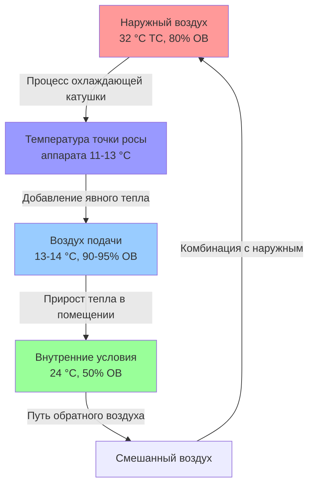

## Определение условий тропического климата

Тропические климаты представляют уникальные проектные задачи для систем HVAC, характеризующиеся повышенными температурами, высокой абсолютной влажностью, минимальными сезонными колебаниями и значительной солнечной радиацией. Классификация климатических зон ASHRAE относит большинство тропических регионов к зонам 1A и 2A, обозначающим условия с жарким и влажным климатом, с градусо-днями охлаждения, превышающими 27 800 °C-дней в год.

Основные параметры проектирования для систем HVAC в тропических условиях существенно отличаются от требований в умеренном климате из-за термодинамических свойств теплого и влагонасыщенного воздуха и его влияния на процессы теплопередачи.

## Термодинамические свойства тропического воздуха

### Характеристики температуры и влажности

Тропические климаты характеризуются постоянно высокими температурами сухого термометра в диапазоне 24–35 °C в течение всего года, с суточными колебаниями обычно составляющими 8–14 °C. Критическое различие при проектировании заключается в повышенных температурах влажного термометра, которые обычно превышают 24 °C в условиях пиковой нагрузки.

Уровни абсолютной влажности в тропических регионах часто достигают 0,020–0,025 кг влаги на кг сухого воздуха (или 140–175 зёрен/фунт), что соответствует температурам точки росы 21–26 °C. Это повышенное содержание влаги принципиально изменяет психрометрические процессы, необходимые для обеспечения комфорта.

**Ключевые параметры тропического климата:**

| Параметр | Типичный диапазон | Влияние на проектирование |
|----------|-------------------|---------------------------|
| Температура сухого термометра | 29–35 °C | Явная тепловая нагрузка охлаждения |
| Температура влажного термометра | 24–28 °C | Ограничения по мощности оборудования |
| Относительная влажность | 70–90 % | Величина скрытой нагрузки |
| Температура точки росы | 21–26 °C | Минимальные достижимые условия подачи |
| Солнечная радиация | 2840–3970 Вт/м² | Составляющая нагрузки на ограждающую конструкцию |

### Требования психрометрического процесса

Психрометрическое преобразование от наружных к внутренним условиям в тропических климатах требует значительного осушения. Для типичного комфортного состояния 24 °C и 50 % ОВ, начиная с наружных условий 32 °C и 80 % ОВ, процесс включает:

Удаление явного тепла:

$$Q_s = \dot{m} \times c_p \times (T_{наружный} - T_{внутренний})$$

Удаление скрытого тепла:

$$Q_l = \dot{m} \times h_{fg} \times (W_{наружный} - W_{внутренний})$$

Где разница по отношению влажности обычно составляет 0,010–0,015 кг/кг, требующая значительного извлечения влаги.

Коэффициент явного тепла (SHR) для тропических приложений обычно составляет 0,60–0,75, что существенно ниже значений 0,80–0,90, типичных для умеренных климатов. Это определяет выбор оборудования в пользу систем, оптимизированных для скрытной мощности.

## Распределение тепловой нагрузки

### Состав явной и скрытой нагрузок

Тепловые нагрузки зданий в тропическом климате характеризуются более высокими соотношениями скрытой и явной нагрузок по сравнению со строениями в умеренном климате. Типичное коммерческое здание в тропическом климате испытывает следующее распределение нагрузок:

**Структура тепловой нагрузки в тропическом климате:**

| Составляющая нагрузки | Процент | Основной источник |
|-----------------------|---------|-------------------|
| Солнечная радиация (ограждение) | 25–35 % | Высокий угол падения, длительное воздействие |
| Передача через конструкцию | 15–20 % | Малая разница температур |
| Инфильтрация (явное тепло) | 5–10 % | Минимальная разница температур |
| Инфильтрация (скрытое тепло) | 15–25 % | Высокая разница влагосодержания |
| Вентиляция (скрытое тепло) | 15–20 % | Наружный воздух по нормам |
| Внутренние источники | 20–25 % | Люди, оборудование, освещение |

Скрытые нагрузки от инфильтрации и вентиляции составляют 30–45 % от общей нагрузки охлаждения, что сравнивается с 15–25 % в умеренных климатах. Это смещение происходит потому, что разница энтальпии между внутренним и наружным воздухом происходит в основном из-за содержания влаги, а не температуры.

### Влияние вентиляции наружным воздухом

Требования стандарта ASHRAE 62.1 по вентиляции накладывают существенные ограничения в тропических климатах. Энтальпия наружного воздуха при 32 °C ТС и 24 °C ТВ составляет примерно 94 кДж/кг, тогда как внутренний воздух при 24 °C и 50 % ОВ содержит примерно 66 кДж/кг. Каждый м³/ч наружного воздуха, таким образом, добавляет:

$$\dot{Q}_{НВ} = \dot{V} \times \rho \times \Delta h = \text{м³/ч} \times 1,2 \times (94-66) = 33,6 \text{ Вт на м³/ч}$$

Эта нагрузка 33,6 Вт на м³/ч сравнивается с 59–82 Вт на м³/ч в умеренных климатах, фактически удваивая вклад нагрузки вентиляции.

## Характеристики солнечной радиации

Тропические местоположения у экватора испытывают режимы солнечной радиации, отличающиеся от более высоких широт. Угол возвышения солнца остаётся повышенным в течение года, варьируясь между 60 и 90 градусов в полдень. Это создаёт:

- Высокую интенсивность радиации на горизонтальных поверхностях (крыши)
- Уменьшенные углы падения на вертикальных поверхностях в полдень
- Продолжительные часы светового дня с минимальными сезонными колебаниями
- Последовательные ежедневные режимы солнечного прироста

Пиковой солнечный прирост тепла через остекление происходит в утренние и вечерние часы, когда углы солнца непосредственно ударяют в восточные и западные фасады. Южные поверхности (в северном полушарии тропиков) получают минимальное прямое излучение, тогда как северные поверхности получают некоторое прямое воздействие в зависимости от широты.

Коэффициент солнечного прироста (SHGC) для остекления становится критическим, с рекомендуемыми значениями ниже 0,30 для большинства ориентаций. Метод разности температур охлаждающей нагрузки (CLTD) требует поправочных коэффициентов, учитывающих непрерывно высокую температуру окружающей среды и уменьшенный суточный перепад температур.

## Вопросы характеристик материалов и оборудования

### Ограничения психрометрической эффективности

Охлаждающее оборудование работает с пониженной эффективностью в тропических климатах из-за повышенных температур конденсации. Воздушные конденсаторы отклоняют тепло в окружающий воздух при 32–38 °C, в сравнении с условиями проектирования 29–35 °C в умеренных зонах. Результирующее увеличение температуры конденсации с примерно 41 °C до 49 °C снижает коэффициент производительности (COP) на 15–25 % согласно соотношению карновской эффективности:

$$COP_{идеальный} = \frac{T_{испар}}{T_{конд} - T_{испар}}$$

Системы с водяным охлаждением получают преимущество в тропических климатах, поскольку температуры влажного термометра обычно остаются на 5–8 °C ниже значений сухого термометра, позволяя достичь более низких температур конденсации через испарительное охлаждение в градирнях.

### Требования к контролю влажности

Постоянно высокая влажность ускоряет коррозию, способствует биологическому росту и деградирует строительные материалы. Системы HVAC должны поддерживать относительную влажность в помещениях ниже 60 %, чтобы предотвратить развитие плесени и деградацию материалов. Это требование necessitates:

- Глубокие точки росы охлаждающей катушки (11–13 °C)
- Надлежащий контроль скорости потока через лицевую часть катушки (менее 2,54 м/с)
- Эффективное дренирование и управление конденсатом
- Возможность повторного нагрева при низких нагрузках
- Непрерывная циркуляция воздуха в периоды отсутствия людей

Процесс глубокого осушения по существу обеспечивает значительное переохлаждение, требующее тщательного управления температурой подаваемого воздуха, чтобы избежать чрезмерного охлаждения обслуживаемых помещений при частичной нагрузке.

## Выбор расчётных температур

Справочник ASHRAE - Основы предоставляет климатические данные для проектирования на основе статистического анализа записей о погоде. Для тропических местоположений типичные расчётные температуры сухого термометра на уровне 0,4 % и 1,0 % обычно отличаются всего на 1–2 °C, отражая минимальную температурную вариативность. Критическим параметром проектирования становится средняя совпадающая температура влажного термометра (MCWB), которая определяет мощность оборудования и эффективность.

Выбор расчётных условий требует уравновешивания начальной стоимости, эксплуатационных расходов и надёжности комфорта. Условие на уровне 1,0 % указывает, что параметр превышает расчётное значение примерно в течение 88 часов в год (1 % от 8760 часов), представляя приемлемый риск для большинства приложений.

Температура влажного термометра определяет теоретический минимум температур, достижимых через испарительные процессы, и устанавливает пределы производительности для градирен, испарительных конденсаторов и прямых/непрямых испарительных охладителей. В тропических климатах, где температуры влажного термометра превышают 24 °C, эти технологии обеспечивают минимальное преимущество, смещая предпочтение проектирования в сторону систем механического охлаждения.

---

**Связанные темы:**
- Стратегии осушения для климатов с высокой влажностью
- Критерии выбора систем HVAC для тропиков
- Рекуперация энергии в жарко-влажных климатах
- Контроль плесени и влаги в тропических зданиях
