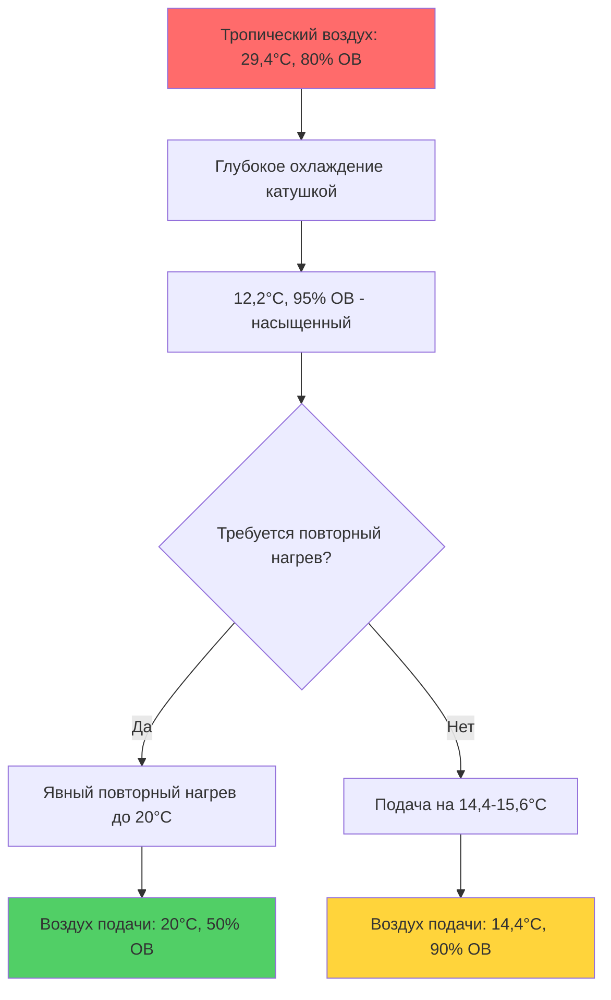
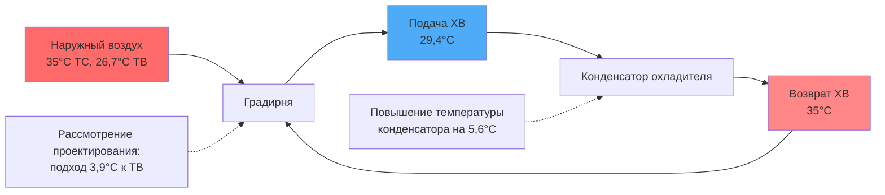

Работа HVAC-оборудования в тропических климатах представляет уникальные проблемы, обусловленные постоянно высокими температурами, повышенным уровнем влажности, интенсивной солнечной радиацией и коррозионными атмосферными условиями. Надлежащий выбор и спецификация оборудования требуют понимания физических механизмов, которые снижают производительность и долговечность компонентов в этих условиях.

## Снижение мощности для тропических условий

HVAC-оборудование, рассчитанное на стандартные условия (температура сухого термометра наружного воздуха 35°C для охлаждения), требует корректировки мощности при работе в условиях тропического проектирования, которые обычно превышают 35°C с совместной температурой влажного термометра 26,5-27,8°C.

### Производительность холодильного цикла

Коэффициент производительности Карно для систем охлаждения снижается по мере увеличения перепада температур:

$$
COP_{Carnot} = \frac{T_{evap}}{T_{cond} - T_{evap}}
$$

Где температуры указаны в абсолютных единицах (Ранкин или Кельвин). При увеличении температуры конденсации с 40,6°C до 46,1°C с постоянной температурой испарителя:

$$
\Delta COP = \frac{COP_{T1}}{COP_{T2}} = \frac{T_{cond,2}(T_{cond,1} - T_{evap})}{T_{cond,1}(T_{cond,2} - T_{evap})}
$$

Практическое воздушное оборудование испытывает снижение мощности на 8-15% и потери эффективности на 10-20% при повышенных тропических условиях окружающей среды в сравнении со стандартными условиями оценки.

| Тип оборудования | Потеря мощности при 40,6°C | Потеря мощности при 46,1°C | Увеличение мощности при 46,1°C |
|----------------|------------------------|------------------------|-------------------------|
| Воздухоохлаждаемый охладитель жидкости | 5-8% | 12-18% | 15-25% |
| Кровельный агрегат | 6-10% | 14-20% | 18-28% |
| Раздельная система | 8-12% | 15-22% | 20-30% |
| Система VRF | 6-9% | 13-19% | 16-26% |

## Управление высокой скрытой нагрузкой

Тропические климаты создают коэффициенты явного тепла (SHR) 0,65-0,75, значительно ниже типичных 0,75-0,80 в умеренных климатах. Требуемое скрытое охлаждение:

$$
q_{latent} = \dot{m} \cdot h_{fg} \cdot (W_1 - W_2) = 1,293 \cdot CFM(м³/ч) \cdot (W_1 - W_2)
$$

Где $W$ — коэффициент влажности в кг воды/кг сухого воздуха и $h_{fg}$ — теплота парообразования (приблизительно 2450 кДж/кг при типичных условиях).

### Выбор оборудования для скрытой мощности

Стандартное оборудование прямого испарения может достигать значений SHR 0,75-0,85, что недостаточно для тропических приложений. Повышенная скрытая мощность требует:

- **Пониженный расход воздуха**: Снижение CFM (м³/ч) на тонну с 6800 (м³/ч) до 5950 (м³/ч) повышает удаление влаги катушкой
- **Дополнительные ряды катушек**: Катушки с 6-8 рядами вместо стандартных 3-4 рядов
- **Более низкая температура входящего воздуха на катушку**: Конфигурации с разделением потока или выделенная осушка
- **Переохлаждение и повторный нагрев**: Избыточное охлаждение для удаления влаги, затем повторный нагрев для предотвращения переохлаждения

## Требования защиты от коррозии

Тропические прибрежные среды сочетают высокую соленость (концентрация хлоридов, превышающая 3,2 мг/м³ в пределах 1,6 км от побережья) с постоянной высокой влажностью, создавая агрессивные коррозионные условия.

### Спецификации материалов

| Компонент | Стандартный материал | Тропическое улучшение | Механизм коррозии |
|-----------|------------------|------------------|---------------------|
| Ребра катушки | Алюминий | Предварительно покрытый алюминий или медь | Гальваническая коррозия, атака хлоридами |
| Трубки катушки | Медь | Медь с усиленной толщиной стенки | Муравьиная коррозия |
| Крепежные элементы | Оцинкованная сталь | Нержавеющая сталь 316 | Щелевая коррозия |
| Корпуса | Окрашенная оцинкованная сталь | Порошковое покрытие оцинкованного или алюминия | Атмосферная коррозия |
| Поддоны конденсата | Оцинкованная сталь | Нержавеющая сталь 304/316 | Гальваническая коррозия |

### Защитные покрытия

Системы покрытия катушек обеспечивают барьерную защиту от атмосферных коррозионных веществ. Производительность зависит от толщины покрытия и адгезии:

- **Электрофоретическое покрытие (E-coating)**: Толщина 0,020-0,030 мм, равномерное покрытие
- **Порошковое покрытие**: Толщина 0,050-0,100 мм, превосходные барьерные свойства
- **Фенольные покрытия**: Толщина 0,013-0,025 мм, золотой стандарт для защиты от коррозии

Стандарт ASHRAE 188 требует коррозионностойких материалов для систем с продолжительным воздействием наружного воздуха в прибрежной или промышленной среде.

## Управление конденсатом

Высокие скрытые нагрузки производят конденсат со скоростью 22,7-37,9 л на кВт охлаждения в день, в сравнении с 7,6-15,1 л в умеренных климатах. Скорость производства конденсата:

$$
\dot{m}_{condensate} = \frac{q_{latent}}{h_{fg}} = \frac{CFM(м³/ч) \cdot 1,293 \cdot (W_1 - W_2)}{2450}
$$

Для агрегата мощностью 3,5 кВ, удаляющего влагу с 0,020 до 0,010 кг/кг при 5945 м³/ч:

$$
\dot{m}_{condensate} = \frac{5945 \cdot 1,293 \cdot (0,020 - 0,010)}{2450} = 0,031 \text{ кг/мин} = 1,86 \text{ л/ч}
$$

### Проектирование системы дренажа

- **Глубина сифона**: Минимальная глубина, равная статическому давлению системы плюс 25 мм (H = P/0,036 для мм сифона на Па давления)
- **Уклон**: Минимум 3 мм на метр, 6 мм предпочтительны для надежности
- **Размеры трубопровода**: 19 мм минимум в диаметре на кВт для косвенного дренажа
- **Защита от переполнения**: Вторичные поддоны с независимым дренажом и мониторингом

## Требования к фильтрации

Высокие уровни твердых частиц и биологических загрязнений в тропических климатах требуют улучшенной фильтрации. Концентрации наружных частиц в тропических городских районах обычно превышают 50 мкг/м³ PM2.5, при этом концентрации биологических аэрозолей в 2-5 раз выше, чем в умеренных регионах.

### Спецификация фильтра

| Применение | Минимальный MERV | Предпочтительный MERV | Интервал замены |
|-------------|--------------|----------------|----------------------|
| Жилое | 8 | 11 | 60-90 дней |
| Коммерческий офис | 11 | 13 | 90-120 дней |
| Здравоохранение | 14 | 16 | 180 дней |
| Критическая среда | 17 (HEPA) | 17 (HEPA) | Ежегодно |

Перепад давления через фильтры увеличивается быстрее в условиях высокой влажности из-за гигроскопического роста частиц. Статическое давление проектирования должно учитывать на 50% более высокий конечный перепад давления в сравнении с приложениями умеренного климата.

## Размеры теплообменника

Повышенные температуры влажного термометра снижают разность температур, управляющую теплопередачей в испарителях и конденсаторах. Логарифмическая средняя разность температур (LMTD) для противоточных теплообменников:

$$
LMTD = \frac{(T_{h,in} - T_{c,out}) - (T_{h,out} - T_{c,in})}{\ln\left(\frac{T_{h,in} - T_{c,out}}{T_{h,out} - T_{c,in}}\right)}
$$

Для систем конденсаторной воды приближение температур к влажному термометру должно учитывать снижение движущей силы. Градирня с влажным термометром 25,6°C может достичь только 29,4-30,6°C подачи конденсаторной воды в сравнении с 26,7-27,8°C, возможной при влажном термометре 21,1°C в умеренных климатах.

## Электрические рассмотрения

Высокие температуры окружающей среды снижают электрические компоненты и проводники. Допустимая нагрузка проводника должна быть отрегулирована с использованием коэффициентов коррекции из таблицы NEC. При температуре окружающей среды 50°C в сравнении с эталонной 30°C:

- Допустимая нагрузка медного проводника: коэффициент коррекции 0,82
- Рейтинги клемм оборудования: Часто ограничены классом завершения 75°C
- Загрузка трансформатора: Снизьте мощность на 1,5% на °C выше номинальной окружающей среды

Управляющая электроника требует защиты окружающей среды до стандарта IP65 или NEMA 4X в наружных приложениях с конформным покрытием печатных плат, подвергнутых воздействию высокой влажности.

## Проектирование системы хладагента

Повышенные температуры конденсации увеличивают давления нагнетания и температуры, требуя:

- **Настройки отсечки высокого давления**: Отрегулированы на 10-15% выше, чем приложения умеренного климата
- **Охлаждение компрессора**: Улучшенное охлаждение масла, впрыск жидкости или вспомогательное охлаждение
- **Размеры ресивера**: Увеличенная емкость для размещения большей миграции заряда
- **Выбор расширительного клапана (TXV)**: Рассчитан на более высокие перепады давления через клапан

Требования переохлаждения увеличиваются на 1,1-2,2°C, чтобы обеспечить адекватное качество жидкого хладагента при входе в устройства расширения при высоких условиях окружающей среды.

---

## Ссылки

- Справочник ASHRAE—HVAC Applications, Глава 54: Тропические климаты
- Стандарт ASHRAE 62.1: Вентиляция для приемлемого качества внутреннего воздуха
- Стандарт ASHRAE 188: Легионеллез—Управление рисками для систем водоснабжения зданий
- Стандарт ARI 550/590: Рейтинг производительности охладителей жидкости и тепловых насосов с подогревом жидкости с использованием цикла парокомпрессии
