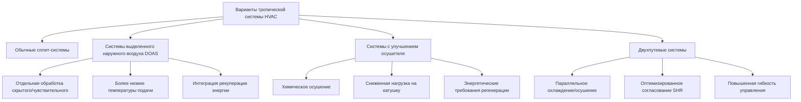

# Стратегии HVAC для тропических климатов

Проектирование HVAC для тропического климата требует принципиально иных подходов по сравнению с умеренными зонами. Сочетание высоких температур окружающей среды (обычно 24–35 °C круглогодично), повышенного уровня влажности (60–100 % ОВ) и минимальных сезонных колебаний создает уникальные проблемы, сосредоточенные на удалении скрытого тепла и контроле влаги, а не только на чувствительном охлаждении.

## Психрометрические соображения

Тропический климат работает в отчетливой области психрометрической диаграммы, где энтальпия остается постоянно высокой. Климатические зоны ASHRAE 0A и 1A охватывают тропические и влажные субтропические регионы, где градусо-дни охлаждения превышают 50 000 °C·дни в год.

Распределение охлаждающей нагрузки существенно отличается от умеренных климатов:

| Компонент нагрузки | Умеренный климат | Тропический климат |
|---|---|---|
| Коэффициент чувствительного тепла (SHR) | 0,75–0,85 | 0,55–0,70 |
| Процент скрытой нагрузки | 15–25 % | 30–45 % |
| Проектная влажность наружного воздуха | 60–100 г/кг | 120–160 г/кг |
| Внутреннее образование влаги | Умеренная проблема | Критический фактор |

Расчет общей охлаждающей нагрузки должен учитывать повышенный спрос на удаление влаги:

$$Q_{total} = Q_{sensible} + Q_{latent} = \dot{m} \times c_p \times \Delta T + \dot{m} \times h_{fg} \times \Delta W$$

Где $\Delta W$ представляет разность коэффициентов влажности между наружным и внутренним воздухом, часто 5–6 г/кг в тропических приложениях.

## Проектирование с приоритетом осушения

Обычные системы HVAC, разработанные для умеренных климатов, обычно работают с температурой подаваемого воздуха 13–16 °C. Тропические приложения требуют более низких температур точки росы аппарата (7–10 °C) для достижения адекватного удаления влаги:

$$\text{Скорость удаления влаги} = \dot{V} \times \rho \times (W_{return} - W_{supply})$$

Выбор оборудования должен отдавать приоритет емкости осушения. Стандартные системы прямого расширения (DX) часто оказываются неадекватными, поскольку:

- Избыточная чувствительная емкость приводит к короткому циклированию
- Недостаточное время контакта с катушкой предотвращает удаление влаги
- Подаваемый воздух может быть слишком теплым для надлежащего осушения помещений

## Подходы архитектуры системы

### Системы выделенного наружного воздуха (DOAS)

Архитектура DOAS разделяет обработку вентиляционного воздуха и кондиционирование помещений, позволяя оптимизировать каждую функцию. Поток наружного воздуха подвергается глубокому осушению до точки росы 4–7 °C, затем чувствительному нагреву до нейтральной температуры (18–21 °C) перед доставкой в помещения.

Преимущества в тропических приложениях:

- Независимый контроль скрытого и чувствительного тепла
- Рекуперация энергии из потоков вытяжного воздуха
- Сниженные требования к изменению размеров зонального оборудования
- Предотвращение инфильтрации влаги через оболочку здания путем нагнетания избыточного давления

Эффективность рекуперации энергии существенно влияет на операционные затраты:

$$\eta_{enthalpy} = \frac{h_{outdoor} - h_{supply}}{h_{outdoor} - h_{exhaust}} \times 100\%$$

Высокопроизводительные колеса с рекуперацией энтальпии достигают эффективности 70–80 %, восстанавливая как чувствительную, так и скрытую энергию из вытяжных потоков.

## Оптимизация скорости вентиляции

Стандарт ASHRAE 62.1 предусматривает минимальные скорости вентиляции, но тропические климаты требуют тщательного анализа влияния доли наружного воздуха. Каждый CFM (м³/ч) наружного воздуха вводит существенную скрытую нагрузку:

$$Q_{latent,OA} = \dot{V}_{OA} \times \rho \times h_{fg} \times (W_{outdoor} - W_{indoor})$$

Для требования наружного воздуха 470 CFM (800 м³/ч) с условиями наружного воздуха 29 °C БТ/26 °C ВТ (W = 14 г/кг) и внутренней уставкой 24 °C/50 % ОВ (W = 9,5 г/кг):

$$Q_{latent,OA} = 800 \times 1,2 \times 2500 \times (14-9,5) = 13,5 \text{ кВт}$$

Это представляет 3,8 кВт скрытого охлаждения только от вентиляционного воздуха. Спрос-контролируемая вентиляция (DCV) с датчиками CO₂ снижает это бремя на 30–50 % в периоды частичной занятости.

## Критерии выбора оборудования

### Проектирование охлаждающей катушки

Катушки тропического климата требуют:

- Глубина 6–8 рядов (против 4–6 рядов для умеренных климатов)
- Расстояние ребер 8–10 FPI для минимизации перемостики влаги
- Скорость потока через фронтальное сечение, ограниченная 2–2,3 м/с для адекватного времени контакта
- Контуры хладагента, оптимизированные для низких температур выходящего воздуха

Коэффициент обхода катушки должен быть минимизирован:

$$BF = \frac{t_{leaving} - t_{ADP}}{t_{entering} - t_{ADP}}$$

Целевые коэффициенты обхода 0,05–0,10 обеспечивают эффективное осушение, в сравнении с 0,15–0,25 типичными для умеренных приложений.

### Компрессор и система холодоснабжения

Более низкие температуры испарителя (3–6 °C) снижают эффективность охлаждения, но остаются необходимыми для удаления влаги. Коэффициент производительности (COP) снижается в соответствии с ограничением Карно:

$$COP_{actual} = \eta_{carnot} \times \frac{T_{evap}}{T_{cond} - T_{evap}}$$

Компрессоры с переменной скоростью смягчают потери эффективности, согласуя емкость с мгновенными нагрузками при сохранении проектной производительности осушения.

## Стратегии распределения воздуха

Доставка подаваемого воздуха должна предотвращать накопление влаги на поверхностях и внутри оболочки здания:

- Потолочные диффузоры, разработанные для горизонтальных характеристик метания, минимизируют застой холодного воздуха
- Температура подаваемого воздуха не ниже 14–16 °C в диффузорах для предотвращения конденсации
- Пути возврата воздуха сконфигурированы для предотвращения короткого замыкания
- Легкое положительное давление (5–12 Па) предотвращает инфильтрацию влаги

Эффективность смешивания напрямую влияет на контроль влажности:

$$\epsilon_{mixing} = \frac{T_{room} - T_{supply}}{T_{exhaust} - T_{supply}}$$

Значения ниже 0,85 указывают на плохое перемешивание и потенциальные зоны стратификации влажности.

## Предотвращение миграции влаги

Проектирование оболочки здания интегрируется со стратегией HVAC для предотвращения межслойной конденсации. Дифференциал давления паров приводит влагу из высокой влажности снаружи к кондиционируемому интерьеру:

$$\dot{m}_{vapor} = \frac{A \times \delta \times (p_{v,out} - p_{v,in})}{d}$$

Где $\delta$ представляет проницаемость материала. Паровые барьеры на внешней (теплой) стороне изоляции предотвращают конденсацию внутри сборок стен. Системы HVAC должны поддерживать внутреннюю точку росы ниже самой холодной температуры поверхности в оболочке здания для предотвращения видимой конденсации и роста плесени.

## Требования к системе управления

Управление тропическим климатом отдает приоритет контролю влажности:

- Двойной контроль уставок (температура и влажность)
- Переустановка температуры подаваемого воздуха в зависимости от уровней влажности в помещении
- Принудительное обеспечение минимального времени работы для обеспечения адекватных циклов осушения
- Пошаговая или переменная скоростная работа для предотвращения короткого циклирования
- Интеграция с прогнозом погоды для стратегий предварительного охлаждения

Алгоритм управления должен сбалансировать энергетическую эффективность и контроль влажности, часто принимая незначительное переохлаждение для достижения целевых уровней влажности в периоды высокой скрытой нагрузки.

## Интеграция естественной вентиляции

Несмотря на высокую влажность, естественная вентиляция обеспечивает комфорт через повышенное движение воздуха при благоприятных наружных условиях. Эффект охлаждения от скорости воздуха подчиняется:

$$\Delta T_{effective} = 1,0 \times (V_{air})^{0,5}$$

Где $V_{air}$ в м/с. При 1 м/с занятые люди ощущают снижение эффективной температуры примерно на 1,4 °C, что позволяет повысить уставки термостата в мягкие периоды.

## Дренаж и управление конденсатом

Тропические системы генерируют 7,5–15 л конденсата на кВт охлаждения в час. Дренажные системы требуют:

- Увеличенные поддоны с 100 % резервом емкости
- Изменение размера P-образного сифона для высоких скоростей потока конденсата
- Вторичные поддоны с независимыми путями дренажа
- Обработка альгицидом или УФ-стерилизация для предотвращения биологического роста
- Конденсатные насосы с сигналами тревоги при высоком уровне воды для критических приложений

Расчет скорости потока конденсата:

$$\dot{V}_{condensate} = \frac{Q_{latent}}{h_{fg} \times \rho_{water}} = \frac{Q_{latent}}{2500 \times 1000}$$

Для системы мощностью 3,5 кВт со скрытой нагрузкой 40 %, образование конденсата достигает 2 л/ч во время пиковой работы.

## Выбор материалов для устойчивости к коррозии

Среды с высокой влажностью ускоряют коррозию компонентов HVAC. Спецификации материалов должны учитывать воздействие влаги:

| Компонент | Стандартный материал | Спецификация для тропиков |
|---|---|---|
| Ребра катушки | Алюминий | Эпоксидированный алюминий или медь |
| Дренажные поддоны | Оцинкованная сталь | Нержавеющая сталь или полимер |
| Крепеж | Оцинкованная сталь | Нержавеющая сталь 316 |
| Воздуховоды | Оцинкованный листовой металл | Предварительно покрытые или композитные полимерные |
| Облицовка изоляции | Стандартная фольга | Пленки полимера с антимикробной обработкой |

---

**Связанные темы:** Характеристики тропического климата, Рассмотрение оборудования, Предотвращение плесени, Вентиляция с рекуперацией энергии
