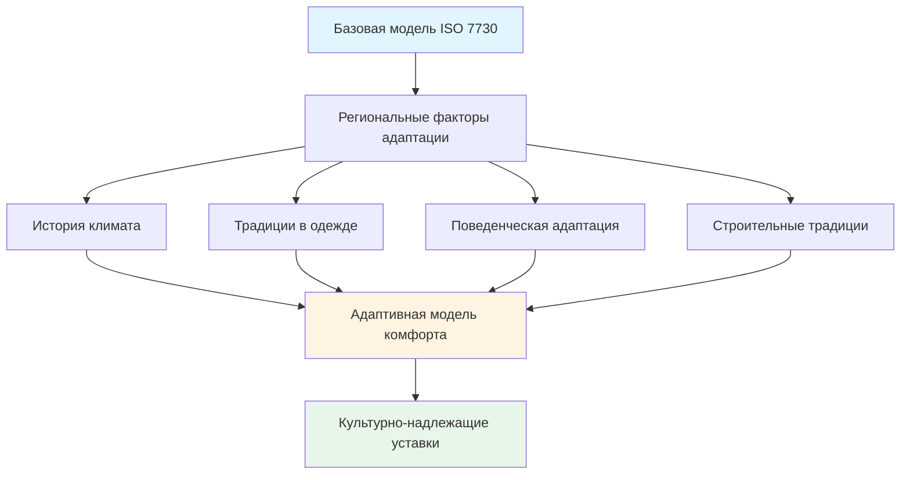
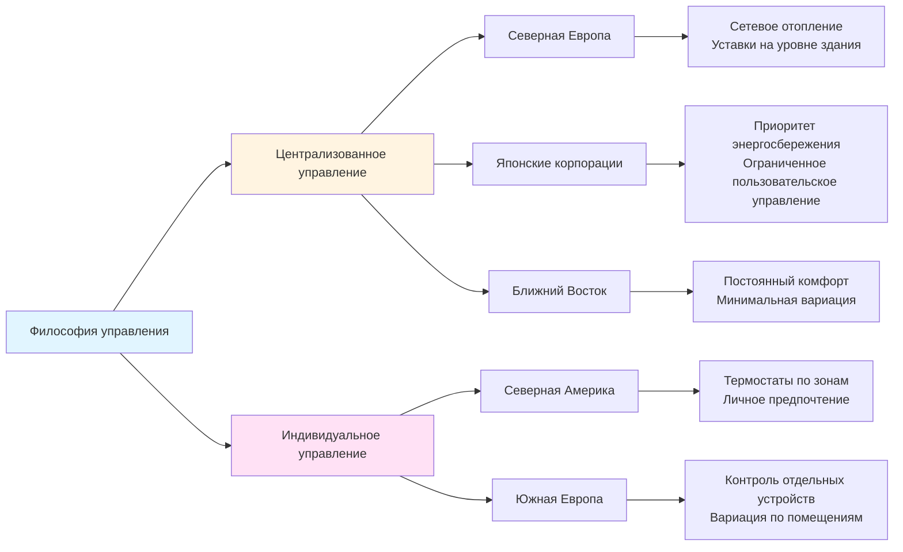
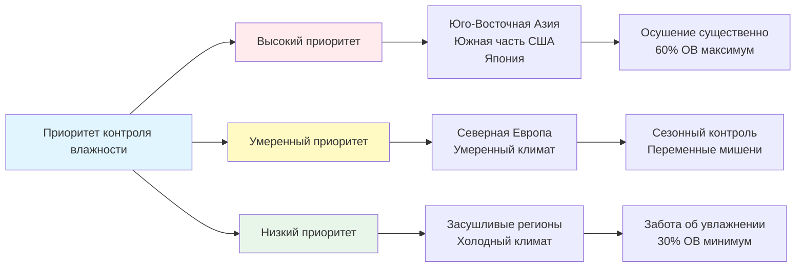
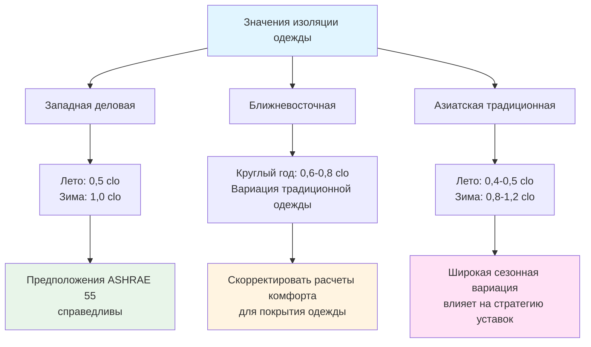

# Межкультурные соображения в проектировании HVAC

Культурные факторы значительно влияют на ожидания теплового комфорта, предпочтения эксплуатации систем и стратегии контроля климата в зданиях. Понимание этих различий является критически важным для международных проектов HVAC и управления объектами многонациональных корпораций.

## Культурные ожидания комфорта

Восприятие теплового комфорта варьируется между культурами из-за физиологической адаптации, традиций в одежде, характеров активности и исторических практик строительства.

### Региональные предпочтения температуры комфорта

| Регион | Уставка охлаждения | Уставка отопления | Предпочтение влажности | Основание |
|--------|-------------------|------------------|----------------------|----------|
| Северная Америка | 22-24°C | 20-22°C | 40-60% ОВ | ASHRAE Standard 55 |
| Северная Европа | 20-22°C | 20-21°C | 30-50% ОВ | EN 16798-1 |
| Южная Европа | 24-26°C | 19-21°C | 40-65% ОВ | Адаптивный комфорт |
| Япония | 25-28°C | 18-20°C | 50-70% ОВ | Стандарты JIS |
| Ближний Восток | 21-24°C | 22-24°C | 30-50% ОВ | Местные нормы |
| Юго-Восточная Азия | 24-27°C | Неприменимо | 50-70% ОВ | Адаптивные модели |
| Китай | 23-26°C | 18-20°C | 40-70% ОВ | GB 50736 |

### ISO 7730 и культурная адаптация

ISO 7730 предоставляет основу методов Predicted Mean Vote (PMV) и Predicted Percentage of Dissatisfied (PPD), однако исследования показывают систематические различия в восприятии комфорта между культурами:

**Корректировки PMV по регионам:**
- Население Юго-Восточной Азии: Нейтральная температура примерно на 1,5-2°C выше прогнозов ISO 7730
- Население Северной Европы: Близко соответствует прогнозам ISO 7730
- Население Ближнего Востока: Более высокая толерантность к сухому жару, более низкое принятие влажности
- Население Японии: Сезонная корректировка одежды более выражена, чем у западного населения

## Вариации в операционной практике

### Поведение при открытии окон

Культурные подходы к естественной вентиляции и эксплуатации окон существенно различаются:

| Культура | Практика открытия окон | Влияние на HVAC |
|---------|----------------------|-----------------|
| Немецкая | Частая "stoßlüften" (ударная вентиляция) | Системы должны поддерживать быстрые изменения воздуха |
| Британская | Предпочтение открываемых окон круглый год | Конфликт с герметичными системами HVAC |
| Американская | Зависимость от механических систем | Редко открывают окна при работе HVAC |
| Японская | Сезонные традиции открытия окон | Обычны смешанные системы |
| Скандинавская | Высокое предпочтение вентиляции | Спрос на элементы управления переопределением свежего воздуха |

### Философия контроля температуры

**Централизованное управление в сравнении с индивидуальным:**
- **Скандинавский/немецкий подход:** Сетевое отопление/охлаждение с ограниченным индивидуальным управлением, упор на коллективную энергоэффективность
- **Североамериканский подход:** Индивидуальные термостаты стандартно, приоритет личного комфорта
- **Японский подход:** Централизованное управление в офисах с сильной культурой энергосбережения, индивидуальное управление в жилых помещениях
- **Южноевропейский подход:** Высокое распространение индивидуальных сплит-систем с автономным управлением

## Вариации в стандартах проектирования

### Предпочтения по движению воздуха

Допустимая скорость воздуха существенно варьируется между культурами и климатической адаптацией:

| Регион | Скорость воздуха летом | Скорость воздуха зимой | Обоснование |
|--------|----------------------|----------------------|------------|
| США | <0,25 м/с (50 CFM) | <0,15 м/с (30 CFM) | Приоритет избежания сквозняков |
| Европа | <0,20 м/с (40 CFM) | <0,12 м/с (25 CFM) | Консервативный подход |
| Тропическая Азия | 0,5-1,0 м/с (100-200 CFM) | Неприменимо | Охлаждение с повышенной скоростью воздуха |
| Ближний Восток | <0,30 м/с (60 CFM) | <0,20 м/с (40 CFM) | Умеренное движение воздуха |

Стратегии охлаждения с повышенной скоростью воздуха культурно приемлемы в жарко-влажном климате, где население адаптировалось к условиям естественной вентиляции.

### Приоритеты контроля влажности

## Культура энергосбережения

Культурные подходы к использованию энергии драматически влияют на стратегии эксплуатации HVAC:

### Факторы поведения в использовании энергии

| Культура | Приоритет энергосбережения | Типичное поведение | Влияние на систему |
|---------|---------------------------|-------------------|------------------|
| Японская | Очень высокий | Агрессивные уставки (28°C летом), ограниченное время | Минималистская эксплуатация HVAC |
| Немецкая/скандинавская | Высокий | Высокопроизводительные ограждения, оптимальное управление | Эффективное использование системы |
| Североамериканская | Умеренный | Ориентация на комфорт, растущее осознание эффективности | Большая емкость, более длительное время работы |
| Ближневосточная | Переменный | Низкие затраты на энергию снижают стимул к сбережению | Частые случаи переразмерения систем |
| Южноевропейская | Умеренно-высокий | Экономические стимулы, избежание жары в полдень | Прерывистые режимы работы |

**Программы Cool Biz и Warm Biz (Япония):**
Инициативы японского правительства по установлению летней температуры 28°C (82°F) и зимней 20°C (68°F) в офисах демонстрируют культурное принятие более широких диапазонов комфорта для энергосбережения. Подобные программы существуют в других азиатских странах, но с менее строгим соблюдением.

## Соображения об одежде и активности

### Сезонная адаптация одежды

Традиционные и религиозные практики в одежде влияют на расчеты теплового комфорта:
- Ближневосточные тхоуб/абайя: Выше покрытия, но легкие ткани
- Деловая одежда Южной Азии: Часто более высокая изоляция, чем западные эквиваленты
- Японские сезонные традиции в одежде: Явное зимне-летнее изменение

### Предположения о скорости обмена веществ

Характеры активности и различия в культуре работы влияют на предположения о скорости обмена веществ:
- **Северная Европа:** Стандартные предположения для малоподвижного офиса (1,2 met) справедливы
- **Северная Америка:** Справедливы предположения о малоподвижности, возрастает принятие столов для работы стоя
- **Азиатское производство:** Более высокие уровни активности в объектах без кондиционирования воздуха
- **Ближний Восток:** Требования помещений для молитвы влияют на модели использования зданий

## Ожидания по скорости вентиляции

Культурные ожидания по доставке наружного воздуха варьируются независимо от требований норм:

| Регион | Ожидание наружного воздуха | Основной фактор |
|--------|--------------------------|-----------------|
| Скандинавский | Очень высокий (>15 CFM (м³/ч)) | Культурное предпочтение свежего воздуха |
| Немецкий | Высокий (>12 CFM (м³/ч)) | Влияние движения биологии зданий |
| Североамериканский | Минимум норм (обычно) | Ориентация на стоимость, основа ASHRAE 62.1 |
| Южноевропейский | Умеренный, предпочтение естественной вентиляции | Традиционные практики строительства |
| Японский | Умеренный до высокого | Осознание синдрома больного здания |
| Китайский | Растущий спрос | Озабоченность качеством воздуха |

## Рекомендации по проектированию международных проектов

**1. Изучите местные предпочтения комфорта:**
- Проведите опросы занятых в существующих зданиях в регионе
- Проанализируйте местные стандарты сверх международных норм
- Проконсультируйтесь с местными инженерными фирмами о норме практики

**2. Обеспечьте операционную гибкость:**
- Более широкие диапазоны корректировок уставок, чем в однокультурных проектах
- Возможности ручного переопределения для культурно обусловленных предпочтений
- Сезонное планирование, учитывающее местные практики

**3. Рассмотрите адаптивные модели комфорта:**
- Адаптивная модель ASHRAE 55 для естественно кондиционируемых пространств
- Адаптивная модель EN 16798-1 для европейских проектов
- Местные исследования тепловой адаптации, где доступны

**4. Учтите поведенческие различия:**
- Блокировки открытия окон, где существует культурное сопротивление закрытию
- Датчики присутствия, калибруемые для местных характеров активности
- Интерфейсы управления на местном языке с культурно надлежащими символами

**5. Согласованность с политикой энергии:**
- Проектируйте в соответствии с местными требованиями энергетической производительности, отражающими культурные приоритеты
- Рассмотрите будущие нормативные тенденции (например, движение Азии к более высоким уставкам)
- Четко сообщайте предположения проектирования и ожидания эксплуатации

## Стандарты и руководства

**Международные стандарты:**
- ISO 7730: Умеренная термальная окружающая среда - определение PMV и PPD
- ISO 7726: Приборы и методы измерения термальной окружающей среды
- ASHRAE Standard 55: Условия термальной окружающей среды для занятости людьми
- EN 16798-1: Параметры внутренней окружающей среды для оценки энергетической производительности
- JIS Z 8703: Японские стандарты термальной окружающей среды

**Региональные адаптации:**
- GB 50736 (Китай): Код проектирования отопления вентиляции и кондиционирования воздуха
- NBC (Индия): Положения национального строительного кодекса о тепловом комфорте
- Singapore SS 553: Код практики кондиционирования воздуха и механической вентиляции
- Saudi SBC 601: Код энергосбережения с культурными соображениями

Понимание межкультурных вариаций в ожиданиях теплового комфорта, операционных предпочтениях и приоритетах энергосбережения позволяет специалистам HVAC проектировать системы, которые удовлетворяют разнообразным популяциям занятых при соответствии местным ожиданиям производительности и нормативным требованиям.
