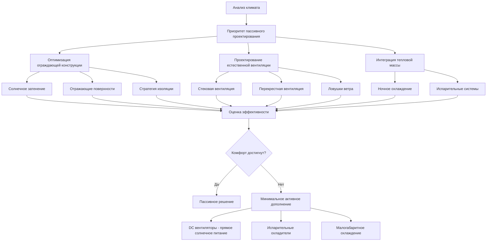

# Решения HVAC для приложений в развивающихся странах

Климатический контроль в развивающихся регионах требует принципиально иных инженерных подходов, чем традиционное проектирование HVAC. Ограничения ресурсов — ограниченная электроснабжающая инфраструктура, доступность капитала, технический опыт и возможности обслуживания — требуют решений, основанных на принципах пассивной физики, надежной простоте и локальной адаптивности. В этом разделе рассматриваются стратегии управления температурой, оптимизированные для развивающихся экономик, где традиционное кондиционирование воздуха остается экономически или технически нецелесообразным.

## Реальность тепловой нагрузки в жарком климате

Развивающиеся регионы концентрируются в тропических и субтропических зонах, где спрос на охлаждение доминирует. Типичная сельская конструкция в странах Африки к югу от Сахары или Юго-Восточной Азии испытывает пиковые нагрузки охлаждения 80–150 Вт/м² при прямом солнечном облучении. Фундаментальное уравнение баланса теплоты определяет условия в помещении:

$$Q_{total} = Q_{solar} + Q_{conduction} + Q_{infiltration} + Q_{internal} - Q_{ventilation}$$

Где солнечная радиация через неизолированные крыши составляет 40–60% от общего прироста тепла в легкой конструкции. Снижение $Q_{solar}$ пассивными средствами дает большее влияние, чем активное охлаждение в условиях ограниченных ресурсов.

## Механизмы пассивного охлаждения

### Удаление тепла, управляемое вентиляцией

Естественная вентиляция использует эффект стека и перепады давления, вызванные ветром. Объемный расход воздуха через отверстия следует уравнению:

$$\dot{V} = C_d A \sqrt{2g\Delta H \frac{\Delta T}{T_{avg}}}$$

Где:
- $C_d$ = коэффициент расхода (0,6–0,65 для типичных отверстий)
- $A$ = свободная площадь отверстий (м²)
- $g$ = ускорение свободного падения (9,81 м/с²)
- $\Delta H$ = вертикальное расстояние между входом и выходом (м)
- $\Delta T$ = разность температур внутри/снаружи (K)
- $T_{avg}$ = средняя абсолютная температура (K)

Высота стека в 4 метра с площадью отверстия 1 м² и перепадом температуры 3°C генерирует примерно 0,8 м³/с воздушного потока — достаточно для поддержания приемлемых условий в помещении площадью 50 м², если внутренняя теплогенерация остается ниже 2 кВт.

### Стратегии радиационного охлаждения

Радиация в ночное небо обеспечивает теплоприемник при эффективных температурах на 10–30°C ниже окружающей среды. Мощность радиационного охлаждения следует принципам Стефана-Больцмана:

$$q_{rad} = \varepsilon \sigma (T_{surface}^4 - T_{sky}^4)$$

При излучательной способности поверхности $\varepsilon$ = 0,9 и условиях ясного неба горизонтальные поверхности отводят 80–120 Вт/м² ночью. Связь с тепловой массой улавливает это охлаждение для подавления температуры в дневное время.

## Рамки надлежащей технологии

## Матрица сравнения технологий

| Стратегия | Капитальные затраты | Эксплуатационные затраты | Мощность охлаждения | Требование инфраструктуры | Сложность обслуживания |
|----------|--------------|----------------|------------------|----------------------------|------------------------|
| Естественная вентиляция | Очень низкие | Нулевые | 20–40 Вт/м² | Отсутствует | Минимальная |
| Тепловая масса + ночная вентиляция | Низкие | Нулевые | 30–50 Вт/м² | Отсутствует | Минимальная |
| Прямое испарительное охлаждение | Низкие | Низкие | 100–200 Вт/м² | Водоснабжение | Низкая |
| Непрямое испарительное | Средние | Низкие | 150–250 Вт/м² | Вода + электричество | Средняя |
| DC солнечные вентиляторы | Средние | Нулевые | Только вентиляция | Солнечные панели | Низкая |
| Малая сплит-система AC (солнечная) | Высокие | Средние | 2000–3500 Вт | Солнечная + аккумулятор | Средняя-Высокая |
| Мини-сплит AC (сеть) | Средние-Высокие | Высокие | 2000–5000 Вт | Надежная сеть | Средняя |

## Ограничения энергии и интеграция солнечной энергии

Электроснабжение сети в сельских развивающихся регионах в среднем доступно 4–12 часов в день с колебаниями напряжения ±20%. Солнечные фотоэлектрические системы обеспечивают надежность, но требуют рентабельной интеграции. Базовая система охлаждения для комфорта требует:

$$E_{daily} = \frac{Q_{cooling} \times t_{operation}}{\text{COP}} + P_{fans} \times t_{operation}$$

Для помещения площадью 20 м², требующего пикового охлаждения 1,5 кВт, работающего 8 часов в день с COP = 2,5:

$$E_{daily} = \frac{1500 \times 8}{2,5} + 40 \times 8 = 5120 \text{ Вт·ч}$$

Это требует примерно 1,2 кВп солнечной мощности с накопителем емкостью 400 Ач при 24 В — представляя значительные капитальные инвестиции относительно местных доходов.

## Эффективность испарительного охлаждения

Прямое испарительное охлаждение обеспечивает рентабельное чувственное охлаждение в засушливых климатах. Теоретическое снижение температуры следует уравнению:

$$\Delta T = \eta (T_{db} - T_{wb})$$

Где $\eta$ представляет эффективность насыщения (0,7–0,85 для прокладочных систем). В климате с температурой сухого термометра 40°C и влажного термометра 24°C:

$$\Delta T = 0,75 \times (40 - 24) = 12°C$$

Достижение температуры подачи 28°C без механического охлаждения. Однако этот подход не работает во влажных тропических климатах, где температура влажного термометра превышает 26°C.

## Применение стандартов ASHRAE

Стандарт ASHRAE 55 для тепловых зон комфорта требует модификации для контекстов развивающихся стран. Адаптивные модели комфорта позволяют более высокие эффективные температуры (28–32°C) при контроле занятыми лицами воздушного потока и наличии акклиматизации. Адаптивная температура комфорта:

$$T_{comfort} = 0,31 \times T_{outdoor,mean} + 17,8$$

Для тропических регионов со средней наружной температурой 30°C приемлемые температуры в помещении достигают 27°C при движении воздуха — достижимо через низкоэнергетические системы вентиляторов, а не кондиционирование воздуха.

## Выбор материалов для жарких климатов

Материалы крыши и стен доминируют над тепловыми характеристиками в легкой конструкции. Солнечная отражаемость (альбедо) и тепловая эмиссия определяют прирост тепла:

| Материал | Солнечная отражаемость | Тепловая эмиссия | Температура поверхности (40°C окружающей среды) |
|----------|-------------------|-------------------|-------------------------------------|
| Голый бетон | 0,30 | 0,90 | 62°C |
| Оцинкованный металл | 0,60 | 0,25 | 68°C |
| Металл, окрашенный в белый цвет | 0,70 | 0,90 | 48°C |
| Красная глиняная плитка | 0,35 | 0,90 | 58°C |
| Соломенная крыша | 0,40 | 0,90 | 54°C |

Кровля белого или светлого цвета снижает проводимое поступление тепла на 40–60% по сравнению с голым металлом, представляя наиболее рентабельное вмешательство.

## Сохранение воды при охлаждении

Испарительные системы потребляют 4–8 литров на киловатт-час чувственного охлаждения. В регионах с дефицитом воды это ограничение отдает предпочтение сухим технологиям охлаждения. Замкнутые системы непрямого испарительного охлаждения снижают потребление на 60–70%, сохраняя эффективность.

## Проблемы внедрения

Технический успех зависит от местной способности к установке и обслуживанию. Системы, требующие обработки хладагента, электрической диагностики или сложного управления, выходят из строя без подготовленных технических специалистов. Надежные конструкции отдают приоритет:

- Механической простоте с минимальным количеством движущихся частей
- Локально доступным сменным компонентам
- Эксплуатации без специализированных инструментов
- Пассивным режимам отказоустойчивости
- Визуальным показателям производительности

Оптимальное решение HVAC для развивающихся стран уравновешивает физические основы с экономической реальностью, отдавая приоритет пассивному управлению температурой в дополнение к минимальным активным системам, когда требования комфорта превышают пассивные возможности.
