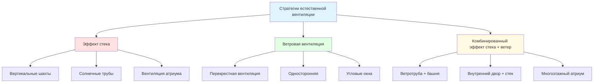
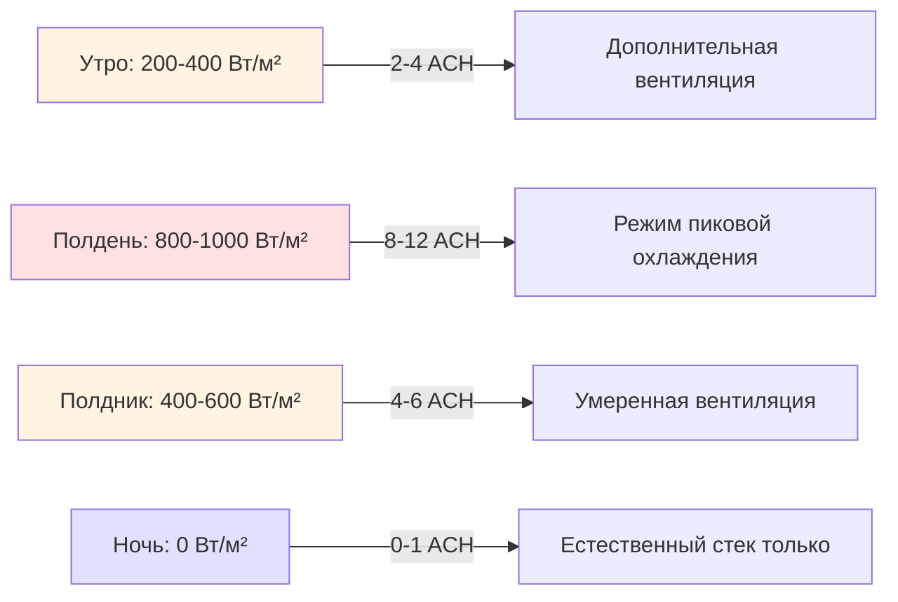
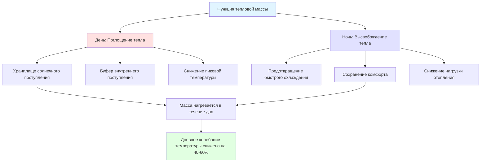

HVAC надлежащей технологии подчеркивает простые, легко поддерживаемые на местном уровне решения для климат-контроля, которые минимизируют энергопотребление, капитальные затраты и техническую сложность, одновременно максимизируя тепловой комфорт. Эти подходы интегрируют основанные на физике пассивные стратегии с традиционными методами строительства, адаптированными к современным требованиям производительности.

## Основы пассивного охлаждения

### Пути теплопередачи

Пассивное охлаждение манипулирует тремя механизмами теплопередачи для отвода нагрузок здания без механического охлаждения:

**Кондуктивный отвод тепла:**

$q = \frac{k \cdot A \cdot \Delta T}{L}$

Где:
- q = скорость теплопередачи (Вт)
- k = теплопроводность (Вт/м·K)
- A = площадь поверхности (м²)
- ΔT = разность температур (K)
- L = толщина материала (м)

**Конвективное удаление тепла:**

$q = h \cdot A \cdot (T_s - T_{\infty})$

Где:
- h = коэффициент конвекции (Вт/м²·K)
- T_s = температура поверхности (K)
- T_∞ = температура жидкости (K)

**Радиационный обмен теплом:**

$q = \epsilon \cdot \sigma \cdot A \cdot (T_s^4 - T_{sky}^4)$

Где:
- ε = излучательная способность поверхности (безразмерная)
- σ = постоянная Стефана-Больцмана (5,67×10⁻⁸ Вт/м²·K⁴)
- T_sky = эффективная температура неба (K)

### Потенциал охлаждения по климатическим зонам

| Климатическая зона | Приоритет стратегии | Потенциал охлаждения | Стоимость внедрения |
|-------------------|-------------------|-------------------|------------------|
| Жаркий-сухой | Испарительное, радиационное | 80-120 Вт/м² пола | Низкая ($5-15/м²) |
| Жаркий-влажный | Вентилятивное, затенение | 40-60 Вт/м² пола | Очень низкая ($2-8/м²) |
| Умеренный-сухой | Ночное охлаждение, масса | 50-80 Вт/м² пола | Низкая ($8-20/м²) |
| Жаркий-умеренный | Смешанный режим | 60-90 Вт/м² пола | Умеренная ($15-35/м²) |

## Проектирование естественной вентиляции

### Поток, управляемый плавучестью

Эффект стека создает поток воздуха через вертикальные температурные градиенты. Разность давлений, управляющая потоком:

$\Delta P = \rho \cdot g \cdot H \cdot \frac{\Delta T}{T_{avg}}$

Где:
- ΔP = дифференциал давления (Па)
- ρ = плотность воздуха (1,2 кг/м³ на уровне моря)
- g = ускорение свободного падения (9,81 м/с²)
- H = разница высоты между входом и выходом (м)
- ΔT = разность температур между входом и выходом (K)
- T_avg = средняя абсолютная температура (K)

**Объемный расход воздуха:**

$\dot{Q} = C_d \cdot A \cdot \sqrt{2 \cdot g \cdot H \cdot \frac{\Delta T}{T_{avg}}}$

Где:
- Q̇ = объемный поток (м³/с)
- C_d = коэффициент выброса (0,6-0,7 для острокромочных отверстий)
- A = эффективная площадь отверстия (м²)

### Параметры проектирования для вентиляции стека

| Параметр | Минимум | Оптимум | Максимум |
|---------|---------|---------|---------|
| Высота дифференциала | 2 м | 4-8 м | 15 м |
| Площадь входного отверстия | 0,5% площади пола | 2-4% площади пола | 8% площади пола |
| Соотношение выход/вход | 1,0 | 1,2-1,5 | 2,0 |
| Разность температур | 2 K | 5-8 K | 15 K |
| Воздухообмены в час | 3 ACH | 6-12 ACH | 20 ACH |

**Практическая производительность:** Высота стека 5 м с разностью температур 3 K создает примерно 2,5 Па движущего давления, достаточно для 4-8 ACH в типичном жилищном строительстве.

### Ветровая вентиляция

Давление ветра на фасады зданий создает перепады давления, используемые для перекрестной вентиляции:

$\Delta P = C_p \cdot \frac{1}{2} \cdot \rho \cdot v^2$

Где:
- C_p = коэффициент давления (-0,8 до +0,8, зависит от фасада)
- v = скорость ветра (м/с)

**Объемный поток через отверстия:**

$\dot{Q} = C_d \cdot A \cdot \sqrt{\frac{2 \cdot \Delta P}{\rho}}$

**Эффективность перекрестной вентиляции** зависит от:
- Расположения отверстий (высокое давление с наветренной стороны, низкое давление с подветренной стороны)
- Соотношения размеров отверстий (сбалансированный поток: 1:1, повышенная скорость: меньший выход)
- Внутренних препятствий (перегородки снижают поток на 30-60%)
- Угла падения ветра (максимальная эффективность при 45-90° к фасаду)

## Системы ветротруб (Baud-Geer)

### Принципы традиционного проектирования

Ветротрубы захватывают преобладающие ветры на уровне крыши и направляют поток воздуха в занятые пространства. Ближневосточные конструкции объединяют захват ветра с испарительным охлаждением и тепловой массой.

**Базовые конфигурации ветротруб:**

| Тип | Направление | Высота | Применение | Улучшение охлаждения |
|----|-----------|--------|-----------|-------------------|
| Однонаправленная | Одиночное отверстие | 4-8 м | Постоянный ветер | Только прием |
| Двунаправленная | Два противоположных | 5-10 м | Переменный ветер | Прием/выпуск |
| Многонаправленная | Четыре отверстия | 6-12 м | Сложный ветер | Всенаправленная |
| Ветротруба + шахта | Башня + подвал | 8-15 м | Жаркий-сухой климат | Испарительное + стек |

### Анализ производительности

Скорость воздуха через ветротрубу:

$v_{interior} = C_d \cdot v_{exterior} \cdot \sqrt{\frac{A_{capture}}{A_{interior}}}$

**Типичное снижение скорости:** Наружный ветер 3-5 м/с создает внутренние скорости 0,8-1,5 м/с, достаточные для улучшения комфорта за счет конвективного охлаждения.

**Эффект конвективного охлаждения на находящихся в помещении:**

При 35°C окружающей среды и скорости воздуха 1,2 м/с конвективное и испарительное удаление тепла от находящихся в помещении увеличивается примерно на 40%, эквивалентно снижению воспринимаемой температуры на 3-4 K.

### Улучшенные конструкции ветротруб

**Интеграция испарительного охлаждения:**
- Смоченные пористые керамические вставки в шахте ветротруба
- Снижение температуры: 5-10 K в жаркий-сухом климате
- Расход воды: 2-5 л/ч на 100 м³/ч потока воздуха
- Эффективность ограничена влажностью (оптимальная влажность <35%)

**Подземное охлаждение воздуха:**
- Вход ветротруба подключен к подземной камере
- Глубина камеры: 3-4 м ниже уровня земли
- Снижение температуры: 8-12 K в жаркомкclimat
- Время пребывания воздуха: 15-30 секунд для эффективной теплопередачи

**Сравнение затрат:**

| Конфигурация | Капитальные затраты | Эксплуатационные затраты | Мощность охлаждения | Техническое обслуживание |
|-------------|----------------|-------------------|------------------|----------------------|
| Базовая ветротруба | $200-500 | $0/год | 30-50 Вт/м² пола | Минимальное |
| + Испарительное | $400-800 | $20-40/год | 50-80 Вт/м² пола | Низкое |
| + Подземное | $800-1,500 | $0/год | 60-100 Вт/м² пола | Минимальное |
| Обычный AC | $1,500-3,000 | $300-600/год | 100-150 Вт/м² пола | Умеренное |

## Вентиляция солнечной трубы

### Принцип работы

Солнечные трубы используют солнечное излучение для нагрева воздуха в вертикальном канале, создавая управляемый плавучестью восходящий поток, который индуцирует вентиляцию через здание.

**Солнечный теплоприем в солнечной трубе:**

$q_{solar} = \alpha \cdot I \cdot A_{absorber} \cdot \eta_{thermal}$

Где:
- α = абсорбция поверхности абсорбера (0,85-0,95 для селективных покрытий)
- I = падающее солнечное облучение (Вт/м²)
- A_absorber = площадь поверхности абсорбера (м²)
- η_thermal = тепловая эффективность (0,40-0,65 типичная)

**Повышение температуры в трубе:**

$\Delta T = \frac{q_{solar}}{\dot{m} \cdot c_p}$

Где:
- ṁ = массовый расход (кг/с)
- c_p = удельная теплоемкость воздуха (1 005 Дж/кг·K)

**Индуцированная скорость массового потока:**

$\dot{m} = C_d \cdot A_{chimney} \cdot \sqrt{2 \cdot g \cdot H \cdot \rho \cdot \frac{\Delta T}{T_{avg}}}$

### Параметры проектирования

| Параметр | Малый масштаб | Средний масштаб | Крупный масштаб |
|---------|------------|-------------|-------------|
| Высота трубы | 2-4 м | 4-8 м | 8-15 м |
| Ширина канала | 0,15-0,30 м | 0,30-0,60 м | 0,60-1,20 м |
| Остекление | Одинарное прозрачное | Двойное прозрачное | Двойное Low-e |
| Абсорбер | Черная краска | Селективное покрытие | Селективное + ребра |
| Расход | 50-150 м³/ч | 150-500 м³/ч | 500-2 000 м³/ч |
| Повышение температуры | 10-20 K | 15-25 K | 20-35 K |
| ACH обеспеченные | 2-4 | 4-8 | 8-15 |

**Пиковая производительность:** Солнечная труба высотой 6 м и облучением 800 Вт/м² может создавать повышение температуры 20-25 K, производя 8-12 ACH для помещения площадью 100 м².

### Профиль дневной производительности

**Интеграция тепловой массы:** Внедрение 100-200 мм бетона в абсорбер солнечной трубы продлевает работу на 2-4 часа после захода солнца, сохраняя вентиляцию в вечерние часы.

## Пассивное солнечное отопление

### Системы прямого поступления

Остекление, обращенное на юг (северное полушарие), допускает солнечное излучение, которое нагревает внутреннюю тепловую массу. Масса накапливает тепло в течение дня и высвобождает его ночью, модерируя колебания температуры.

**Солнечный теплоприем:**

$q_{gain} = SHGC \cdot A_{glazing} \cdot I \cdot \tau_{glazing}$

Где:
- SHGC = коэффициент солнечного теплоприема (0,60-0,80 для одинарного остекления)
- τ_glazing = пропускание остекления (0,85-0,90 для прозрачного стекла)

**Требуемая тепловая масса для модерирования температуры:**

$m = \frac{q_{gain} \cdot t}{c_p \cdot \Delta T_{acceptable}}$

Где:
- t = период хранения (типично 8-12 часов)
- ΔT_acceptable = приемлемое колебание температуры (6-8 K)

**Практическое определение размера:** Для 10 м² остекления на юг, получающего среднее облучение 600 Вт/м² в течение 6 часов, требуемая тепловая масса составляет примерно 5 000 кг (5 м³ бетона при толщине 100 мм, распределенном по площади пола 50 м²).

### Косвенный поступление: стены Trombe

Стены Trombe размещают тепловую массу непосредственно за остеклением, отделенную воздушным зазором. Солнечно-нагретая масса передает тепло в интерьер через кондукцию и термоциркуляцию через вентиляционные отверстия.

**Теплопередача через стену Trombe:**

$q = \frac{A \cdot \Delta T}{R_{total}}$

Где общее тепловое сопротивление включает:
- Остекление полости (0,15-0,20 м²·K/Вт)
- Каменная масса (0,05-0,10 м²·K/Вт на 100 мм)
- Внутренняя пленка поверхности (0,12 м²·K/Вт)

**Термоциркуляция через вентиляционные отверстия:**

Вентиляционные отверстия в верхней и нижней части стены позволяют естественному контуру конвекции:
- Нижнее отверстие: прохладный воздух помещения входит в полость
- Воздух нагревается в полости теплой массой
- Верхнее отверстие: теплый воздух возвращается в помещение
- Скорость потока: 20-40 м³/ч на м² стены при облучении 800 Вт/м²

### Сравнение конструкций

| Тип системы | Капитальные затраты | Подача тепла | Временной сдвиг | Управление | Сложность |
|-----------|----------------|------------|-----------|----------|----------|
| Прямое поступление | Низкая ($50-100/м²) | Немедленная | Минимальный | Простой затвор | Очень простая |
| Стена Trombe | Умеренная ($150-250/м²) | Постепенная | 6-10 часов | Работа вентиля | Простая |
| Солнечное пространство | Высокая ($300-500/м²) | Переменная | 2-4 часа | Двери/вентили | Умеренная |
| Изолированный поступление | Высокая ($400-700/м²) | Контролируемая | Минимальный | Активное распределение | Сложная |

**Климатическая пригодность:**
- Холодный-солнечный: Все системы эффективны
- Холодный-облачный: Требуется дополнительное отопление независимо от пассивного проектирования
- Умеренный: Прямое поступление и солнечное пространство оптимальны (отопление + естественное освещение)
- Жаркий-сухой: Стена Trombe с ночной вентиляцией для охлаждения

## Земляная связь для модерирования температуры

### Профили температуры грунта

Ниже глубины промерзания (типично 1,5-2,5 м) температура почвы стабилизируется близко к среднегодовой температуре воздуха. Этот тепловой резервуар обеспечивает отопление зимой и охлаждение летом.

**Температура почвы на глубине:**

$T(z,t) = T_{mean} + A_s \cdot e^{-z\sqrt{\frac{\pi}{365 \cdot \alpha}}} \cdot \cos\left[\frac{2\pi}{365}(t - t_0 - \frac{z}{2}\sqrt{\frac{365}{\pi \cdot \alpha}})\right]$

Где:
- T_mean = среднегодовая температура воздуха (K)
- A_s = амплитуда температуры поверхности (K)
- z = глубина ниже поверхности (м)
- α = термическая диффузивность почвы (м²/день)
- t = время (дни)
- t_0 = фазовый сдвиг (дни)

**Практические значения:**
- На глубине 3 м колебание температуры <2 K ежегодно
- На глубине 5 м температура практически постоянна в течение года
- Термическая диффузивность: 0,05-0,15 м²/день (зависит от содержания влаги)

### Реализация земляной трубы

**Эффективность теплопередачи:**

$\epsilon = 1 - e^{-\frac{U \cdot A}{\dot{m} \cdot c_p}}$

Где:
- U = общий коэффициент теплопередачи (8-15 Вт/м²·K для погруженных труб)
- A = площадь внутренней поверхности трубы (м²)
- ṁ = массовый расход воздуха (кг/с)

**Снижение температуры:**

$T_{out} = T_{soil} + (T_{in} - T_{soil}) \cdot (1 - \epsilon)$

**Оптимальные конфигурации:**

| Параметр | Летнее охлаждение | Зимнее отопление | Круглогодичное |
|---------|-----------------|-----------------|-------------|
| Глубина | 2,5-3,5 м | 3,0-4,0 м | 3,5-4,5 м |
| Длина | 20-35 м | 25-40 м | 30-45 м |
| Диаметр | 200-300 мм | 250-350 мм | 250-350 мм |
| Расход воздуха | 100-300 м³/ч | 150-400 м³/ч | 200-400 м³/ч |
| Уклон | 2-3% | 2-3% | 2-3% |

**Ожидания производительности:**
- Лето: 6-10 K охлаждения в жаркомкленты
- Зима: 4-8 K предварительного нагрева в холодномклимате
- Мощность вентилятора: 100-200 Вт для типичного жилого приложения
- Эквивалент охлаждения: 1,5-2,5 т без хладагента

### Земляно-защищенное строительство

**Подземные здания** используют постоянную земляную температуру для пассивной термической стабильности:

**Снижение теплопотерь:**

$q = U \cdot A \cdot (T_{interior} - T_{ground})$

Где T_ground ≈ T_mean снижает нагрузки на отопление/охлаждение на 40-70% в сравнении с надземным строительством.

**Рассмотрения проектирования:**
- Гидроизоляция критична (бентонит, мембраны, дренаж)
- Структурные нагрузки от грунтового перекрытия (1 800-2 000 кг/м³)
- Естественное освещение через световые колодцы, верхние окна
- Вентиляция необходима (нет естественной инфильтрации)
- Смягчение радона в затронутых регионах

**Премия за стоимость строительства:** 15-30% выше обычного, компенсируется 50-80% снижением энергии HVAC в течение жизни здания.

## Стратегии тепловой массы

### Теплоемкость и снижение колебания температуры

Тепловая масса поглощает тепло в периоды избыточного поступления и высвобождает тепло в периоды дефицита, модерируя температуру в помещении.

**Емкость теплового хранилища:**

$Q = m \cdot c_p \cdot \Delta T$

**Эффективная тепловая масса** зависит от:
- Удельная теплоемкость материала
- Плотность материала
- Открытая площадь поверхности
- Связь с воздухом помещения (конвективная теплопередача)
- Дневная активация (цикл ежедневной зарядки/разрядки)

### Сравнение материалов

| Материал | Плотность (кг/м³) | Удельная теплоемкость (Дж/кг·K) | Объемная емкость (МДж/м³·K) | Стоимость ($/м³) |
|---------|-----------------|---------------------------|-------------------------|------------|
| Бетон | 2 300 | 880 | 2,02 | $100-150 |
| Кирпич | 1 800 | 840 | 1,51 | $120-200 |
| Глинобитный кирпич | 1 600 | 840 | 1,34 | $40-80 |
| Трамбованная земля | 2 000 | 880 | 1,76 | $60-120 |
| Камень | 2 500 | 840 | 2,10 | $150-300 |
| Вода | 1 000 | 4 180 | 4,18 | $5-15 |
| Материал с изменением фазы | 800-900 | 2 000 + скрытая теплота | 8-15 (эффективная) | $800-2 000 |

**Вода обеспечивает максимальное тепловое хранилище на единицу объема**, но требует герметичного контейнера и имеет ограничения по структурной целостности.

**Материалы с изменением фазы (PCM)** поглощают/высвобождают большое количество скрытой теплоты при определенных температурах, обеспечивая улучшенный тепловой буфер в узких температурных диапазонах.

### Оптимальное распределение массы

**Размещение внутренней массы:**
- Максимальное воздействие солнца для систем прямого поступления
- Распределено по пространству для общей модерации температуры
- Толщина: 100-200 мм оптимальна (более 250 мм дает убывающей возврат)
- Соотношение поверхности к объему: выше лучше для быстрой зарядки/разрядки

**Требуемая масса для снижения колебания температуры:**

Для помещения 50 м² с пиковым внутренним поступлением 3 кВт в течение 8 часов и целевым колебанием температуры 6 K:

$m = \frac{3 000 \text{ Вт} \times 8 \times 3 600 \text{ с}}{880 \text{ Дж/кг·K} \times 6 \text{ K}} = 16 400 \text{ кг}$

Это соответствует примерно 7 м³ бетона или толщине 100 мм над площадью поверхности 70 м² (стены, полы в совокупности).

## Интегрированное проектирование системы

### Выбор климатически приемлемой стратегии

| Климат | Приоритет отопления | Приоритет охлаждения | Вентиляция | Оптимальная интеграция |
|--------|------------------|------------------|-----------|---------------------|
| Жаркий-сухой | Минимальный | Высокий | Умеренный | Ветротруба + испарительное + масса |
| Жаркий-влажный | Минимальный | Высокий | Критический | Перекрестная вентиляция + затенение |
| Холодный-сухой | Критический | Минимальный | Контролируемая | Пассивное солнце + масса + земляная связь |
| Умеренный | Умеренный | Умеренный | Сезонная | Смешанный режим + масса + ночной пролив |
| Жаркий-умеренный | Низкий | Высокий | Важный | Солнечная труба + стек + затенение |

### Метрики производительности

**Тепловая автономия** (процент часов в пределах диапазона комфорта без активного HVAC):

- Только пассивное проектирование: 40-60% в большинстве климатов
- Пассивное + надлежащая технология: 60-80% в благоприятных климатах
- Пассивное + низкоэнергетическое механическое: 80-95% во всех климатах
- Обычный HVAC: 95-100% (высокая стоимость энергии)

**Сравнение рентабельности** (30-летний жизненный цикл, жаркийклимат):

| Подход | Капитал | Энергия | Техническое обслуживание | Всего | Тепловая автономия |
|--------|---------|--------|----------------------|-------|-----------------|
| Только пассивное | $2 000 | $3 000 | $500 | $5 500 | 50% |
| Надлежащая технология | $5 000 | $6 000 | $2 000 | $13 000 | 75% |
| Mini-split AC | $3 000 | $24 000 | $3 000 | $30 000 | 100% |
| Центральный AC | $8 000 | $36 000 | $6 000 | $50 000 | 100% |

**Ценностное предложение:** Системы надлежащей технологии обеспечивают 75% комфорта при 26% стоимости жизненного цикла в сравнении с центральным кондиционированием воздуха.

## Рассмотрения внедрения

### Использование локальных материалов

**Преимущества:**
- Сниженные расходы на транспортировку и воплощенная энергия
- Поддержка местной экономики и навыков
- Культурная приемлемость и принятие
- Упрощенные цепочки поставок и ремонт

**Критерии оценки материалов:**
- Тепловая производительность (проводимость, емкость, стабильность)
- Структурная адекватность для приложения
- Долговечность в местном климате
- Доступность и стоимость
- Обрабатываемость с помощью локальных навыков

### Требования к техническому обслуживанию

| Технология | Частота | Уровень навыка | Стоимость/год | Критические отказы |
|-----------|---------|------------|-----------|-------------------|
| Естественная вентиляция | Ежегодно | Низкий | <$50 | Заблокированные отверстия, сетки насекомых |
| Ветротруба | 2-3 года | Низкий | <$100 | Накопление обломков, отказ дросселя |
| Солнечная труба | 2-5 лет | Низкий-умеренный | $50-150 | Разбивка остекления, отказ уплотнения |
| Земляные трубы | 5 лет | Умеренный | $100-200 | Забивание фильтра, проблемы конденсата |
| Тепловая масса | 10+ лет | Низкий | <$50 | Деградация поверхности, минимальный риск |
| Пассивное солнце | 3-5 лет | Низкий-умеренный | $100-300 | Остекление, подвижная изоляция |

**Проектирование для доступа обслуживания:** Критично для долгосрочной производительности, особенно в условиях с ограниченными ресурсами, где замена компонентов может быть затруднена.

### Обучение пользователей и задействование

**Требования к эксплуатации:**
- Понимание сезонной работы системы (летний и зимний режимы)
- Ручное управление вентилями, дроссельными заслонками, затенением
- Распознавание оптимальных условий работы
- Базовые способности по устранению неполадок

**Культурная интеграция:**
- Соответствие традиционной практике, где применимо
- Четко демонстрируйте преимущества производительности
- Предоставьте визуальные индикаторы функции системы
- Спроектируйте для интуитивной работы

## Трансфер технологии и адаптация

### Критерии надлежащей технологии (рамка Шумахера)

1. **Малый масштаб:** Пригодна для домохозяйства или малого общинного внедрения
2. **Трудоинтенсивная:** Использует местную рабочую силу, создает занятость
3. **Низкий капитал:** Доступные первоначальные инвестиции
4. **Энергоэффективная:** Минимальное требуемое эксплуатационное энергопотребление
5. **Простая:** Локально поддерживаемая без специализированного опыта
6. **Локальные материалы:** Использует регионально доступные ресурсы
7. **Децентрализованная:** Независимая работа, устойчивая к отказам инфраструктуры

### Примеры успешного внедрения

**Ближневосточные ветротрубы:**
- Традиционные конструкции адаптированы с современными материалами
- Интеграция с механической резервной системой
- Продемонстрировано 60-80% снижение энергии против полного AC
- Культурная приемлемость позволяет широкое внедрение

**Индийское испарительное охлаждение:**
- Пассивные башни испарительного охлаждения с нисходящим потоком
- Смоченная трава khus (ветивер) для испарения
- Нулевая стоимость эксплуатации за исключением воды ($0,10-0,20/день)
- Достигает 8-12 K снижения температуры

**Восточноафриканское земляное строительство:**
- Стабилизированные земляные блоки с 5-8% цементом
- Высокая тепловая масса, низкая воплощенная энергия
- 50-70% снижение нагрузок охлаждения
- Стоимость материала: $20-40/м³ против $120+ для бетонных блоков

Надлежащая технология HVAC предоставляет жизнеспособный тепловой комфорт в условиях с ограниченными ресурсами через основанные на физике пассивные стратегии, традиционные методы, подтвержденные современным анализом, и локально поддерживаемые системы. Успех требует осторожного соответствия технологии климату, материалов контексту и проектирования способностям пользователя.

## Компоненты

- Стратегии пассивного охлаждения
- Проектирование естественной вентиляции
- Испарительное охлаждение с низкой стоимостью
- Вентиляция солнечной трубы
- Традиционные конструкции ветротруб
- Охлаждение земляной связью
- Пассивное солнечное отопление
- Строительство тепловой массы
