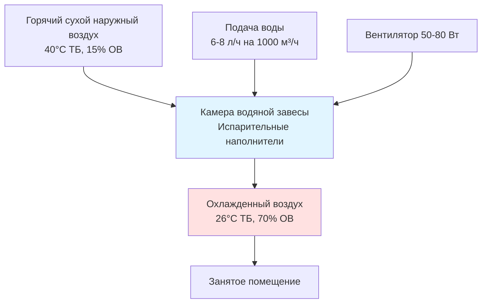

## Обзор

Проектирование систем HVAC с ограниченными ресурсами решает проблемы климатического контроля в развивающихся регионах, где финансовые ограничения, ненадежная электрическая инфраструктура, ограниченная техническая квалификация и ограничения цепочки поставок требуют принципиально отличных инженерных подходов. Эффективное проектирование приоритизирует пассивные стратегии, материалы локального производства, минимальное потребление энергии и простоту обслуживания, обеспечивая при этом необходимый тепловой комфорт и качество воздуха в помещении.

## Основные ограничения проектирования

### Экономические ограничения

Ограничения капитальных затрат обычно ограничивают расходы на HVAC до 2-5% от общей стоимости здания на развивающихся рынках в сравнении с 15-25% в развитых экономиках. Чувствительность к затратам на эксплуатацию требует систем с минимальным потреблением энергии из-за высокой стоимости электроэнергии относительно уровня доходов.

**Иерархия оптимизации первоначальных затрат:**

1. Пассивные архитектурные особенности (ориентация здания, тепловая масса, затенение)
2. Системы естественной вентиляции с минимальным механическим оборудованием
3. Испарительное охлаждение, где это климатически уместно
4. Высокоэффективные вентиляторы для циркуляции воздуха
5. Механическое охлаждение только для критических применений

### Проблемы инфраструктуры

Надежность электросети значительно варьируется в развивающихся регионах. Проектирование должно учитывать:

- Колебания напряжения: ±20-30% от номинального
- Частые перерывы в электроснабжении: 2-10 отключений в день в некоторых регионах
- Низкое качество электроэнергии: гармоники, дисбаланс фаз, переходные процессы
- Отсутствие или ограниченная доступность трехфазного питания в сельской местности

**Требования к допустимому рабочему напряжению:**

$V_{operating} = V_{nominal} \pm 0.25 V_{nominal}$

Оборудование должно работать в этом диапазоне без устройств защиты, так как стабилизаторы напряжения добавляют неприемлемые затраты.

### Ограничения технической подготовки

Ограниченная доступность квалифицированных техников требует проектирования, которое минимизирует:

- Работу с хладагентом (обнаружение утечек, заправка, восстановление)
- Электронные органы управления и датчики
- Требования к специализированному диагностическому оборудованию
- Сложные процедуры ввода в эксплуатацию

## Пассивные стратегии охлаждения

### Использование тепловой массы

Конструкция с высокой тепловой массой (глинобитная кирпич, утрамбованная земля, бетон) обеспечивает суточную стабилизацию температуры в климатах с большими колебаниями между днем и ночью.

**Емкость накопления тепла:**

$Q_{stored} = \rho V c_p \Delta T$

Где:
- ρ = плотность материала (кг/м³)
- V = объем (м³)
- c_p = удельная теплоемкость (Дж/кг·К)
- ΔT = температурный перепад (К)

Для стены из бетона толщиной 300 мм (10 м²):

$Q_{stored} = 2400 \times 3 \times 840 \times 8 = 48,4 \text{ МДж}$

Это накопление тепла снижает колебания температуры в помещении на 4-6°C при надлежащей сочетании с ночной вентиляцией.

### Проектирование естественной вентиляции

Вентиляция, приводимая в движение тепловым напором и ветром, исключает потребление механической энергии при обеспечении адекватного воздухообмена для комфорта и качества воздуха в помещении.

**Воздушный поток при естественной тяге:**

$Q = C_d A \sqrt{2 g H \frac{\Delta T}{T_{average}}}$

Где:
- C_d = коэффициент расхода (0,6-0,65)
- A = эффективная площадь открытия (м²)
- g = ускорение свободного падения (9,81 м/с²)
- H = вертикальное расстояние между отверстиями (м)
- ΔT = разность температур внутри и снаружи (К)

Для H = 4 м, A = 2 м², ΔT = 5 К, T_avg = 303 К:

$Q = 0,62 \times 2 \times \sqrt{2 \times 9,81 \times 4 \times \frac{5}{303}} = 2,2 \text{ м}^3\text{/с} = 7920 \text{ м}^3\text{/ч}$

Это обеспечивает 8-12 воздухообменов в час для помещения площадью 100 м² с высотой потолка 3 м.

## Решения надлежащих технологий

### Системы испарительного охлаждения

Прямое и непрямое испарительное охлаждение обеспечивает снижение температуры на 8-15°C в жарком сухом климате (относительная влажность <40%) с минимальным энергопотреблением.

**Эффективность охлаждения:**

$\epsilon = \frac{T_{db,in} - T_{db,out}}{T_{db,in} - T_{wb,in}}$

Прямые испарительные охладители достигают ε = 0,70-0,85, требуя только мощности вентилятора (30-80 Вт/1000 м³/ч воздушного потока).

**Расход воды:**

$\dot{m}_{water} = \frac{\dot{m}_{air} (W_{out} - W_{in})}{1}$

Для воздушного потока 2000 м³/ч с увеличением коэффициента влажности на 10 г/кг:

$\dot{m}_{water} = \frac{2000 \times 1,2 \times 0,010}{3600} = 6,7 \text{ кг/ч}$

### Оптимизация потолочных вентиляторов

Потолочные вентиляторы повышают приемлемую уставку температуры на 2-4°C за счет увеличенной скорости воздуха, снижая или исключая требования к механическому охлаждению.

**Эффективное снижение температуры:**

$\Delta T_{effective} = 0,6 v^{0.5}$

Для v = 1,0 м/с скорости воздуха:

$\Delta T_{effective} = 0,6 \times 1,0^{0.5} = 0,6°C$

В сочетании с повышенной допустимой уставкой в развивающихся климатах (28-30°C приемлемо), потолочные вентиляторы (60-75 Вт) заменяют системы кондиционирования (1500-2500 Вт) для многих приложений.

## Низкоэнергетические механические системы

### Оборудование на постоянном токе

Интеграция фотоэлектрических панелей с компрессорами и вентиляторами на постоянном токе исключает потери инвертора (8-12%) и обеспечивает автономное действие.

**Сравнение эффективности системы:**

| Конфигурация | Стадии преобразования | Общая эффективность |
|--------------|----------------------|---------------------|
| Система переменного тока с питанием от сети | Генерация → Передача → Преобразование | 28-32% |
| Система переменного тока с солнечной панелью + инвертор | ФЭ → Инвертор постоянный/переменный ток → Оборудование переменного тока | 12-16% |
| Система постоянного тока с прямой солнечной панелью | ФЭ → Оборудование постоянного тока | 16-20% |

Системы постоянного тока достигают на 20-30% более высокой эффективности использования солнечной энергии, исключая преобразование инвертора.

### Компрессия с переменной скоростью

Компрессоры с частотным преобразователем снижают потребление энергии на 30-45% в сравнении с фиксированной скоростью за счет модуляции производительности, соответствующей колебаниям нагрузки.

**Сезонная энергетическая эффективность:**

$SEER = \frac{\sum Q_{cooling}}{\sum W_{input}}$

Бюджетные системы с частотным преобразователем достигают SEER = 4,0-4,5 (13,6-15,3 EER) в сравнении с SEER = 2,8-3,2 (9,5-10,9 EER) для эквивалентных фиксированных скоростей, оправдывая премию стоимости 15-25% сроком окупаемости 2-3 года.

## Выбор материалов и компонентов

### Материалы локального производства

Проектирование должно приоритизировать материалы и компоненты, доступные через местные цепочки поставок:

**Предпочтительная иерархия материалов:**

1. Конструктивные: Бетон, глиняный кирпич, местный природный камень
2. Изоляция: Рисовая шелуха, кокосовое волокно, спрессованная земля
3. Воздуховоды: Оцинкованная сталь, жесткий ПВХ
4. Трубопроводы: Мягкая сталь, ХПВХ (избегать медь из-за стоимости/кража)

### Устойчивость к коррозии

Прибрежные и влажные среды требуют повышенной защиты от коррозии без использования премиум-материалов:

- Конденсаторы и испарители с эпоксидным покрытием
- Конструктивная сталь с горячей гальванизацией
- Крепежные изделия из нержавеющей стали (марка 304 минимум)
- Защитные покрытия электрических компонентов

## Упрощенные органы управления

### Механические термостаты

Биметаллические термостаты исключают режимы отказа электроники и обеспечивают срок службы 20+ лет с точностью управления ±1-2°C, достаточной для большинства приложений.

**Сравнение стоимости:**

| Тип управления | Первоначальная стоимость | Годовой процент отказа | Стоимость замены |
|----------------|--------------------------|------------------------|------------------|
| Механический термостат | $8-15 | 0,5-1% | $8-15 |
| Базовый электронный | $25-40 | 3-5% | $25-40 |
| Программируемый электронный | $60-120 | 5-8% | $60-120 |

Анализ стоимости жизненного цикла за 10 лет убедительно благоприятствует механическим органам управления в приложениях с ограниченными ресурсами.

### Стратегии ручного управления

Управляемые пользователем заслонки, жалюзи и переключатели снижают сложность системы при обеспечении адаптации жильцов к местным предпочтениям и режимам использования.

## Упрощение обслуживания

### Принципы проектирования для обслуживания

Критерии выбора оборудования приоритизируют:

- Доступ к фильтрам без инструментов
- Минимальные требования к специализированным инструментам
- Визуальные индикаторы диагностики
- Стандартные размеры крепежа
- Модульная замена компонентов

### Графики профилактического обслуживания

Расширенные интервалы обслуживания снижают частоту вызовов техников:

- Очистка/замена фильтра: Ежемесячно → Ежеквартально
- Очистка катушки: Ежемесячно → Два раза в год
- Проверка хладагента: Ежеквартально → Ежегодно
- Проверка ремня: Ежемесячно → Ежеквартально (или исключить с прямым приводом)

## Оптимизация производительности

### Проектирование, специфичное для климата

Климатические зоны ASHRAE направляют выбор надлежащих технологий:

**Матрица пригодности технологии:**

| Климатическая зона | Основная стратегия | Вторичная стратегия | Избегать |
|-------------------|-------------------|---------------------|----------|
| Жарко-сухой (BWh, BSh) | Испарительное охлаждение | Тепловая масса | Герметичные здания |
| Жарко-влажный (Af, Am) | Естественная вентиляция | Потолочные вентиляторы | Испарительное охлаждение |
| Теплый-влажный (Aw) | Перекрестная вентиляция | Осушение | Высокая тепловая масса |
| Умеренный (Cfa, Cfb) | Тепловая масса | Пассивное солнце | Механическое охлаждение |

### Стратегии снижения нагрузки

Улучшения ограждающей конструкции зданий обеспечивают превосходную отдачу инвестиций в сравнении с модернизацией механических систем:

**Приоритеты снижения теплоприбыли:**

1. Изоляция крыши: Снижение нагрузки охлаждения на 40-50%, окупаемость 1-2 года
2. Внешнее затенение: Снижение нагрузки через окна на 30-40%, немедленная окупаемость
3. Отражающие поверхности: Снижение теплоприбыли крыши на 20-30%, окупаемость 2-3 года
4. Герметизация воздуха: Снижение нагрузки инфильтрации на 15-25%, окупаемость 1-2 года

**Тепловой поток через изоляцию крыши:**

$q = \frac{T_{outdoor} - T_{indoor}}{R_{total}}$

Добавление изоляции R-2,5 (RSI-0,44) к необработанной бетонной крыше:

$q_{before} = \frac{45 - 28}{0,15} = 113 \text{ Вт/м}^2$

$q_{after} = \frac{45 - 28}{2,65} = 6,4 \text{ Вт/м}^2$

Это снижение теплоприбыли на 94% исключает требования механического охлаждения для многих типов зданий.

## Рассмотрения при внедрении

### Поэтапная установка

Финансовые ограничения требуют поэтапного внедрения:

**Этап 1:** Пассивные меры (ориентация, затенение, тепловая масса, естественная вентиляция)

**Этап 2:** Низкоэнергетические активные системы (потолочные вентиляторы, испарительное охлаждение)

**Этап 3:** Механическое охлаждение только для критических помещений (спальни, зоны чувствительного оборудования)

Этот подход обеспечивает немедленные улучшения комфорта при распределении затрат на несколько бюджетных циклов.

### Местное производство

Поощрение местного производства простых компонентов HVAC (испарительные охладители, потолочные вентиляторы, воздуховоды) снижает затраты на 30-50% при одновременном укреплении региональной технической подготовки и создании занятости.

## Заключение

Проектирование систем HVAC с ограниченными ресурсами требует фундаментального переосмысления условных подходов. Успех требует приоритизации пассивных стратегий, минимизации потребления энергии, упрощения обслуживания и использования материалов локального производства и производственных возможностей. При надлежащем проектировании такие системы обеспечивают адекватный тепловой комфорт и качество воздуха в помещении при стоимости жизненного цикла на 60-80% ниже, чем обычные механические системы, обеспечивая при этом превосходную надежность в сложной инфраструктурной среде.

Физика теплопередачи, термодинамики и гидромеханики остаются постоянными независимо от экономического контекста. Проектирование с ограниченными ресурсами применяет эти принципы более тщательно, извлекая максимальную ценность из минимальных ресурсов через оптимизированные пассивные стратегии перед добавлением избирательного механического вмешательства только там, где это необходимо для здоровья и производительности жильцов.
