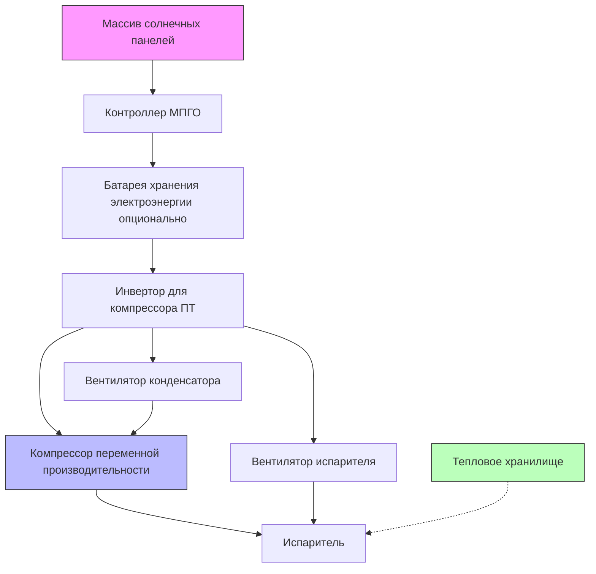
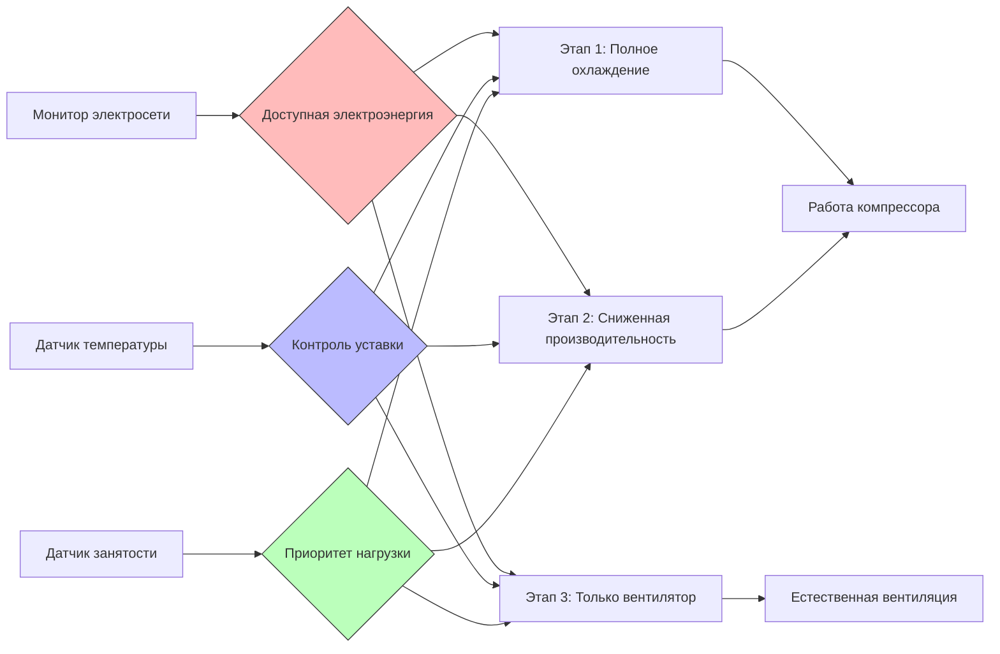

# Системы ОВКВ для электрификации сельских районов

Программы электрификации сельских районов в развивающихся регионах сталкиваются с уникальными проблемами при интеграции систем климатического контроля. Ограниченная пропускная способность сети, прерывистое электроснабжение и высокие расходы на инфраструктуру требуют специализированных подходов к ОВКВ, которые уравновешивают тепловой комфорт с энергетическими ограничениями.

## Характеристики источников электроснабжения

### Системы, подключенные к сельской электросети

Сельские электросети обычно демонстрируют колебания напряжения ±15-20% по сравнению с ±5% в городских районах. Эта изменчивость существенно влияет на производительность и долговечность оборудования ОВКВ.

**Влияние напряжения на производительность компрессора:**

Зависимость между изменением напряжения и холодопроизводительностью следует уравнению:

$$Q_{actual} = Q_{rated} \times \left(\frac{V_{actual}}{V_{rated}}\right)^{1.5}$$

где:
- $Q_{actual}$ = фактическая холодопроизводительность (Вт)
- $Q_{rated}$ = номинальная холодопроизводительность (Вт)
- $V_{actual}$ = фактическое напряжение сети (В)
- $V_{rated}$ = номинальное напряжение (В)

Снижение напряжения на 20% уменьшает холодопроизводительность примерно на 28%, в то время как потребление энергии снижается только на 16%, что приводит к снижению эффективности.

### Источники электроэнергии автономного снабжения

| Источник электроэнергии | Диапазон мощности | Коэффициент доступности | Начальная стоимость | Стоимость ТО |
|-------------------------|-------------------|------------------------|-------------------|-------------|
| Солнечная ФЭ | 1-10 кВт | 0,15-0,25 | Высокая | Низкая |
| Дизельный генератор | 5-50 кВт | 0,95 | Средняя | Высокая |
| Микро-ГЭС | 2-100 кВт | 0,70-0,90 | Высокая | Низкая |
| Ветротурбина | 1-20 кВт | 0,20-0,35 | Высокая | Средняя |
| Гибридные системы | Переменная | 0,60-0,85 | Высокая | Средняя |

## Системы ОВКВ на солнечной энергии

### Прямое солнечное охлаждение постоянного тока

Системы парокомпрессионного охлаждения с питанием от ФЭ устраняют потери преобразования ПТ-ПТ (обычно 8-12%), повышая общую эффективность системы. Компрессоры переменного тока постоянного тока модулируют производительность в зависимости от доступного солнечного излучения.

**Методология расчета размеров системы:**

Пиковая холодопроизводительность должна соответствовать производству фотоэлектрической системы при максимальном солнечном излучении:

$$P_{PV} = \frac{Q_{cool}}{\text{COP}_{system} \times \eta_{electrical} \times \eta_{wiring}}$$

где:
- $P_{PV}$ = требуемая мощность ФЭ массива (Вт)
- $Q_{cool}$ = расчетная холодопроизводительность (Вт)
- $\text{COP}_{system}$ = коэффициент эффективности (2,5-3,5 типично)
- $\eta_{electrical}$ = электрическая эффективность (0,92-0,96)
- $\eta_{wiring}$ = эффективность электросети (0,95-0,98)

### Солнечное абсорбционное охлаждение

Одноступенчатые абсорбционные холодильные машины, приводимые в действие вакуумными трубчатыми коллекторами, обеспечивают охлаждение без фотоэлектрических панелей. Температуры генератора 80-95°C обеспечивают коэффициент эффективности (COP) 0,65-0,75.

**Расчет площади коллектора:**

$$A_{collector} = \frac{Q_{cooling}}{I_{solar} \times \eta_{collector} \times \text{COP}_{absorption}}$$

где:
- $A_{collector}$ = требуемая площадь коллектора (м²)
- $I_{solar}$ = среднее солнечное излучение (Вт/м²)
- $\eta_{collector}$ = эффективность коллектора (0,60-0,70 для вакуумных трубок)

## Стратегии управления нагрузкой

### Тепловое накопление энергии

Ледяное хранилище или материалы с фазовым переходом (МФП) сдвигают охлаждающие нагрузки на периоды пикового поколения солнечной энергии или низкой стоимости электроэнергии. Скрытое тепловое накопление обеспечивает в 3-4 раза более высокую плотность энергии, чем явное тепловое накопление.

**Емкость ледяного хранилища:**

$$m_{ice} = \frac{Q_{storage}}{h_{fusion} \times \eta_{charge}}$$

где:
- $m_{ice}$ = требуемая масса льда (кг)
- $Q_{storage}$ = емкость хранилища (кДж)
- $h_{fusion}$ = скрытая теплота плавления (334 кДж/кг)
- $\eta_{charge}$ = эффективность зарядки (0,85-0,92)

### Управление, отвечающее на спрос

Микропроцессорные органы управления модулируют работу ОВКВ на основе:
- Доступной производительности электросети
- Состояния заряда батареи (солнечные системы)
- Тарифов, зависящих от времени использования
- Режимов занятости

## Критерии выбора оборудования

### Допуск по напряжению

Сельские приложения требуют оборудования, рассчитанного на расширенные диапазоны напряжения:
- Стандартное оборудование: ±10% колебания напряжения
- Сельское оборудование: ±20-25% колебания напряжения
- Стабилизаторы напряжения добавляют штраф 5-8% по энергии

### Требования к эффективности

Минимальные значения эффективности в соответствии со стандартом ASHRAE 90.1 должны быть превышены для экономичной работы дорогой или ограниченной электроэнергией:

| Тип оборудования | Стандартная эффективность | Целевой показатель для сельского применения |
|------------------|---------------------------|----------------------------------------------|
| Сплит-система (≤5,3 кВт) | EER ≥ 11,0 (3,22 COP) | EER ≥ 13,0 (3,81 COP) |
| Оконный кондиционер | EER ≥ 10,0 (2,93 COP) | EER ≥ 12,0 (3,52 COP) |
| Испарительный охладитель | N/A | 15-25 Вт на 1000 м³/ч |

### Доступность при техническом обслуживании

Выбор оборудования должен учитывать:
- Наличие запасных частей в сельских районах
- Уровень технических навыков местных поставщиков услуг
- Логистика транспортировки крупных компонентов
- Упрощенная диагностика для поиска и устранения неисправностей

## Интеграция естественной вентиляции

Проектирование зданий максимизирует пассивное охлаждение через сифонный эффект и поперечную вентиляцию, снижая механические охлаждающие нагрузки на 30-60% в подходящих климатических условиях.

**Воздушный поток вентиляции через сифон:**

$$\dot{V} = C_d A \sqrt{2 g H \frac{\Delta T}{T_{avg}}}$$

где:
- $\dot{V}$ = объемный расход воздуха (м³/с)
- $C_d$ = коэффициент расхода (0,6-0,65)
- $A$ = площадь отверстия (м²)
- $g$ = ускорение свободного падения (9,81 м/с²)
- $H$ = вертикальное расстояние между отверстиями (м)
- $\Delta T$ = разность температур внутри и снаружи (К)
- $T_{avg}$ = средняя абсолютная температура (К)

## Экономические соображения

Анализ жизненного цикла должен учитывать:
- Затраты на транспортировку топлива для систем на основе генераторов (премия 50-200% по сравнению с городскими ценами на дизель)
- Интервалы замены батареи (обычно 3-5 лет)
- Сокращенный срок службы оборудования из-за колебаний напряжения и условий окружающей среды
- Создание местных рабочих мест за счет установки и обслуживания

**Анализ текущей стоимости:**

$$\text{TS}_{total} = C_{initial} + \sum_{t=1}^{n} \frac{C_{operation,t} + C_{maintenance,t}}{(1+r)^t}$$

где:
- $r$ = норма дисконтирования (0,08-0,12 типично для развивающихся регионов)
- $n$ = период анализа (15-20 лет)

Системы ОВКВ для электрификации сельских районов требуют интегрированных решений, сочетающих возобновляемую энергию, тепловое накопление, эффективное оборудование и стратегии пассивного проектирования. Успех зависит от согласования технологии с местными ресурсами, техническими возможностями и экономическими ограничениями при сохранении приемлемого качества внутренней среды для здоровья и производительности.
