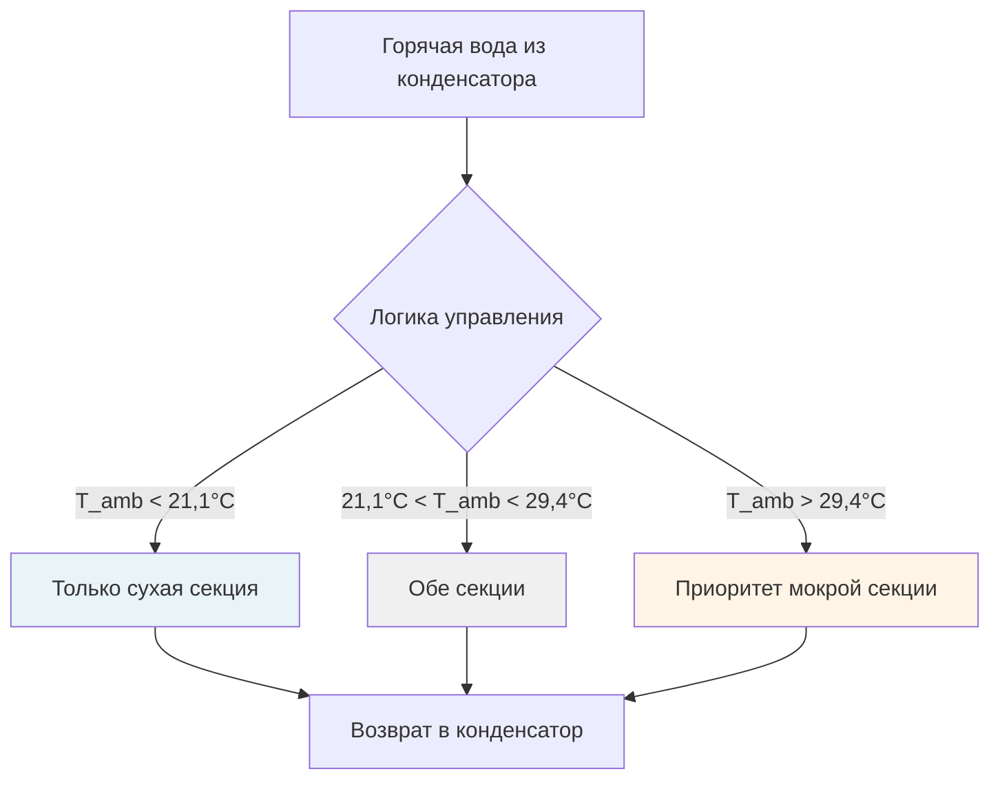
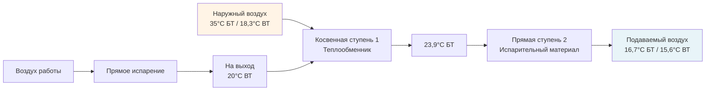

## Обзор

Дефицит воды представляет критическое ограничение для систем HVAC в развивающихся регионах, особенно там, где испарительное охлаждение и водяное охлаждение доминируют благодаря более низким капитальным затратам. Системы HVAC в коммерческих зданиях могут потреблять 20–40% от общего использования воды, при этом градирни занимают основную часть. Эффективные стратегии водосбережения снижают затраты на эксплуатацию, экологическое воздействие и зависимость от ненадежной водопроводной инфраструктуры.

## Потребление воды в системах HVAC

### Основные применения воды

**Системы испарительного охлаждения:**
- Потери на испарение: 0,8–1,0% расхода циркуляции на снижение температуры на 5,56°C
- Продувка: 0,3–0,6% расхода циркуляции в зависимости от кратностей концентрации
- Потери дрейфа: 0,001–0,02% расхода циркуляции

**Расчет требуемого расхода подпитки:**

$$
W_{makeup} = W_{evap} + W_{blowdown} + W_{drift}
$$

$$
W_{evap} = \frac{Q_{rejected}}{h_{fg}}
$$

где $Q_{rejected}$ — расход отводимой теплоты (кДж/ч), $h_{fg}$ — удельная теплота парообразования (≈2380 кДж/кг при атмосферном давлении).

**Отношение кратности концентрации (COC):**

$$
COC = \frac{C_{blowdown}}{C_{makeup}} = \frac{W_{evap}}{W_{blowdown}}
$$

Более высокая COC снижает требования к продувке, но увеличивает потенциал отложений и коррозии.

## Технологии водосбережения

### Системы сухого охлаждения

Сухое охлаждение исключает потребление воды путем прямого отвода теплоты в окружающий воздух через оребренные теплообменники.

**Характеристики производительности:**

| Параметр | Сухое охлаждение | Мокрое охлаждение | Гибридное |
|-----------|-------------|-------------|--------|
| Потребление воды | 0 л/(кВт·ч) | 7,6–9,1 л/(кВ·ч) | 1,9–4,5 л/(кВ·ч) |
| Подход к окружающей среде | 8,3–13,9°C | 2,8–3,9°C | 5,6–8,3°C |
| Множитель капитальной стоимости | 2,0–3,0× | 1,0× | 1,4–1,8× |
| Мощность вентилятора | 22–37 кВ/3,5 MВ | 7,5–15 кВ/3,5 MВ | 15–22 кВ/3,5 MВ |
| Площадь застройки | Большая | Средняя | Средне-Большая |

**Эффективность сухого охлаждения:**

$$
\varepsilon = \frac{T_{in} - T_{out}}{T_{in} - T_{ambient}}
$$

Типичная эффективность составляет 0,65–0,80 в зависимости от скорости воздуха и конфигурации оребрения.

### Гибридные системы охлаждения

Гибридные системы сочетают сухое и мокрое охлаждение для оптимизации потребления воды при сохранении приемлемых температур конденсации.

**Расчет экономии воды:**

$$
WS = W_{wet} \times \left(1 - \frac{t_{wet}}{t_{total}}\right)
$$

где $t_{wet}$ — часы работы в режиме влажного охлаждения и $t_{total}$ — общее время работы.

## Продвинутые стратегии управления водой

### Максимизация кратности концентрации

Увеличение COC с 3 до 6 может снизить расход подпитки приблизительно на 33%.

**Требование продувки:**

$$
W_{blowdown} = \frac{W_{evap}}{COC - 1}
$$

**Общий расход подпитки:**

$$
W_{makeup} = W_{evap} \times \frac{COC}{COC - 1}
$$

**Ограничивающие факторы для COC:**

| Параметр | Целевой диапазон | Метод |
|-----------|--------------|--------|
| Общее содержание растворенных веществ | < 2000 мг/л | Фильтрация, умягчение |
| Жесткость кальция | < 800 мг/л в виде CaCO₃ | Впрыск кислоты, умягчение |
| Щелочность | < 500 мг/л в виде CaCO₃ | Подвод кислоты |
| Индекс насыщения Лангелье | -0,5 до +0,5 | Химический баланс |
| Хлориды | < 750 мг/л | Контроль продувки |

### Альтернативные источники воды

**Использование серой воды и обработанных сточных вод:**

Серая вода из раковин, душей и прачечных может обеспечить 30–50% потребности подпитки градирни после базовой фильтрации и обработки.

**Требования обработки:**

- Фильтрация: минимум 50–100 микрон
- Регулировка pH: диапазон 6,5–8,5
- Дезинфекция: остаточный свободный хлор 0,5–1,0 мг/л
- Мониторинг: еженедельное тестирование биологической потребности в кислороде (BOD)

**Сбор дождевой воды:**

Потенциал годового сбора:

$$
V_{collect} = A_{roof} \times P_{annual} \times \eta_{collection} \times 28,317
$$

где $A_{roof}$ — площадь кровли (м²), $P_{annual}$ — годовые осадки (мм), $\eta_{collection}$ — эффективность сбора (0,75–0,85), и 28,317 преобразует в литры.

### Восстановление конденсата

Приточные установки, работающие в режиме охлаждения, генерируют конденсат, который можно уловить для повторного использования.

**Расход образования конденсата:**

$$
W_{condensate} = \frac{Q_{sensible} \times SHR}{h_{fg} \times (1 - SHR)}
$$

где SHR — коэффициент явного охлаждения.

Для приточной установки мощностью 1238 кВ при SHR = 0,70:

$$
W_{condensate} = \frac{868,100 \times 0,70}{2380 \times 0,30} \approx 717 \text{ л/ч}
$$

## Альтернативы испарительному охлаждению

### Косвенное испарительное охлаждение

Системы косвенного охлаждения обеспечивают охлаждение по явному теплу без добавления влаги в подаваемый воздух, снижая потребление воды на 40–60% по сравнению с прямым испарительным охлаждением.

**Эффективность охлаждения:**

$$
\varepsilon_{IEC} = \frac{T_{db,in} - T_{db,out}}{T_{db,in} - T_{wb,in}}
$$

Типичная эффективность: 0,55–0,75

### Охлаждение по точке росы

Продвинутое косвенное/прямое каскадирование достигает охлаждения ниже температуры по влажному термометру с потреблением воды на 50–70% ниже, чем в обычных испарительных системах.

## Мониторинг качества воды

### Критические параметры

**Требования стандарта ASHRAE 188:**

- Ежемесячная оценка риска легионеллы
- Непрерывный мониторинг электропроводности для контроля COC
- Еженедельное измерение pH и окислительно-восстановительного потенциала (ORP)
- Ежеквартальное микробиологическое тестирование

**Автоматизированное управление продувкой:**

$$
BD_{rate} = \frac{EC_{circulating} - EC_{makeup}}{EC_{blowdown} - EC_{makeup}} \times Q_{makeup}
$$

где EC — электропроводность (мкСм/см).

## Экономический анализ

### Влияние стоимости воды

**Сравнение годовых затрат на эксплуатацию для системы 439 кВ:**

| Тип системы | Потребление воды (тыс. л/год) | Стоимость воды ($0,0021/л) | Энергетический штраф | Общие годовые затраты |
|-------------|---------------------|-------------------------|----------------|-------------------|
| Мокрая градирня (3 COC) | 27,237 | $57,200 | $0 | $57,200 |
| Мокрая градирня (6 COC) | 18,158 | $38,100 | $2,000 | $40,100 |
| Гибридная система | 9,079 | $19,100 | $7,100 | $26,200 |
| Сухое охлаждение | 0 | $0 | $20,000 | $20,000 |

**Расчет периода окупаемости:**

$$
PB = \frac{C_{capital,incremental}}{(C_{water,base} - C_{water,efficient}) + (C_{energy,base} - C_{energy,efficient})}
$$

## Рассмотрения реализации

### Региональная адаптация

**Засушливые климаты (< 254 мм годовых осадков):**
- Приоритизация сухого охлаждения для базовой нагрузки
- Гибридные системы с смещением в режим сухого охлаждения
- Реализация максимальных стратегий COC (8–10 циклов)

**Полузасушливые климаты (254–508 мм годовых осадков):**
- Гибридные системы, оптимизированные для местных температур по влажному термометру
- Сезонные изменения режима работы
- Интеграция сбора дождевой воды

**Регионы с напряженной водоснабжением и периодическим дефицитом:**
- Двухрежимные системы, способные к работе в режиме сухого охлаждения
- Хранилище воды на объекте (7–14 дневной емкости)
- Системы восстановления серой воды и конденсата

### Требования к техническому обслуживанию

**Системы водосбережения требуют усиленного обслуживания:**

- Ежедневно: визуальный осмотр уровней воды, автоматические системы управления
- Еженедельно: тестирование химии воды, проверка COC
- Ежемесячно: осмотр теплообменника, оценка отложений
- Ежеквартально: комплексный аудит обработки воды
- Ежегодно: промывка системы, капитальный ремонт механических компонентов

**Расходы на химическую обработку растут с COC:**

$$
C_{chemical} = C_{base} \times \left(1 + 0,15 \times \frac{COC - 3}{3}\right)
$$

## Будущие разработки

Появляющиеся технологии водосбережения включают:

- **Мембранная дистилляция** для нулевого жидкостного стока в градирнях
- **Атмосферное извлечение воды** с использованием улучшения конденсата HVAC
- **Термоэлектрическое охлаждение**, исключающее использование воды в малых приложениях
- **Продвинутые полимерные теплообменники**, позволяющие работу при более высокой COC
- **Управление продувкой на основе искусственного интеллекта**, оптимизирующее водопотребление в реальном времени

Эффективное водосбережение требует комплексного проектирования систем с учетом местного климата, стоимости воды, нормативных требований и операционных возможностей. В регионах с дефицитом воды в развивающихся странах экономическая ценность сэкономленной воды часто превышает выгоды энергоэффективности, радикально изменяя традиционные приоритеты оптимизации HVAC.
