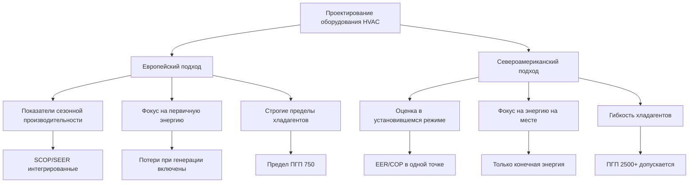

## Обзор европейской нормативно-правовой базы HVAC

Европейские стандарты HVAC представляют одну из наиболее комплексных и строгих нормативно-правовых баз в мире, движимую амбициозными климатическими целями и требованиями энергоэффективности. Подход Европейского союза интегрирует энергоэффективность зданий, эффективность оборудования, управление хладагентами и внедрение возобновляемых источников энергии в единую систему, которая определяет проектирование и эксплуатацию HVAC во всех 27 государствах-членах.

Нормативная архитектура включает три основных уровня: стандарты EN (Европейская норма), разработанные CEN (Европейский комитет по стандартизации), директивы и регламенты ЕС с юридической силой и реализация государствами-членами через национальные строительные нормы. Эта многоуровневая структура создает единые минимальные требования, позволяя при этом региональную адаптацию под климатические условия.

## Ключевые нормативные инструменты

### Директива об энергетических характеристиках зданий (EPBD)

EPBD устанавливает рамку для энергетических характеристик зданий в ЕС, требуя практически нулевого потребления энергии (nZEB) для новых строительств и устанавливая стандарты модернизации для существующего фонда. Системы HVAC подпадают под строгие требования эффективности, причем рекуперация тепла вентиляции и высокоэффективные тепловые насосы становятся стандартной практикой в приложениях Северной Европы.

Директива требует Сертификатов энергетических характеристик (EPC), которые количественно определяют потребление энергии зданием, нормализованное к климатической зоне, выраженное как первичный спрос энергии на единицу площади пола:

$\text{PED} = \frac{Q_{\text{heating}} + Q_{\text{cooling}} + Q_{\text{DHW}} + Q_{\text{lighting}} + Q_{\text{ventilation}}}{A_{\text{floor}} \cdot f_{\text{primary}}}$

где $f_{\text{primary}}$ представляет коэффициент преобразования первичной энергии, учитывающий потери при генерации и передаче.

### F-Gas Регламент (EU 517/2014)

Этот регламент предусматривает поэтапное снятие с производства гидрофторуглеродных (ГФУ) хладагентов посредством системы квот, сокращающей поставки на 79% между 2015 и 2030 годами. Механизм устанавливает пределы потенциала глобального потепления (ПГП) для конкретных приложений, при этом системы прямого расширения кондиционирования воздуха все чаще ограничиваются хладагентами с ПГП менее 750 для оборудования, содержащего более 3 кг заряда.

Поэтапное снятие с производства стимулирует внедрение природных хладагентов (R290, R744, R717) и низкоПГП синтетических вариантов (R32, R1234yf). Производители тепловых насосов перешли на R290 (пропан) для жилых единиц и системы R744 (CO₂) транскритического типа для коммерческого применения, особенно на скандинавских рынках.

### Директива об эконизме (2009/125/EC)

Требования эконизма устанавливают минимальные пороги энергоэффективности для оборудования HVAC, размещаемого на рынке ЕС. Директива использует показатели сезонной производительности, учитывающие работу на частичной нагрузке и производительность, зависящую от климата:

**Сезонный коэффициент производительности (SCOP) для тепловых насосов:**

$\text{SCOP} = \frac{\sum_{i=1}^{n} Q_{\text{heating},i}}{\sum_{i=1}^{n} W_{\text{input},i}}$

где производительность интегрируется на протяжении отопительного сезона с использованием расчетов метода бинов температур для трех эталонных климатов (холодный, средний, теплый).

## Структура европейских стандартов

### EN 12831: Проектирование систем отопления

EN 12831 определяет методологию расчета тепловой нагрузки, отличающуюся от основ ASHRAE в нескольких аспектах. Расчетные наружные температуры используют значения 99% годового превышения, а не 97,5%, что результирует в более консервативном подборе оборудования. Расчеты потерь тепла передачей включают обязательные поправки на тепловые мосты для современного низкоэнергетического строительства:

$\Phi_{\text{T}} = \sum (U \cdot A \cdot f_{\text{temp}}) + \sum (\psi \cdot l \cdot f_{\text{temp}}) \cdot (T_{\text{int}} - T_{\text{ext}})$

где $\psi$ представляет линейный коэффициент теплопередачи стыков между строительными элементами.

### EN 13779 / EN 16798: Стандарты вентиляции

Эти стандарты устанавливают категории качества внутренней среды (IEQ I–IV) с соответствующими расходами наружного воздуха, требованиями к фильтрации и критериями теплового комфорта. Категория II (обычные ожидания) требует минимум 0,7 л/с·м² приточного воздуха с фильтрацией класса F7 (эквивалент MERV 13), значительно превышающей типичные минимумы ASHRAE 62.1 для коммерческих зданий.

## Сравнение с североамериканской практикой

| Параметр | Европейские стандарты | ASHRAE/Североамериканские | Последствие |
|-----------|-------------------|---------------------|-------------|
| Расчетная температура | 99% превышения | 97,5% превышения | Оборудование ЕС на 15-20% больше |
| Минимум вентиляции | 0,7 л/с·м² (Категория II) | 0,3 л/с·м² (ASHRAE 62.1) | Более высокое применение рекуперации энергии |
| Производительность теплового насоса | SCOP (сезонный) | COP (9°C/47°F) | Оптимизация частичной нагрузки критична |
| Предел ПГП хладагента | 750 (сплит-кондиционер >3кг) | Нет федерального ограничения | Рост применения природных хладагентов |
| Тепловые мосты | Обязательный расчет | Типично не учитывается | Более низкие требования U-значений |
| Коэффициент первичной энергии | 1,9-2,5 (электроэнергия) | Не стандартизировано | Предпочтение тепловых насосов vs. сопротивления |

## Различия в технической реализации

### Философия подбора тепловых насосов

Европейская практика подчеркивает бивалентную работу теплового насоса, где тепловой насос покрывает базовую нагрузку (типично 60-80% пиковой) с вспомогательным источником тепла, обеспечивающим пиковую мощность. Этот подход максимизирует сезонную эффективность благодаря работе теплового насоса с более высокими коэффициентами загрузки. Бивалентная точка возникает, когда мощность теплового насоса соответствует нагрузке здания:

$Q_{\text{HP}}(T_{\text{biv}}) = Q_{\text{building}}(T_{\text{biv}})$

Ниже этой температуры активируется дополнительное тепло. Типовой подбор ASHRAE предусматривает размер тепловых насосов на полную пиковую нагрузку, результирующий в чрезмерном цикличном режиме при мягкой погоде.

### Доминирование гидравлического распределения

Низкотемпературные гидравлические системы (температура подачи 35-45°C) с лучистыми панелями или увеличенными радиаторами доминируют в европейской практике, обеспечивая более высокий COP теплового насоса благодаря сниженным температурам конденсации. Североамериканские воздушные системы требуют подачу 50-60°C для адекватного повышения температуры воздуха, снижая эффективность теплового насоса на 15-25% при расчетных условиях.

Соотношение эффективности Карно иллюстрирует это преимущество:

$\eta_{\text{Carnot}} = \frac{T_{\text{cond}}}{T_{\text{cond}} - T_{\text{evap}}}$

Снижение температуры конденсации с 60°C (333K) на 40°C (313K) при температуре испарения -5°C (268K) улучшает теоретическую эффективность с 5,1 на 6,0, представляя прирост на 18%.

### Рекуперация тепла вентиляции

EN 13053 устанавливает протоколы испытаний рекуператоров тепла вентиляции с эффективностью по температуре, определенной в стандартизированных условиях. Системы, достигающие 85-90% чувствительной эффективности рекуперации, стандартны в строительстве пассивного дома, восстанавливая 50-70% нагрузки отопления вентиляции. Это контрастирует с североамериканской практикой, где применение рекуперации энергии остается ограниченным вне холодных климатов несмотря на требования восстановления энергии ASHRAE 90.1.

## Региональные вариации

Хотя директивы ЕС устанавливают минимальные требования, государства-члены реализуют различные уровни строгости. EnEV Германии (замененный на GEG) требует первичный спрос энергии на 25% ниже минимумов EPBD. Северные страны требуют рекуперацию тепла выброса воздуха во всех жилых строительствах. Средиземноморские регионы сосредотачиваются на эффективности охлаждения с минимальными пороговыми значениями сезонного коэффициента энергоэффективности (SEER) для кондиционеров воздуха.

## Интеграция с системами возобновляемой энергии

Директива по возобновляемой энергии (RED II) устанавливает обязывающие целевые показатели для возобновляемой энергии в зданиях, стимулируя интеграцию систем HVAC с фотоэлектрическими массивами, солнечными тепловыми коллекторами и сетями теплоснабжения. Тепловые насосы, питаемые сетевой электроэнергией, считаются в направлении возобновляемых целевых показателей на основе доли возобновляемой генерации сети, создавая нормативное предпочтение электрического тепла перед сжиганием ископаемых топлив в регионах с генерацией электроэнергии с высокой долей возобновляемых источников.

## Сертификация и соответствие

Сертификация Eurovent обеспечивает независимую проверку заявлений производителя о производительности оборудования, испытывая тепловые насосы, воздухообработчики и чиллеры в соответствии со стандартами EN. Маркировка CE указывает на соответствие всем применимым директивам ЕС, но представляет декларацию соответствия производителя, а не независимое испытание. Эта двойная система контрастирует с сертификацией AHRI Североамерики, которая объединяет как нормативное соответствие, так и проверку производительности.

Европейская нормативная база расставляет приоритеты потреблению энергии на протяжении жизненного цикла и воздействию на окружающую среду через интегрированные нормативные инструменты, устанавливая глобальные прецеденты для декарбонизации зданий при одновременном требовании принципиальных сдвигов в проектировании систем HVAC по сравнению с доминирующей североамериканской практикой.
