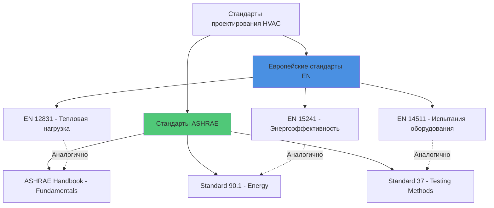

## Обзор стандартов EN

Европейские нормы (EN), разработанные Европейским комитетом по стандартизации (CEN), устанавливают единые технические спецификации для систем HVAC во всех государствах-членах Европейского союза и связанных странах. Эти стандарты приобретают юридическую силу при принятии в качестве национальных стандартов, заменяя конфликтующие местные коды. Стандарты EN уделяют особое внимание энергоэффективности, качеству внутренней среды и гармонизации методик испытаний.

Рамки EN отличаются от стандартов ASHRAE подходом к регулированию: стандарты EN имеют юридическую силу при трансформации в национальное законодательство, в то время как стандарты ASHRAE в основном служат техническими рекомендациями, если они не приняты местными органами. Это фундаментальное различие определяет практику проектирования по всей Европе.

## EN 12831: Расчет тепловой нагрузки

EN 12831 определяет методологию расчета нагрузки на отопление в зданиях. Стандарт устанавливает процедуру расчета по комнатам на основе принципов установившегося теплопередачи.

### Формула расчета тепловой нагрузки

Общая расчетная тепловая нагрузка состоит из составляющих передачи тепла и вентиляции:

$$
\Phi_{HL} = \Phi_T + \Phi_V
$$

Где:
- $\Phi_{HL}$ = общая расчетная тепловая нагрузка (Вт)
- $\Phi_T$ = потери тепла через передачу (Вт)
- $\Phi_V$ = потери тепла через вентиляцию (Вт)

Потери тепла через передачу через элементы ограждающей конструкции:

$$
\Phi_T = \sum (A \cdot U \cdot f_x) \cdot (T_{int,i} - T_e)
$$

Где:
- $A$ = площадь поверхности (м²)
- $U$ = коэффициент теплопередачи (Вт/м²·К)
- $f_x$ = коэффициент температурной коррекции (безразмерный)
- $T_{int,i}$ = расчетная внутренняя температура (°C)
- $T_e$ = расчетная наружная температура (°C)

Потери тепла через вентиляцию:

$$
\Phi_V = \dot{V} \cdot \rho \cdot c_p \cdot (T_{int,i} - T_{sup})
$$

Где:
- $\dot{V}$ = расход вентиляционного воздуха (м³/с)
- $\rho$ = плотность воздуха (кг/м³)
- $c_p$ = удельная теплоемкость воздуха (Дж/кг·К)
- $T_{sup}$ = температура приточного воздуха (°C)

EN 12831 требует использования конкретных расчетных наружных температур на основе географического положения, в отличие от процентильного подхода ASHRAE (99,6% или 99% условия проектирования). Европейский метод использует стандартизированные климатические зоны с фиксированными расчетными температурами.

## EN 13779: Вентиляция зданий нежилого назначения

EN 13779 (заменен на EN 16798-3, но по-прежнему широко используется) категоризирует требования к качеству внутреннего воздуха и вентиляции для коммерческих зданий.

### Категории качества внутреннего воздуха

| Категория | Описание | Применение | Расход наружного воздуха |
|-----------|---------|-----------|-------------------------|
| IDA 1 | Высокое | Больницы, лаборатории | >54 м³/ч·на человека |
| IDA 2 | Среднее | Офисы, школы | 36-54 м³/ч·на человека |
| IDA 3 | Умеренное | Коммерческие здания | 22-36 м³/ч·на человека |
| IDA 4 | Низкое | Временное пребывание | <22 м³/ч·на человека |

Эта система классификации отличается от стандарта ASHRAE 62.1, который предписывает минимальные расходы вентиляции на основе численности людей и площади пола, а не категорий качества.

## EN 15241: Оценка энергоэффективности

EN 15241 устанавливает методы расчета для оценки энергоэффективности системы HVAC в зданиях. Стандарт оценивает общее потребление первичной энергии, включая потери при генерации, распределении и выпуске.

### Энергетический баланс системы

$$
E_{tot} = E_{gen} + E_{dist} + E_{em} + E_{ctrl} - E_{rec}
$$

Где:
- $E_{tot}$ = общая энергия системы (кВт·ч/год)
- $E_{gen}$ = потери при генерации (кВт·ч/год)
- $E_{dist}$ = потери при распределении (кВт·ч/год)
- $E_{em}$ = потери при выпуске/терминалах (кВт·ч/год)
- $E_{ctrl}$ = энергия управления (кВт·ч/год)
- $E_{rec}$ = восстановленная энергия (кВт·ч/год)

Стандарт требует учета работы на неполной нагрузке с использованием методики расчета по интервалам, признавая, что оборудование работает на расчетной мощности минимальное количество часов в году.

## EN 1264: Встроенные водяные системы отопления

EN 1264 регулирует проектирование и установку гидронных систем радиационного отопления, встроенных в полы, стены и потолки. Стандарт указывает максимальные температуры поверхности, чтобы предотвратить дискомфорт для людей.

### Расчет теплоотдачи

Удельная теплоотдача от радиационных поверхностей:

$$
q = B \cdot (T_m - T_i)^n
$$

Где:
- $q$ = удельная теплоотдача (Вт/м²)
- $B$ = коэффициент, зависящий от системы
- $T_m$ = средняя температура воды (°C)
- $T_i$ = температура внутреннего воздуха (°C)
- $n$ = показатель степени (обычно 1,1)

Пределы максимальной температуры поверхности:

| Тип зоны | Макс. темп. поверхности (°C) | Применение |
|----------|----------------------------|-----------|
| Зона пребывания | 29 | Жилые помещения |
| Периферийная зона | 35 | Периметровые области |
| Ванные комнаты | 33 | Влажные помещения |

## EN 14511: Кондиционеры и тепловые насосы

EN 14511 определяет условия испытаний и оценку производительности кондиционирующего оборудования. Стандарт устанавливает сезонные показатели производительности вместо рейтингов с одной точкой.

### Сезонный коэффициент энергоэффективности охлаждения

Для режима охлаждения:

$$
SEER = \frac{Q_{C,annual}}{E_{C,annual}}
$$

Где:
- $SEER$ = сезонный коэффициент энергоэффективности (безразмерный)
- $Q_{C,annual}$ = годовая потребность в охлаждении (кВт·ч)
- $E_{C,annual}$ = годовое потребление электроэнергии (кВт·ч)

Для режима отопления:

$$
SCOP = \frac{Q_{H,annual}}{E_{H,annual}}
$$

Где $SCOP$ представляет сезонный коэффициент производительности.

## Сравнение со стандартами ASHRAE

### Ключевые методические различия

| Аспект | Стандарты EN | Стандарты ASHRAE |
|--------|--------------|------------------|
| Основа расчета тепловой нагрузки | Установившееся состояние по комнатам | Метод CLTD/CLF или RTS |
| Расчетная наружная темп. | Фиксирована климатической зоной | Процентильный подход (99,6%) |
| Расходы вентиляции | Категории IDA | На основе численности и площади |
| Рейтинги оборудования | Сезонные (SEER/SCOP) | Одноточечные + сезонные |
| Система единиц | SI (метрическая) исключительно | IP и SI двойная система |
| Юридический статус | Обязательны при трансформации | Рекомендательны, если приняты |

## EN 16798: Энергоэффективность зданий

EN 16798 представляет текущий согласованный подход к энергоэффективности зданий, включающий вентиляцию, внутренний климат и оценку энергии. Часть 1 рассматривает входные параметры, включая графики пребывания, скорость метаболизма и значения теплоизоляции одежды.

Стандарт устанавливает четыре категории теплового комфорта на основе прогнозируемого процента неудовлетворенных (PPD):

$$
PPD = 100 - 95 \cdot e^{(-0.03353 \cdot PMV^4 - 0.2179 \cdot PMV^2)}
$$

Где $PMV$ представляет прогнозируемый средний голос из модели теплового комфорта Фангера, идентичной методологии ISO 7730, на которую ссылается стандарт ASHRAE 55.

## Соответствие требованиям и внедрение

Национальные органы стандартизации (BSI в Великобритании, DIN в Германии, NEN в Нидерландах) трансформируют стандарты EN в местные коды с национальными приложениями, учитывающими климатические условия и строительные практики. Проектировщики должны ссылаться как на основной стандарт EN, так и на применимое национальное приложение.

Требование маркировки CE для оборудования HVAC, продаваемого в пределах ЕС, предусматривает соответствие соответствующим стандартам испытаний EN, создавая единые критерии производительности во всех государствах-членах. Эта нормативная база обеспечивает совместимость оборудования и способствует трансграничной торговле при сохранении технической строгости.

Стандарты EN постоянно развиваются для решения новых технологий, включая передовые системы тепловых насосов, хранение тепловой энергии и автоматизацию зданий. Будущие редакции будут включать стратегии управления на основе машинного обучения и концепции зданий, взаимодействующих с сетью, расширяя рамки текущих методик расчета в установившемся состоянии.
