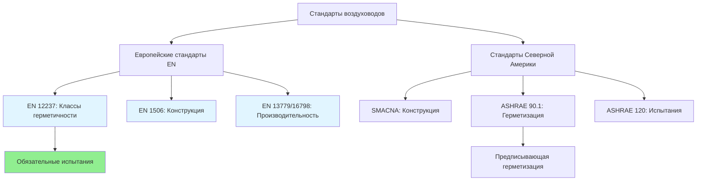

## Обзор европейских стандартов воздуховодов

Проектирование и конструкция европейских воздуховодов следуют комплексной базе, установленной главным образом через EN 12237 (стальные воздуховоды), EN 1506 (прямоугольные стальные воздуховоды), EN 13779 (требования к производительности вентиляции) и новую серию EN 16798. Эти стандарты устанавливают строгие требования к конструкции воздуховодов, классификации герметичности, испытаниям под давлением и производительности систем, которые часто превышают практику Северной Америки, определенную SMACNA и ASHRAE Standard 90.1.

Европейский подход подчеркивает герметичность через обязательное испытание герметичности, стандартизированные методы строительства и подробные системы классификации, которые интегрируются с требованиями энергетической производительности зданий в соответствии с Директивой об энергетических характеристиках зданий (EPBD).

## Система классификации герметичности воздуховодов

EN 12237 устанавливает четыре класса герметичности воздуховодов (A, B, C, D) на основе допустимых скоростей утечки воздуха на единицу площади поверхности при заданных давлениях испытания. Эта классификация непосредственно влияет на энергопотребление и производительность системы.

### Расчет скорости утечки

Допустимая скорость утечки рассчитывается по формуле:

$$
f_v = C \cdot \Delta p^{0.65}
$$

Где:
- $f_v$ = скорость утечки на квадратный метр поверхности воздуховода (л/с·м²)
- $C$ = коэффициент класса герметичности
- $\Delta p$ = давление испытания (Па)

| Класс герметичности | Коэффициент C | Типичные применения |
|--------------|---------------|----------------------|
| Класс A | 0,027 | Высокопроизводительные здания, чистые комнаты |
| Класс B | 0,009 | Стандартная коммерческая HVAC, офисные здания |
| Класс C | 0,003 | Низконапорные жилые системы |
| Класс D | 0,001 | Очень низконапорные применения |

### Требования к давлению испытания

Давления испытания определяются классификацией давления воздуховода:

- **Низкое давление**: ≤500 Па → Испытание при 400 Па
- **Среднее давление**: 500-1500 Па → Испытание при 700 Па
- **Высокое давление**: >1500 Па → Испытание при 1000 Па

Общая герметичность системы должна соответствовать:

$$
Q_L = f_v \cdot A_{duct} = C \cdot \Delta p^{0.65} \cdot A_{duct}
$$

Где $A_{duct}$ представляет общую площадь поверхности воздуховода, включая фитинги.

## Требования к размерам и производительности EN 13779

EN 13779 (замещен на EN 16798-3, но все еще широко используется) устанавливает критерии производительности вентиляционной системы, включая ограничения скорости, допуски потерь давления и эффективность распределения воздуха.

### Ограничения скорости

Максимальные скорости воздуховодов предотвращают чрезмерное шумообразование и потери давления:

| Расположение воздуховода | Максимальная скорость | Критерии шума |
|--------------|------------------|----------------|
| Основные воздуховоды | 8 м/с | NC 35-40 |
| Ветвевые воздуховоды | 6 м/с | NC 30-35 |
| Концевые устройства | 4 м/с | NC 25-30 |
| Отверстия подачи (занятые зоны) | 2-3 м/с | NC 25-30 |

### Бюджет потерь давления

EN 13779 рекомендует удельные целевые значения мощности вентилятора (SFP) для полных систем:

$$
SFP = \frac{P_{fan,total}}{\dot{V}}
$$

Где:
- $SFP$ = удельная мощность вентилятора (Вт/(л/с) или кВт/(м³/с))
- $P_{fan,total}$ = общая мощность вентилятора (Вт)
- $\dot{V}$ = расход воздуха (л/с или м³/с)

**Целевые значения SFP:**
- **SFP 1**: <500 Вт/(м³/с) - Системы пассивной вентиляции
- **SFP 2**: 500-750 Вт/(м³/с) - Вентиляция с контролем по спросу
- **SFP 3**: 750-1250 Вт/(м³/с) - Системы с постоянным объемом воздуха (CAV)
- **SFP 4**: 1250-2000 Вт/(м³/с) - Сложные системы VAV
- **SFP 5**: >2000 Вт/(м³/с) - Специализированные промышленные системы

## Стандарты конструкции воздуховодов EN 1506

EN 1506 определяет конструкцию прямоугольных воздуховодов, включая толщину листового металла, конфигурацию швов, расстояние между армированием и требования герметизации.

### Требования к толщине листового металла

Минимальная толщина листового металла варьируется в зависимости от размеров воздуховода и класса давления:

| Размер воздуховода (мм) | Низкое давление | Среднее давление | Высокое давление |
|---------------------|--------------|-----------------|---------------|
| ≤200 | 0,5 мм | 0,6 мм | 0,8 мм |
| 201-500 | 0,6 мм | 0,7 мм | 1,0 мм |
| 501-1000 | 0,7 мм | 0,8 мм | 1,2 мм |
| 1001-2000 | 0,8 мм | 1,0 мм | 1,5 мм |
| >2000 | 1,0 мм | 1,2 мм | 2,0 мм |

### Расстояние между армированием

Прямоугольные воздуховоды требуют поперечного армирования с интервалами, определяемыми шириной воздуховода и давлением:

$$
L_{max} = k \cdot \frac{w}{\sqrt{\Delta p}}
$$

Где:
- $L_{max}$ = максимальное расстояние между армированием (м)
- $k$ = коэффициент конструкции (обычно 1,5-2,0)
- $w$ = ширина воздуховода (м)
- $\Delta p$ = проектное давление (Па)

## Сравнение со стандартами ASHRAE/SMACNA

### Ключевые различия

| Аспект | Европейские стандарты | ASHRAE/SMACNA |
|--------|-------------------|---------------|
| Испытание герметичности | Обязательно для всех классов | Опционально (ASHRAE 120) |
| Спецификация герметизации | На основе производительности (класс герметичности) | Предписывающая (места герметизации) |
| Испытание под давлением | Детальные протоколы по классам | Общие рекомендации |
| Ограничения скорости | Строгие критерии на основе NC | В зависимости от применения |
| Требования SFP | Обязательные целевые значения энергии | Добровольные (рекомендации 90.1) |

## Требования к изоляции EN 14303

Изоляция воздуховодов следует EN 14303 и интегрируется в общие расчеты энергии здания в соответствии с EN ISO 13790. Минимальное тепловое сопротивление изоляции варьируется в зависимости от применения:

$$
R_{min} = \frac{1}{U_{max}}
$$

**Типичные требования:**
- Воздуховоды подачи в некондиционируемых помещениях: R ≥ 1,2 м²·K/Вт
- Воздуховоды возврата в некондиционируемых помещениях: R ≥ 0,6 м²·K/Вт
- Воздуховоды в кондиционируемых помещениях: R ≥ 0,3 м²·K/Вт

Тепловые потери через изолированные воздуховоды:

$$
Q_{loss} = U \cdot A_{duct} \cdot (T_{air} - T_{ambient})
$$

Где:
- $U$ = коэффициент общей теплопередачи (Вт/м²·K)
- $A_{duct}$ = площадь поверхности воздуховода (м²)
- $T_{air}$ - $T_{ambient}$ = разность температур (K)

## Интеграция системы и соответствие

Европейские стандарты воздуховодов интегрируются с более широкими базами производительности зданий, включая EN 15241 (вентиляция зданий) и национальные строительные коды. Проверка соответствия требует:

1. **Документация по проектированию**: спецификация класса герметичности для всех участков воздуховодов
2. **Проверка конструкции**: сертификаты материалов и записи сборки швов
3. **Испытание под давлением**: испытание с участием свидетелей в соответствии с протоколами EN 12237
4. **Пусконаладка производительности**: проверка расхода воздуха и измерение SFP

Этот интегрированный подход гарантирует, что проектирование воздуховодов напрямую поддерживает целевые показатели энергетической производительности EPBD при сохранении стандартов качества внутреннего воздуха в соответствии с EN 16798-1.

---

**Ссылки:**
- EN 12237:2003 - Вентиляция зданий: Воздуховоды
- EN 1506:2007 - Стальные воздуховоды и фитинги
- EN 13779:2007 - Вентиляция нежилых зданий
- EN 16798-3:2017 - Энергетическая производительность зданий: Вентиляция
- ASHRAE Handbook - HVAC Systems and Equipment
