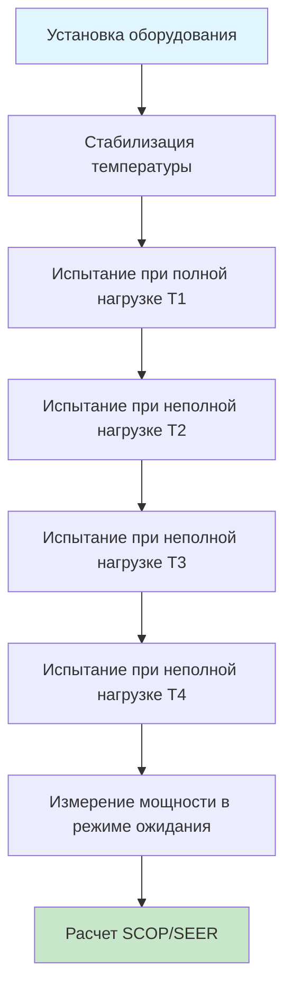

# Стандарты энергоэффективности ЕС для систем HVAC

Европейские стандарты энергоэффективности устанавливают обязательные требования эффективности оборудования HVAC через Директиву Ecodesign (2009/125/ЕС) и Регламент по энергетической маркировке (2017/1369). Эти стандарты принципиально отличаются от североамериканских подходов, делая упор на метрики сезонной производительности, которые учитывают режим неполной нагрузки и климатические вариации.

## Метрики сезонной эффективности

Европейские стандарты требуют использования сезонных коэффициентов производительности вместо одноточечных оценок, обеспечивая более точное представление годового энергопотребления.

### Сезонный коэффициент производительности (SCOP)

SCOP количественно оценивает эффективность отопления в течение всего отопительного сезона, используя климатически взвешенную производительность в нескольких точках работы:

$$
SCOP = \frac{\sum_{j} h_j \cdot P_{h}(T_j)}{\sum_{j} h_j \cdot \left[\frac{P_{h}(T_j)}{COP(T_j)} + P_{TO}(T_j) + P_{SB}(T_j) + P_{CK}(T_j) + P_{OFF}(T_j)\right]}
$$

Где:
- $h_j$ = количество часов при температуре $T_j$ (часы)
- $P_{h}(T_j)$ = мощность отопления при температуре (кВ)
- $COP(T_j)$ = коэффициент производительности в точке работы
- $P_{TO}$ = мощность в режиме отключения термостата (кВ)
- $P_{SB}$ = мощность в режиме ожидания (кВ)
- $P_{CK}$ = мощность подогревателя картера (кВ)
- $P_{OFF}$ = мощность в выключенном режиме (кВ)

### Сезонный коэффициент энергоэффективности охлаждения (SEER)

SEER оценивает производительность охлаждения, используя аналогичную сезонную методологию:

$$
SEER = \frac{Q_{C,annual}}{E_{C,annual}} = \frac{\sum_{j} h_j \cdot P_{c}(T_j)}{\sum_{j} h_j \cdot \left[\frac{P_{c}(T_j)}{EER(T_j)} + P_{TO}(T_j) + P_{SB}(T_j) + P_{OFF}(T_j)\right]}
$$

Где:
- $Q_{C,annual}$ = годовое охлаждающее воздействие (кВч)
- $E_{C,annual}$ = годовое электропотребление охлаждением (кВч)
- $P_{c}(T_j)$ = мощность охлаждения при температуре (кВ)
- $EER(T_j)$ = коэффициент энергоэффективности в точке работы

## Классификация климатических зон

Европейские стандарты определяют три эталонных климата для испытаний производительности, учитывая континентальное разнообразие:

| Климат | Местоположение | Средняя годовая темп. | Часы отопления | Часы охлаждения |
|--------|----------------|----------------------|-----------------|-----------------|
| Средний | Страсбург | 10,5°C | 4 910 | 350 |
| Теплый | Афины | 17,6°C | 2 602 | 1 177 |
| Холодный | Хельсинки | 5,3°C | 6 446 | 0 |

## Стандарты протокола испытаний

### Испытания многосплит-систем EN 14511

EN 14511 устанавливает процедуры испытания кондиционеров и тепловых насосов, требуя проверки производительности в стандартизированных условиях:

### Стандартные условия оценки

Испытания производительности проводятся при определенных наружных температурах, соответствующих интервалам работы:

**Режим отопления (EN 14511-3):**
- T1: +7°C наружной температуры, 20°C внутренней (точка номинальной мощности)
- T2: +2°C наружной температуры, 20°C внутренней
- T3: −7°C наружной температуры, 20°C внутренней
- T4: −15°C наружной температуры, 20°C внутренней (для холодных климатов)

**Режим охлаждения (EN 14511-2):**
- T1: +35°C наружной температуры, 27°C внутренней (точка номинальной мощности)
- T2: +30°C наружной температуры, 27°C внутренней
- T3: +25°C наружной температуры, 27°C внутренней
- T4: +20°C наружной температуры, 27°C внутренней

## Минимальные требования эффективности

Нормативные акты Ecodesign требуют постепенного повышения эффективности путем поэтапного внедрения:

### Воздушные тепловые насосы типа воздух-воздух (Регламент 206/2012)

| Диапазон мощности | Минимум SCOP (средний климат) | Минимум SEER |
|-------------------|--------------------------------|--------------|
| ≤12 кВ | 4,0 | 6,1 |
| >12 кВ | 4,0 | 5,1 |

### Обогреватели помещений (Регламент 813/2013)

Требования к сезонной энергоэффективности отопления помещений (ηs):

$$
\eta_s = \frac{Q_{H,annual}}{Q_{fuel} + E_{elec} \cdot CC}
$$

Где:
- $Q_{fuel}$ = годовое потребление топлива (кВч)
- $E_{elec}$ = годовое электропотребление (кВч)
- $CC$ = коэффициент преобразования (2,5 для электроэнергии в первичную энергию)

Минимальные значения $\eta_s$ варьируются от 75% (обычные котлы) до 125% (тепловые насосы и конденсационные системы).

## Сравнение со стандартами ASHRAE

Европейские и североамериканские подходы проявляют фундаментальные различия:

| Параметр | Европейские стандарты | Стандарты ASHRAE |
|----------|----------------------|------------------|
| Основа метрики | Сезонная (SCOP/SEER) | Одноточечная + неполная нагрузка (IEER/IPLV) |
| Учет климата | Три эталонных климата | Одно стандартное условие |
| Взвешивание неполной нагрузки | Метод интервалов температур | Четырехточечное взвешенное среднее |
| Мощность в режиме ожидания | Включена в расчет | Отдельная спецификация |
| Стандарт испытания | EN 14511 | AHRI 210/240 |

Стандарт ASHRAE 90.1 акцентирует внимание на интегрированных значениях неполной нагрузки (IPLV), рассчитываемых при 100%, 75%, 50% и 25% точках нагрузки, в то время как европейский SCOP/SEER непрерывно интегрируют по интервалам температур, взвешенным по частоте их возникновения.

## Требования к управлению

EN 15232 задает влияние автоматизации зданий на энергоэффективность, категоризируя системы управления по классам эффективности:

- **Класс A (высокая энергоэффективность):** передовая автоматизация с саморегулирующимся управлением
- **Класс B (стандартный):** электронное управление с ограниченной саморегуляцией
- **Класс C (неэнергоэффективный):** системы ручного управления
- **Класс D (неэнергоэффективный):** без автоматических элементов управления

Коэффициенты энергоэффективности системы управления изменяют рассчитанное потребление энергии HVAC зданием, при этом системы класса A снижают энергопотребление HVAC на 10–20% по сравнению с эталонными системами класса C.

## Документация соответствия

Производители должны предоставить техническую документацию, демонстрирующую:

1. Результаты испытаний во всех указанных точках работы согласно EN 14511
2. Расчеты SCOP/SEER для всех трех климатических зон
3. Измерения уровня звуковой мощности согласно EN 12102
4. Данные хладагента, включая значения потенциала глобального потепления
5. Инструкции по установке и техническому обслуживанию, обеспечивающие номинальную производительность

Несоответствие приводит к изъятию с рынка и финансовым штрафам согласно Регламенту о надзоре за рынком (ЕС) 2019/1020.

## Компоненты

- En 15232 Влияние автоматизации и управления зданием на энергоэффективность
- En 15316 Системы отопления зданий
- En 14825 Кондиционеры, тепловые насосы для отопления
- En 14511 Кондиционеры, охладители, тепловые насосы
- En 12309 Газовые абсорбционные и адсорбционные тепловые насосы

---

*Содержание отражает стандарты, актуальные по состоянию на январь 2025 г.*
