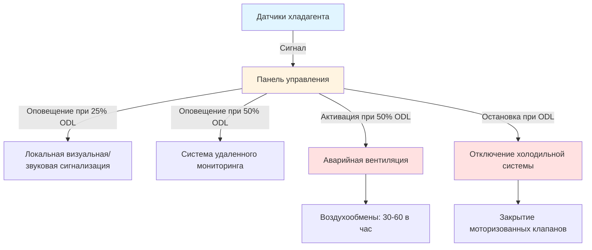

## Обзор европейских стандартов охлаждения

Европейские стандарты охлаждения устанавливают согласованные требования безопасности и производительности во всех государствах-членах ЕС. Серия EN 378 составляет основу для холодильных систем и тепловых насосов, охватывая проектирование, конструкцию, испытания, установку и эксплуатацию. Эти стандарты обеспечивают соответствие Директиве по оборудованию, работающему под давлением (PED) 2014/68/EU и Регламенту по фторированным газам (ЕС) № 517/2014.

EN 378 отличается от ASHRAE Standard 15 по нескольким ключевым областям: пределы заряда хладагента, классификация занятости помещений, требования к машинным отделениям и пороги обнаружения утечек. Понимание этих различий необходимо для инженеров, работающих над международными проектами или сертификацией оборудования.

## Структура серии стандартов EN 378

Стандарт EN 378 разделен на четыре взаимосвязанные части:

**EN 378-1: Требования безопасности и охраны окружающей среды**
- Классификация и свойства хладагентов
- Определение категорий занятости
- Расчет пределов заряда
- Ограничения по местоположению
- Требования к предохранительным устройствам

**EN 378-2: Проектирование, конструкция, испытания, маркировка и документация**
- Конструкция сосудов высокого давления согласно PED
- Спецификации материалов
- Процедуры сварки и соединения
- Протоколы испытаний на давление и герметичность
- Требования к технической документации

**EN 378-3: Установочная площадка и средства индивидуальной защиты**
- Критерии проектирования машинного отделения
- Требования к вентиляции
- Системы экстренного отключения и сигнализация
- Средства индивидуальной защиты
- Положения об обеспечении доступа к техническому обслуживанию

**EN 378-4: Эксплуатация, техническое обслуживание, ремонт и восстановление**
- Процедуры пусконаладки
- Графики периодических осмотров
- Обращение с хладагентом и восстановление
- Требования к выводу из эксплуатации
- Обязанности по ведению записей

## Классификация хладагентов и пределы заряда

EN 378-1 классифицирует хладагенты по группе безопасности (A1, A2L, A2, A3, B1, B2L, B2, B3) в соответствии с ISO 817 и ASHRAE Standard 34. Затем стандарт устанавливает максимально допустимые пределы заряда на основе группы хладагента, категории занятости и типа системы.

### Категории занятости

| Категория | Описание | Примеры | Критический фактор |
|-----------|---------|---------|-------------------|
| a | Жилая/домашняя | Дома, квартиры | м³ на человека |
| b | Контролируемое общественное пространство | Офисы, рестораны | Пути эвакуации |
| c | Общественное с высокой плотностью | Театры, спортивные объекты | Время эвакуации |
| d | Критические объекты | Больницы, центры обработки данных | Непрерывная работа |

### Практический расчет предела заряда

Для прямых систем с хладагентами A1 (R-134a, R-404A, R-507A) в категории занятости b:

$$m_{max} = 2.5 \times LFL \times h_0 \times A^{0.5}$$

Где:
- $m_{max}$ = максимальный заряд хладагента (кг)
- $LFL$ = нижний предел воспламеняемости (кг/м³), или практический предел для хладагентов A1
- $h_0$ = высота установки над полом (м), ограничена 1,8 м
- $A$ = площадь пола занятого помещения (м²)

Для хладагентов A1 (невоспламеняющихся) практический предел заряда упрощается с учетом токсичности и объема помещения. Занятость категории b позволяет до 1,5 кг на м³ объема помещения для большинства хладагентов A1, с конкретными расчетами, требуемыми для меньших помещений.

Для хладагентов A2L (R-32, R-1234yf, R-454B, R-515B):

$$m_{max} = \frac{LFL \times h_0 \times A^{0.5}}{G}$$

Где $G$ – коэффициент безопасности (обычно 4 для хладагентов A2L).

### Сравнение пределов заряда хладагента

| Хладагент | Группа | LFL (кг/м³) | Макс. заряд офиса 50 м² | Примечания |
|-----------|--------|-------------|--------------------------|----------|
| R-404A | A1 | Невоспламеняющийся | 106 кг | Ограничение по объему |
| R-134a | A1 | Невоспламеняющийся | 106 кг | Ограничение по объему |
| R-32 | A2L | 0,307 | 14,7 кг | Высота h₀ = 1,8 м |
| R-1234yf | A2L | 0,289 | 13,8 кг | Высота h₀ = 1,8 м |
| R-290 (пропан) | A3 | 0,038 | 1,8 кг | Серьезные ограничения |
| R-717 (аммиак) | B2L | 0,116 | Запрещено | Только машинное отделение |

## Требования к машинным отделениям

EN 378-3 обязывает наличие машинных отделений для систем, превышающих пределы заряда для занятых помещений, или использующих хладагенты группы B (токсичные). Проектирование машинного отделения должно удовлетворять множеству критериев:

**Конструктивные требования:**
- Класс огнестойкости REI 120 (120 минут)
- Прямой доступ к открытому воздуху или защищенному коридору
- Двери, открывающиеся наружу с паническими механизмами
- Отсутствие прямого сообщения с занятыми помещениями
- Взрывозащищенное электрическое оборудование для хладагентов A2, A3, B2, B3

**Проектирование вентиляции:**

Производительность механической вентиляции должна удалять пар хладагента из сценария наибольшей утечки. Для хладагентов A1:

$$Q_{vent} = \frac{m_{total}}{t \times \rho_{air} \times C_{max}}$$

Где:
- $Q_{vent}$ = скорость вентиляции (м³/с)
- $m_{total}$ = полный заряд системы (кг)
- $t$ = время эвакуации (3600 с в режиме экстренной вентиляции)
- $\rho_{air}$ = плотность воздуха (1,2 кг/м³)
- $C_{max}$ = максимально допустимая концентрация (кг/кг), обычно ODL/2

Для воспламеняющихся хладагентов вентиляция должна поддерживать концентрацию ниже 25% от LFL при непрерывной работе и аварийном резервировании.

**Системы обнаружения и сигнализации:**

## Соответствие Директиве по оборудованию под давлением

Холодильные системы подпадают под действие PED 2014/68/EU при рабочих давлениях, превышающих 0,5 бар избыточного давления. Директива классифицирует оборудование на основе произведения давления и объема, а также группы жидкости:

**Классификация группы жидкости:**
- Группа 1: Хладагенты, классифицируемые как опасные в соответствии с Регламентом CLP
- Группа 2: Все остальные хладагенты

**Назначение категории:**

Для сосудов и аксессуаров под давлением категория зависит от:

$$PV_{product} = PS \times V$$

Где:
- $PS$ = максимально допустимое давление (бар избыточного давления)
- $V$ = объем сосуда (литры)

| Произведение PV | Группа 2 (большинство хладагентов) | Группа 1 (аммиак, углеводороды) |
|-----------------|-------------------------------------|----------------------------------|
| < 50 бар·л | Добросовестная инженерная практика (SEP) | Категория I |
| 50–200 бар·л | Категория I | Категория II |
| 200–1000 бар·л | Категория II | Категория III |
| > 1000 бар·л | Категория III | Категория IV |

Более высокие категории требуют:
- Оценка соответствия уполномоченным органом
- Маркировка CE с идентификационным номером
- Декларация соответствия ЕС
- Полная техническая документация
- Обеспечение качества при производстве

## EN 13313: Трубопроводы хладагента

EN 13313 определяет требования к системам трубопроводов хладагента, дополняя EN 378 подробными руководствами по установке:

**Выбор материала:**
- Медная труба по EN 12735-1 для галокарбоновых хладагентов
- Стальная труба по EN 10255 или EN 10216 для аммиачных систем
- Алюминий запрещен для большинства хладагентов
- Нержавеющая сталь для конкретных применений

**Методы соединения:**
- Паяные соединения предпочтительны (серебряный припой >5% серебра)
- Расклепанные фитинги ограничены малыми диаметрами и низким давлением
- Сварные соединения требуются для стальных аммиачных трубопроводов
- Механические соединения ограничены доступными местами

**Протокол испытания под давлением:**

Давление испытания на прочность:

$$P_{strength} = 1.43 \times PS$$

Давление испытания на герметичность:

$$P_{tightness} = 1.1 \times PS$$

Минимальная продолжительность испытания: 24 часа с документированным мониторингом давления.

## Требования к обнаружению утечек

EN 378 устанавливает пороги обнаружения утечек на основе заряда хладагента и GWP:

**Фиксированное обнаружение обязательно при:**
- Полный заряд превышает 500 кг CO₂-эквивалента
- Заряд > 500 кг для любого хладагента в машинных отделениях
- Воспламеняющиеся хладагенты (A2L, A3) в занятых помещениях

**Расчет:**

$$CO_2eq = m_{charge} \times GWP$$

Где:
- $m_{charge}$ = заряд хладагента (кг)
- $GWP$ = Потенциал глобального потепления (100-летнее значение)

Для R-404A (GWP 3922): Фиксированное обнаружение требуется при заряде выше 0,127 кг (500/3922).

Для R-32 (GWP 675): Фиксированное обнаружение требуется при заряде выше 0,74 кг.

Это требование обусловливает значительные различия в проектировании по сравнению с ASHRAE 15, особенно для хладагентов с высоким GWP, по-прежнему допускаемых в существующих системах.

## Сравнение: EN 378 и ASHRAE 15

| Аспект | EN 378 | ASHRAE 15 |
|--------|--------|-----------|
| Классификация хладагента | ISO 817 | ASHRAE 34 (похожа) |
| Категории занятости | a, b, c, d | A1, A2, A3, B1, B2 |
| Основание предела заряда | Формула на основе площади | На основе объема |
| Вентиляция машинного отделения | Непрерывная на основе ODL | Событие сценария утечки |
| Порог обнаружения утечки | 500 кг CO₂-эквивалента | 6,6 кг хладагента |
| Испытание под давлением | Требования PED | Стандарты ASME |
| Документация | Технический файл обязателен | Записи об установке |

## Требования к периодическим осмотрам

Регламент по фторированным газам 517/2014 обязывает проводить периодическую проверку утечек с интервалами, основанными на CO₂-эквивалентном заряде:

| CO₂-Эквивалентный заряд (тCO₂) | Частота осмотра | Альтернатива фиксированного обнаружения |
|----------------------------------|-----------------|-----------------------------------------|
| 5 до < 50 | Каждые 12 месяцев | 24 месяца с обнаружением |
| 50 до < 500 | Каждые 6 месяцев | 12 месяцев с обнаружением |
| ≥ 500 | Каждые 3 месяца | 6 месяцев с обнаружением |
| Герметичная < 10 | Освобождена при маркировке | Н/д |

Сертифицированные техники должны проводить осмотры в соответствии с протоколами EN 378-4 и записывать результаты в журналы системы, хранящиеся минимум 5 лет.

## Практические соображения при реализации

Инженеры, проектирующие холодильные системы для установки в Европе, должны ориентироваться в множественных перекрывающихся нормативных требованиях:

1. **Серия EN 378** для безопасности и проектирования
2. **PED 2014/68/EU** для сосудов высокого давления
3. **Регламент по фторированным газам 517/2014** для соответствия окружающей среде
4. **Директива ATEX 2014/34/EU** для воспламеняющихся хладагентов
5. **Национальные нормы**, которые могут установить более строгие требования

Тенденция к хладагентам с более низким GWP (классификации A2L и A3) создает проблемы проектирования, примиряя безопасность от воспламеняемости с оптимизацией предела заряда. Косвенные системы, использующие вторичные жидкости, все чаще предоставляют решения для приложений большой мощности при сохранении соответствия.

---

*Это содержание предоставляет инженерное руководство на основе опубликованных стандартов. Проектировщики должны проверить текущие редакции стандартов и местные нормативные акты, реализующие эти требования, для конкретных проектов. Профессиональное инженерное суждение и надлежащие сертификаты остаются важными для проектирования и установки холодильных систем.*
