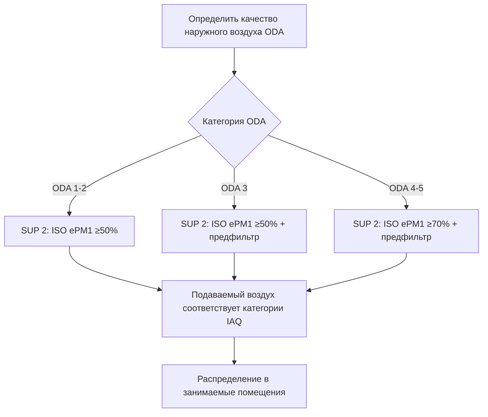
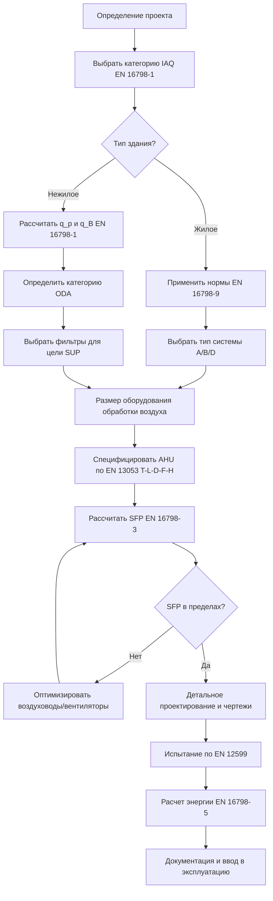

# Европейские стандарты вентиляции: EN 13779 и EN 16798

Европейские стандарты вентиляции устанавливают техническую базу для проектирования систем вентиляции, классификации качества внутренней среды, оценки энергетической эффективности и процедур испытания во всех государствах-членах ЕС. Основные стандарты — EN 13779 (в настоящее время заменен на EN 16798), EN 15251 (заменен на EN 16798-1), EN 12599 для испытания и EN 13053 для рейтинга установок обработки воздуха — определяют методологию расчета норм вентиляции, категории качества внутреннего воздуха, классификацию чистоты воздуха, показатели энергетической эффективности и протоколы ввода в эксплуатацию, которые существенно отличаются от подходов, применяемых в Северной Америке и кодифицированных в стандартах ASHRAE 62.1 и 62.2.

## EN 16798: Энергетическая эффективность зданий - вентиляция

### Разработка и структура стандарта

**Переход от EN 13779 и EN 15251:**
Серия EN 16798 заменила и консолидировала более ранние европейские стандарты вентиляции с 2019 года, обеспечивая обновленную методологию, согласованную с требованиями Директивы об энергетической эффективности зданий (EPBD). Стандарт рассматривает расчет энергетической эффективности при сохранении принципов проектирования вентиляции.

**Структура серии EN 16798:**

- **EN 16798-1:** Параметры внутренней среды для проектирования и оценки энергетической эффективности, включая качество воздуха, тепловую среду, освещение и акустику
- **EN 16798-2:** Интерпретация требований EN 16798-1 для коммерческих зданий
- **EN 16798-3:** Вентиляция нежилых зданий - требования к эффективности систем вентиляции и кондиционирования воздуха
- **EN 16798-5:** Методы расчета энергетических требований систем вентиляции
- **EN 16798-7:** Расчет системной эффективности вентиляции
- **EN 16798-9:** Методы расчета для жилой вентиляции
- **EN 16798-13:** Расчет систем охлаждения
- **EN 16798-15:** Энергетическая эффективность зданий - вентиляция зданий - методы расчета энергетических требований систем отопления
- **EN 16798-17:** Вентиляция зданий - рекомендации по проверке систем вентиляции

### Категории качества внутреннего воздуха (EN 16798-1)

**Система классификации:**
EN 16798-1 устанавливает четыре категории качества внутреннего воздуха (IAQ) на основе ожиданий занимающихся лиц и типа здания, принципиально отличаясь от предписывающего подхода ASHRAE 62.1.

| Категория IAQ | Описание | Типичные применения | Уровень неудовлетворенности |
|--------------|-------------|---------------------|----------------------|
| **Категория I** | Высокий уровень ожиданий | Помещения, занимаемые лицами с повышенной чувствительностью (больницы, детские учреждения, кабинеты для аллергиков) | < 15% недовольных |
| **Категория II** | Нормальный уровень ожиданий | Новые здания, капитальный ремонт (офисы, школы, жилые помещения) | < 20% недовольных |
| **Категория III** | Умеренный, приемлемый уровень | Существующие здания, подвергаемые капитальному ремонту | < 30% недовольных |
| **Категория IV** | Низкий уровень ожиданий | Существующие здания, требующие модернизации | > 30% недовольных |

**Принцип проектирования:**
Выбрать категорию IAQ на этапе проектирования исходя из назначения здания, ожиданий занимающихся лиц, целевых показателей энергетической эффективности и экономических ограничений. Более высокие категории требуют повышенных норм вентиляции, но обеспечивают превосходное удовлетворение потребностей и производительность занимающихся лиц.

### Определение норм вентиляции

**Два дополняющих метода:**

**Метод A: норма вентиляции на основе ощущаемого качества воздуха:**

Требуемая норма вентиляции учитывает выбросы от занимающихся лиц и строительных материалов:

$$q_{tot} = n \cdot q_p + A \cdot q_B$$

Где:
- $q_{tot}$ = общая требуемая норма вентиляции (л/с)
- $n$ = число занимающихся лиц (человек)
- $q_p$ = норма вентиляции на одного человека (л/с·человек)
- $A$ = площадь пола (м²)
- $q_B$ = норма вентиляции на площадь пола для выбросов зданием (л/с·м²)

**Нормы вентиляции для каждой категории (малозагрязняющие здания):**

| Категория IAQ | $q_p$ (л/с·человек) | $q_B$ (л/с·м²) | Общая норма (офис, 0,07 человека/м²) |
|--------------|-------------------|----------------|--------------------------------------|
| Категория I | 10 | 0,5 | 1,2 л/с·м² (2,4 cfm/ft²) |
| Категория II | 7 | 0,35 | 0,84 л/с·м² (1,7 cfm/ft²) |
| Категория III | 4 | 0,2 | 0,48 л/с·м² (0,95 cfm/ft²) |
| Категория IV | 2,5 | 0,1 | 0,28 л/с·м² (0,55 cfm/ft²) |

**Зданиям с интенсивными выбросами:**
Для помещений с заметными выбросами материалов (новое строительство с неотобранными материалами с низкими выбросами) умножить $q_B$ на коэффициенты коррекции 1,5–3,0 в зависимости от уровня выбросов.

**Метод B: норма вентиляции на основе конкретных загрязняющих веществ:**

Для помещений с известными основными загрязнителями (CO₂ в densely populated spaces, specific pollutants in industrial ventilation):

$$q = \frac{G}{C_i - C_o}$$

Где:
- $q$ = требуемая норма вентиляции (м³/с)
- $G$ = скорость образования загрязняющего вещества (мг/с или л/с для CO₂)
- $C_i$ = предел концентрации загрязнителя внутри помещения (мг/м³ или ppm)
- $C_o$ = концентрация загрязнителя на открытом воздухе (мг/м³ или ppm)

**Расчет на основе CO₂ (метаболическое образование):**

$$q_{CO_2} = \frac{n \cdot G_{CO_2}}{C_{i,CO_2} - C_{o,CO_2}}$$

Где:
- $G_{CO_2}$ = образование CO₂ на одного человека ≈ 19 л/ч (0,0053 л/с) для малоподвижной офисной работы
- $C_{i,CO_2}$ = предел концентрации CO₂ внутри помещения (ppm выше наружного)
- $C_{o,CO_2}$ = концентрация CO₂ на открытом воздухе (обычно 400 ppm)

**Пределы CO₂ для каждой категории:**

| Категория IAQ | Макс CO₂ выше наружного | Внутренний CO₂ (400 ppm на открытом воздухе) | Прибл. норма вентиляции |
|--------------|----------------------|------------------------------|-------------------------|
| Категория I | 350 ppm | 750 ppm | 15,1 л/с·человек |
| Категория II | 500 ppm | 900 ppm | 10,6 л/с·человек |
| Категория III | 800 ppm | 1200 ppm | 6,6 л/с·человек |
| Категория IV | 1200 ppm | 1600 ppm | 4,4 л/с·человек |

### Сравнение с ASHRAE 62.1

**Различия основных подходов:**

| Аспект | EN 16798-1 | ASHRAE 62.1-2022 |
|--------|-----------|------------------|
| **Философия** | Категории на основе уровня ожиданий | Предписывающие минимальные нормы |
| **Компонент на одного занимающегося** | 2,5–10 л/с·человек по категориям | 2,5 л/с·человек (фиксировано) |
| **Компонент на площадь здания** | 0,1–0,5 л/с·м² по категориям | Варьируется по типу помещения (0–0,3 cfm/ft²) |
| **Гибкость проектирования** | Высокая (выбор категории) | Средняя (фиксирована по типу помещения) |
| **Учет энергии** | Явный в выборе категории | Неявный в выборе нормы |
| **Основание для загрязнителей** | Ощущаемое качество воздуха (деципол) | Основано на здоровье (CO₂, летучие органические соединения, формальдегид) |

**Пример сравнения для офисного помещения (100 м², 7 занимающихся):**

**EN 16798-1 Категория II:**
- Компонент на одного человека: 7 × 7 = 49 л/с
- Компонент на площадь: 100 × 0,35 = 35 л/с
- **Всего: 84 л/с (178 cfm, 0,84 л/с·м² или 1,67 cfm/ft²)**

**ASHRAE 62.1-2022 (Офис, Таблица 6-1):**
- Компонент на одного человека: 7 × 2,5 = 17,5 л/с
- Компонент на площадь: 100 × 0,06 × 2,118 = 12,7 cfm = 6,0 л/с
- **Всего: 23,5 л/с (50 cfm, 0,235 л/с·м² или 0,47 cfm/ft²)**

**Результат:** EN 16798 Категория II требует вентиляции в 3,6 раза выше, чем ASHRAE 62.1 для типичных офисных помещений, что отражает европейский акцент на ощущаемое качество воздуха и выбросы материалов.

### Классификация качества наружного воздуха

**Категории качества наружного воздуха (ODA) по EN 16798-1:**

| Категория ODA | Описание | PM₁₀ (мкг/м³) | NO₂ (мкг/м³) | Типичные местоположения |
|--------------|-------------|--------------|-------------|-------------------|
| **ODA 1** | Чистый воздух | < 20 | < 40 | Сельские районы, леса |
| **ODA 2** | Низкое загрязнение | 20–35 | 40–80 | Пригородные районы |
| **ODA 3** | Умеренное загрязнение | 35–50 | 80–150 | Городские районы |
| **ODA 4** | Высокое загрязнение | 50–70 | 150–250 | Центры городов с трафиком |
| **ODA 5** | Очень высокое загрязнение | > 70 | > 250 | Промышленные районы, автомагистрали |

**Требования к фильтрации воздуха:**
Наружный воздух должен фильтроваться для достижения качества подаваемого воздуха (SUP), соответствующего или превосходящего требования категории качества внутреннего воздуха.

**Категории подаваемого воздуха (после фильтрации):**

| Категория SUP | Макс концентрация частиц | Мин класс фильтра | Применения |
|--------------|---------------------------|-----------------|--------------|
| **SUP 1** | Очень низкая | ISO ePM1 ≥ 80% | Операционные, чистые комнаты |
| **SUP 2** | Низкая | ISO ePM1 ≥ 50% | Помещения категории I |
| **SUP 3** | Средняя | ISO Coarse ≥ 80% | Помещения категории II–III |
| **SUP 4** | Умеренная | ISO Coarse ≥ 60% | Помещения категории IV |

**Логика выбора фильтра:**
Комбинировать категорию ODA с требуемой категорией SUP для определения минимальной эффективности фильтра. Пример: ODA 3 (городская местность) со зданием категории II (требуется SUP 2) требует минимум фильтра ISO ePM1 ≥ 50% (эквивалент MERV 13–14).

## EN 13053: Рейтинг и эффективность установок обработки воздуха

### Область применения и приложение

EN 13053 устанавливает систему классификации и рейтинга установок обработки воздуха (AHU), охватывающую тепловую эффективность, утечку воздуха, перепуск фильтра, механическую прочность и эффективность рекуперации тепла. Стандарт обеспечивает возможность сравнения между производителями и спецификации минимальных требований к эффективности.

### Параметры классификации

**Коэффициент теплопередачи (класс изоляции):**

| Класс | Макс U-значение (Вт/м²·К) | Типичная конструкция |
|-------|---------------------|---------------------|
| **T1** | ≤ 0,3 | Тяжелая изоляция (100 мм минеральной ваты) |
| **T2** | ≤ 0,5 | Стандартная изоляция (50 мм) |
| **T3** | ≤ 1,0 | Легкая изоляция (25 мм) |
| **T4** | ≤ 1,5 | Минимальная изоляция |
| **T5** | > 1,5 | Без изоляции |

**Класс утечки воздуха (при ±400 Па, ±700 Па или ±1000 Па давления испытания):**

| Класс | Макс норма утечки (% номинального расхода) | Применение |
|-------|--------------------------------------|-------------|
| **L1** | ≤ 0,15% + 0,06 л/с·м² | Высокоэффективные системы |
| **L2** | ≤ 0,30% + 0,12 л/с·м² | Стандартные коммерческие |
| **L3** | ≤ 0,45% + 0,18 л/с·м² | Легкие коммерческие |

**Механическая прочность:**

| Класс | Предел прогиба при испытании | Диапазон статического давления |
|-------|----------------------|----------------------|
| **D1** | ≤ 4 мм/м длины панели | ≥ ±2000 Па |
| **D2** | ≤ 6 мм/м длины панели | ≥ ±1500 Па |
| **D3** | ≤ 8 мм/м длины панели | ≥ ±1000 Па |

**Класс перепуска фильтра:**

| Класс | Макс перепуск (% расхода) | Качество герметизации |
|-------|------------------------|-----------------|
| **F5** | ≤ 0,5% | Превосходная герметизация |
| **F6** | ≤ 1% | Хорошая герметизация |
| **F7** | ≤ 2% | Стандартная герметизация |
| **F8** | ≤ 5% | Легкая герметизация |
| **F9** | > 5% | Плохая герметизация |

### Классификация эффективности рекуперации тепла

**Эффективность температуры при расчетных условиях:**

$$\eta_t = \frac{t_{supply} - t_{outdoor}}{t_{extract} - t_{outdoor}} \times 100\%$$

Где:
- $\eta_t$ = эффективность температуры (%)
- $t_{supply}$ = температура подаваемого воздуха после рекуперации тепла (°C)
- $t_{outdoor}$ = температура наружного воздуха (°C)
- $t_{extract}$ = температура вытяжного воздуха (°C)

**Классы эффективности EN 13053:**

| Класс | Мин сухая эффективность (%) | Типичная технология |
|-------|----------------------|-------------------|
| **H1** | ≥ 90% | Пластинчатый противоток, регенератор ротационный |
| **H2** | ≥ 80% | Пластинчатый перекрестный ток, тепловая трубка |
| **H3** | ≥ 70% | Пластинчатый перекрестный ток (компактный) |
| **H4** | ≥ 60% | Катушка с циркулирующей жидкостью, базовая пластина |
| **H5** | < 60% | Тепловое колесо (низкая эффективность) |

**Рекуперация влажности (энтальпийные теплообменники):**

Дополнительная классификация эффективности передачи влаги:

$$\eta_x = \frac{x_{supply} - x_{outdoor}}{x_{extract} - x_{outdoor}} \times 100\%$$

Где:
- $\eta_x$ = эффективность рекуперации влаги (%)
- $x$ = абсолютная влажность (г/кг)

**Пример спецификации типичной AHU:**
**Классификация: EN 13053 - T2 L1 D1 F5 H1**
- T2: U-значение ≤ 0,5 Вт/м²·К
- L1: утечка воздуха ≤ 0,15% + 0,06 л/с·м² при 400 Па
- D1: прогиб панели ≤ 4 мм/м при 2000 Па
- F5: перепуск фильтра ≤ 0,5%
- H1: эффективность рекуперации тепла ≥ 90%

Эта спецификация обеспечивает высокоэффективную установку, подходящую для зданий категории I или II с энергетической рекуперацией вентиляции.

## EN 12599: Процедуры испытания и измерения вентиляции

### Область применения стандарта

EN 12599 устанавливает протоколы испытания, регулирования и баланса (TAB) систем вентиляции и кондиционирования воздуха для проверки соответствия проектным спецификациям. Стандарт определяет методы измерения, требования к точности приборов, условия испытания и форматы документации.

### Параметры и методы измерения

**Измерение расхода воздуха:**

**Метод траверса по воздуховоду (EN 12599 раздел 6.1):**

$$Q = A \cdot \bar{v}$$

Где:
- $Q$ = объемный расход (м³/с)
- $A$ = площадь сечения воздуховода (м²)
- $\bar{v}$ = средняя скорость воздуха из траверса (м/с)

**Требования к точкам траверса:**

| Диаметр/ширина воздуховода (мм) | Мин количество точек | Схема траверса |
|--------------------------|----------------|------------------|
| < 250 | 9 | сетка 3×3 |
| 250–500 | 16 | сетка 4×4 |
| 500–1000 | 25 | сетка 5×5 |
| > 1000 | 36+ | сетка 6×6 или более |

**Требования к точности измерения:**

| Параметр | Требуемая точность | Тип прибора |
|-----------|------------------|-----------------|
| Скорость воздуха | ±3% показаний или ±0,05 м/с | Термоанемометр, крыльчатый анемометр |
| Объемный расход | ±5% показаний | Трубка Пито + манометр, расходомер |
| Статическое давление | ±2 Па или ±3% | Цифровой манометр |
| Температура | ±0,5 К | Откалиброванный термометр/датчик |
| Влажность | ±5% RH | Откалиброванный гигрометр |

**Измерение расхода на выходных/вытяжных клапанах:**

**Метод расходомера с капотом:**
Предпочтителен для потолочных диффузоров и решеток, где доступ к воздуховодам невозможен. Точность: ±10% для расходов > 50 л/с, снижается для более низких расходов.

**Допуск балансировки:**

| Компонент системы | Приемлемое отклонение от проектного значения |
|------------------|----------------------------------|
| Отдельный клапан | ±10% |
| Общий подачу/вытяжку в помещение | ±5% |
| Общий расход в системе | ±5% |
| Расход в зоне | ±5% |
| Давление в помещении | ±10% от проектного давления |

### Испытание производительности системы

**Проверка установки обработки воздуха (EN 12599 раздел 7):**

**Параметры, подлежащие испытанию:**
1. Общие расходы подаваемого и вытяжного воздуха
2. Температуры наружного, подаваемого, возвратного и вытяжного воздуха
3. Перепады давления на фильтрах
4. Эффективность рекуперации тепла (температура и энтальпия)
5. Потребление электроэнергии вентиляторов
6. Статические давления подачи и вытяжки
7. Уровни звука у установки и в занимаемых помещениях

**Испытание эффективности рекуперации тепла в полевых условиях:**

Измерить температуры в четырех точках одновременно в условиях установившегося режима:

$$\eta_{field} = \frac{t_2 - t_1}{t_3 - t_1} \times 100\%$$

Где:
- $t_1$ = температура наружного воздуха перед рекуперацией тепла (°C)
- $t_2$ = температура подаваемого воздуха после рекуперации тепла (°C)
- $t_3$ = температура вытяжного воздуха перед рекуперацией тепла (°C)

**Критерии приемки:** Измеренная эффективность ≥ 90% от рейтинга производителя (например, при номинальной 85% требуется ≥ 76,5% полевое измерение).

**Проверка удельной мощности вентилятора (SFP):**

$$SFP = \frac{P_{fan}}{Q}$$

Где:
- $SFP$ = удельная мощность вентилятора (Вт/(м³/с) или кВт/(м³/с))
- $P_{fan}$ = общая электрическая мощность всех вентиляторов (подачи + вытяжки) (Вт)
- $Q$ = расход воздуха (м³/с)

Конвертировать в общую европейскую единицу Вт/(л/с): разделить на 1000.

**Пределы SFP EN 16798-3 (комбинированные подача + вытяжка):**

| Тип системы вентиляции | Макс SFP (Вт/(л/с)) | Макс SFP (кВт/(м³/с)) |
|-------------------------|------------------|---------------------|
| Жилая механическая вытяжка только | 0,45 | 0,45 |
| Жилая сбалансированная с рекуперацией тепла | 0,80 | 0,80 |
| Нежилая CAV без рекуперации тепла | 1,50 | 1,50 |
| Нежилая CAV с рекуперацией тепла | 2,00 | 2,00 |
| Нежилая VAV с рекуперацией тепла | 2,50 | 2,50 |

**Проверка качества воздуха в помещении:**

Минимальная длительность испытания: 48 часов нормального использования после завершения балансировки системы.

**Контролируемые параметры:**
- Концентрация CO₂ (непрерывное или периодическое отбор проб)
- Температура и относительная влажность
- Скорость воздуха на рабочих местах (< 0,15–0,25 м/с в зависимости от категории)
- Уровень акустического шума (< 30–45 дB(A) в зависимости от категории)

### Требования к документации

**Содержание отчета об испытании (EN 12599 Приложение C):**

1. Описание системы и проектные спецификации
2. Условия испытания (температура наружного воздуха, уровень занятости, режим работы системы)
3. Используемые приборы для измерения (модель, серийный номер, дата калибровки)
4. Измеренные данные с идентификацией местоположения
5. Сравнение измеренных и проектных значений
6. Отклонения и принятые корректирующие меры
7. Расчеты балансировки системы и произведенные регулировки
8. Окончательная проверка соответствия
9. Подпись при вводе в эксплуатацию

## Расчет энергетической эффективности (EN 16798-5)

### Методология расчета энергии системы вентиляции

EN 16798-5 предоставляет стандартизированный метод расчета годового энергопотребления систем вентиляции, поддерживающий соответствие EPBD и расчеты сертификатов энергетической эффективности (EPC).

**Общая энергия вентиляции:**

$$E_{vent,tot} = E_{fans} + E_{heat} - E_{rec} + E_{cool} + E_{hum}$$

Где:
- $E_{vent,tot}$ = общая годовая энергия системы вентиляции (кВт·ч/год)
- $E_{fans}$ = электрическая энергия вентиляторов (кВт·ч/год)
- $E_{heat}$ = энергия нагрева подаваемого воздуха (кВт·ч/год)
- $E_{rec}$ = энергия, рекуперированная рекуператором тепла (кВт·ч/год)
- $E_{cool}$ = энергия охлаждения подаваемого воздуха (кВт·ч/год)
- $E_{hum}$ = энергия увлажнения (кВт·ч/год)

**Расчет энергии вентиляторов:**

$$E_{fans} = SFP \cdot Q \cdot t_{op} \cdot f_{ctrl}$$

Где:
- $SFP$ = удельная мощность вентилятора (кВт/(м³/с))
- $Q$ = расход воздуха (м³/с)
- $t_{op}$ = годовые часы работы (ч/год)
- $f_{ctrl}$ = коэффициент управления (0,4–1,0, учитывающий VAV, расписание и т. д.)

**Энергия нагрева без рекуперации тепла:**

$$E_{heat,no-rec} = \rho \cdot c_p \cdot Q \cdot (t_{supply} - t_{outdoor,avg}) \cdot t_{op}$$

Где:
- $\rho$ = плотность воздуха (1,2 кг/м³)
- $c_p$ = удельная теплоемкость воздуха (1,005 кДж/кг·К)
- $t_{supply}$ = заданное значение температуры подаваемого воздуха (°C)
- $t_{outdoor,avg}$ = средняя температура наружного воздуха в период отопления (°C)

**Энергия, сохраняемая рекуператором тепла:**

$$E_{rec} = \eta_{HR} \cdot E_{heat,no-rec}$$

Где:
- $\eta_{HR}$ = сезонная эффективность рекуперации тепла (учитывающая перепуск, оттаивание и т. д.)

**Требуемая чистая энергия нагрева:**

$$E_{heat} = E_{heat,no-rec} - E_{rec} = (1 - \eta_{HR}) \cdot E_{heat,no-rec}$$

### Сезонные корректировки эффективности

**Коэффициенты коррекции эффективности рекуперации тепла:**

| Коэффициент | Типичное значение | Влияние |
|--------|--------------|--------|
| Деградация эффективности температуры | 0,90–0,95 | Иней, загрязнение, дисбаланс |
| Работа перепуска (теплый сезон) | 0,70–0,85 | Режим свободного охлаждения |
| Штраф за оттаивание (холодный климат) | 0,85–0,95 | Предварительный нагрев или регенерация |
| Утечка через перекрестный ток (ротационные теплообменники) | 0,95–0,98 | Загрязнение подаваемого воздуха |

**Эффективная сезонная эффективность:**

$$\eta_{seasonal} = \eta_{rated} \cdot f_{degrad} \cdot f_{bypass} \cdot f_{defrost}$$

**Пример расчета (Северная Европа, офисное здание):**
- Проектный расход наружного воздуха: 5000 м³/ч (1,39 м³/с)
- SFP: 1,8 кВт/(м³/с) (подача + вытяжка)
- Номинальная эффективность рекуперации тепла: 85%
- Часы работы: 3500 часов/год (будни, 10 часов/день)
- Коэффициент управления: 0,7 (VAV с выключением ночью/выходные)
- Температура подачи: 18°C
- Средняя температура наружного воздуха в период отопления: 5°C
- Сезонная эффективность RH: 85% × 0,95 × 0,80 × 0,90 = 58%

**Энергия вентиляторов:**

$$E_{fans} = 1,8 \times 1,39 \times 3500 \times 0,7 = 6126 \text{ кВт·ч/год}$$

**Энергия нагрева без рекуперации:**

$$E_{heat,no-rec} = 1,2 \times 1,005 \times 1,39 \times (18-5) \times 3500 = 76000 \text{ кВт·ч/год}$$

**Рекуперированная энергия:**

$$E_{rec} = 0,58 \times 76000 = 44080 \text{ кВт·ч/год}$$

**Чистая энергия нагрева:**

$$E_{heat} = 76000 - 44080 = 31920 \text{ кВт·ч/год}$$

**Общая энергия вентиляции:**

$$E_{vent,tot} = 6126 + 31920 = 38046 \text{ кВт·ч/год}$$

**Энергия, сохраняемая рекуператором тепла:** 44080 кВт·ч/год (58% снижение энергии нагрева)

**Влияние на первичную энергию (коэффициент электричества 2,0, коэффициент тепла 1,0):**
- Первичная энергия вентиляторов: 6126 × 2,0 = 12252 кВт·ч ПЭ/год
- Первичная энергия нагрева: 31920 × 1,0 = 31920 кВт·ч ПЭ/год (предполагается центральное теплоснабжение)
- **Всего: 44172 кВт·ч ПЭ/год**

Без рекуперации тепла общая сумма составила бы 88252 кВт·ч ПЭ/год (достигнуто 50% снижение).

## Жилая вентиляция (EN 16798-9)

### Требования к норме вентиляции жилых помещений

**Норма вентиляции всего жилого помещения:**

$$q_{tot,dwelling} = n_{bedrooms} \cdot q_{bedroom} + A_{living} \cdot q_{living}$$

**Типичные минимальные нормы (жилое помещение категория II):**

| Тип помещения | Норма вентиляции | Единица | Основание |
|-----------|-----------------|------|--------|
| Спальни | 7 | л/с·человек | Спящие занимающиеся |
| Жилые помещения | 0,35–0,49 | л/с·м² | Выбросы материалов |
| Кухни (фоновая) | 7–10 | л/с | Непрерывная |
| Кухни (при готовке) | 20–30 | л/с | Прерывистая/усиленная |
| Ванные комнаты (фоновая) | 7 | л/с | Непрерывная |
| Ванные комнаты (душ) | 15–20 | л/с | Прерывистая/усиленная |

**Альтернативный метод: метод количества воздухообменов:**

$$q_{ACH} = \frac{n \cdot V}{3600}$$

Где:
- $n$ = количество воздухообменов в час (ACH)
- $V$ = объем жилого помещения (м³)

**Минимальные количества воздухообменов:**

| Занятость жилого помещения | Мин ACH (Категория II) | Эквивалентная норма (100 м², потолок 2,5 м) |
|-------------------|----------------------|----------------------------------------|
| Низкая (0–2 человека) | 0,30 ACH | 21 л/с (44 cfm) |
| Средняя (3–4 человека) | 0,40 ACH | 28 л/с (59 cfm) |
| Высокая (5+ человек) | 0,50 ACH | 35 л/с (74 cfm) |

### Типы систем жилой вентиляции

**Классификация систем по EN 16798-9:**

**Система A: Природная подача и вытяжка:**
- Окна, приточные клапаны, пассивные вертикальные воздуховоды
- Без механических компонентов
- Минимальное энергопотребление (нулевое электричество)
- Производительность зависит от климата
- Качество внутреннего воздуха: обычно категория III–IV

**Система B: Только механическая вытяжка:**
- Непрерывные или прерывистые вытяжные вентиляторы
- Природная подача через приточные клапаны или решетки
- Низкое энергопотребление (50–150 Вт)
- Создает подпор в жилом помещении (отрицательное давление)
- Качество внутреннего воздуха: достижима категория II–III

**Система C: Только механическая подача:**
- Механическая подача с природной вытяжкой
- Создает избыточное давление в жилом помещении (положительное давление, предотвращает инфильтрацию)
- Умеренное энергопотребление
- Редко используется в жилых помещениях (более типично в коммерческих)

**Система D: Сбалансированная механическая подача и вытяжка с рекуперацией тепла:**
- Вентиляторы подачи и вытяжки с теплообменником
- Наивысший потенциал качества внутреннего воздуха (категория I–II)
- Наивысшее энергопотребление вентиляторов (200–500 Вт)
- Значительное энергосбережение на отопление (40–70%)
- Все чаще обязательна в строительстве NZEB жилых помещений

**Сравнение энергии (100 м² жилого помещения, Северная Европа):**

| Тип системы | Мощность вентилятора (Вт) | Годовая энергия вентилятора (кВт·ч) | Годовая энергия отопления (кВт·ч) | Общая энергия (кВт·ч) |
|-------------|--------------|------------------------|-----------------------------|--------------------|
| A: Природная | 0 | 0 | 8000 | 8000 |
| B: Механическая вытяжка | 100 | 876 | 7500 | 8376 |
| D: Сбалансированная с 80% RH | 300 | 2628 | 2400 | 5028 |

**Заключение:** Несмотря на более высокую энергию вентиляторов, система D снижает общую энергию на 37% по сравнению с природной вентиляцией благодаря рекуперации тепла.

## Реализация на практике

### Рабочий процесс проектирования с использованием европейских стандартов

### Пример спецификации: Офисное здание

**Параметры проекта:**
- Площадь этажа: 2000 м²
- Занятость: 0,07 человека/м² = 140 человек
- Цель IAQ: Категория II
- Местоположение: городская местность (ODA 3)
- График работы: 10 часов/день, 250 дней/год

**Расчет нормы вентиляции (EN 16798-1 Метод A):**

$$q_{tot} = 140 \times 7 + 2000 \times 0,35 = 980 + 700 = 1680 \text{ л/с} = 6048 \text{ м³/ч}$$

**Выбор системы:**
Сбалансированная механическая вентиляция с рекуперацией тепла (обязательна для категории II новых зданий согласно национальным строительным кодексам)

**Спецификация AHU:**
- Номинальный расход: 6500 м³/ч (запас безопасности 8%)
- Классификация: EN 13053 T2 L1 D1 F5 H1
- Рекуперация тепла: пластинчатый теплообменник противоток, эффективность 85%
- Фильтры подаваемого воздуха: ISO ePM1 60% (эквивалент F7, для ODA 3 к SUP 2)
- Фильтры вытяжного воздуха: ISO Coarse 60% (эквивалент G4)
- Целевой SFP: максимум 1,8 кВт/(м³/с)

**Бюджет перепада давления на фильтрах:**
- Приток наружного воздуха: ISO Coarse 60% @ 75 Па (среднее)
- Подаваемый воздух: ISO ePM1 60% @ 150 Па (среднее)
- Вытяжной воздух: ISO Coarse 60% @ 75 Па
- Общая фильтрация: 300 Па

**Бюджет давления в системе:**
- Воздуховоды подачи: 400 Па
- Диффузоры подачи: 50 Па
- Внутреннее AHU (спирали, HX, заслонки): 250 Па
- Фильтры (сторона подачи): 225 Па
- **Общее статическое давление подачи: 925 Па**

- Воздуховоды вытяжки: 350 Па
- Решетки вытяжки: 30 Па
- Внутреннее AHU: 200 Па
- Фильтр вытяжки: 75 Па
- **Общее статическое давление вытяжки: 655 Па**

**Размер вентиляторов:**
- Вентилятор подачи: 6500 м³/ч @ 925 Па → 1,85 кВт (η = 0,60)
- Вентилятор вытяжки: 6500 м³/ч @ 655 Па → 1,35 кВт (η = 0,60)
- **Общая мощность вентиляторов: 3,20 кВт**

**Проверка SFP:**

$$SFP = \frac{3200}{6500/3600} = 1,78 \text{ кВт/(м³/с)} = 1,78 \text{ Вт/(л/с)}$$

Результат: В пределах предела EN 16798-3 2,0 Вт/(л/с) для нежилых зданий с рекуперацией тепла.

## Сводка

Европейские стандарты вентиляции EN 16798, EN 13053 и EN 12599 устанавливают комплексную техническую базу, охватывающую категоризацию качества внутреннего воздуха (категории I–IV на основе ожиданий занимающихся лиц), определение норм вентиляции, сочетающее компоненты на одного человека и выбросы зданием (2,5–10 л/с·человек плюс 0,1–0,5 л/с·м²), классификацию качества наружного воздуха, требующую надлежащей фильтрации (категории ODA 1–5), спецификацию производительности установок обработки воздуха (классы теплопередачи, утечки воздуха, механической прочности, перепуска фильтра, эффективности рекуперации тепла), процедуры испытания и баланса с определенными требованиями к точности измерения, и методологии расчета энергетической эффективности. Эти стандарты принципиально отличаются от ASHRAE 62.1 благодаря гибкому проектированию на основе категорий, явному учету выбросов строительных материалов, обычно более высоким нормам вентиляции для эквивалентных помещений, жестким требованиям утечки воздуха установок обработки воздуха, обязательной рекуперации тепла для высших категорий производительности и интеграции с расчетами соответствия Директиве об энергетической эффективности зданий, коллективно устанавливающих европейскую передовую практику для проектирования систем вентиляции, спецификации, установки, испытания и проверки энергетической эффективности.

---

## Компоненты

- EN 13779 Вентиляция нежилых помещений
- EN 15251 Критерии внутренней среды
- EN 16798 Энергетическая эффективность зданий вентиляция
- EN 12599 Процедуры испытания вентиляции
- EN 13053 Установки обработки воздуха рейтинг
