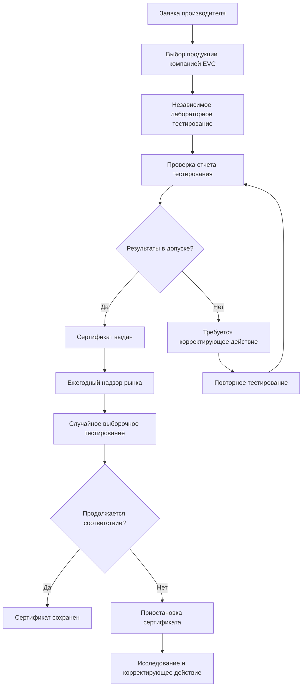

# Сертификация Eurovent для оборудования HVAC

Сертификация Eurovent (EVC) обеспечивает независимую сертификацию третьей стороной производительности оборудования HVAC на европейских рынках. Программа проверяет заявления производителей посредством аккредитованного лабораторного тестирования, гарантируя, что оборудование соответствует заявленным характеристикам производительности, эффективности и уровням звуковой мощности. Данная сертификационная схема устанавливает доверие между производителями, проектировщиками и конечными пользователями путем валидации данных производительности в соответствии со стандартизированными методами испытаний.

## Программы сертификации и область охвата

Eurovent управляет несколькими программами сертификации, специфичными для продукции, охватывающими основные категории оборудования HVAC:

### Сертифицированные категории продукции

| Категория продукции | Ключевые сертифицируемые параметры | Стандарты испытаний |
|-----------------|-------------------------|----------------|
| Приточно-вытяжные установки (AHU) | Тепловая производительность, герметичность воздуха, звуковая мощность | EN 1886, EN 13053 |
| Теплообменники с вентилятором | Охлаждающая/нагревающая мощность, звуковая мощность, расход воды | EN 1397, EN 14518 |
| Холодильные машины | Охлаждающая мощность, EER, ESEER, звуковая мощность | EN 14511, EN 14825 |
| Тепловые насосы | Нагревающая/охлаждающая мощность, COP, SCOP | EN 14511, EN 14825 |
| Градирни | Тепловая производительность, расход воды | CTI STD-201 |
| Воздушные фильтры | Эффективность фильтрации, падение давления | ISO 16890 |
| Блоки прецизионного кондиционирования | Охлаждающая мощность, эффективность, управление влажностью | EN 14511 |

## Методология проверки производительности

### Тестирование тепловой производительности

Сертификация Eurovent валидирует тепловую производительность оборудования посредством контролируемого лабораторного тестирования. Для воздушных теплообменников эффективность проверяется с использованием:

$$
\varepsilon = \frac{T_{подача} - T_{наружный}}{T_{возврат} - T_{наружный}}
$$

где эффективность (ε) представляет отношение фактической передачи тепла к теоретическому максимуму. Сертифицированная производительность должна находиться в пределах ±5% от заявленных значений во всем диапазоне операции.

Для жидкостных связанных систем проверка мощности следует:

$$
Q = \dot{m} \cdot c_p \cdot \Delta T
$$

Тестирование подтверждает скорость передачи тепла (Q) путем измерения массового расхода ($\dot{m}$), удельной теплоемкости ($c_p$) и температурной разницы (ΔT) на сторонах воздуха и воды, с требованием проверки энергетического баланса в пределах 3%.

### Сезонные показатели эффективности

Сертификация Eurovent включает рейтинги сезонной производительности, которые учитывают работу с частичной нагрузкой и изменчивость климата. Европейское соотношение сезонной энергетической эффективности (ESEER) для холодильных машин рассчитывает взвешенную среднюю эффективность:

$$
ESEER = 0.03 \cdot EER_{100\%} + 0.33 \cdot EER_{75\%} + 0.41 \cdot EER_{50\%} + 0.23 \cdot EER_{25\%}
$$

Это взвешивание отражает типичные профили нагрузки европейских коммерческих зданий, где большая часть операции происходит при условиях частичной нагрузки. Сезонный коэффициент производительности (SCOP) для тепловых насосов применяет аналогичную методологию для приложений отопления.

## Сертификация приточно-вытяжной установки

### Тепловые мосты и герметичность воздуха

Сертификация AHU проверяет качество конструкции посредством тестирования теплопередачи и герметичности воздуха в соответствии с EN 1886. Коэффициент теплового моста (Kb) количественно определяет потерю тепла через конструктивные элементы:

$$
K_b = \frac{U_{измеренный} - U_{панель}}{U_{панель}}
$$

Сертифицированные установки достигают уровней классификации:

- **Класс T2**: Kb ≤ 0.75 (максимальное увеличение на 75%)
- **Класс T1**: Kb ≤ 0.40 (максимальное увеличение на 40%)

Классификация герметичности воздуха проверяет целостность кабинета при давлении испытания 400 Па:

| Класс герметичности | Максимальная герметичность (л/с·м²) | Применение |
|---------------|-------------------------|-------------|
| L1 | ≤ 0.15 | Высокопроизводительные приложения |
| L2 | ≤ 0.44 | Стандартное коммерческое использование |
| L3 | ≤ 1.32 | Легкое коммерческое использование |

### Акустическая производительность

Сертификация уровня звуковой мощности измеряет генерирование шума AHU в октавных полосах от 63 Гц до 8000 Гц. Общий взвешенный уровень звуковой мощности (LwA) рассчитывается из:

$$
L_{wA} = 10 \cdot \log_{10}\left(\sum_{i} 10^{(L_{wi} + A_i)/10}\right)
$$

где Lwi представляет звуковую мощность в каждой октавной полосе и Ai является корректирующим коэффициентом A-взвешивания. Сертифицированные значения должны соответствовать заявленным оценкам в пределах ±3 дБ.

## Сертификация холодильных машин и тепловых насосов

### Проверка мощности и эффективности

Сертификация холодильных машин валидирует охлаждающую мощность и эффективность при полной и частичной нагрузке. Тестирование происходит при стандартных условиях рейтинга Eurovent:

**Стандартные условия рейтинга (воздушное охлаждение):**
- Испаритель: 12°C на входе / 7°C на выходе охлажденной воды
- Конденсатор: 35°C температура окружающего воздуха
- Коэффициент обрастания: 0.000018 м²·К/Вт

Проверка коэффициента энергетической эффективности:

$$
EER = \frac{Q_{охлаждение}}{W_{вход}} = \frac{\dot{m}_w \cdot c_p \cdot (T_{вход} - T_{выход})}{P_{компрессор} + P_{вентиляторы} + P_{насосы}}
$$

Сертифицированные значения EER учитывают всю вспомогательную потребляемую мощность, обеспечивая реалистичные показатели системной эффективности.

## Процесс сертификации

## Надзор рынка и соответствие

Eurovent поддерживает целостность сертификации посредством постоянного надзора рынка. Случайные образцы продукции проходят тестирование с минимальным интервалом 12 месяцев. Статистический анализ сравнивает результаты надзора с исходными данными сертификации, используя контрольные пределы:

- Предупредительный предел: ±5% от заявленного значения
- Пороговый предел: ±7% от заявленного значения

Превышение порогового предела вызывает приостановление сертификата до расследования и принятия корректирующих мер.

## Сравнение со стандартами ASHRAE

| Аспект | Сертификация Eurovent | Стандарты ASHRAE |
|--------|------------------------|------------------|
| Сезонная эффективность | ESEER, SCOP (европейский климат) | IEER, IPLV (североамериканский климат) |
| Герметичность AHU | Классы EN 1886 (тест при 400 Па) | ASHRAE 111 (варьируется в зависимости от приложения) |
| Акустическое тестирование | EN ISO 3741 (реверберирующая камера) | AHRI 370 (полуреверберирующая) |
| Тестирование фильтров | ISO 16890 (рейтинги ePM) | ASHRAE 52.2 (рейтинги MERV) |
| Проверка | Обязательная третья сторона | Часто самосертификация |

## Преимущества для проектировщиков и подрядчиков

Сертификация Eurovent обеспечивает количественные преимущества:

1. **Уверенность в производительности**: Независимая проверка исключает оптимизм производителя в опубликованных характеристиках
2. **Упрощенная спецификация**: Ссылка на сертифицированные по Eurovent продукты снижает сложность написания спецификаций
3. **Снижение рисков**: Сертифицированное оборудование соответствует гарантиям производительности контракта
4. **Точность энергетического моделирования**: Проверенные данные эффективности улучшают точность моделирования энергии здания
5. **Поддержка гарантии**: Документация сертификации поддерживает гарантийные требования оборудования

## Интеграция со строительными нормами

Европейские нормы энергетической производительности зданий все чаще ссылаются на сертифицированные данные Eurovent:

- **Соответствие EPBD**: Расчеты Директивы по энергетической производительности зданий требуют проверенной эффективности оборудования
- **Требования экодизайна**: Минимальные стандарты эффективности ссылаются на методологии испытаний Eurovent
- **Национальные строительные нормы**: Многие европейские страны требуют сертифицированное оборудование для государственных зданий

Проектировщики должны проверить требования местных юрисдикций для документации сертификации в пакетах представления.

## Использование сертификационного знака

Продукты, соответствующие требованиям сертификации Eurovent, отображают официальный знак сертификации на табличках оборудования и технической документации. Знак включает:

- Логотип Eurovent
- Идентификатор программы сертификации
- Номер сертификата
- Диапазон действительности даты

Это маркирование обеспечивает возможность полевой проверки и гарантирует, что установленное оборудование соответствует указанным характеристикам производительности.
