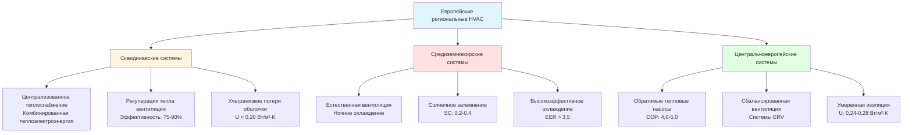

## Региональные климатические зоны и стратегии HVAC

Практики HVAC в Европе отражают отчетливо выраженные климатические зоны, требующие принципиально различных инженерных подходов. Региональные практики развивались в течение многих десятилетий для оптимизации энергоэффективности, комфорта пассажиров и надежности системы в условиях конкретных климатических условий.

### Скандинавский регион: проектирование с преобладанием отопления

**Характеристики климата:**
- Проектные наружные температуры: -20°C до -40°C
- Отопительный сезон: 240-280 дней в год
- Солнечная активность: 6-8 часов (зима), 18-20 часов (лето)

**Доминирование централизованного теплоснабжения:**

Скандинавский регион демонстрирует наивысшую долю проникновения систем централизованного теплоснабжения в мире, при этом эффективность сети зависит от оптимизации температуры подачи:

$$
\eta_{network} = \frac{Q_{delivered}}{Q_{generated}} = \frac{\dot{m} \cdot c_p \cdot (T_{supply} - T_{return})}{Q_{boiler} + W_{pump}}
$$

Где:
- $\eta_{network}$ = тепловая эффективность сети (безразмерная)
- $\dot{m}$ = массовый расход (кг/с)
- $c_p$ = удельная теплоемкость воды (4.186 кДж/кг·K)
- $T_{supply}$ = температура подачи (°C)
- $T_{return}$ = температура обратного потока (°C)

Современное централизованное теплоснабжение четвертого поколения работает при температуре подачи 50-70°C, снижая потери при распределении на 30-50% по сравнению с традиционными системами 90-120°C.

**Стандарты строительной оболочки:**

Скандинавские страны устанавливают значения U значительно ниже, чем в других европейских регионах:

| Строительный компонент | Скандинавия (Вт/м²·K) | Центральная ЕС (Вт/м²·K) | Средиземноморье (Вт/м²·K) |
|-------------------|-----------------|---------------------|------------------------|
| Наружные стены | 0,15-0,20 | 0,24-0,28 | 0,35-0,45 |
| Крыша | 0,09-0,13 | 0,18-0,20 | 0,30-0,38 |
| Окна (U_w) | 0,80-1,00 | 1,10-1,40 | 1,60-2,00 |
| Пол на грунте | 0,12-0,15 | 0,25-0,30 | 0,40-0,50 |

Потери тепла через строительную оболочку следуют уравнению:

$$
Q_{loss} = U \cdot A \cdot \Delta T = U \cdot A \cdot (T_{indoor} - T_{outdoor})
$$

Для наружной стены площадью 150 м² со скандинавским значением U 0,17 Вт/м²·K и проектной разницей температур 42 K (-22°C снаружи, 20°C внутри):

$$
Q_{loss} = 0,17 \times 150 \times 42 = 1 071 \text{ Вт}
$$

### Средиземноморский регион: системы, ориентированные на охлаждение

**Климатические параметры:**
- Проектные летние условия: 32-38°C сухой термометр, 18-24°C влажный термометр
- Градусо-дни охлаждения: 800-1 500 в год
- Высокая солнечная радиация: 5-7 кВт·ч/м²·день (летом)

**Интеграция естественной вентиляции:**

Средиземноморская практика подчеркивает пассивное охлаждение благодаря вентиляции за счет эффекта дымовой трубы:

$$
\Delta P_{stack} = \rho_{outdoor} \cdot g \cdot h \cdot \left(\frac{T_{indoor} - T_{outdoor}}{T_{indoor}}\right)
$$

Где:
- $\Delta P_{stack}$ = перепад давления за счет эффекта дымовой трубы (Па)
- $\rho_{outdoor}$ = плотность наружного воздуха (кг/м³)
- $g$ = ускорение свободного падения (9,81 м/с²)
- $h$ = вертикальная высота между входом и выходом (м)

Для h = 8 м, $T_{indoor}$ = 298 K (25°C), $T_{outdoor}$ = 308 K (35°C):

$$
\Delta P_{stack} = 1,14 \times 9,81 \times 8 \times \left(\frac{25 - 35}{298}\right) = -3,0 \text{ Па}
$$

Отрицательное давление создает обратный поток; механическая помощь требуется в условиях пиковой жары.

**Оптимизация коэффициента затемнения:**

Средиземноморские здания отдают приоритет внешнему затемнению для снижения охлаждающих нагрузок:

$$
Q_{solar} = A_{window} \cdot SHGC \cdot I_{solar} \cdot SC_{external}
$$

Где:
- $SHGC$ = коэффициент солнечного теплового прироста (безразмерный)
- $I_{solar}$ = падающая солнечная радиация (Вт/м²)
- $SC_{external}$ = коэффициент внешнего затемнения (0,2-0,4 для внешних жалюзи)

### Центральноевропейские сбалансированные системы

Климаты Центральной Европы требуют как возможности отопления, так и охлаждения, что способствует внедрению тепловых насосов и проектированию обратимых систем.

**Коэффициент производительности тепловых насосов:**

Практика Центральной Европы нацелена на сезонные значения COP:

$$
COP_{heating} = \frac{Q_{heating}}{W_{input}} = \frac{T_{condenser}}{T_{condenser} - T_{evaporator}} \times \eta_{Carnot}
$$

Для наземного теплового насоса с $T_{evaporator}$ = 278 K (5°C), $T_{condenser}$ = 318 K (45°C), $\eta_{Carnot}$ = 0,55:

$$
COP_{heating} = \frac{318}{318 - 278} \times 0,55 = 4,37
$$

## Сравнение региональных систем HVAC

## Стандарты интенсивности вентиляции

Европейские стандарты вентиляции различаются по регионам в зависимости от скорости инфильтрации и климата:

| Регион | Минимальная вентиляция (л/с·человек) | Воздухообмены (1/ч) | Справочный стандарт |
|--------|----------------------------------|-------------------|-------------------|
| Скандинавия | 7-10 | 0,3-0,5 | Национальные строительные нормы |
| Центральная ЕС | 8-10 | 0,4-0,6 | EN 16798-1 |
| Средиземноморье | 10-15 | 0,5-0,8 | Местные нормативы |
| Великобритания/Ирландия | 8-10 | 0,5-1,0 | Building Regulations Part F |

Повышенные средиземноморские нормы компенсируют неопределенность естественной вентиляции и более высокие охлаждающие нагрузки от метаболизма.

## Выравнивание сертификации энергетических характеристик

Региональные практики согласованы с EPBD (Директива об энергетических характеристиках зданий), но применяют различные методологии расчета:

**Вариации коэффициента первичной энергии:**

$$
PE_{total} = \sum (E_{delivered,i} \times f_{PE,i}) - (E_{exported} \times f_{PE,export})
$$

Где коэффициенты первичной энергии ($f_{PE}$) варьируются значительно:
- Централизованное теплоснабжение: 0,4-1,0 (Скандинавия) vs. 1,0-1,3 (Центральная ЕС)
- Электроэнергия: 1,8-2,5 (сети на угле) vs. 1,5-1,8 (сети с возобновляемыми источниками)

Региональные вариации методологии расчета создают различия в сертифицированных характеристиках 15-30% для идентичных зданий.

## Подходы к контролю влажности

**Скандинавия: управление влагой**

Строительство в холодном климате отдает приоритет паробарьерам и контролируемой механической вентиляции для предотвращения конденсации в строительных конструкциях.

**Средиземноморье: осушение для комфорта**

Высокая наружная влажность в переходные сезоны требует специального осушения, часто с использованием адсорбционных систем, интегрированных с рекуперацией тепла.

**Центральная Европа: адаптивные стратегии**

Системы рекуперации энтальпии балансируют явные и скрытые нагрузки в течение сезонов, поддерживая относительную влажность 30-60% круглый год.

## Матрица принятия решения по выбору системы

| Параметр | Скандинавский выбор | Средиземноморский выбор | Центральноевропейский выбор |
|-----------|---------------|---------------------|------------------|
| Основной источник тепла | Централизованное теплоснабжение/Биомасса | Тепловой насос/Газ | Тепловой насос/Газ |
| Система охлаждения | Минимальное/Свободное охлаждение | Высокоэффективная прямая система | Обратимый тепловой насос |
| Вентиляция | HRV (75-90%) | Естественная + механическая | ERV (65-80%) |
| Стратегия управления | Компенсация по погоде | На основе занятости | Адаптивные алгоритмы |

Региональные европейские практики HVAC демонстрируют, что оптимальное проектирование системы требует согласования характеристик оборудования с профилями нагрузок, специфичными для климата, локальной энергетической инфраструктурой и установившимися строительными практиками. Основанные на физике подходы, разработанные в каждом регионе, предлагают ценные уроки для аналогичных климатических зон во всем мире.

---

*Связанные темы: [Директива об энергетических характеристиках зданий](../energy-performance-buildings-directive/), [Регламент по фторированным газам](../f-gas-regulation/), [Международные метрики эффективности](../../international-efficiency-metrics/)*
