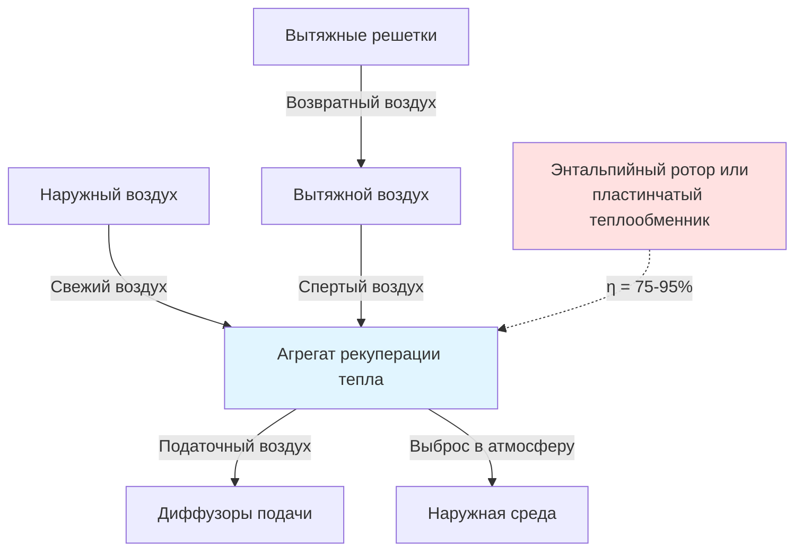

## Обзор

Центральная Европа лидирует глобальных инноваций в области HVAC благодаря строгим стандартам энергоэффективности и прецизионной инженерии. Регион охватывает Германию, Австрию, Швейцарию, Нидерланды и Бельгию, где строительные нормы предписывают превосходные характеристики теплозащиты и эффективность механических систем. Эти страны пионеры методологии пассивного дома и установили эталонные стандарты, которые влияют на международную практику.

## Характеристики климата и параметры проектирования

Климат Центральной Европы сочетает континентальное и умеренное морское влияния, создавая специфические требования к проектированию HVAC:

| Параметр климата | Диапазон значений | Влияние на проектирование |
|------------------|-------------|---------------|
| Градусо-дни отопления (18°C) | 2800-3600 HDD | Преобладание высокой нагрузки на отопление |
| Температура зимнего проектирования | -12°C до -16°C | Значительные требования к производительности теплового насоса |
| Температура летнего проектирования | 28°C до 32°C | Умеренные охлаждающие нагрузки |
| Среднегодовое количество осадков | 600-1200 мм | Управление влажностью критично |
| Относительная влажность (зима) | 75-85% | Риск конденсации в тепловых мостах |

Климат с преобладанием отопления направляет проектирование систем на оптимизацию тепловой оболочки и рекуперацию тепла.

## Стандарт Пассивный дом

Стандарт Пассивный дом (Passive House) возник в Германии и представляет наиболее строгий добровольный стандарт энергоэффективности зданий в мире. Основные требования устанавливают максимальный годовой спрос на энергию отопления:

$$
Q_h \leq 15 \text{ кВтч/(м}^2\text{·год)}
$$

Где $Q_h$ — годовой спрос на энергию отопления на площадь отапливаемого помещения. Стандарт также ограничивает спрос на первичную энергию:

$$
E_{primary} \leq 120 \text{ кВтч/(м}^2\text{·год)}
$$

Это охватывает отопление, охлаждение, горячее водоснабжение, освещение и вспомогательные системы.

### Требования герметичности

Пассивный дом предписывает строгую герметичность, измеренную испытанием с дверью дымовой камеры при перепаде давления 50 Па:

$$
n_{50} \leq 0.6 \text{ ч}^{-1}
$$

Коэффициент изменения воздуха при 50 Па не должен превышать 0,6 объема здания в час. Это требование минимизирует потери инфильтрации и позволяет эффективную механическую вентиляцию с рекуперацией тепла.

### Управление тепловыми мостами

Стандарт требует конструкции без тепловых мостов, где коэффициент линейной теплопередачи удовлетворяет:

$$
\Psi \leq 0.01 \text{ Вт/(м·К)}
$$

Это устраняет риск конденсации и снижает локализованные потери тепла, которые снижают производительность оболочки.

## Стандарт Minergie (Швейцария)

Minergie представляет национальный стандарт зданий Швейцарии с несколькими уровнями сертификации. Базовый стандарт Minergie ограничивает взвешенный спрос на энергию:

$$
E_{weighted} = E_{heating} + E_{cooling} + E_{DHW} + E_{auxiliary} \leq \text{Предельное значение}
$$

Предельные значения зависят от категории здания и года строительства, обычно составляя от 35-90 кВтч/(м²·год) для жилых зданий.

### Требования Minergie-P

Minergie-P (сопоставимо с Пассивным домом) требует:
- Максимальный спрос на отопление: 15 кВтч/(м²·год)
- Герметичность: n₅₀ ≤ 0,6 ч⁻¹
- Обязательная механическая вентиляция с рекуперацией тепла
- Минимальная эффективность рекуперации тепла: 75%

## Механическая вентиляция с рекуперацией тепла

Практика Центральной Европы предписывает сбалансированную механическую вентиляцию с рекуперацией тепла (MVHR) для большинства новых строительств и крупных реноваций. Проектирование системы следует конкретным принципам:

### Расчет эффективности рекуперации тепла

Температурная эффективность системы рекуперации тепла:

$$
\eta_t = \frac{T_{supply} - T_{outdoor}}{T_{exhaust} - T_{outdoor}} \times 100\%
$$

Где:
- $T_{supply}$ = температура податочного воздуха после рекуперации тепла (°C)
- $T_{outdoor}$ = температура наружного воздуха (°C)
- $T_{exhaust}$ = температура вытяжного воздуха из здания (°C)

Немецкие нормы (EnEV, теперь GEG) требуют минимум 80% температурной эффективности для систем вентиляции в малоэнергетических зданиях.

### Рассмотрения падения давления

Удельная мощность вентилятора в системе (SFP) ограничивает энергоэффективную работу вентилятора:

$$
SFP = \frac{P_{fan}}{\dot{V}} \leq 2.0 \text{ кВт/(м}^3\text{/с)}
$$

Где $P_{fan}$ — общая мощность вентилятора (кВ) и $\dot{V}$ — объемный расход (м³/с). Пассивный дом ограничивает SFP до 0,45 кВт/(м³/с) для высокоэффективных систем.

## Интеграция районного теплоснабжения

Районное теплоснабжение обслуживает значительную часть городской Центральной Европы, особенно в Австрии (27% спроса на отопление) и Германии (14%). Низкотемпературное районное теплоснабжение четвертого поколения обеспечивает:

- Температуры подачи: 50-70°C (в сравнении с традиционными 80-120°C)
- Температуры возврата: 25-35°C
- Интеграцию с возобновляемыми источниками тепла
- Сниженные потери распределения

Температура возврата прямо влияет на эффективность системы:

$$
\eta_{network} = 1 - \frac{Q_{loss}}{\dot{m} \cdot c_p \cdot (T_{supply} - T_{return})}
$$

Более низкие температуры возврата увеличивают полезный температурный перепад и улучшают общую эффективность сети.

## Технология тепловых насосов

Центральная Европа лидирует в внедрении тепловых насосов с более чем 1 миллионом установок ежегодно. Воздушные и геотермальные тепловые насосы достигают сезонных коэффициентов производительности (SPF) превышающих 4,0 в хорошо спроектированных системах.

### Требования коэффициента производительности

Сезонный коэффициент производительности для отопления помещений:

$$
SCOP = \frac{Q_{heating,season}}{\sum W_{electrical,season}}
$$

Немецкое нормирование требует минимум SCOP 3,5 для воздушных тепловых насосов, получающих стимулы к установке. Геотермальные системы обычно достигают SCOP 4,5-5,0.

### Двухвалентная эксплуатация

Многие системы используют двухвалентную конфигурацию, сочетающую тепловые насосы с дополнительным отоплением:

| Двухвалентный режим | Описание | Применение |
|---------------|-------------|------------|
| Альтернативный | Тепловой насос работает до двухвалентной точки, затем включается резервное | Системы с оптимизацией затрат |
| Параллельный | Тепловой насос и резервное работают одновременно ниже двухвалентной точки | Управление пиковой нагрузкой |
| Частично параллельный | Тепловой насос работает непрерывно, резервное дополняет при необходимости | Наиболее энергоэффективный |

## Голландский строительный декрет (Bouwbesluit)

Нидерланды требуют расчета коэффициента энергетической производительности (EPC) для новых зданий:

$$
EPC = \frac{E_{primary}}{A_{floor} \cdot f_{shape}}
$$

Где $f_{shape}$ — коэффициент формы, учитывающий геометрию здания. Максимальные значения EPC снизились до 0,4 для жилых зданий (2021), стимулируя строительство с нулевым энергопотреблением.

## Бельгийские нормы EPB

Бельгийское региональное регулирование энергетической производительности предписывает ограничения U-значения и потолки первичного потребления энергии:

| Элемент здания | Максимальное U-значение (Вт/м²·К) |
|------------------|--------------------------|
| Кровля | 0,24 |
| Наружная стена | 0,24 |
| Пол | 0,24 |
| Окна | 1,50 |

Эти требования предусматривают высокоэффективные системы HVAC для достижения общего энергетического бюджета.

## Сравнение со стандартами ASHRAE

Стандарты Центральной Европы превышают минимальные требования ASHRAE 90.1:

| Параметр | ASHRAE 90.1-2019 | Пассивный дом | Minergie-P |
|-----------|------------------|------------|------------|
| Герметичность | Не указано | 0,6 ACH₅₀ | 0,6 ACH₅₀ |
| Рекуперация тепла вентиляции | 50% (климатические зоны 5-8) | Минимум 75% | Минимум 75% |
| Предел энергии отопления | Путь производительности | 15 кВтч/(м²·год) | 15 кВтч/(м²·год) |
| Предел первичной энергии | Путь производительности | 120 кВтч/(м²·год) | Переменный |

Предписывающий характер европейских стандартов контрастирует с подходом ASHRAE, основанным на производительности.

## Рассмотрения технической реализации

Практика HVAC в Центральной Европе подчеркивает:

1. **Подход "конверт в первую очередь"**: Превосходная изоляция и герметичность снижают требования к размерам механической системы
2. **Сбалансированная вентиляция**: Обязательная вентиляция с рекуперацией тепла и непрерывная работа
3. **Гидравлическое распределение**: Водяные системы отопления доминируют над принудительным воздухом
4. **Низкотемпературное отопление**: Напольные и настенные лучистые системы, работающие при температуре подачи 35-45°C
5. **Децентрализованное ГВС**: Точечное или квартирное горячее водоснабжение для минимизации потерь распределения

Эти принципы достигают превосходной энергетической производительности при сохранении теплового комфорта и качества воздуха в помещении согласно стандартам DIN 1946 и EN 15251.

## Компоненты

- Немецкий стандарт Пассивный дом
- Швейцарский стандарт Minergie
- Австрийский подход к энергоэффективности
- Голландский строительный декрет Bouwbesluit
- Бельгийские нормы EPB
