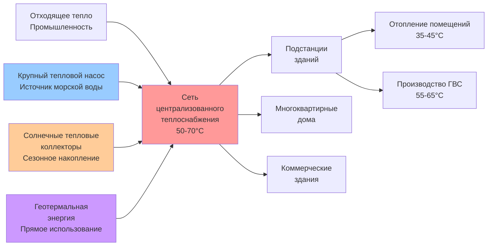

# Стандарты и практика HVAC Северной Европы

Северная Европа охватывает скандинавские страны (Швеция, Норвегия, Дания, Финляндия, Исландия) и страны Балтии (Эстония, Латвия, Литва), регионы, характеризующиеся экстремальными требованиями к отоплению, прогрессивной энергетической политикой и мировыми стандартами производительности зданий. Проектирование HVAC в этих климатических условиях приоритизирует сохранение тепла, рекуперацию энергии и интеграцию возобновляемых источников при суровых зимних условиях, достигающих -30°C до -40°C в континентальных районах, при одновременном управлении умеренными нагрузками охлаждения и учете значительных колебаний солнечной радиации между летним и зимним сезонами.

## Климатические характеристики и последствия для проектирования

Климат Северной Европы создает уникальные ограничения проектирования HVAC, обусловленные экстремальными сезонными различиями и продолжительными периодами отопления.

### Анализ градусо-дней отопления

Градусо-дни отопления (база 18°C) определяют фундаментальные требования нагрузки:

| Регион | Годовые ГДО | Расчетная температура зимы | Продолжительность сезона отопления |
|--------|-----------|-------------------|------------------------|
| Южная Швеция | 3400-3800 | -16°C до -18°C | Октябрь - апрель (210 дней) |
| Северная Швеция/Финляндия | 5500-8000 | -30°C до -40°C | Сентябрь - май (270 дней) |
| Осло, Норвегия | 4000-4500 | -18°C до -20°C | Октябрь - апрель (210 дней) |
| Копенгаген, Дания | 3200-3600 | -12°C до -14°C | Ноябрь - март (180 дней) |
| Рейкьявик, Исландия | 4200-4600 | -10°C до -12°C | Круглогодичный потенциал (морской климат) |
| Таллинн, Эстония | 4000-4500 | -22°C до -24°C | Октябрь - апрель (210 дней) |
| Северная Финляндия/Норвегия | 8000-10000 | -35°C до -42°C | Август - июнь (300 дней) |

Экстремальные северные регионы испытывают полярную ночь (24-часовую темноту) в течение 2-3 месяцев ежегодно, исключая поступления солнечного тепла в периоды максимального спроса на отопление.

### Изменчивость солнечной радиации

Солнечная радиация демонстрирует драматические сезонные колебания, влияющие на проектирование пассивного солнечного отопления и интеграцию фотоэлектрических систем:

$$
I_{daily} = I_{0} \cdot \sin\left(\frac{2\pi(n-80)}{365}\right) \cdot \tau_{atm}
$$

Где:
- $I_{daily}$ = суточная солнечная радиация на горизонтальной поверхности (кВтч/м²)
- $I_{0}$ = амплитуда внеземной радиации
- $n$ = день года
- $\tau_{atm}$ = пропускаемость атмосферы

На широте 60°N (Осло, Стокгольм, Хельсинки) суточная радиация в декабре составляет в среднем 0,2-0,5 кВтч/м² по сравнению с июньскими значениями 6-8 кВтч/м², создавая 15-40-кратное сезонное различие.

## Финский строительный код (D3/D5)

Финляндия внедряет строгие требования к тепловым характеристикам через разделы Национального строительного кода D3 (энергоэффективность) и D5 (системы HVAC).

### Требование первичной энергии E-value

E-value в Финляндии устанавливает максимальное годовое потребление первичной энергии:

$$
E_{total} = E_{heating} + E_{cooling} + E_{DHW} + E_{ventilation} + E_{lighting} - E_{renewable}
$$

Максимальные E-values для жилых зданий (действует с 2018 г.):

- Отдельные дома: 131 кВтч/(м²·год)
- Многоквартирные дома: 97 кВтч/(м²·год)
- Нежилые здания: переменные значения в зависимости от типа (80-170 кВтч/(м²·год))

Расчет E-value использует коэффициенты первичной энергии:
- Централизованное теплоснабжение: 0,5
- Электричество: 1,2
- Масло/газ: 1,0
- Возобновляемые источники на месте: 0,5

### Требования к коэффициенту тепловых потерь

Максимальный коэффициент тепловых потерь здания:

$$
H_{total} = \sum(U_i \cdot A_i) + \sum(\Psi_j \cdot l_j) + n_{infiltration} \cdot \rho \cdot c_p \cdot V
$$

Где:
- $U_i$ = коэффициент теплопередачи элемента i (Вт/м²·К)
- $A_i$ = площадь элемента i (м²)
- $\Psi_j$ = линейный коэффициент теплопередачи теплового моста j (Вт/м·К)
- $l_j$ = длина теплового моста j (м)
- $n_{infiltration}$ = скорость инфильтрации (ч⁻¹)

Максимальные значения U (финский строительный код D3, 2018):

| Элемент конструкции | Максимальное значение U (Вт/м²·К) |
|------------------|--------------------------|
| Наружные стены | 0,17 |
| Крыша | 0,09 |
| Напольная плита | 0,16 |
| Окна/двери | 1,0 |
| Стены подвала | 0,16 |

Эти значения требуют толщины теплоизоляции стен 300-400 мм и окон с тройным остеклением с заполнением аргоном и низкоэмиссионными покрытиями.

### Обязательные требования к рекуперации тепла вентиляции

Финские нормы требуют механической приточной и вытяжной вентиляции с рекуперацией тепла для всех новых зданий. Минимальная годовая эффективность рекуперации тепла:

$$
\eta_{annual} = \frac{\sum_{year}(T_{supply} - T_{outdoor})}{\sum_{year}(T_{exhaust} - T_{outdoor})} \geq 0,55
$$

Практические реализации достигают эффективности 70-85% с использованием роторных или противоточных пластинчатых теплообменников с защитой от обледенения.

## Шведские строительные нормы (BBR)

Шведский национальный совет по жилищному строительству (Boverket) устанавливает требования через BBR (Boverkets Byggregler).

### Требования к энергетической производительности

BBR определяет максимальное удельное потребление энергии на основе климатической зоны и типа здания:

**Климатическая зона I (Южная Швеция, Стокгольм):**
- Жилые здания: 70 кВтч/(м²·год) первичной энергии
- Нежилые здания: переменные значения в зависимости от использования (55-100 кВтч/(м²·год))

**Климатическая зона II (Центральная Швеция):**
- Жилые здания: 80 кВтч/(м²·год)

**Климатическая зона III (Северная Швеция):**
- Жилые здания: 90 кВтч/(м²·год)

Системы электрического отопления требуют дополнительного обеспечения возобновляемой энергией или улучшений оболочки здания для компенсации более высоких коэффициентов первичной энергии.

### Средний коэффициент тепловых потерь

BBR устанавливает максимальный средний коэффициент теплопередачи:

$$
U_{m,avg} = \frac{\sum(U_i \cdot A_i)}{\sum A_i} + \Delta U_{tb}
$$

Где $\Delta U_{tb}$ учитывает эффекты тепловых мостов (обычно добавление 0,03-0,05 Вт/м²·К).

Максимальные значения варьируются от 0,30-0,40 Вт/м²·К в зависимости от климатической зоны и геометрии здания.

## Норвежский стандарт пассивного дома (NS 3700/3701)

Норвегия разработала комплексные стандарты пассивного дома NS 3700 (критерии) и NS 3701 (критерии для нежилых зданий).

### Пределы потребления энергии для отопления

Годовое чистое потребление энергии для отопления:

$$
Q_{heating,net} = Q_{transmission} + Q_{infiltration} + Q_{ventilation} - Q_{internal} - Q_{solar} \leq 15 \text{ кВтч/(м}^2\text{·год)}
$$

Для зданий в холодном климате (> 5000 ГДО) лимит корректируется:

$$
Q_{heating,net,adjusted} = 15 + \left(\frac{HDD - 5000}{1000}\right) \times 2 \text{ кВтч/(м}^2\text{·год)}
$$

Это допускает 21 кВтч/(м²·год) для мест с 8000 ГДО, признавая физические ограничения экстремальных климатов.

### Требование первичной энергии

Общая первичная энергия, включая все системы здания:

$$
E_{primary} \leq 120 \text{ кВтч/(м}^2\text{·год)}
$$

Коэффициенты первичной энергии (специфичные для Норвегии):
- Электричество: 2,0 (отражающие характеристики норвежской сети)
- Централизованное теплоснабжение: 1,0
- Возобновляемые источники на месте: 0,5

### Требования к герметичности

Тест дверцы вентилятора при дифференциальном давлении 50 Па:

$$
n_{50} \leq 0,6 \text{ ч}^{-1}
$$

Для нежилых зданий с механической вентиляцией:

$$
q_{50} \leq 1,5 \text{ м}^3\text{/(ч·м}^2\text{)}
$$

Где $q_{50}$ - скорость утечки воздуха на единицу площади оболочки.

Достижение этих значений в арктических условиях требует сплошных воздухозащитных систем, паронепроницаемого строительства и исключения всех проходов через тепловую оболочку.

## Датские строительные нормы (BR18)

Дания внедряет прогрессивные требования к энергии через Строительные нормы 2018 (BR18) с стандартами практически нулевой энергии зданий.

### Расчет энергетического лимита

Ограничение общего спроса на первичную энергию:

$$
E_{frame} = 30 + \frac{1000}{A_{heated}} \text{ кВтч/(м}^2\text{·год)}
$$

Для жилых зданий с отапливаемой площадью $A_{heated}$ (м²). Эта формула допускает более высокое удельное потребление энергии для меньших зданий при сохранении абсолютной энергоэффективности.

Минимальные требования для класса зданий 2020:
- Дома: 27 кВтч/(м²·год) + 1650/A кВтч/год
- Многоквартирные дома: 30 кВтч/(м²·год)
- Офисы: 41 кВтч/(м²·год)

### Классы зданий с низким энергопотреблением

Дания определяет прогрессивные энергетические классы:

| Класс | Описание | Требование к энергии |
|-------|-------------|-------------------|
| BR18 | Строительные нормы 2018 | 30 + 1000/A кВтч/(м²·год) |
| Класс с низким энергопотреблением 2015 | Добровольный | 52,5 + 1650/A кВтч/(м²·год) |
| Класс зданий 2020 | Практически нулевая энергия | 27 + 1650/A кВтч/(м²·год) |

## Доминирование централизованного теплоснабжения

Северная Европа оперирует самой обширной в мире инфраструктурой централизованного теплоснабжения, обслуживающей 60-65% зданий в Швеции, 64% в Дании, 50% в Финляндии и 46% в Исландии.

### Централизованное теплоснабжение четвертого поколения

Современное скандинавское централизованное теплоснабжение использует низкотемпературные системы:

**Температуры подачи и обратного потока:**
- Традиционное (1-3 поколение): 80-120°C подача, 40-60°C обратный поток
- Четвертое поколение: 50-70°C подача, 25-35°C обратный поток

Снижение потерь тепла от снижения температуры:

$$
Q_{loss} = U_{pipe} \cdot A_{pipe} \cdot (T_{avg,network} - T_{ground})
$$

Где средняя температура сети:

$$
T_{avg,network} = \frac{T_{supply} + T_{return}}{2}
$$

Снижение подачи с 90°C до 60°C с обратным потоком с 50°C до 30°C снижает среднюю температуру с 70°C до 45°C, снижая потери примерно на 35-40% при температуре грунта 5°C.

### Интеграция с возобновляемыми источниками

Низкотемпературная эксплуатация обеспечивает интеграцию:
- Крупнотоннажные тепловые насосы, использующие сточные воды, морскую воду или грунтовые воды (достигающие COP 3,5-5,0)
- Рекуперация промышленных отходящих газов
- Поля солнечных тепловых коллекторов (сезонное аккумулирование)
- Геотермальная энергия (Исландия: 90% отопления из геотермальных источников)

### Конструкция подстанции здания

Подстанции централизованного теплоснабжения используют непрямое соединение для предотвращения перекрестного загрязнения:

**Первичная сторона (сеть централизованного теплоснабжения):**
- Температура подачи: 50-70°C
- Целевая температура обратного потока: 25-35°C (критична для эффективности системы)
- Регулирование потока: Клапан дифференциального давления

**Вторичная сторона (системы здания):**
- Отопление помещений: 35-45°C подача к радиантным полам/низкотемпературным радиаторам
- Горячее водоснабжение: Теплообменник с мгновенной теплопередачей, производящий 55-65°C

Теплопередача в пластинчатом теплообменнике:

$$
Q = U \cdot A \cdot \Delta T_{LMTD}
$$

Где логарифмическая средняя разность температур:

$$
\Delta T_{LMTD} = \frac{(T_{1,in} - T_{2,out}) - (T_{1,out} - T_{2,in})}{\ln\left(\frac{T_{1,in} - T_{2,out}}{T_{1,out} - T_{2,in}}\right)}
$$

Достижение низких температур обратного потока требует:
- Переразмеренные теплообменники (большая A)
- Низкотемпературное отопительное распределение
- Надлежащая гидравлическая балансировка
- Термостатические клапаны радиаторов с низкотемпературной характеристикой

## Технология тепловых насосов в экстремально холодном климате

Скандинавские страны возглавляют разработку тепловых насосов, работающих при экстремальных наружных температурах.

### Производительность при низких температурах

Современные тепловые насосы воздушного источника в условиях холода сохраняют мощность до -25°C наружной температуры. Эффективность Карно устанавливает теоретический максимум:

$$
COP_{Carnot} = \frac{T_{condensing}}{T_{condensing} - T_{evaporating}}
$$

Для отопления до 35°C (308 К) из воздуха -25°C (248 К):

$$
COP_{Carnot} = \frac{308}{308 - 248} = 5,13
$$

Практические системы достигают 50-65% эффективности Карно, давая COP 2,5-3,3 при -25°C наружных условиях с технологией продвинутой парной инъекции.

### Улучшенные системы впрыска паров

Двухступенчатое сжатие с впрыском экономайзера сохраняет мощность и эффективность при низких температурах:

**Процесс сжатия с впрыском паров:**
1. Первичное сжатие от давления испарителя к промежуточному давлению
2. Экономайзер вспомогательного резервуара обеспечивает впрыск паров при промежуточном давлении
3. Вторичное сжатие от промежуточного к давлению конденсации

Увеличение мощности от впрыска паров:

$$
\dot{Q}_{capacity,EVI} = \dot{Q}_{capacity,standard} \times (1 + 0,15 \text{ к } 0,30)
$$

Это сохраняет 80-90% номинальной мощности при -25°C по сравнению с 40-60% для одноступенчатых стандартных систем.

### Геотермальные тепловые насосы в холодных климатах

Вертикальные скважинные системы обеспечивают стабильный источник тепла:

**Требование к глубине скважины:**

$$
L_{borehole} = \frac{Q_{heating,design}}{\dot{q}_{extraction} \times N_{boreholes}}
$$

Где:
- $Q_{heating,design}$ = нагрузка отопления при проектировании (Вт)
- $\dot{q}_{extraction}$ = удельная скорость извлечения (25-40 Вт/м в гранитных скалах Скандинавии)
- $N_{boreholes}$ = количество скважин

Для нагрузки отопления 10 кВт с извлечением 30 Вт/м:

$$
L_{borehole} = \frac{10 000}{30 \times 1} = 333 \text{ м (одна скважина)}
$$

Обычно реализуется как 2-3 скважины глубиной 120-180 м для минимизации земельной площади и стоимости бурения.

Температура грунта на глубине 100-150 м остается стабильной при +4°C до +8°C круглый год в скандинавских условиях, обеспечивая SCOP значения 4,5-5,5 для надлежащим образом спроектированных систем.

## Передовая рекуперация тепла вентиляции

Практика Северной Европы использует сложные методы рекуперации тепла для минимизации потерь вентиляции в экстремальных климатах.

### Производительность роторного теплообменника

Роторные теплообменники (энтальпийные колеса) достигают наивысшей эффективности:

**Эффективность:**

$$
\varepsilon = \frac{T_{supply} - T_{outdoor}}{T_{exhaust} - T_{outdoor}}
$$

Высокопроизводительные установки достигают ε = 0,85-0,92 с возможностью восстановления влаги.

**Требование защиты от обледенения:**

При наружных температурах ниже -5°C образование инея на поверхностях теплообменника требует активной защиты:

1. **Предварительное подогревание:** Электрический или рециркуляционный предварительный подогреватель воздуха повышает наружный воздух до минимума -5°C
2. **Снижение скорости колеса:** Снижает эффективность рекуперации тепла для предотвращения обледенения (неэффективно)
3. **Рециркуляция колеса:** Обход части выхлопного воздуха обратно на выхлопную сторону

Потребление энергии предварительного подогрева:

$$
Q_{preheat} = \dot{m} \cdot c_p \cdot (T_{target} - T_{outdoor})
$$

При -30°C с потоком воздуха 0,1 кг/с и целью +5°C:

$$
Q_{preheat} = 0,1 \times 1005 \times (5 - (-30)) = 3,52 \text{ кВт}
$$

Это представляет значительную паразитную нагрузку, влияющую на спецификацию устойчивых к обледенению конструкций.

### Противоточные пластинчатые теплообменники

Пластинчатые теплообменники избегают проблем обледенения благодаря:
- Поддержанию температуры выхлопного воздуха выше точки росы
- Циклам оттаивания с использованием обходных демпферов
- Конструкции из алюминия или пластика, предотвращающей прилипание льда

**Расчет эффективности:**

$$
\eta_{plate} = \frac{c_{min} \cdot (T_{supply,out} - T_{outdoor,in})}{c_{min} \cdot (T_{exhaust,in} - T_{outdoor,in})}
$$

Где $c_{min}$ - минимальная скорость теплоемкости. Высокопроизводительные установки достигают η = 0,75-0,85.

### Оптимизация удельной мощности вентилятора

Энергоэффективная работа вентилятора критична в постоянно работающих системах вентиляции:

$$
SFP = \frac{P_{fan,supply} + P_{fan,exhaust}}{\dot{V}} \leq 1,5 \text{ кВт/(м}^3\text{/с)}
$$

Лучшая практика Северной Европы ориентирует SFP < 1,0 кВт/(м³/с) с использованием:
- EC моторов с эффективностью > 80%
- Оптимального размера воздуховодов (скорость 2-4 м/с)
- Низкопадающих фильтров и теплообменников
- Управления вентиляцией по требованию (датчики CO₂)

Годовая энергия вентилятора для системы 100 L/s (1,699 м³/ч) при SFP 1,0 кВт/(м³/с):

$$
E_{fan,annual} = \frac{1,0 \times 0,1 \times 8760}{1000} = 876 \text{ кВтч/год}
$$

Снижение SFP с 2,0 до 1,0 кВт/(м³/с) экономит 876 кВтч/год, значительное в зданиях с низким энергопотреблением.

## Управление влагой и паровой контроль

Экстремальные температурные различия между внутренним и наружным воздухом создают значительные градиенты давления паров, требующие тщательного управления влагой.

### Дифференциал давления пара

Зимние условия с +21°C внутреннего (2500 Па давление пара при 40% ОВ) и -30°C наружного (38 Па давление насыщения):

$$
\Delta P_{vapor} = P_{indoor} - P_{outdoor} = 2500 - 38 = 2462 \text{ Па}
$$

Этот 65-кратный дифференциал давления способствует миграции влаги через любой проницаемый барьер.

### Риск конденсации в строительной оболочке

Межслойная конденсация происходит где температура в оболочке достигает точки росы мигрирующей влаги:

**Анализ методом Глазера:**

$$
\theta_{dewpoint} = \frac{b \cdot \ln(P_{vapor}/a)}{1 - \ln(P_{vapor}/a)}
$$

Где a = 611 Па, b = 17,27 (коэффициенты Magnus-Tetens).

Для давления пара 2500 Па: θ_dewpoint = 20,1°C

Любое место в оболочке ниже 20,1°C испытывает конденсацию если влага достигает этой точки, требуя:
- Сплошного пароизоляции на теплой стороне (интерьер)
- Паропроницаемости, увеличивающейся наружу
- Вентилируемых воздушных промежутков в критических узлах

### Требования к вытяжке в ванных комнатах и кухнях

Помещения с высоким выделением влаги требуют отдельной вытяжки:

**Минимальные скорости вытяжки (финский строительный код D2):**
- Ванная: 15 L/s (25,5 м³/ч) непрерывно или 35 L/s (59,5 м³/ч) прерывистая
- Кухня: 10 L/s (17 м³/ч) непрерывно + 20 L/s (34 м³/ч) бустер приготовления пищи
- Сауна: 15 L/s (25,5 м³/ч) + 5 L/s (8,5 м³/ч) на человека по вместимости

Мощность удаления влаги:

$$
\dot{m}_{moisture,removal} = \dot{V} \cdot \rho \cdot (x_{indoor} - x_{outdoor})
$$

Где x - абсолютная влажность (кг воды/кг сухого воздуха).

## Интеграция геотермальной энергии Исландии

Исландия получает 90% энергии отопления зданий из прямой геотермальной энергии, создавая уникальные требования проектирования HVAC.

### Централизованное геотермальное теплоснабжение

Геотермальная вода при 80-120°C распределяется непосредственно к зданиям:

**Первичное распределение:**
- Температура подачи: 80-85°C
- Температура обратного потока: 40-50°C
- Непрессуризованная открытая система (атмосферное давление)

**Подключение здания:**
- Теплообменник изоляции (защита от коррозии из-за геотермальных минералов)
- Вторичный контур: 70-75°C подача к радиаторам
- Горячее водоснабжение: Прямое соединение с регулирующим клапаном (доставка 60°C)

### Размеры геотермального теплообменника

Теплопередача с первичной геотермальной:

$$
UA = \frac{\dot{Q}}{\Delta T_{LMTD}} = \frac{\dot{m}_{primary} \cdot c_p \cdot (T_{in} - T_{out})}{\Delta T_{LMTD}}
$$

Для нагрузки отопления 20 кВт с геотермальным 85°C/45°C и вторичной 70°C/35°C:

$$
\Delta T_{LMTD} = \frac{(85-70) - (45-35)}{\ln(15/10)} = 12,3 \text{ К}
$$

$$
UA = \frac{20 000}{12,3} = 1 626 \text{ Вт/К}
$$

Пластинчатый теплообменник с U = 3000 Вт/(м²·К) требует площади поверхности A = 0,54 м².

## Прогрессия энергоэффективности стран Балтии

Эстония, Латвия и Литва перешли от советских стандартов к требованиям Директивы EU по энергетической производительности зданий.

### Эстонские строительные нормы

Требования к энергетической производительности (действуют с 2019 г.):

**Пределы первичной энергии:**
- Жилые: 150 кВтч/(м²·год) максимум
- Нежилые: 100-180 кВтч/(м²·год) в зависимости от типа

**Значения U оболочки:**

| Элемент | Максимальное значение U (Вт/м²·К) |
|---------|--------------------------|
| Наружные стены | 0,18 |
| Крыша | 0,12 |
| Пол на грунте | 0,15 |
| Окна | 1,0 |

### Латвийский строительный код (LBN)

LBN 002-19 устанавливает энергетическую сертификацию с пределами коэффициента тепловых потерь:

$$
H_{spec} = \frac{H_{total}}{A_{floor}} \leq H_{max}
$$

Где H_max варьируется от 0,35-0,60 Вт/(м²·К) в зависимости от коэффициента компактности здания (поверхность/объем).

### Энергоэффективность Литвы

Техническое положение STR 2.01.02:2016 требует:

**Классы энергетической производительности:**
- Класс A++: ≤ 25 кВтч/(м²·год)
- Класс A+: ≤ 40 кВтч/(м²·год)
- Класс A: ≤ 90 кВтч/(м²·год)

Новые здания должны достигать минимума класса A, побуждая внедрение тепловых насосов и рекуперации тепла вентиляции.

## Сравнение со стандартами ASHRAE

Требования Северной Европы значительно превышают описательные минимумы ASHRAE 90.1:

| Параметр | ASHRAE 90.1-2019 Климатическая зона 7 | Финский D3 2018 | Норвежский пассивный дом |
|-----------|--------------------------------------|---------------------|----------------------------|
| U стены | 0,283 Вт/м²·К | 0,17 Вт/м²·К | 0,10-0,15 Вт/м²·К |
| U крыши | 0,168 Вт/м²·К | 0,09 Вт/м²·К | 0,08-0,10 Вт/м²·К |
| U окна | 2,27 Вт/м²·К | 1,0 Вт/м²·К | 0,6-0,8 Вт/м²·К |
| Герметичность | Не указана | Тест требуется | 0,6 ACH₅₀ |
| Рекуперация тепла вентиляции | 50% энтальпийная | 55% годовой минимум | 75-85% температурная |
| Лимит первичной энергии | Путь производительности | 97-131 кВтч/(м²·год) | 120 кВтч/(м²·год) |

40-65% более низкие значения U и обязательное тестирование герметичности отражают адаптацию к экстремальному климату и приоритеты энергетической безопасности.

## Технические стратегии реализации

Практика HVAC Северной Европы подчеркивает:

1. **Супер-изолированные оболочки**: Толщины стен 300-500 мм со сплошными слоями теплоизоляции, исключающими тепловые мосты

2. **Герметичное строительство**: Сплошные воздухозащитные системы с испытанием дверцей вентилятора при завершении проекта

3. **Уравновешенная вентиляция с высокоэффективной рекуперацией тепла**: Роторные или противоточные теплообменники, достигающие 75-90% эффективности с защитой от обледенения

4. **Низкотемпературное гидроное отопление**: Радиантные полы, работающие при 30-40°C подачи, обеспечивающие оптимизацию тепловых насосов и централизованного теплоснабжения

5. **Устойчивое к влаге строительство**: Сплошность пароизоляции и надлежащая последовательность материалов по паропроницаемости для предотвращения межслойной конденсации

6. **Доминирование централизованного теплоснабжения**: Подключение к низкотемпературным сетям четвертого поколения где доступно, с возобновляемыми источниками энергии

7. **Технология тепловых насосов**: Геотермальные системы предпочтительны для наивысшей эффективности; холодоустойчивые воздушные источники с впрыском паров для приложений модернизации

8. **Мониторинг и управление энергией**: Системы автоматизации зданий с непрерывным отслеживанием производительности и выявлением неисправностей

Эти стратегии достигают сокращения потребления энергии отопления на 75-85% по сравнению с типичным строительством 1970-1980-х годов при сохранении превосходного качества внутреннего воздуха и теплового комфорта в условиях Арктики и суб-Арктики.

## Компоненты

- Финский строительный код D3 D5
- Шведские строительные нормы BBR
- Норвежский пассивный дом NS 3700
- Датские строительные нормы BR18
- Системы централизованного теплоснабжения Северной Европы
- Технология тепловых насосов в условиях холода
- Эстонский код энергоэффективности зданий
- Латвийские строительные стандарты LBN
- Литовская энергетическая производительность
