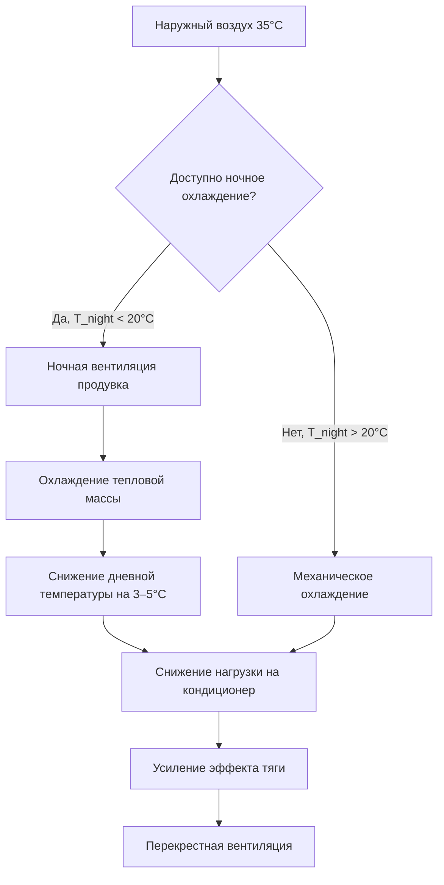

## Философия проектирования, ориентированная на климат

Практика HVAC в Южной Европе отдает приоритет нагрузкам охлаждения над требованиями отопления, отражая характеристики средиземноморского климата с жаркими, сухими летами и мягкими влажными зимами. Расчетные наружные температуры варьируются от 35–42 °C летом до 0–10 °C зимой, создавая годовые энергетические профили с преобладанием охлаждения, принципиально отличающиеся от ориентированных на отопление подходов в Северной Европе.

Региональный акцент на естественную вентиляцию, использование тепловой массы и затенение от солнца напрямую отражают высокие уровни солнечной радиации (1500–2000 кВт·ч/м²/год) и продленные сезоны охлаждения, длящиеся 5–7 месяцев. Проектирование ограждающей конструкции здания отдает приоритет контролю коэффициента солнечного теплопоступления (SHGC) над чистой толщиной изоляции, уравновешивая годовую энергетическую производительность.

## Характеристики нагрузок охлаждения

Летние нагрузки охлаждения в Южной Европе характеризуются отчетливыми закономерностями, обусловленными солнечной радиацией и температурой наружного воздуха:

$$Q_{cooling} = Q_{sensible} + Q_{latent} = \dot{m}c_p(T_{indoor} - T_{supply}) + \dot{m}h_{fg}(\omega_{indoor} - \omega_{supply})$$

Где ощутимое охлаждение преобладает из-за низкой влажности во многих регионах (внутренние районы Греции, Испании), в то время как прибрежные районы (итальянское побережье, южная Франция) испытывают более высокие скрытые нагрузки от влажного морского воздуха.

Пиковые нагрузки охлаждения возникают в полуденные часы (14:00–17:00), когда солнечные поступления и температура наружного воздуха совпадают:

$$Q_{solar} = A \cdot SHGC \cdot I_{solar} \cdot CLF$$

Типичная пиковая солнечная радиация достигает 900–1000 Вт/м² на остекленных поверхностях, обращенных на юг, требуя агрессивных стратегий затенения и низкого коэффициента SHGC остекления (0,25–0,35) в сравнении со значениями в Северной Европе (0,50–0,60).

## Региональные нормативно-правовые базы

| Страна | Основной нормативный акт | Область применения | Пределы U-value (Вт/м²·К) |
|--------|-------------------------|-------------------|---------------------------|
| Испания | RITE (Reglamento de Instalaciones Térmicas) | Тепловые установки | Стены: 0,50, Кровля: 0,38 |
| Италия | DPR 412/93, D.Lgs 192/2005 | Системы отопления/охлаждения | Стены: 0,36, Кровля: 0,32 |
| Греция | KENAK Energy Performance | Энергоэффективность зданий | Стены: 0,45, Кровля: 0,40 |
| Португалия | SCE (Sistema de Certificação Energética) | Энергетическая сертификация | Стены: 0,50, Кровля: 0,40 |

Испанское предписание RITE предусматривает минимальные значения коэффициента сезонной энергоэффективности охлаждения (SEER) для оборудования охлаждения, варьирующиеся от 2,6–4,6 в зависимости от мощности, значительно ниже требований ASHRAE 90.1 (3,8–4,5 EER), отражая более старый парк оборудования и менее строгое соблюдение.

## Интеграция естественной вентиляции

Проектирование в Южной Европе в значительной степени использует естественную вентиляцию для снижения механического охлаждения:

Эффективность ночной вентиляции зависит от тепловой массы и скорости вентиляции:

$$\Delta T_{mass} = \frac{Q_{night} \cdot t}{m \cdot c_p} = \frac{\dot{V} \cdot \rho \cdot c_p \cdot (T_{indoor} - T_{outdoor}) \cdot t}{m_{building} \cdot c_p}$$

Бетонные конструкции, распространенные в регионе, обеспечивают тепловую массу 200–400 кДж/м²·К, позволяя снизить температуру на 3–5 °C при сочетании с показателями ночной вентиляции 5–10 ACH50.

## Распространенность солнечной тепловой энергии

Греция лидирует в Европе по количеству установок солнечных тепловых коллекторов с показателем 300–400 м²/1000 жителей в сравнении с 40–50 м²/1000 в Северной Европе. Экономическое преимущество вытекает из высокой солнечной радиации и благоприятных сроков окупаемости:

$$E_{solar} = A_{collector} \cdot \eta_{collector} \cdot I_{solar} \cdot f_{shading}$$

Типичная эффективность плоского коллектора в Южной Европе достигает 0,65–0,75 при рабочих температурах 50–60 °C для горячего водоснабжения (ГВС), производя 600–900 кВт·ч/м²/год в сравнении с 350–500 кВт·ч/м²/год в Центральной Европе.

Доля солнечной энергии в системах ГВС достигает 60–80 % в год с надлежащим объемом накопления (50–75 л/м² площади коллектора), снижая потребление условного топлива и поддерживая директивы ЕС в области возобновляемой энергии.

## Предпочтения в технологии охлаждения

Сплит-системы кондиционирования доминируют в жилых и малых коммерческих приложениях благодаря:
- Более низкой начальной стоимости (800–1500 евро/3,5 кВт мощности)
- Упрощенной установке в существующих зданиях
- Индивидуальному зональному управлению, соответствующему режимам занятости
- Возможности отопления в мягких зимних условиях

Системы с переменным расходом хладагента (VRF) проникают в крупные коммерческие здания, предлагая:
- Одновременное отопление и охлаждение между зонами
- Эффективность при частичной нагрузке благодаря модулирующим компрессорам
- Сокращение воздуховодов в приложениях модернизации
- Значения SEER 4,5–6,0 для конфигураций с рекуперацией тепла

## Тепловая масса и проектирование ограждающей конструкции

Традиционные методы строительства используют материалы с высокой тепловой массой (камень, бетон, терракота), которые обеспечивают естественное буферизирование температуры:

$$\phi = \sqrt{\frac{\rho \cdot c_p \cdot k}{\pi \cdot \tau}}$$

Где тепловая эффузивность (φ) определяет глубину проникновения тепла. Бетон с φ = 1800 Дж/м²·К·√с ограничивает амплитуду суточного колебания температуры на 40–60 % в сравнении с легким строительством (φ = 400–600 Дж/м²·К·√с).

Системы наружной изоляции с отделкой (EIFS), применяемые к существующим каменным зданиям, обеспечивают U-value 0,30–0,45 Вт/м²·К при сохранении внутренней тепловой массы, оптимизируя динамическую тепловую производительность, в отличие от внутренней изоляции, которая отделяет тепловую массу от кондиционируемого пространства.

## Нормы вентиляции и качество воздуха в помещениях

EN 15251 и национальные адаптации определяют скорости вентиляции на основе категории здания и уровня занятости:
- Категория I (чувствительная): 0,49 л/с/м² (0,96 CFM/фут²)
- Категория II (нормальная): 0,42 л/с/м² (0,83 CFM/фут²)
- Категория III (умеренная): 0,29 л/с/м² (0,57 CFM/фут²)

Эти скорости согласуются с процедурой определения скорости вентиляции ASHRAE 62.1, но обычно применяются только к механически вентилируемым зданиям. Естественная вентиляция остается преобладающей в жилом строительстве, часто без механического резерва.

Внедрение вентиляции с регулированием по потребности (DCV) отстает от Северной Европы из-за:
- Более низких штрафов за отопление при избыточной вентиляции
- Более высокого потенциала естественной вентиляции
- Снижения требований к контролю влажности в сухом климате

## Энергетическая сертификация

Директива ЕС о характеристиках энергоэффективности зданий (EPBD) требует энергетических свидетельств, отображающих первичное потребление энергии в кВт·ч/м²/год:
- Класс A: < 30 кВт·ч/м²/год
- Класс B: 31–50 кВт·ч/м²/год
- Класс C: 51–70 кВт·ч/м²/год
- Класс D–G: Прогрессивно более высокое потребление

Жилой фонд Южной Европы преимущественно получает рейтинг Класс D–E (100–200 кВт·ч/м²/год) вследствие:
- Более старого строительства без изоляции (до 1980 г.)
- Одинарного остекления
- Неэффективного оборудования охлаждения (EER 2,0–2,5)
- Ограниченной автоматизации зданий

Программы модернизации, нацеленные на улучшение ограждающей конструкции и замену оборудования, достигают снижения энергопотребления на 40–60 %, переводя здания на уровень производительности Класса B–C.

## Компоненты

- Средиземноморский фокус на охлаждение
- Испанские тепловые установки согласно RITE
- Итальянское предписание DPR 412 по отоплению
- Греческое распространение солнечной тепловой энергии
- Португальская энергетическая сертификация согласно SCE
