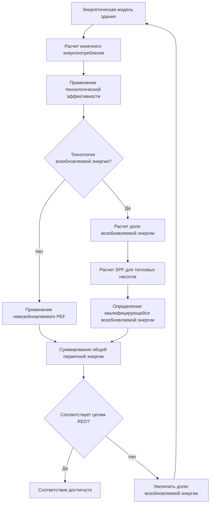

## Обзор

Директива Европейского Союза по возобновляемым источникам энергии (RED II, Директива 2018/2001/EU) устанавливает обязательные целевые показатели потребления возобновляемой энергии во всех секторах, оказывающие прямое влияние на проектирование, выбор и эксплуатацию систем HVAC. Директива предусматривает, что 32% валового конечного энергопотребления ЕС должны поступать из возобновляемых источников к 2030 году, при этом отопление и охлаждение представляют крупнейший энергопотребляющий сектор, составляющий примерно 50% от общего спроса на энергию в ЕС.

Директива признает конкретные технологии возобновляемой энергии, применяемые в системах HVAC, и предоставляет методологии расчета для количественной оценки их вклада в общие целевые показатели возобновляемой энергии.

## Технологии возобновляемой энергии в HVAC

### Признание технологии тепловых насосов

Директива RED II явно признает аэротермальную, геотермальную и гидротермальную энергию, захватываемую тепловыми насосами, как возобновляемую энергию при условии соответствия теплового насоса минимальным пороговым значениям производительности. Коэффициент сезонной производительности (SPF) должен превышать:

$$\text{SPF}_{\min} = \frac{1}{1 - \frac{1}{\eta}}$$

где $\eta$ — это отношение между общей валовой выработкой электроэнергии и первичным потреблением энергии для производства электроэнергии, типично оцениваемое в 0,455 для энергосистемы ЕС. Это дает:

$$\text{SPF}_{\min} = \frac{1}{1 - \frac{1}{0.455}} = 1.833$$

Только тепловые насосы со значениями SPF, превышающими этот порог, квалифицируются для учета возобновляемой энергии в соответствии с директивой.

**Методология расчета производительности:**

$$E_{\text{RES}} = Q_{\text{usable}} \times \left(1 - \frac{1}{\text{SPF}}\right)$$

где:
- $E_{\text{RES}}$ = содержание возобновляемой энергии (кВт·ч)
- $Q_{\text{usable}}$ = общее количество тепла, поставляемого тепловым насосом (кВт·ч)
- SPF = коэффициент сезонной производительности (безразмерный)

### Системы солнечной тепловой энергии

Солнечные тепловые коллекторы напрямую способствуют достижению целевых показателей возобновляемой энергии, при этом 100% поставляемой тепловой энергии рассчитывается как возобновляемая. Годовой вклад возобновляемой энергии составляет:

$$E_{\text{solar}} = A_c \times \eta_0 \times I_{\text{annual}} \times F_{\text{system}}$$

где:
- $A_c$ = апертурная площадь коллектора (м²)
- $\eta_0$ = оптический КПД коллектора (безразмерный)
- $I_{\text{annual}}$ = годовое солнечное облучение (кВт·ч/м²·год)
- $F_{\text{system}}$ = коэффициент использования системы с учетом тепловых потерь (типично 0,5–0,7)

## Стратегии обеспечения соответствия для систем HVAC

### Интеграция возобновляемой энергии на уровне здания

Директива требует, чтобы государства-члены обеспечили, чтобы новые здания и здания, подвергаемые капитальному ремонту, включали минимальные уровни возобновляемой энергии. Проектировщики HVAC должны оценить комбинации технологий для соответствия этим требованиям.

| Технология | Доля возобновляемой энергии | Типовое применение | Коэффициент затрат капитала |
|------------|-------------------|---------------------|---------------------|
| Воздушный тепловой насос (ASHP) | 50–65% | Отопление/охлаждение помещений | 1,0x |
| Наземный тепловой насос (GSHP) | 65–75% | Отопление/охлаждение помещений | 2,5–3,5x |
| Солнечная тепловая энергия (ГВС) | 100% поставляемой | Горячее водоснабжение | 1,5x |
| Биомассовый котел | 100% | Отопление помещений | 1,8x |
| Гибридные системы (НП + солнце) | 70–85% | Комбинированные нагрузки | 2,0–2,5x |

*Коэффициенты затрат относительно базового варианта с газовым котлом*

### Системы районного теплоснабжения и охлаждения

Директива способствует развитию сетей районного отопления и охлаждения на основе возобновляемых источников. Доля возобновляемой энергии для систем районного теплоснабжения составляет:

$$f_{\text{RES,district}} = \frac{\sum Q_{\text{RES,sources}}}{\sum Q_{\text{delivered}} + Q_{\text{network,losses}}}$$

Квалифицирующиеся источники возобновляемой энергии включают:
- Отходящее тепло от производства электроэнергии из возобновляемых источников
- Геотермальную энергию
- Установки солнечной тепловой энергии
- Тепло от эффективных ТЭЦ на биомассе
- Тепло от высокоэффективных тепловых насосов

## Рамочная методология расчета

### Применение коэффициента первичной энергии

Директива использует коэффициенты первичной энергии (PEF) для преобразования конечного энергопотребления в эквивалент первичной энергии:

$$E_{\text{primary}} = E_{\text{final}} \times \text{PEF}$$

Стандартные коэффициенты PEF для государств-членов ЕС:

| Энергоноситель | Невозобновляемый PEF | Общий PEF | Кредит на возобновляемость |
|----------------|-------------------|-----------|------------------|
| Природный газ | 1,1 | 1,1 | 0 |
| Электроэнергия (смесь ЕС) | 2,1 | 2,5 | Переменный |
| Районное отопление | 1,3 | 1,3 | Переменный |
| Биомасса | 0,2 | 1,0 | 1,0 |
| Солнечная тепловая энергия | 0 | 1,0 | 1,0 |

### Рабочий процесс расчета энергетической производительности

## Оптимизация проектирования системы теплового насоса

Чтобы максимизировать вклад возобновляемой энергии в соответствии с RED II, системы тепловых насосов должны достичь высокой сезонной производительности. Ключевые факторы проектирования:

**Снижение температуры подачи:**

$$\text{COP} = \frac{T_{\text{cond}}}{T_{\text{cond}} - T_{\text{evap}} - \Delta T_{\text{losses}}}$$

Снижение температуры конденсации ($T_{\text{cond}}$) через системы низкотемпературного распределения (подача 35–45°C) увеличивает COP на 15–30% по сравнению с обычными системами 70–80°C.

**Интеграция буферного хранилища:**

Объемы теплового аккумулятора должны удовлетворять:

$$V_{\text{buffer}} \geq \frac{\dot{Q}_{\text{HP,min}} \times t_{\text{cycle,min}}}{\rho c_p \Delta T_{\text{storage}}}$$

где:
- $\dot{Q}_{\text{HP,min}}$ = минимальная тепловая мощность теплового насоса (кВт)
- $t_{\text{cycle,min}}$ = минимальное время цикла (3600 с типично)
- $\rho c_p$ = объемная теплоемкость воды (4186 кДж/м³·K)
- $\Delta T_{\text{storage}}$ = дифференциал температуры хранилища (10–15 K)

## Взаимодействие со стандартами ASHRAE

Хотя RED II управляет европейскими рынками, стандарты ASHRAE обеспечивают совместимые расчетные рамки:

- **ASHRAE 90.1**: Требования к энергоэффективности соответствуют пороговым значениям производительности RED II
- **ASHRAE 169**: Классификация климатических зон поддерживает точные расчеты SPF
- **ASHRAE 62.1**: Требования вентиляции влияют на потенциал рекуперации тепла
- **ASHRAE Standard 205**: Представление производительности оборудования позволяет моделировать соответствие RED II

Пороговое значение SPF директивы 1,833 примерно соответствует требованиям к эффективности тепловых насосов ASHRAE 90.1 для европейских климатических зон (зоны 3–5).

## Проблемы внедрения

### Измерение и проверка

Демонстрация соответствия требует:

1. **Расчетов на этапе проектирования**, используя стандарты серии EN 15316 для эффективности систем HVAC
2. **Проверки при вводе в эксплуатацию** характеристик установленного оборудования
3. **Оперативного мониторинга** через системы управления энергией зданий (BEMS)
4. **Годовой отчетности** о доле возобновляемой энергии

### Учет возобновляемой электроэнергии

Для электрически питаемых тепловых насосов доля возобновляемой энергии в электросети зависит от:
- Времени использования (корреляция с генерацией из возобновляемых источников)
- Географического местоположения (региональный энергосистемный баланс)
- Прямых соглашений о закупке возобновляемой энергии (PPA)

Государства-члены могут применять почасовые или ежемесячные коэффициенты возобновляемой электроэнергии для более точного учета.

## Будущее развитие директивы

Предложенная RED III (находится на рассмотрении) предусматривает:
- Повышенные целевые показатели возобновляемой энергии (42,5% к 2030 году)
- Повышенные требования к возобновляемой энергии для районного отопления (минимум 49% к 2030 году)
- Обязательная интеграция возобновляемой энергии для центров обработки данных и промышленных объектов
- Усиленные системы гарантий происхождения для возобновляемого отопления и охлаждения

Проектировщикам HVAC-систем на европейских рынках необходимо предвидеть эти развивающиеся требования при выборе оборудования с длительным жизненным циклом.

## Пример проверки соответствия

Для коммерческого здания с годовой нагрузкой на отопление 500 000 кВт·ч, обслуживаемого воздушным тепловым насосом с измеренным SPF 3,5:

$$E_{\text{RES}} = 500{,}000 \times \left(1 - \frac{1}{3.5}\right) = 357{,}143 \text{ кВт·ч}$$

$$E_{\text{electric}} = \frac{500{,}000}{3.5} = 142{,}857 \text{ кВт·ч}$$

$$E_{\text{primary}} = 142{,}857 \times 2.5 = 357{,}143 \text{ кВт·ч}$$

Доля возобновляемой энергии: 71,4% поставляемой тепловой энергии квалифицируется как возобновляемая в соответствии с RED II.

## Заключение

Директива ЕС по возобновляемым источникам энергии коренным образом изменяет выбор и проектирование систем HVAC на европейских рынках. Технология тепловых насосов, особенно в сочетании с системами низкотемпературного распределения, обеспечивает наиболее практичный путь к соответствию для большинства типов зданий. Проектировщики систем должны проводить тщательные расчеты производительности на ранних этапах проектирования, чтобы обеспечить соответствие установленных систем требованиям директивы и целевым показателям энергетической производительности здания. Методология расчета директивы, хотя и сложная, обеспечивает четкие пути для демонстрации соответствия посредством надлежащего выбора оборудования, проектирования системы и проверки производительности.
