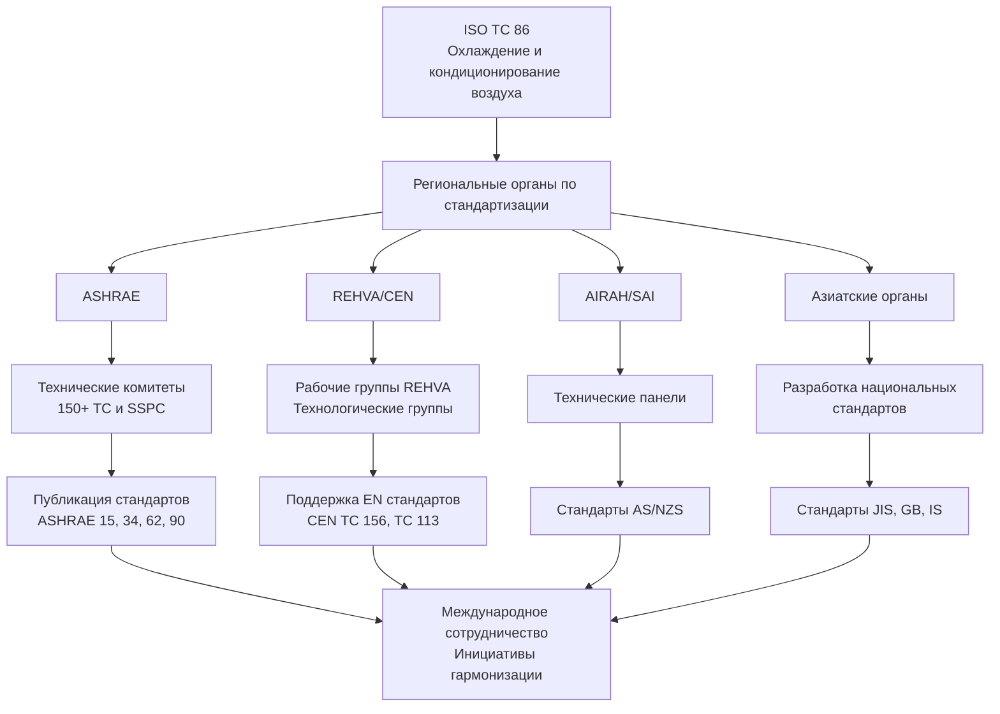
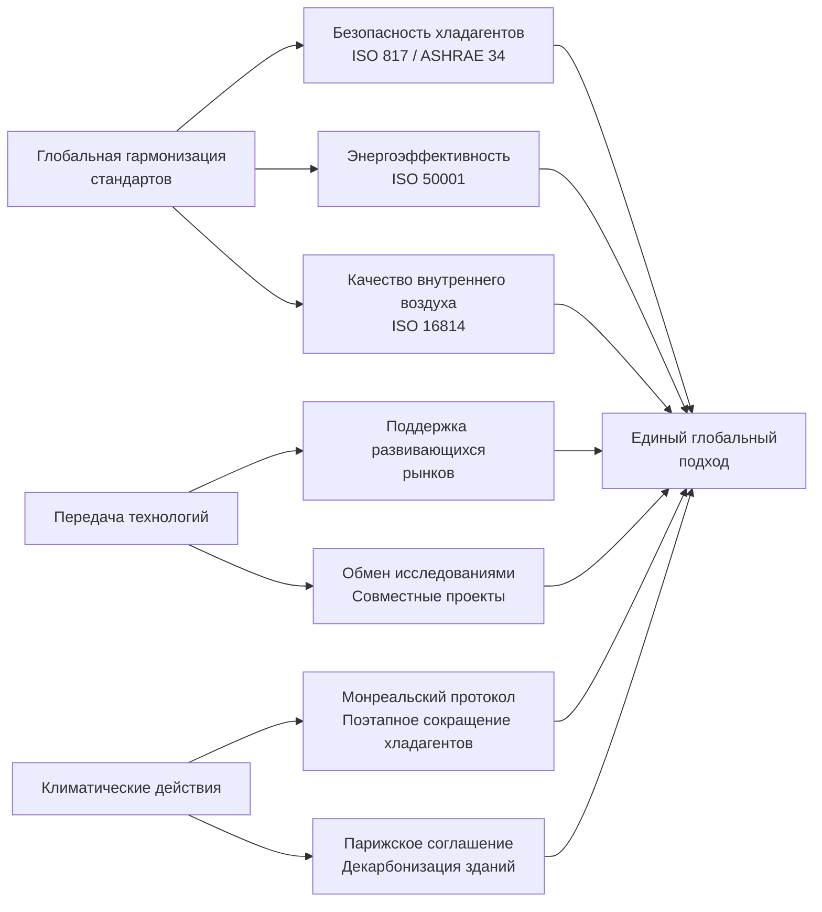

## Обзор глобальных профессиональных организаций HVAC

Профессиональные организации являются основой развития отрасли HVAC во всем мире, способствуя разработке стандартов, распространению знаний и техническим инновациям. Эти органы служат отдельным географическим регионам, одновременно сотрудничая в международных инициативах, решающих проблемы изменения климата, энергоэффективности и качества внутренней среды. Основные организации включают ASHRAE (ориентация на Америку), REHVA (Европа), CIBSE (Великобритания), AIRAH (Австралия) и многочисленные региональные структуры, охватывающие Азию, Африку и Ближний Восток.

## Сравнение основных международных организаций

| Организация | Регион | Основана | Членов | Основные стандарты | Ключевые публикации |
|-------------|---------|---------|---------|------------------|------------------|
| ASHRAE | Америка/Глобально | 1894 | 57 000+ | ASHRAE 90.1, 62.1, 55 | Справочник ASHRAE (4 тома) |
| REHVA | Европа | 1963 | 120 000+ (через ассоциации) | Поддержка EN стандартов | Журнал REHVA, руководства |
| CIBSE | Великобритания/Глобально | 1976 | 20 000+ | Руководства CIBSE A-M | Серия знаний CIBSE |
| AIRAH | Австралия/Тихоокеанский регион | 1920 | 10 000+ | Стандарты AS/NZS | Справочник AIRAH |
| ISHRAE | Индия | 1981 | 20 000+ | Поддержка NBC Индии | Журнал ISHRAE |
| SHASE | Япония | 1917 | 5 000+ | Стандарты JIS | Справочники SHASE |

## Региональные профессиональные органы

### Организации Азиатско-Тихоокеанского региона

**ISHRAE (Индийское общество инженеров отопления, охлаждения и кондиционирования воздуха)** обеспечивает решение требований субконтинента, включая высокие температуры окружающей среды, контроль влажности и энергоэффективное проектирование. Организация разрабатывает методы расчета нагрузок, специфичные для Индии, и продвигает соответствующие технологии для тропического климата.

**SHASE (Общество инженеров отопления, кондиционирования воздуха и санитарной техники Японии)** сосредоточено на проектировании, устойчивом к землетрясениям, высокоэффективных технологиях и ультрачистых средах для производства полупроводников. Японские стандарты подчеркивают точность контроля и надежность.

**SAREK (Общество инженеров кондиционирования воздуха и охлаждения Кореи)** совершенствует корейские строительные стандарты с упором на интеграцию отопления ondol, системы теплоснабжения и нагнетание давления в многоэтажных зданиях.

### Европейские национальные органы

REHVA объединяет 27 национальных ассоциаций HVAC, представляющих более 120 000 профессионалов. Членские ассоциации включают VDI (Германия), AICVF (Франция), AiCARR (Италия) и TVVL (Нидерланды). Эти органы согласовывают европейские стандарты, сохраняя при этом национальные технические традиции.

### Ближний Восток и Африка

**Глава ASHRAE на Ближнем Востоке** и региональные секции адаптируют североамериканские стандарты к экстремальным условиям пустыни, подчеркивая экономию воды, работу при высоких температурах и требования фильтрации пыли.

**SACAIR (Южноафриканский совет инженеров кондиционирования воздуха, отопления и охлаждения)** решает проблемы климатического разнообразия Африки, автономных систем и приложений с ограниченными ресурсами.

## Организационная структура и взаимосвязи

## Сравнение преимуществ членства

| Тип преимущества | ASHRAE | REHVA | CIBSE | AIRAH |
|-------------|--------|-------|-------|-------|
| Технические публикации | Полный доступ к справочнику | Журнал REHVA | 13 руководств по проектированию | Справочник + журнал |
| Стандарты | Скидка для членов | Через национальные органы | Цена для членов | Доступ AS/NZS |
| Конференции | Годовая + специализированные | CLIMA один раз в 2 года | Годовая | Годовая |
| Сертификации | BEAP, BEMP, HBDP, OPMP | Каркас EQF | Консультант по низкоуглеродному развитию | Сертифицированный AIRCOP |
| Местные отделения | 182 отделения глобально | 27 национальных ассоциаций | 18 региональных групп | 14 филиалов |
| Сетевое взаимодействие | Встречи отделений | Национальные события | Программы CPD | Технические вечера |
| Развитие карьеры | Учебный институт | Курсы REHVA | Запись CPD | Программы обучения |

## Процессы разработки стандартов

### Разработка стандартов ASHRAE

ASHRAE использует процесс на основе консенсуса с открытым общественным рецензированием. Комитеты проектов включают сбалансированное представительство производителей, пользователей и категорий общего интереса. Стандарты подвергаются постоянному обслуживанию с публикацией дополнений между изданиями.

**Ключевые стандарты ASHRAE:**
- **Standard 90.1** - Энергетический стандарт для зданий (кроме малоэтажных жилых)
- **Standard 62.1** - Вентиляция для приемлемого качества внутреннего воздуха
- **Standard 55** - Тепловые условия в окружающей среде для занятости людьми
- **Standard 15** - Стандарт безопасности для систем охлаждения
- **Standard 34** - Обозначение и классификация безопасности хладагентов

### Гармонизация европейских стандартов

REHVA поддерживает технические комитеты CEN (Европейский комитет по стандартизации), разрабатывающие EN стандарты. Серия EN становится обязательной во всех государствах-членах ЕС, заменяя конфликтующие национальные стандарты.

**Критические EN стандарты:**
- **EN 16798** серия - Энергоэффективность зданий (заменяет EN 15251)
- **EN 12170** - Системы отопления, терминология и символы
- **EN 378** - Системы охлаждения и тепловые насосы, требования безопасности

### Международные стандарты ISO

Технический комитет ISO 86 разрабатывает глобально применимые стандарты в области охлаждения и кондиционирования воздуха. Организации сотрудничают в разработке стандартов ISO через национальные органы по стандартизации (ANSI для США, BSI для Великобритании, SAI для Австралии).

## Инициативы международного сотрудничества

### Совместные исследовательские программы

Организации сотрудничают в фундаментальных исследованиях, решая:
- **Производительность хладагентов с низким ПГП** - Протоколы тестирования воспламеняемости A2L
- **Стратегии вентиляции при пандемии** - Контроль передачи по воздуху
- **Пути декарбонизации** - Электрификация и развертывание тепловых насосов
- **Гибкость спроса** - Взаимодействующие с сетью эффективные здания

### Платформы обмена знаниями

**Мировой конгресс CLIMA** (организуемый REHVA каждые 3 года) собирает глобальных специалистов HVAC. Годовые и зимние конференции ASHRAE отличаются международным участием. Региональные события, такие как ARBS (Австралия), AHR Expo (США) и MCE (Италия), облегчают распространение технологий.

**Цифровые платформы:** Организации все чаще предлагают вебинары, онлайн-курсы и цифровые публикации, обеспечивающие глобальный доступ к знаниям независимо от географического местоположения.

## Профессиональное развитие и сертификация

Организации предлагают структурированное продвижение по карьере:

**Сертификации ASHRAE:**
- Специалист по оценке энергоэффективности зданий (BEAP)
- Специалист по моделированию энергоэффективности зданий (BEMP)
- Специалист по проектированию высокопроизводительных зданий (HBDP)
- Специалист по управлению производительностью и эксплуатацией (OPMP)

**Пути CIBSE:**
- Спонсорство дипломированного инженера (CEng)
- Сертификация консультанта по низкоуглеродному развитию
- Поддержка LEED/BREEAM AP

**Учетные данные AIRAH:**
- AIRCOP (программа сертификации)
- Отслеживание непрерывного профессионального развития (CPD)
- Пути продвинутых дипломов

## Развивающиеся регионы и укрепление потенциала

Организации активно поддерживают развитие отрасли HVAC на развивающихся рынках посредством:

- **Программы обучения**, адаптированные к местному климату и экономическим условиям
- **Руководство по стандартам** для стран, разрабатывающих строительные нормы
- **Программы наставничества**, соединяющие опытных профессионалов с развивающимися регионами
- **Программы стипендий**, обеспечивающие доступ к международному образованию
- **Инициативы передачи технологий**, продвигающие надлежащие, устойчивые решения

Региональный рост сосредоточен на Юго-Восточной Азии, Африке к югу от Сахары и Латинской Америке, где быстрая урбанизация требует масштабируемых решений HVAC, балансирующих комфорт, доступность и экологическую ответственность.

## Будущие направления

Глобальные организации координируют:

- **Переход на хладагенты** - Поддержка внедрения A2L и природных хладагентов
- **Интеграция с сетью** - Стратегии гибкости спроса и тепловые хранилища
- **Качество внутреннего воздуха** - Постпандемические стандарты вентиляции
- **Цифровизация** - Интеграция BIM и управление с поддержкой AI
- **Циклическая экономика** - Управление жизненным циклом оборудования и рекультивация хладагентов

Рабочие группы между организациями решают эти проблемы посредством согласованных технических позиций, снижая конфликтующие региональные подходы, которые препятствуют глобальному развертыванию технологий.

## Заключение

Профессиональные организации обеспечивают важнейшую инфраструктуру для развития отрасли HVAC, преобразуя исследования в практику посредством стандартов, образования и сетей знаний. Хотя региональные организации решают местные требования, растущее сотрудничество обеспечивает согласованные глобальные ответы на общие проблемы изменения климата, энергетического перехода и качества внутренней среды. Членство в соответствующих организациях ускоряет профессиональное развитие, одновременно способствуя техническому прогрессу отрасли в целом.
